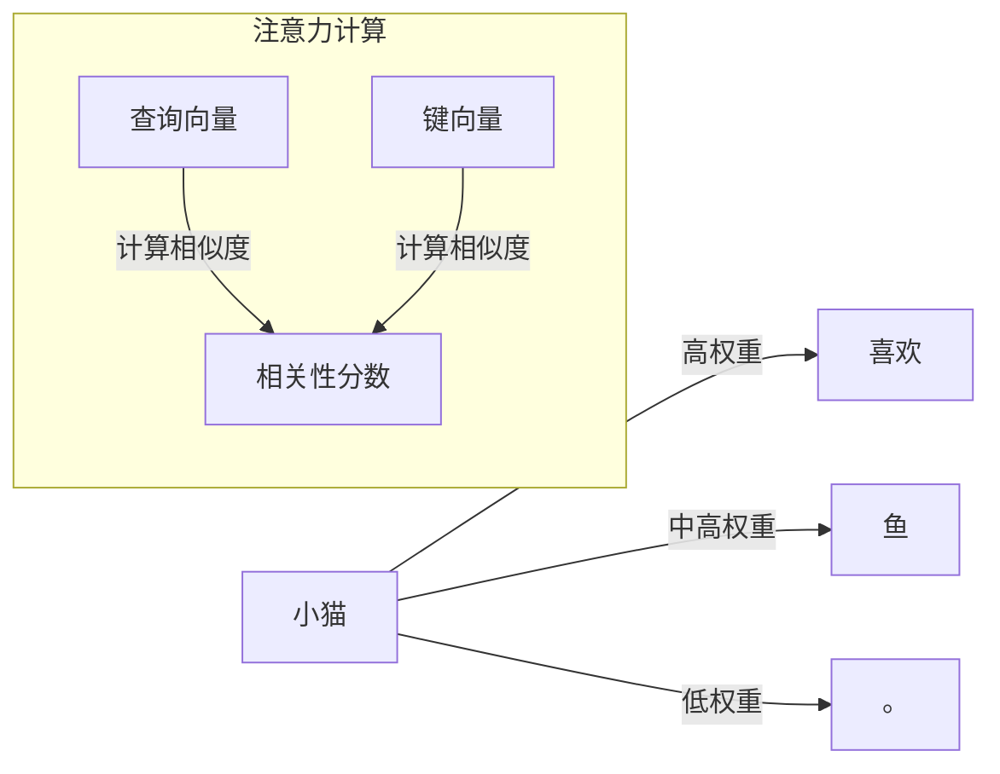

# 01-Transformer基础概念

## 1. 概述 📚

（一段话介绍Transformer，不分点）

## 2. 为什么需要Transformer 🤔

我们在学习Transformer之前，先来聊聊为什么会出现这个技术。理解它的诞生背景，能帮我们更好地把握它的核心思想。

### 2.1 传统序列模型的局限性 🚧

在说Transformer之前，我们得先说说它的"前辈"们。在Transformer出现之前，处理序列数据主要靠RNN（循环神经网络）和它的改进版本LSTM（长短期记忆网络）。这些模型曾经是NLP领域的标配，但它们有两个致命缺陷让我们很头疼 😫

第一个问题是**梯度消失和爆炸**。当我们用RNN处理一个很长的句子时，需要通过BPTT（沿时间反向传播）来更新参数。想象一下，你要从句子最后一个词一路回传到第一个词，中间要经过成百上千个时间步。这么长的传播路径，梯度要么衰减到接近零（梯度消失），要么放大到失控（梯度爆炸）。结果就是模型根本记不住句子开头的信息，就像我们看了很长的文章后忘了开头说了啥 😅

第二个问题是**无法并行计算**。RNN的处理方式是串行的：必须先算第一个词，再算第二个词，以此类推。这就像流水线只有一条道，后面的工序必须等前面的完成才能开始。在GPU并行计算能力越来越强的今天，这种串行方式严重拖累了训练效率。

LSTM和GRU虽然通过门控机制缓解了梯度问题，但它们仍然无法摆脱串行计算的限制。业界急需一个新架构来打破这个困局 💪

### 2.2 Transformer的诞生 🌟

2017年，Google团队发表了那篇划时代的论文《Attention Is All You Need》，首次提出了Transformer架构。他们完全摒弃了RNN的循环结构，转而采用纯注意力机制来处理序列数据。这个创新立即刷新了机器翻译的各项纪录，后来更是成为BERT、GPT等所有大语言模型的基础架构。

Transformer的核心突破是：它让序列中的每个位置都能直接关注到所有其他位置，不再需要像RNN那样一步步传递信息。这样既解决了长距离依赖问题，又能充分利用GPU进行并行计算。可以说，Transformer的出现标志着深度学习进入了一个新时代 🚀

## 3. Transformer核心特点 ✨

 Transformer相比传统RNN有哪些独门绝技？接下来我们一起看看它的三大核心特点。

### 3.1 纯注意力机制 🔍

这是Transformer最核心的创新。在Transformer里，每个词都能直接"看到"句子中的所有其他词，然后根据相关性来决定该关注哪些词。就好比你读书的时候，虽然眼睛看着当前这个词，但实际上脑子里会同时想到前后文的关联词 📖

具体来说，注意力机制会计算每个词与其他词之间的"相关性分数"。比如句子"小猫喜欢、鱼"，"小猫"和"喜欢"的关联度高，和"鱼"的关联度也高，但和"喜欢"的关系更密切。这种动态调整关注重点的能力，让模型能更好地理解语义。



### 3.2 并行计算 ⚡

这是Transformer效率提升的关键。RNN处理句子必须一个个词顺序计算，就像一条单行道，后面的车必须等前面的走完才能走 🚗

Transformer完全颠覆了这种方式。它利用矩阵运算的并行特性，可以同时计算所有词之间的关系。这就像把单行道变成了多车道高速，所有车辆可以同时前进。实际测试中，Transformer的训练速度比RNN快10倍以上！

### 3.3 长距离依赖捕捉 🌊

想象一下，你要理解"他"指代谁，需要往前看几十个词甚至更远。RNN在这么长的距离上，信息早就衰减没了 🤔

Transformer的注意力机制让任意两个词之间都能直接"对话"，不受距离限制。不管句子有多长，开头的词和结尾的词都能直接建立联系。这对于理解长文本、保持上下文一致性特别重要 💪

## 4. Transformer整体架构 🏗️

  Transformer是怎么工作的？让我们看看它的整体结构。

### 4.1 编码器-解码器结构 🏛️

 Transformer采用了经典的编码器-解码器（Encoder-Decoder）架构，这种设计最初是为机器翻译任务量身定制的 🎯

**编码器**负责"理解"输入。它由N个相同的层堆叠而成（论文中N=6），每层包含两个核心子层：多头自注意力和前馈神经网络。编码器的任务是把输入序列转换成包含丰富语义信息的向量表示。你可以把它想象成一个翻译员，先把源语言读进去，理解其中的含义 👂

**解码器**负责"生成"输出。它同样由N个层堆叠而成，但比编码器多一个子层：编码器-解码器注意力。这个额外的注意力层让解码器能关注到输入序列的关键信息，这是生成正确输出的关键 🔑

### 4.2 数据流过程 🔄

 数据在Transformer中是这样流动的：输入序列首先经过嵌入层转换为向量表示，然后加上位置编码（因为Transformer本身无法感知词序，需要额外注入位置信息），接着依次通过编码器的每一层，最后到达解码器生成输出。

```mermaid
flowchart LR
    subgraph 输入
    I[输入序列 "I love you"]
    end
    
    subgraph Encoder
    E1[嵌入层] --> E2[位置编码] --> E3[多头自注意力] --> E4[前馈网络]
    E3 --> E4
    end
    
    subgraph Decoder
    D1[输出嵌入] --> D2[位置编码] --> D3[掩码注意力] --> D4[编码器-解码器注意力] --> D5[前馈网络]
    end
    
    I --> E1
    E4 --> D4
    D5 --> O[输出概率]
    
    style E3 fill:#e1f5fe
    style E4 fill:#e1f5fe
    style D3 fill:#fff3e0
    style D4 fill:#fff3e0
    style D5 fill:#fff3e0
```

整个过程可以想象成一条流水线：编码器是"理解环节"，把源语言翻译成机器能理解的内部表示；解码器是"生成环节"，根据编码器的输出和已生成的部分，逐步产出目标语言。整个架构简单清晰，效率又高 👍

## 5. Transformer vs 传统模型 📊

（表格对比RNN/LSTM与Transformer）

## 6. Transformer发展历程 📈

---

**最后更新时间**：2026-04-04