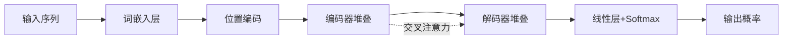

# 01-Transformer基础概念

## 1. 概述 📚

Transformer是2017年Google团队在论文《Attention Is All You Need》中提出的深度学习架构，它完全抛弃了传统RNN的循环结构，采用自注意力机制来捕捉序列中的依赖关系。Transformer的出现彻底改变了自然语言处理领域，成为GPT、BERT等所有大语言模型的基石架构。现在就让我们一起揭开Transformer的神秘面纱吧 😊

## 2. 为什么需要Transformer 🤔

我们在学习Transformer之前，必须先搞清楚一个问题：既然RNN已经能处理序列数据了，为什么还要发明Transformer？这要从传统模型的局限性说起。

### 2.1 传统序列模型的痛点

以前我们用RNN（循环神经网络）及其变体LSTM、GRU来处理文本、语音这类序列数据，但它们有两个致命缺陷 😫

第一个问题是串行计算导致的效率低下。RNN必须按时间步顺序处理：先算第一个词，再算第二个词，以此类推。这就像排队办事一样，一个人一个人来，效率怎么可能高？GPU/TPU这些并行计算设备完全派不上用场。

第二个问题是长距离依赖失效。想象一下，你要翻译一个超长的句子，RNN读到句子末尾时，可能早就忘了开头说的是什么。这是因为反向传播时，梯度经过多层链式求导后会指数级衰减，超过200个时间步的信息基本就丢失了 📉

### 2.2 Transformer的诞生

Google团队在2017年发表了里程碑论文《Attention Is All You Need》，提出了Transformer架构，彻底解决了这两个痛点 🎉

Transformer的核心创新是使用自注意力机制。它不再按顺序一个个处理，而是"一眼看遍"整个序列。比如判断"bank"是指银行还是河岸，Transformer可以直接关注到句子中的"river"或"money"，一步到位做出判断。这就是所谓的"全局依赖捕捉"能力，理论可以处理无限长的序列！

## 3. Transformer核心特点 ✨

Transformer相比传统RNN有三大核心优势，这也是它能取代RNN的原因。

### 3.1 纯注意力机制

Transformer完全抛弃了循环和卷积结构，仅靠注意力机制来处理序列。注意力机制就像一个"全局信息检索器"，每个词都能直接和任意其他词建立联系，不需要层层传递 🎯

### 3.2 并行计算

这是Transformer最致命的优势。传统RNN是串行的，Transformer可以一次处理整个序列。Google的论文显示，在翻译任务上Transformer训练速度比RNN快了一个数量级！对于现代GPU/TPU来说，这才是它们擅长的计算方式 ⚡

### 3.3 长距离依赖捕捉

由于注意力机制的特性，Transformer可以轻松捕捉任意距离的依赖关系。序列长度对它来说不是问题，不像RNN那样会"遗忘"远处的信息。这对于处理长文本、长对话场景特别重要 📚

## 4. Transformer整体架构 🏗️

说了这么多，Transformer到底长什么样？让我们来看看它的整体结构。

### 4.1 编码器-解码器结构

Transformer采用了经典的编码器-解码器架构，这和之前的Seq2Seq模型类似，但内部实现完全不同 🔧

编码器负责理解输入序列。它由N层相同的堆叠而成，每层包含两个子层：多头自注意力机制和前馈神经网络。解码器也是N层堆叠，但每个解码器层有三个子层：掩码自注意力、编码器-解码器注意力、前馈网络。

### 4.2 数据流过程

让我们用一张图来说明数据是如何在Transformer中流动的：

简单来说，输入句子先变成词向量，加上位置编码后送入编码器，编码器处理完的"理解"结果送给解码器，解码器结合已生成的内容逐词预测下一个词，最后通过Softmax输出概率分布。这就是机器翻译等任务的基本流程 🎬

## 5. Transformer vs 传统模型 📊

光说不练假把式，我们来对比一下Transformer和传统RNN/LSTM的区别：

| 特性 | RNN/LSTM | Transformer |
|------|----------|-------------|
| 计算方式 | 串行（依赖上一步） | ✅ 完全并行 |
| 长距离依赖 | 梯度消失（<200步） | ✅ 直接建模（理论无限） |
| 计算效率 | 较低 | ✅ 较高（适合GPU/TPU） |
| 信息保留 | 远距离信息丢失 | ✅ 全局注意力直接连接 |
| 模型规模 | 一般 | ✅ 优秀（可扩展到千亿参数）|

从表格可以看出，Transformer在各个方面都优于传统模型，这也是为什么它能成为当代AI的核心架构 💪

## 6. Transformer发展历程 📈

Transformer从2017年诞生至今，已经走过了将近8个年头。这期间诞生了无数经典模型：

2018年，Google发布BERT，这是双向编码器模型，在各项NLP任务上刷新了记录。同年OpenAI发布GPT，开启了生成式预训练的道路 🚀

2019年，GPT-2发布，15亿参数展示出惊人的零样本能力。2020年，GPT-3发布，1750亿参数震惊业界，Few-shot学习能力让所有人看到了大模型的潜力 🌍

2022年，ChatGPT发布，AI进入公众视野。2023年GPT-4发布，多模态能力进一步扩展。如今，Transformer已经成为AI领域的基础设施，从文本到图像、从语音到代码，处处都有它的身影 🌟

---

**最后更新时间**：2026-04-04
