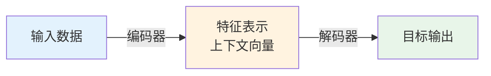

# 01a-编码器解码器架构详解

## 📝 摘要


## 1. 概述 📚


## 2. 编码器-解码器架构的本质 🤔

编码器-解码器（Encoder-Decoder）架构并非单一模型，而是一种通用的"两步式"框架。它既能**理解输入数据**，又能**生成目标输出**，是深度学习中最重要、最通用的架构设计模式之一。😊

### 2.1 什么是编码器-解码器

编码器-解码器架构由两个核心组件组成：😊

**编码器（Encoder）：**
- 📝 **作用**：将原始输入数据（文本、图像、语音等）转化为低维度的特征表示
- 🎯 **目标**：提取核心特征，剥离冗余信息
- 📦 **输出**：上下文向量（Context Vector）或潜在向量（Latent Vector）

**解码器（Decoder）：**
- 📝 **作用**：将编码器生成的特征表示重构为目标输出
- 🎯 **目标**：基于特征表示生成期望的输出格式
- 📤 **输出**：目标序列或重构的数据



> 💡 **类比理解**：编码器就像一位"速记员"，把长篇演讲压缩成几页笔记；解码器就像另一位"演讲者"，根据笔记重新组织语言进行演讲。

### 2.2 核心思想：压缩与重构

编码器-解码器架构的核心思想可以概括为两个字：**压缩**与**重构**。😊

**第一步：压缩（Compression）**
- 📉 将高维、复杂的输入数据压缩成低维、紧凑的特征表示
- 🎯 保留最关键的信息，丢弃噪声和冗余
- 💡 类似于人类的大脑记忆：我们不会记住每一个细节，而是记住核心概念

**第二步：重构（Reconstruction）**
- 📈 基于压缩后的特征表示，重构出目标格式的输出
- 🎯 可以是相同格式的重构（如去噪、修复），也可以是不同格式的转换（如翻译、描述）
- 💡 类似于根据记忆重新讲述一个故事，可能用词不同，但核心内容一致

**为什么这种架构有效？**
- 🧠 **信息瓶颈**：强制模型学习最重要的特征
- 🎯 **特征解耦**：将输入的复杂模式解耦成可理解的特征
- 🔄 **端到端学习**：从输入直接映射到输出，无需人工设计特征

### 2.3 与Seq2Seq的关系

编码器-解码器架构与 Seq2Seq（序列到序列）模型是什么关系？😊

**简单来说：Seq2Seq 是编码器-解码器架构的一种具体实现。**

| 对比项 | 编码器-解码器架构 | Seq2Seq 模型 |
|--------|------------------|-------------|
| **本质** | 通用的架构设计模式 | 具体的模型实现 |
| **输入输出** | 可以是任意数据类型 | 特指序列数据（文本、语音等） |
| **应用场景** | 图像生成、文本翻译、语音识别等 | 机器翻译、文本摘要、对话系统等 |
| **典型模型** | Autoencoder、VAE、Seq2Seq、Transformer | RNN-based Seq2Seq、Transformer |

**架构演进路线：**
```
编码器-解码器架构（通用框架）
    ↓
自编码器 Autoencoder（相同输入输出）
    ↓
变分自编码器 VAE（概率生成）
    ↓
Seq2Seq（不同输入输出序列）
    ↓
Transformer（注意力机制增强）
```

> 📖 **学习路径**：本文档（01a）讲解编码器-解码器的通用原理，下篇文档[02-序列到序列模型](https://juejin.cn/post/7627774689625391131)将深入探讨 Seq2Seq 的具体实现。建议先掌握本章内容，再学习 Seq2Seq 和 Transformer！🚀


## 3. 自编码器（Autoencoder）🎯


### 3.1 自编码器的基本结构


### 3.2 编码器：压缩输入


### 3.3 解码器：重构输出


### 3.4 自编码器的应用


## 4. 变分自编码器（VAE）✨


### 4.1 VAE与自编码器的区别


### 4.2 概率编码与潜在空间


### 4.3 重参数化技巧


## 5. Seq2Seq编码器-解码器 🔄


### 5.1 编码器：理解输入序列


### 5.2 上下文向量


### 5.3 解码器：生成输出序列


## 6. 三种架构对比 📊


### 6.1 自编码器 vs VAE vs Seq2Seq


### 6.2 应用场景对比


## 7. 大模型中的编码器-解码器架构 🚀


### 7.1 Encoder-only架构（BERT）


### 7.2 Decoder-only架构（GPT）


### 7.3 Encoder-Decoder架构（T5、BART）


## 8. 总结 📌


---

**最后更新时间**：2026-04-13
