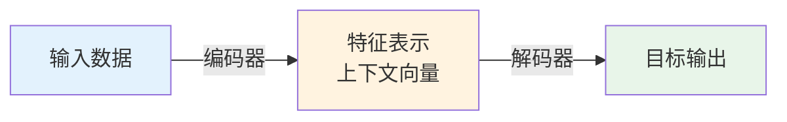
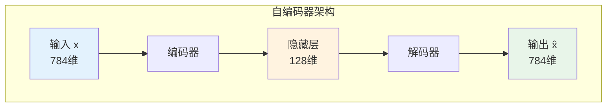

# 01a-编码器解码器架构详解

## 📝 摘要


## 1. 概述 📚


## 2. 编码器-解码器架构的本质 🤔

编码器-解码器（Encoder-Decoder）架构并非单一模型，而是一种通用的"两步式"框架。它既能**理解输入数据**，又能**生成目标输出**，是深度学习中最重要、最通用的架构设计模式之一。😊

### 2.1 什么是编码器-解码器

编码器-解码器架构由两个核心组件组成：😊

**编码器（Encoder）：**
- 📝 **作用**：将原始输入数据（文本、图像、语音等）转化为低维度的特征表示
- 🎯 **目标**：提取核心特征，剥离冗余信息
- 📦 **输出**：上下文向量（Context Vector）或潜在向量（Latent Vector）

**解码器（Decoder）：**
- 📝 **作用**：将编码器生成的特征表示重构为目标输出
- 🎯 **目标**：基于特征表示生成期望的输出格式
- 📤 **输出**：目标序列或重构的数据



> 💡 **类比理解**：编码器就像一位"速记员"，把长篇演讲压缩成几页笔记；解码器就像另一位"演讲者"，根据笔记重新组织语言进行演讲。

### 2.2 核心思想：压缩与重构

编码器-解码器架构的核心思想可以概括为两个字：**压缩**与**重构**。😊

**第一步：压缩（Compression）**
- 📉 将高维、复杂的输入数据压缩成低维、紧凑的特征表示
- 🎯 保留最关键的信息，丢弃噪声和冗余
- 💡 类似于人类的大脑记忆：我们不会记住每一个细节，而是记住核心概念

**第二步：重构（Reconstruction）**
- 📈 基于压缩后的特征表示，重构出目标格式的输出
- 🎯 可以是相同格式的重构（如去噪、修复），也可以是不同格式的转换（如翻译、描述）
- 💡 类似于根据记忆重新讲述一个故事，可能用词不同，但核心内容一致

**为什么这种架构有效？**
- 🧠 **信息瓶颈**：强制模型学习最重要的特征
- 🎯 **特征解耦**：将输入的复杂模式解耦成可理解的特征
- 🔄 **端到端学习**：从输入直接映射到输出，无需人工设计特征

### 2.3 与Seq2Seq的关系

编码器-解码器架构与 Seq2Seq（序列到序列）模型是什么关系？😊

**简单来说：Seq2Seq 是编码器-解码器架构的一种具体实现。**

| 对比项 | 编码器-解码器架构 | Seq2Seq 模型 |
|--------|------------------|-------------|
| **本质** | 通用的架构设计模式 | 具体的模型实现 |
| **输入输出** | 可以是任意数据类型 | 特指序列数据（文本、语音等） |
| **应用场景** | 图像生成、文本翻译、语音识别等 | 机器翻译、文本摘要、对话系统等 |
| **典型模型** | Autoencoder、VAE、Seq2Seq、Transformer | RNN-based Seq2Seq、Transformer |

**架构演进路线：**
```
编码器-解码器架构（通用框架）
    ↓
自编码器 Autoencoder（相同输入输出）
    ↓
变分自编码器 VAE（概率生成）
    ↓
Seq2Seq（不同输入输出序列）
    ↓
Transformer（注意力机制增强）
```

> 📖 **学习路径**：本文档（01a）讲解编码器-解码器的通用原理，下篇文档[02-序列到序列模型](https://juejin.cn/post/7627774689625391131)将深入探讨 Seq2Seq 的具体实现。建议先掌握本章内容，再学习 Seq2Seq 和 Transformer！🚀

### 2.4 与Transformer的关系

Transformer 与编码器-解码器架构是什么关系？😊

**Transformer 是编码器-解码器架构的一种高级实现形式。** 它完全继承了编码器-解码器的核心思想，但用 **注意力机制（Attention）** 彻底替代了传统的 RNN/LSTM 结构。

| 对比项 | 传统编码器-解码器 | Transformer |
|--------|------------------|-------------|
| **架构基础** | RNN/LSTM/GRU | 纯注意力机制 |
| **并行能力** | 串行计算，速度慢 | 完全并行，速度快 |
| **长距离依赖** | 梯度消失，难以捕捉 | 直接关联，无距离限制 |
| **代表模型** | RNN Seq2Seq | BERT、GPT、T5 |

**Transformer 的创新之处：**
- 🎯 **自注意力机制**：让序列中的每个位置都能直接关注所有其他位置
- ⚡ **完全并行**：不再依赖循环结构，可充分利用 GPU 并行计算
- 🌟 **位置编码**：通过正弦/余弦函数注入位置信息

> 📖 **前置知识**：在学习 Transformer 之前，强烈建议先理解编码器-解码器架构的基本原理。上篇文档[01-Transformer基础概念](https://juejin.cn/post/7627774689625391131)已经介绍了 Transformer 的整体架构，本文档（01a）则深入讲解其理论基础——编码器-解码器架构。掌握这些内容后，你就能真正理解 Transformer 的设计思想！💪


## 3. 自编码器（Autoencoder）🎯

自编码器（Autoencoder，AE）是最基础的编码器-解码器架构，它是一种**无监督学习**的神经网络模型。自编码器的目标是学习数据的有效表示（编码），通常用于降维、特征学习和数据去噪。😊

### 3.1 自编码器的基本结构

自编码器由两部分组成：编码器（Encoder）和解码器（Decoder），整体形成一个"沙漏"形状的结构。😊

**基本架构：**
```
输入数据（高维）
    ↓
[编码器] → 压缩
    ↓
潜在表示（低维）
    ↓
[解码器] → 重构
    ↓
输出数据（高维，与输入同维度）
```

**关键特点：**
- 🔄 **输入输出同维度**：自编码器的输入和输出具有相同的维度
- 📉 **中间层维度低**：潜在表示（Latent Representation）的维度远小于输入
- 🎯 **无监督学习**：不需要标签，通过最小化重构误差来训练



> 💡 **类比理解**：自编码器就像一位"文件压缩专家"，把大文件压缩成zip（编码），然后再解压还原（解码）。理想情况下，解压后的文件应该和原文件一模一样。

### 3.2 编码器：压缩输入

编码器的作用是将高维输入数据压缩成低维的潜在表示。😊

**数学表示：**
```
z = f(x)
```
其中：
- `x` 是输入数据（如一张 28×28 的图像，维度为 784）
- `f` 是编码器函数（通常是神经网络）
- `z` 是潜在表示（如 128 维的向量）

**编码器的实现：**
```python
# 简单的编码器示例（PyTorch风格）
class Encoder(nn.Module):
    def __init__(self, input_dim=784, hidden_dim=256, latent_dim=128):
        super().__init__()
        self.fc1 = nn.Linear(input_dim, hidden_dim)
        self.fc2 = nn.Linear(hidden_dim, latent_dim)
    
    def forward(self, x):
        x = torch.relu(self.fc1(x))
        z = self.fc2(x)  # 潜在表示
        return z
```

**编码器的核心任务：**
- 📉 **降维**：将高维数据映射到低维空间
- 🎯 **特征提取**：学习数据的最重要特征
- 🧠 **去噪**：过滤掉输入中的噪声和冗余信息

### 3.3 解码器：重构输出

解码器的作用是将潜在表示还原为与输入同维度的输出。😊

**数学表示：**
```
x̂ = g(z)
```
其中：
- `z` 是潜在表示（编码器的输出）
- `g` 是解码器函数（通常是神经网络）
- `x̂` 是重构的输出（应与输入 `x` 相似）

**解码器的实现：**
```python
# 简单的解码器示例（PyTorch风格）
class Decoder(nn.Module):
    def __init__(self, latent_dim=128, hidden_dim=256, output_dim=784):
        super().__init__()
        self.fc1 = nn.Linear(latent_dim, hidden_dim)
        self.fc2 = nn.Linear(hidden_dim, output_dim)
    
    def forward(self, z):
        z = torch.relu(self.fc1(z))
        x_hat = torch.sigmoid(self.fc2(z))  # 重构输出
        return x_hat
```

**训练目标：**
自编码器的训练目标是最小化**重构误差**，即输入和输出之间的差异：
```
Loss = ||x - x̂||²
```

常用的损失函数包括：
- 📏 **均方误差（MSE）**：适用于连续数据
- 📊 **交叉熵损失**：适用于概率分布数据

### 3.4 自编码器的应用

自编码器虽然结构简单，但应用非常广泛：😊

**1. 数据降维 📉**
- 类似于 PCA，但比 PCA 更强大（非线性降维）
- 应用：可视化高维数据、特征压缩

**2. 数据去噪 🧹**
- 训练时加入噪声，让自编码器学习去除噪声
- 应用：图像去噪、语音增强

**3. 特征学习 🎯**
- 学习数据的有效表示，用于下游任务
- 应用：预训练、迁移学习

**4. 异常检测 ⚠️**
- 正常数据重构误差小，异常数据重构误差大
- 应用：欺诈检测、设备故障检测

**5. 图像生成 🎨**
- 在潜在空间中进行插值，生成新图像
- 应用：人脸生成、风格迁移

> 💡 **局限性**：传统自编码器的潜在空间是不规则的，无法直接用于生成新样本。这就是变分自编码器（VAE）要解决的问题，我们将在下一章介绍！🚀


## 4. 变分自编码器（VAE）✨


### 4.1 VAE与自编码器的区别


### 4.2 概率编码与潜在空间


### 4.3 重参数化技巧


## 5. Seq2Seq编码器-解码器 🔄


### 5.1 编码器：理解输入序列


### 5.2 上下文向量


### 5.3 解码器：生成输出序列


## 6. 三种架构对比 📊


### 6.1 自编码器 vs VAE vs Seq2Seq


### 6.2 应用场景对比


## 7. 大模型中的编码器-解码器架构 🚀


### 7.1 Encoder-only架构（BERT）


### 7.2 Decoder-only架构（GPT）


### 7.3 Encoder-Decoder架构（T5、BART）


## 8. 总结 📌


---

**最后更新时间**：2026-04-13
