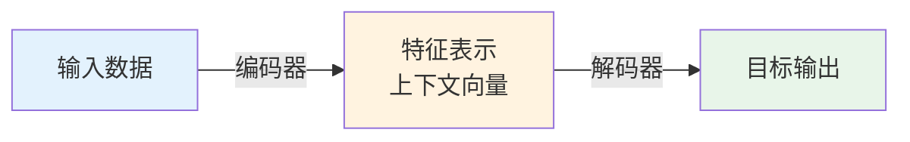
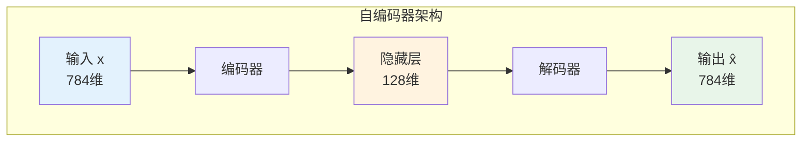
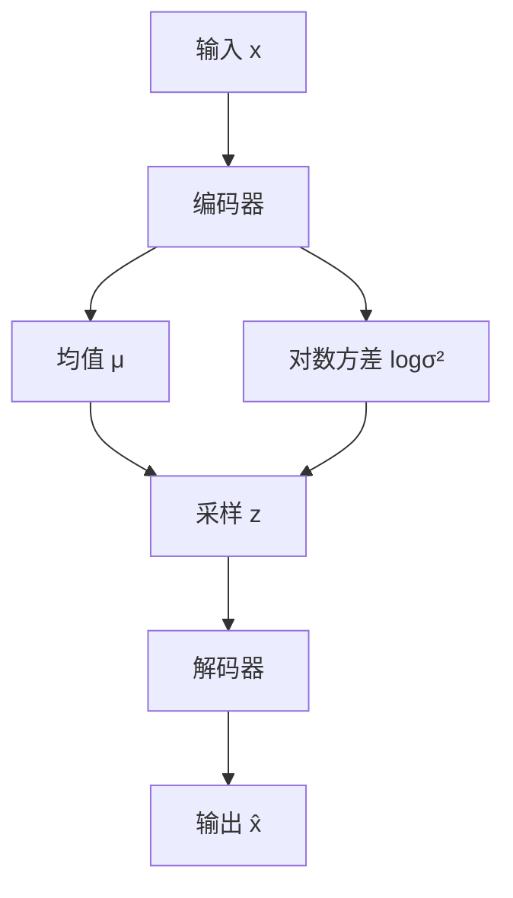

# 01a-编码器解码器架构详解

## 📝 摘要


## 1. 概述 📚


## 2. 编码器-解码器架构的本质 🤔

编码器-解码器（Encoder-Decoder）架构并非单一模型，而是一种通用的"两步式"框架。它既能**理解输入数据**，又能**生成目标输出**，是深度学习中最重要、最通用的架构设计模式之一。😊

### 2.1 什么是编码器-解码器

编码器-解码器架构由两个核心组件组成：😊

**编码器（Encoder）：**
- 📝 **作用**：将原始输入数据（文本、图像、语音等）转化为低维度的特征表示
- 🎯 **目标**：提取核心特征，剥离冗余信息
- 📦 **输出**：上下文向量（Context Vector）或潜在向量（Latent Vector）

**解码器（Decoder）：**
- 📝 **作用**：将编码器生成的特征表示重构为目标输出
- 🎯 **目标**：基于特征表示生成期望的输出格式
- 📤 **输出**：目标序列或重构的数据



> 💡 **类比理解**：编码器就像一位"速记员"，把长篇演讲压缩成几页笔记；解码器就像另一位"演讲者"，根据笔记重新组织语言进行演讲。

### 2.2 核心思想：压缩与重构

编码器-解码器架构的核心思想可以概括为两个字：**压缩**与**重构**。😊

**第一步：压缩（Compression）**
- 📉 将高维、复杂的输入数据压缩成低维、紧凑的特征表示
- 🎯 保留最关键的信息，丢弃噪声和冗余
- 💡 类似于人类的大脑记忆：我们不会记住每一个细节，而是记住核心概念

**第二步：重构（Reconstruction）**
- 📈 基于压缩后的特征表示，重构出目标格式的输出
- 🎯 可以是相同格式的重构（如去噪、修复），也可以是不同格式的转换（如翻译、描述）
- 💡 类似于根据记忆重新讲述一个故事，可能用词不同，但核心内容一致

**为什么这种架构有效？**
- 🧠 **信息瓶颈**：强制模型学习最重要的特征
- 🎯 **特征解耦**：将输入的复杂模式解耦成可理解的特征
- 🔄 **端到端学习**：从输入直接映射到输出，无需人工设计特征

### 2.3 与Seq2Seq的关系

编码器-解码器架构与 Seq2Seq（序列到序列）模型是什么关系？😊

**简单来说：Seq2Seq 是编码器-解码器架构的一种具体实现。**

| 对比项 | 编码器-解码器架构 | Seq2Seq 模型 |
|--------|------------------|-------------|
| **本质** | 通用的架构设计模式 | 具体的模型实现 |
| **输入输出** | 可以是任意数据类型 | 特指序列数据（文本、语音等） |
| **应用场景** | 图像生成、文本翻译、语音识别等 | 机器翻译、文本摘要、对话系统等 |
| **典型模型** | Autoencoder、VAE、Seq2Seq、Transformer | RNN-based Seq2Seq、Transformer |

**架构演进路线：**
```
编码器-解码器架构（通用框架）
    ↓
自编码器 Autoencoder（相同输入输出）
    ↓
变分自编码器 VAE（概率生成）
    ↓
Seq2Seq（不同输入输出序列）
    ↓
Transformer（注意力机制增强）
```

> 📖 **学习路径**：本文档（01a）讲解编码器-解码器的通用原理，下篇文档[02-序列到序列模型](https://juejin.cn/post/7627774689625391131)将深入探讨 Seq2Seq 的具体实现。建议先掌握本章内容，再学习 Seq2Seq 和 Transformer！🚀

### 2.4 与Transformer的关系

Transformer 与编码器-解码器架构是什么关系？😊

**Transformer 是编码器-解码器架构的一种高级实现形式。** 它完全继承了编码器-解码器的核心思想，但用 **注意力机制（Attention）** 彻底替代了传统的 RNN/LSTM 结构。

| 对比项 | 传统编码器-解码器 | Transformer |
|--------|------------------|-------------|
| **架构基础** | RNN/LSTM/GRU | 纯注意力机制 |
| **并行能力** | 串行计算，速度慢 | 完全并行，速度快 |
| **长距离依赖** | 梯度消失，难以捕捉 | 直接关联，无距离限制 |
| **代表模型** | RNN Seq2Seq | BERT、GPT、T5 |

**Transformer 的创新之处：**
- 🎯 **自注意力机制**：让序列中的每个位置都能直接关注所有其他位置
- ⚡ **完全并行**：不再依赖循环结构，可充分利用 GPU 并行计算
- 🌟 **位置编码**：通过正弦/余弦函数注入位置信息

> 📖 **前置知识**：在学习 Transformer 之前，强烈建议先理解编码器-解码器架构的基本原理。上篇文档[01-Transformer基础概念](https://juejin.cn/post/7627774689625391131)已经介绍了 Transformer 的整体架构，本文档（01a）则深入讲解其理论基础——编码器-解码器架构。掌握这些内容后，你就能真正理解 Transformer 的设计思想！💪


## 3. 自编码器（Autoencoder）🎯

自编码器（Autoencoder，AE）是最基础的编码器-解码器架构，它是一种**无监督学习**的神经网络模型。自编码器的目标是学习数据的有效表示（编码），通常用于降维、特征学习和数据去噪。😊

### 3.1 自编码器的基本结构

自编码器由两部分组成：编码器（Encoder）和解码器（Decoder），整体形成一个"沙漏"形状的结构。😊

**基本架构：**
```
输入数据（高维）
    ↓
[编码器] → 压缩
    ↓
潜在表示（低维）
    ↓
[解码器] → 重构
    ↓
输出数据（高维，与输入同维度）
```

**关键特点：**
- 🔄 **输入输出同维度**：自编码器的输入和输出具有相同的维度
- 📉 **中间层维度低**：潜在表示（Latent Representation）的维度远小于输入
- 🎯 **无监督学习**：不需要标签，通过最小化重构误差来训练



> 💡 **类比理解**：自编码器就像一位"文件压缩专家"，把大文件压缩成zip（编码），然后再解压还原（解码）。理想情况下，解压后的文件应该和原文件一模一样。

### 3.2 编码器：压缩输入

编码器的作用是将高维输入数据压缩成低维的潜在表示。😊

**数学表示：**
```
z = f(x)
```
其中：
- `x` 是输入数据（如一张 28×28 的图像，维度为 784）
- `f` 是编码器函数（通常是神经网络）
- `z` 是潜在表示（如 128 维的向量）

**编码器的实现：**
```python
# 简单的编码器示例（PyTorch风格）
class Encoder(nn.Module):
    def __init__(self, input_dim=784, hidden_dim=256, latent_dim=128):
        super().__init__()
        self.fc1 = nn.Linear(input_dim, hidden_dim)
        self.fc2 = nn.Linear(hidden_dim, latent_dim)
    
    def forward(self, x):
        x = torch.relu(self.fc1(x))
        z = self.fc2(x)  # 潜在表示
        return z
```

**编码器的核心任务：**
- 📉 **降维**：将高维数据映射到低维空间
- 🎯 **特征提取**：学习数据的最重要特征
- 🧠 **去噪**：过滤掉输入中的噪声和冗余信息

### 3.3 解码器：重构输出

解码器的作用是将潜在表示还原为与输入同维度的输出。😊

**数学表示：**
```
x̂ = g(z)
```
其中：
- `z` 是潜在表示（编码器的输出）
- `g` 是解码器函数（通常是神经网络）
- `x̂` 是重构的输出（应与输入 `x` 相似）

**解码器的实现：**
```python
# 简单的解码器示例（PyTorch风格）
class Decoder(nn.Module):
    def __init__(self, latent_dim=128, hidden_dim=256, output_dim=784):
        super().__init__()
        self.fc1 = nn.Linear(latent_dim, hidden_dim)
        self.fc2 = nn.Linear(hidden_dim, output_dim)
    
    def forward(self, z):
        z = torch.relu(self.fc1(z))
        x_hat = torch.sigmoid(self.fc2(z))  # 重构输出
        return x_hat
```

**训练目标：**
自编码器的训练目标是最小化**重构误差**，即输入和输出之间的差异：
```
Loss = ||x - x̂||²
```

常用的损失函数包括：
- 📏 **均方误差（MSE）**：适用于连续数据
- 📊 **交叉熵损失**：适用于概率分布数据

### 3.4 自编码器的应用

自编码器虽然结构简单，但应用非常广泛：😊

**1. 数据降维 📉**
- 类似于 PCA，但比 PCA 更强大（非线性降维）
- 应用：可视化高维数据、特征压缩

**2. 数据去噪 🧹**
- 训练时加入噪声，让自编码器学习去除噪声
- 应用：图像去噪、语音增强

**3. 特征学习 🎯**
- 学习数据的有效表示，用于下游任务
- 应用：预训练、迁移学习

**4. 异常检测 ⚠️**
- 正常数据重构误差小，异常数据重构误差大
- 应用：欺诈检测、设备故障检测

**5. 图像生成 🎨**
- 在潜在空间中进行插值，生成新图像
- 应用：人脸生成、风格迁移

> 💡 **局限性**：传统自编码器的潜在空间是不规则的，无法直接用于生成新样本。这就是变分自编码器（VAE）要解决的问题，我们将在下一章介绍！🚀


## 4. 变分自编码器（VAE）✨

变分自编码器（Variational Autoencoder，VAE）是自编码器的概率扩展版本，它不仅能重构输入，还能**生成新的数据样本**。VAE 在生成模型领域有着重要地位，是理解现代生成式 AI（如扩散模型）的基础。😊

> 📖 **什么是生成模型？** 简单说就是能"创造新数据"的模型。判别模型（如CNN）只能判断"这是猫还是狗"，而生成模型（如VAE、GPT、扩散模型）能画出"一只全新的猫"。🎨
>
> 💡 **扩散模型（Diffusion Models）**：目前最火的生成模型，通过"逐步去噪"生成图片。Stable Diffusion、Midjourney、DALL-E 都是基于扩散模型！它生成图片的质量比 VAE 更高，但原理更复杂。本文档先掌握 VAE，为理解扩散模型打基础。🚀

### 4.1 VAE与自编码器的区别

传统自编码器有一个致命缺陷：**无法生成新样本**。😊

**自编码器的问题：**

自编码器虽然能重构输入，但有个大问题：**它不知道"合理的编码"长什么样**。😊

> 🤔 **为什么不知道？**
> 
> 自编码器的训练目标只有一个：**把输入数据压缩后再还原，还原得越像越好**。
> 
> 但它从来没有学过："什么样的编码是合理的、能生成正常数据的"。
> 
> 打个比方：
> - 自编码器就像一个学生，他学会了"把课文背下来再默写出来"
> - 但他从没学过"什么样的句子是通顺的、有意义的"
> - 如果你让他随便写一句话，他可能写出"苹果在天上飞着狗"这种 nonsense
> 
> 这就是为什么自编码器只能"背课文"（重构见过的数据），不能"写作文"（生成新数据）。

**📍 1. 潜在空间乱七八糟（不连续）**

想象自编码器学习了1000个样本（可以是图片、文本、音频等），每个样本都被压缩成一个编码（比如128维的向量）。问题是：这些编码在潜在空间里分布得乱七八糟，没有任何规律！

```
样本1的编码：[0.5, -0.3, 0.8, ...]  ← 第1个样本
样本2的编码：[2.1, 0.7, -1.2, ...]  ← 第2个样本（和第一个完全不挨着）
样本3的编码：[-0.8, 1.5, 0.3, ...]  ← 第3个样本（又跳到别处）
...
```

这就像把1000本书随便扔在地上，没有书架、没有分类。😵

**后果是什么？** 如果你随机生成一个编码（比如 `[0.1, 0.2, 0.3, ...]`），解码器可能输出**无意义的数据**——既不像训练数据中的任何一类，而是一片混乱！因为自编码器从来没见过这个编码，不知道它应该对应什么。😱

**📊 对比理解：**

| 情况 | 比喻 | 结果 |
|------|------|------|
| **自编码器** | 书扔在地上，随机抽一本 | 可能抽到"空白页"（无意义输出）|
| **VAE** | 书整齐摆在书架上，按编号排列 | 抽到的都是有内容的书（合理输出）|

**🚫 2. 无法插值生成（存在"空白区域"）**

假设样本1的编码是 `[0.5, ...]`，样本2的编码是 `[2.1, ...]`。如果你取中间值 `[1.3, ...]`，按理说应该生成"介于两个样本之间的新样本"。

但在自编码器中，`[1.3, ...]` 这个位置可能是**空白区域**——解码器从来没见过这个编码，输出可能是乱码！😵‍💫

这就像在地上两本书之间的空地上随机挖一铲子，挖出来的可能是土，而不是书。😅

**❌ 3. 不是真正的生成模型**

自编码器只能做一件事：**把见过的数据再原样重构出来**。它不能创造新的数据，因为：
- 它不知道哪些编码是"合理的"
- 潜在空间里有大量"陷阱区域"

这就像一个人只会临摹，不会创作。🎨

> 💡 **一句话总结**：自编码器把数据都"记住"了，但记住了不代表"理解"了。VAE 的目标就是让模型真正"理解"什么样的编码是合理的。

**VAE 的解决方案：**

为了解决这个问题，VAE 改变了编码器的工作方式：😊

**🎯 1. 概率编码（不再输出固定值）**

传统自编码器：编码器看到一个样本 → 输出固定向量 `[0.5, 0.3, 0.8]`

VAE：编码器看到一个样本 → 输出一个**范围**而不是固定值：
- "这个样本的编码大概在 0.5 附近，可能在 0.3~0.7 之间"
- 用数学表示就是：均值 μ=0.5，方差 σ²=0.04（标准差 σ=0.2）

这样做的好处是：**同一个样本每次编码都会有点不同**，但都在合理范围内。就像不同的人描述同一件事，每次描述都略有不同，但都能理解是在说同一件事。😊

**📊 2. 正则化潜在空间（让分布有规律）**

如果每个样本的编码范围乱七八糟，潜在空间就会像一团乱麻。VAE 通过训练约束，让所有样本的编码都服从**标准正态分布 N(0,1)**：

- 均值 μ 接近 0
- 方差 σ² 接近 1

这样潜在空间就变得**整齐有序**了，就像把乱七八糟的书按编号整理到书架上。😊

**✨ 3. 可生成新样本（从分布中采样）**

因为潜在空间是整齐的标准正态分布，我们可以：
1. 随机生成一个符合 N(0,1) 的编码
2. 解码器把这个编码转换成数据（图片、文本等）
3. 得到一个**全新的、合理的**样本！

这就像从书架上随机抽一本书，虽然你没见过这本书，但它一定是一本"正常的书"而不是乱码。🎨

| 对比项 | 自编码器（AE） | 变分自编码器（VAE） |
|--------|---------------|-------------------|
| **编码器输出** | 固定的潜在向量 z | 分布参数（均值 μ，方差 σ²） |
| **潜在空间** | 不规则，无约束 | 服从标准正态分布 N(0,I) |
| **生成能力** | 无法生成新样本 | 可以生成新样本 |
| **训练目标** | 最小化重构误差 | 重构误差 + KL 散度 |
| **应用场景** | 降维、去噪、特征学习 | 图像生成、数据增强、风格迁移 |

### 4.2 概率编码与潜在空间

VAE 的核心创新是**概率编码**：编码器不再输出固定的向量，而是输出一个概率分布的参数。😊

**概率编码的原理：**
```
输入 x → 编码器 → 输出（μ(x) 和 σ(x)）→ 从 N(μ, σ²) 采样 → 潜在变量 z
```

**数学表示：**
- 编码器输出：均值 `μ(x)` 和对数方差 `log(σ²(x))`
- 潜在变量 `z` 服从高斯分布：`z ~ N(μ(x), σ²(x))`
- 先验分布：标准正态分布 `p(z) = N(0, I)`

**为什么需要正则化？**
VAE 通过 **KL 散度（Kullback-Leibler Divergence）** 约束潜在空间：
```
KL[q(z|x) || p(z)]
```
这迫使后验分布 `q(z|x)` 接近先验分布 `p(z)`，确保潜在空间的连续性和规范性。

**VAE 的完整架构：**



> 💡 流程说明：输入 x 经过编码器后，输出均值 μ 和对数方差 logσ²，从中采样得到潜在变量 z，最后通过解码器生成输出 x̂。

**VAE 的损失函数：**
```
Loss = 重构误差 + KL散度
     = ||x - x̂||² + KL[q(z|x) || p(z)]
```

- 📏 **重构误差**：衡量生成质量（与自编码器相同）
- 📊 **KL 散度**：衡量潜在分布与标准正态分布的差异

### 4.3 重参数化技巧

VAE 面临一个技术难题：**采样操作不可微**。😊

**问题描述：**
从分布 `N(μ, σ²)` 中采样 `z` 是一个随机操作，无法计算梯度，导致无法使用反向传播训练。

**解决方案：重参数化技巧（Reparameterization Trick）**

将随机采样转化为确定性变换：
```
z = μ + σ · ε
```
其中：
- `μ` 和 `σ` 是编码器输出的确定性参数
- `ε` 是从标准正态分布 `N(0, I)` 采样的随机噪声
- `z` 仍然服从 `N(μ, σ²)`，但梯度可以通过 `μ` 和 `σ` 传播

**代码实现：**
```python
# VAE 编码器 + 重参数化（PyTorch风格）
class VAEEncoder(nn.Module):
    def __init__(self, input_dim=784, hidden_dim=256, latent_dim=128):
        super().__init__()
        self.fc1 = nn.Linear(input_dim, hidden_dim)
        self.fc_mu = nn.Linear(hidden_dim, latent_dim)      # 输出均值
        self.fc_logvar = nn.Linear(hidden_dim, latent_dim)  # 输出对数方差
    
    def encode(self, x):
        h = torch.relu(self.fc1(x))
        mu = self.fc_mu(h)
        logvar = self.fc_logvar(h)
        return mu, logvar
    
    def reparameterize(self, mu, logvar):
        # 重参数化技巧
        std = torch.exp(0.5 * logvar)  # 标准差
        eps = torch.randn_like(std)     # 从 N(0,1) 采样
        z = mu + std * eps              # z ~ N(mu, std²)
        return z
    
    def forward(self, x):
        mu, logvar = self.encode(x)
        z = self.reparameterize(mu, logvar)
        return z, mu, logvar
```

**重参数化技巧的优势：**
- ✅ **可微分**：梯度可以通过 `μ` 和 `σ` 传播
- ✅ **随机性保留**：`ε` 的随机性保证了采样的多样性
- ✅ **训练稳定**：使端到端训练成为可能

**VAE 的应用场景：**
- 🎨 **图像生成**：生成人脸、数字、风景等
- 🎵 **音乐生成**：生成旋律、和弦进行
- ✍️ **文本生成**：生成句子、段落（需配合离散 VAE）
- 🔬 **分子设计**：生成新的化学分子结构
- 🎮 **游戏内容生成**：生成地图、角色、道具

> 💡 **总结**：VAE 通过概率编码和重参数化技巧，将自编码器从"重构工具"升级为"生成模型"。它为后来的生成对抗网络（GAN）、扩散模型（Diffusion Models）奠定了基础！🚀


## 5. Seq2Seq编码器-解码器 🔄


### 5.1 编码器：理解输入序列


### 5.2 上下文向量


### 5.3 解码器：生成输出序列


## 6. 三种架构对比 📊


### 6.1 自编码器 vs VAE vs Seq2Seq


### 6.2 应用场景对比


## 7. 大模型中的编码器-解码器架构 🚀


### 7.1 Encoder-only架构（BERT）


### 7.2 Decoder-only架构（GPT）


### 7.3 Encoder-Decoder架构（T5、BART）


## 8. 总结 📌


---

**最后更新时间**：2026-04-13
