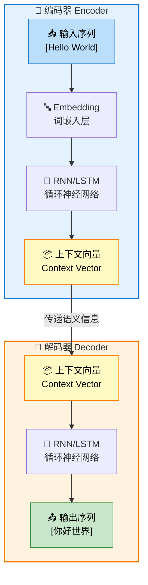

# 02-序列到序列模型

## 📝 摘要


## 1. 概述 📚


## 2. 什么是序列到序列模型 🤔

序列到序列（Sequence-to-Sequence，简称 Seq2Seq）是一种用于处理输入序列到输出序列映射的神经网络架构。它由 Google 团队在 2014 年提出，核心思想是将可变长度的输入序列转换为固定长度的"上下文向量"，再基于该向量生成可变长度的输出序列。😊

> 📖 **与Transformer的关系**：Transformer 本质上也是一种 Seq2Seq 架构，它继承了 Encoder-Decoder 的核心思想，但用注意力机制完全替代了 RNN。理解传统 Seq2Seq 是掌握 Transformer 的基础！

在上篇文档[01-Transformer基础概念](https://juejin.cn/post/7624451674656784394)（[CSDN](https://blog.csdn.net/2301_79239314/article/details/159824877)）中，我们已经了解了 Transformer 的整体架构。现在我们将深入探讨 Seq2Seq 这一更通用的概念，它不仅是 Transformer 的理论基础，也是理解现代大语言模型的关键。🚀

### 2.1 Seq2Seq的基本概念

Seq2Seq 模型是为了解决传统神经网络无法处理"输入输出长度不同"的问题而诞生的。想象一下机器翻译的场景：输入一句中文，输出一句英文，这两句话的长度往往是不一样的。😊

> 💡 **补充说明**：传统神经网络（如 RNN）在处理序列时也会使用**填充（Padding）**技术，但这只是为了解决同一批次中不同样本长度不一致的问题（比如 batch 中有的句子5个词，有的20个词，需要填充到一样长才能矩阵运算）。而 Seq2Seq 解决的是更本质的**架构层面**问题——整个任务的输入和输出长度可以完全不同（如中文2个字翻译成长长的英文句子），这是传统"一个输入对应一个输出"的神经网络无法做到的。

**核心特点：**
- 🔄 **端到端学习**：直接从输入序列映射到输出序列
- 📏 **长度灵活**：输入和输出序列长度可以不同
- 🎯 **通用架构**：适用于翻译、摘要、对话等多种任务

**一个简单的例子：**
```
输入序列：我 喜欢 学习 人工智能
输出序列：I love learning AI
```

在这个例子中，输入有 5 个词，输出只有 4 个词，Seq2Seq 能够灵活处理这种长度不匹配的情况。💪

### 2.2 编码器-解码器架构

Seq2Seq 模型由两个主要部分组成：编码器（Encoder）和解码器（Decoder）。这种架构设计灵感来自于人类翻译的过程：先理解源语言，再生成目标语言。😊

> 📖 **前置知识**：关于编码器-解码器架构的详细原理，请参考[01a-编码器解码器架构详解](https://juejin.cn/spost/7631034166373597210)（[CSDN](https://blog.csdn.net/2301_79239314/article/details/160380736)）。本文档重点讲解 Seq2Seq 如何将这一架构应用于序列转换任务。

**编码器（Encoder）：**
- 📝 **作用**：读取输入序列，将其压缩成一个固定长度的向量表示
- 🧠 **实现**：通常使用 RNN、LSTM 或 GRU 等循环神经网络
- 🎯 **输出**：上下文向量（Context Vector），包含输入序列的语义信息

**解码器（Decoder）：**
- 📝 **作用**：基于编码器生成的上下文向量，逐步生成输出序列
- 🧠 **实现**：同样是 RNN、LSTM 或 GRU
- 🎯 **工作方式**：逐个词生成输出，直到生成结束标记

**Seq2Seq 架构流程图：**



**数据流向说明：**

1. **编码阶段**：输入序列 → Embedding → RNN/LSTM → 上下文向量
2. **传递阶段**：上下文向量作为桥梁，传递给解码器
3. **解码阶段**：上下文向量 → RNN/LSTM → 逐个生成输出词

> 💡 **类比理解**：编码器就像一位翻译员在认真听演讲并做笔记（上下文向量），解码器则根据笔记内容用另一种语言重新讲述。

#### 2.2.1 Seq2Seq vs 标准编码器-解码器架构

你可能会有疑问：Seq2Seq 的编码器-解码器架构和标准的编码器-解码器架构有什么区别？🤔

**核心区别：**

| 对比项 | 标准编码器-解码器架构 | Seq2Seq 编码器-解码器 |
|--------|---------------------|---------------------|
| **输入输出** | 固定长度的输入和输出（如图像→图像） | 可变长度的序列输入和输出（如句子→句子） |
| **处理对象** | 静态数据（图像、特征向量） | 时序数据（文本、语音、时间序列） |
| **核心组件** | CNN、全连接网络 | RNN、LSTM、GRU（循环神经网络） |
| **信息传递** | 一次性编码传递 | 逐步编码，逐个解码生成 |
| **典型应用** | 图像去噪、图像生成、特征提取 | 机器翻译、文本摘要、对话系统 |

**结构上的核心区别：**

**1. 网络结构差异**

| 结构特性 | 标准编码器-解码器 | Seq2Seq 编码器-解码器 |
|---------|------------------|---------------------|
| **网络类型** | 前馈网络（Feedforward） | 循环网络（Recurrent） |
| **层间连接** | 层与层之间单向连接 | 时间步之间有循环连接 |
| **参数共享** | 不同位置使用不同参数 | 所有时间步共享同一套参数 |
| **状态传递** | 无隐藏状态传递 | 有隐藏状态 $h_t$ 传递 |

**2. 数据流动差异**

**标准编码器-解码器架构（如 VAE、图像分割）：**
```
输入图像 (256×256×3)
       ↓
┌─────────────────┐
│  编码器 CNN      │  ← 多层卷积，一次性处理整张图片
│  Conv → ReLU    │
│  Conv → ReLU    │
│  ...            │
└────────┬────────┘
       ↓
特征向量 (512维)  ← 只有一个输出
       ↓
┌─────────────────┐
│  解码器 CNN      │  ← 多层反卷积，一次性生成整张图片
│  Deconv → ReLU  │
│  Deconv → ReLU  │
│  ...            │
└────────┬────────┘
       ↓
输出图像 (256×256×3)
```
- 编码器：**一次性**处理整个输入，输出一个固定向量
- 解码器：**一次性**从向量生成整个输出
- 没有"时间步"的概念，所有操作是并行的

**Seq2Seq 编码器-解码器架构：**
```
输入序列：[我] → [喜欢] → [学习]
            ↓       ↓       ↓
        ┌─────────────────────────┐
        │      编码器 RNN          │
        │  ┌─────┐  ┌─────┐  ┌─────┐
        │  │ RNN │→│ RNN │→│ RNN │  ← 每个词逐个处理，有先后顺序
        │  │Cell │  │Cell │  │Cell │
        │  └──┬──┘  └──┬──┘  └──┬──┘
        │     h₁  →   h₂  →   h₃   ← 隐藏状态传递
        └─────┼───────────────────┘
              ↓
        上下文向量 c = h₃
              ↓
        ┌─────────────────────────┐
        │      解码器 RNN          │
        │  ┌─────┐  ┌─────┐  ┌─────┐
        │  │ RNN │→│ RNN │→│ RNN │  ← 逐个生成输出词
        │  │Cell │  │Cell │  │Cell │
        │  └──┬──┘  └──┬──┘  └──┬──┘
        │     s₁  →   s₂  →   s₃   ← 隐藏状态传递
        └─────┼───────────────────┘
              ↓       ↓       ↓
输出序列：[I]  → [love] → [learning]
```
- 编码器：**逐个**处理输入词，每个词处理后更新隐藏状态
- 解码器：**逐个**生成输出词，每个词依赖前一个词的输出
- 有明确的"时间步"概念，操作是顺序的

**3. 关键结构差异总结**

| 差异点 | 标准编码器-解码器 | Seq2Seq |
|-------|------------------|---------|
| **编码器输出** | 单一张量（如 512 维向量） | 多个隐藏状态，取最后一个作为上下文向量 |
| **解码器输入** | 一次性接收编码结果 | 每个时间步都接收上下文向量 + 上一时刻输出 |
| **连接方式** | 编码器输出 → 解码器输入（一次性） | 编码器最后状态 → 解码器初始状态（传递） |
| **生成方式** | 一次性生成完整输出 | 自回归生成（逐个词，依赖前文） |

> 💡 **核心洞察**：标准编码器-解码器是"并行处理、一次性完成"，而 Seq2Seq 是"顺序处理、逐步生成"。这种结构差异使得 Seq2Seq 能够处理变长序列，但也带来了信息瓶颈问题。

**关系总结：**

Seq2Seq 是编码器-解码器架构的一种**具体实现**，专门用于处理**序列到序列**的映射问题。可以把编码器-解码器看作是一个通用的"设计模式"，而 Seq2Seq 是这个模式在 NLP 领域的特化版本。

> 📖 **深入学习**：
> - 想了解更多关于**编码器-解码器架构的通用原理**（包括自编码器、VAE等），请参考[01a-编码器解码器架构详解](https://juejin.cn/spost/7631034166373597210)（[CSDN](https://blog.csdn.net/2301_79239314/article/details/160380736)）的**第2章**。
> - 想了解**编码器-解码器架构与 Seq2Seq 的关系对比**，请参考[01a-编码器解码器架构详解](https://juejin.cn/spost/7631034166373597210)（[CSDN](https://blog.csdn.net/2301_79239314/article/details/160380736)）的**2.3节**。
> - 想了解**解码器的详细工作机制**（输入输出、Teacher Forcing等），请参考[01a-编码器解码器架构详解](https://juejin.cn/spost/7631034166373597210)（[CSDN](https://blog.csdn.net/2301_79239314/article/details/160380736)）的**5.5节**。
> - 想了解**上下文向量的深入分析**（生成机制、信息瓶颈问题），请参考[01b-上下文向量与信息瓶颈](https://juejin.cn/post/7631595203976101915)（[CSDN](https://blog.csdn.net/2301_79239314/article/details/160419503)）。

### 2.3 上下文向量（Context Vector）

上下文向量是 Seq2Seq 架构的核心，它是编码器对输入序列的"总结"。😊

**什么是上下文向量？**
- 📦 一个固定长度的向量（比如 256 维、512 维）
- 🧠 包含了输入序列的全部语义信息
- 🔄 是编码器和解码器之间的"桥梁"

**工作原理：**
```
输入序列："我 喜欢 学习"  →  编码器处理  →  上下文向量：[0.2, -0.5, 0.8, ...]
                                                      ↓
                                              解码器读取  →  生成："I love learning"
```

**存在的问题：**
- 📏 **信息瓶颈**：无论输入多长，都要压缩成固定长度的向量
- 📉 **信息丢失**：长序列的信息容易被"挤"掉
- 🎯 **注意力分散**：对所有输入词一视同仁，无法突出重点

> ⚠️ **局限性**：当输入序列很长时（比如一篇长文章），上下文向量难以保存所有信息，这就是后来引入注意力机制的原因。

这些问题促使了注意力机制的诞生，我们将在第 6 章详细介绍。🚀

> 📖 **深入学习**：想了解更多关于**上下文向量的生成机制、数学表示和信息瓶颈问题**的深入分析，请参考[01b-上下文向量与信息瓶颈](https://juejin.cn/post/7631595203976101915)（[CSDN](https://blog.csdn.net/2301_79239314/article/details/160419503)）的**第2章**和**第4章**。


## 3. Seq2Seq的应用场景 🎯

Seq2Seq 模型因其能够处理"输入输出长度不同"的序列转换任务，在自然语言处理领域有着广泛的应用。😊 下面我们来看看几个最典型的应用场景。

### 3.1 机器翻译 🌐

**机器翻译是 Seq2Seq 最成功的应用**，也是 Google 团队提出 Seq2Seq 架构的初衷。

**工作原理：**
```
输入（英文）：The agreement was signed in August 1992.
       ↓
   [编码器处理]
       ↓
上下文向量：[0.3, -0.8, 0.5, ...]
       ↓
   [解码器生成]
       ↓
输出（法文）：L'accord a été signé en août 1992.
```

**为什么 Seq2Seq 适合机器翻译？**

| 特性 | 说明 |
|------|------|
| **长度灵活** | 英文4个词 → 法文7个词，长度可以不同 |
| **语义保持** | 编码器捕捉语义，解码器用另一种语言表达 |
| **端到端学习** | 无需人工设计翻译规则，数据驱动 |

**里程碑事件：**
- 2016年，Google Translate 全面转向神经机器翻译（NMT），错误率骤降 60%
- 2024年，Google 翻译日均处理超 1000 亿词，支持 133 种语言

> 💡 **典型案例**：输入 "The agreement on the European Economic Area was signed in August 1992."
> - Seq2Seq 输出："L'accord sur la zone économique européenne a été signé en août 1992."
> - 精准保留了时间、法律术语等关键信息！

### 3.2 文本摘要 📝

**任务目标**：将长文档压缩成简短摘要，保留核心信息。

**应用场景：**
- 📰 新闻摘要：将长篇报道浓缩成几句话
- 📄 论文摘要：自动生成学术论文的摘要
- 📧 邮件摘要：快速了解邮件核心内容

**工作流程：**
```
长文章（1000字）
    ↓
[编码器] 提取核心语义
    ↓
上下文向量（语义压缩）
    ↓
[解码器] 生成摘要
    ↓
短摘要（100字）
```

**挑战与局限：**
- ❌ **信息丢失**：长文章压缩到短摘要，细节难以保留
- ❌ **关键信息遗漏**：可能漏掉重要事实或数据
- ✅ **注意力机制改进**：引入 Attention 后，摘要质量提升 30%+

### 3.3 对话系统 💬

**应用模式**：编码器理解用户问题，解码器生成自然回复。

**典型场景：**
- 🤖 智能客服：自动回答用户咨询
- 🗣️ 聊天机器人：日常对话交互
- 📱 语音助手：Siri、Alexa 等

**工作流程：**
```
用户提问："明天北京天气怎么样？"
    ↓
[编码器] 理解意图（查询天气 + 地点北京 + 时间明天）
    ↓
上下文向量
    ↓
[解码器] 生成回复
    ↓
系统回复："明天北京晴，气温15-25℃，适合出行。"
```

**传统 Seq2Seq 的局限：**
- 😐 **安全回复问题**：倾向于生成"我不知道"、"好的"等通用回复
- 🔄 **缺乏多样性**：回复模式单一，不够自然
- 🧠 **无记忆能力**：无法理解多轮对话的上下文

> 💡 **改进方向**：结合 Attention 机制和外部知识库，提升对话质量。

### 3.4 语音识别 🎤

**任务目标**：将音频信号转换为文字序列。

**处理流程：**
```
音频波形 → 特征提取（MFCC）→ 声学特征序列 → [Seq2Seq] → 文字序列
```

**具体步骤：**
1. **特征提取**：将音频转换为梅尔频率倒谱系数（MFCC）特征序列
2. **编码器**：处理声学特征，捕捉语音模式
3. **解码器**：生成对应的文字转录

**应用场景：**
- 🎙️ 语音输入法：实时将语音转为文字
- 📹 视频字幕：自动生成视频字幕
- 📞 电话转录：记录通话内容

**技术挑战：**
- 🗣️ **口音差异**：不同口音的语音特征差异大
- 🔊 **噪声干扰**：背景噪声影响识别准确率
- ⚡ **实时性要求**：需要低延迟的实时转录

### 3.5 其他应用场景 🚀

Seq2Seq 的应用远不止这些，还包括：

| 应用领域 | 输入 | 输出 | 示例 |
|---------|------|------|------|
| **代码生成** | 自然语言描述 | 可执行代码 | "计算斐波那契数列" → Python代码 |
| **图像描述** | 图像特征 | 文字描述 | 图片 → "一只猫坐在沙发上" |
| **文本纠错** | 错误文本 | 正确文本 | "我爱北京天安们" → "我爱北京天安门" |
| **风格迁移** | 正式文本 | 口语化文本 | 论文 → 通俗科普文章 |

**总结：**

Seq2Seq 的通用性使其成为 NLP（Natural Language Processing，自然语言处理）领域的"瑞士军刀"，几乎所有"序列→序列"的转换任务都可以用它来解决。当然，不同任务需要根据具体特点调整模型结构（如加入 Attention、使用预训练模型等）。


## 4. RNN-based Seq2Seq 🔄

在 Transformer 出现之前，Seq2Seq 主要基于 **循环神经网络（RNN）** 及其变体实现。本节我们将深入了解这些经典的 Seq2Seq 实现方式。😊

### 4.1 传统RNN Seq2Seq结构

**RNN（Recurrent Neural Network，循环神经网络）** 是 Seq2Seq 最早使用的编码器和解码器基础结构。

> 📚 **前置知识**：如果你还不熟悉RNN的基本原理，建议先阅读《01c-循环神经网络RNN详解》：
> - **掘金**：[01c-循环神经网络RNN详解](https://juejin.cn/post/7632201056928268334)
> - **CSDN**：[01c-循环神经网络RNN详解](https://blog.csdn.net/2301_79239314/article/details/160481070)
> 
> 该文档对RNN的详细工作原理、数学公式和代码实现进行了深入讲解。

**RNN 的核心思想：**

RNN 通过引入**循环连接**，让隐藏状态在时间步之间传递，从而保留历史信息。就像一个有记忆的人，每读一个新词，都会结合之前的记忆来理解。🧠

**数学公式（简要回顾）：**

$$
h_t = \tanh(W_{xh} x_t + W_{hh} h_{t-1} + b_h)
$$

其中：
- $x_t$：第 $t$ 步的输入（如词向量）
- $h_t$：第 $t$ 步的隐藏状态（"记忆"）
- $W_{xh}, W_{hh}$：权重矩阵
- $\tanh$：激活函数，将状态压缩到 $(-1, 1)$ 区间

**RNN Seq2Seq 结构：**

```
输入序列：[我] → [喜欢] → [学习]
            ↓       ↓       ↓
        ┌─────────────────────────┐
        │      编码器 RNN          │
        │  ┌─────┐  ┌─────┐  ┌─────┐
        │  │ RNN │→│ RNN │→│ RNN │
        │  │Cell │  │Cell │  │Cell │
        │  └──┬──┘  └──┬──┘  └──┬──┘
        │     h₁  →   h₂  →   h₃   ← 隐藏状态传递
        └─────┼───────────────────┘
              ↓
        上下文向量 c = h₃
              ↓
        ┌─────────────────────────┐
        │      解码器 RNN          │
        │  ┌─────┐  ┌─────┐  ┌─────┐
        │  │ RNN │→│ RNN │→│ RNN │
        │  │Cell │  │Cell │  │Cell │
        │  └──┬──┘  └──┬──┘  └──┬──┘
        │     s₁  →   s₂  →   s₃
        └─────┼───────────────────┘
              ↓       ↓       ↓
输出序列：[I]  → [love] → [learning]
```

**工作流程：**

1. **编码阶段**：RNN 逐个读取输入词，更新隐藏状态
2. **传递阶段**：取最后一个隐藏状态作为上下文向量
3. **解码阶段**：另一个 RNN 从上下文向量开始，逐个生成输出词

### 4.2 LSTM/GRU改进版本

传统 RNN 有一个致命缺陷：**梯度消失/爆炸问题**。当序列很长时，早期的信息很难传递到后面。为了解决这个问题，研究者们提出了改进版本。🔧

#### 4.2.1 LSTM（长短期记忆网络）

**LSTM（Long Short-Term Memory）**通过引入**门控机制**和**细胞状态**，实现了对信息的精细控制。

**核心组件：**

| 组件 | 作用 | 类比 |
|------|------|------|
| **遗忘门** | 决定丢弃哪些历史信息 | 大脑的"删除"功能 |
| **输入门** | 决定存储哪些新信息 | 大脑的"记录"功能 |
| **细胞状态** | 长期记忆的"传送带" | 笔记本的主页 |
| **输出门** | 决定输出哪些信息 | 大脑的"表达"功能 |

**LSTM 的优势：**
- ✅ 有效缓解梯度消失问题
- ✅ 能学习长序列中的长期依赖
- ✅ 通过门控灵活控制信息流

**在 Seq2Seq 中的应用：**

2014年 Google 的原始 Seq2Seq 论文就是使用 **4层 LSTM** 实现的，在英法翻译任务上取得了突破性成果。

#### 4.2.2 GRU（门控循环单元）

**GRU（Gated Recurrent Unit）** 是 LSTM 的简化版本，将三个门合并为两个门，参数更少但效果相当。

**GRU vs LSTM 对比：**

| 对比项 | LSTM | GRU |
|--------|------|-----|
| **门控数量** | 3个（遗忘、输入、输出） | 2个（更新、重置） |
| **参数数量** | 较多 | 较少（约少25%） |
| **训练速度** | 较慢 | 较快 |
| **效果** | 在长序列上略优 | 在多数任务上相当 |

**选择建议：**
- 📊 **数据量大、序列长** → 选 LSTM
- ⚡ **数据量小、需要快速训练** → 选 GRU
- 🎯 **实际应用中**，两者差异通常不大，都可以尝试

### 4.3 RNN Seq2Seq的局限性

尽管 RNN-based Seq2Seq 取得了很大成功，但它存在一些根本性的局限：⚠️

#### 4.3.1 信息瓶颈问题

**问题描述：**
无论输入序列多长，所有信息都要压缩到一个固定维度的上下文向量中。

**具体表现：**
- 📉 输入超过 20 个词时，翻译质量明显下降
- 📝 长句翻译容易遗漏细节
- 🔄 首尾信息难以同时保留

**实验数据：**
在 WMT 2014 基准测试中，当输入超过 20 词时，BLEU 值平均下降 12.3%。

#### 4.3.2 长期依赖捕捉困难

**问题根源：**
即使使用 LSTM/GRU，当序列很长时，早期的信息仍然难以影响后期的输出。

**典型例子：**
```
输入："虽然昨天下了大雨，但是今天的天气____"
                          ↑
                    需要关联到句首的"天气"
```
RNN 在处理这种长距离依赖时表现不佳。

#### 4.3.3 串行计算效率低

**问题描述：**
RNN 必须按顺序处理序列，无法并行计算。

**影响：**
- ⏱️ **训练慢**：无法利用 GPU 的并行计算能力
- 🐌 **推理慢**：生成每个词都要等前一个词完成
- 📈 **难以扩展**：序列越长，计算时间越长

#### 4.3.4 梯度问题依然存在

虽然 LSTM/GRU 缓解了梯度消失，但并未完全解决：
- 🔻 **极长序列**（>100词）仍会出现信息丢失
- 🔺 **梯度裁剪**只能缓解爆炸，不能解决消失
- 🔄 **多层堆叠**会加剧梯度问题

> 💡 **总结**：RNN-based Seq2Seq 是 Seq2Seq 发展的重要里程碑，但它的局限性也促使了注意力机制和 Transformer 的诞生。正如一位研究者所说："Seq2Seq 的问题不是它不够好，而是它让我们看到了更好的可能性。"


## 5. Teacher Forcing机制 👨‍🏫


### 5.1 什么是Teacher Forcing


### 5.2 Teacher Forcing的作用


### 5.3 训练与推理的区别


## 6. 注意力机制的引入 ✨


### 6.1 为什么需要注意力


### 6.2 注意力机制的基本思想


### 6.3 注意力 vs 上下文向量


## 7. Transformer-based Seq2Seq ⚡


### 7.1 为什么Transformer更适合Seq2Seq


### 7.2 Transformer Seq2Seq的优势


## 8. 模型对比与选择 📊


### 8.1 RNN vs Transformer对比


### 8.2 如何选择合适的架构


## 9. 总结 📌


---

**最后更新时间**：2026-04-13
