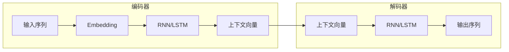

# 02-序列到序列模型

## 📝 摘要


## 1. 概述 📚


## 2. 什么是序列到序列模型 🤔

序列到序列（Sequence-to-Sequence，简称 Seq2Seq）是一种用于处理输入序列到输出序列映射的神经网络架构。它由 Google 团队在 2014 年提出，核心思想是将可变长度的输入序列转换为固定长度的"上下文向量"，再基于该向量生成可变长度的输出序列。😊

> 📖 **与Transformer的关系**：Transformer 本质上也是一种 Seq2Seq 架构，它继承了 Encoder-Decoder 的核心思想，但用注意力机制完全替代了 RNN。理解传统 Seq2Seq 是掌握 Transformer 的基础！

在上篇文档[01-Transformer基础概念](https://juejin.cn/post/7627774689625391131)中，我们已经了解了 Transformer 的整体架构。现在我们将深入探讨 Seq2Seq 这一更通用的概念，它不仅是 Transformer 的理论基础，也是理解现代大语言模型的关键。🚀

### 2.1 Seq2Seq的基本概念

Seq2Seq 模型是为了解决传统神经网络无法处理"输入输出长度不同"的问题而诞生的。想象一下机器翻译的场景：输入一句中文，输出一句英文，这两句话的长度往往是不一样的。😊

**核心特点：**
- 🔄 **端到端学习**：直接从输入序列映射到输出序列
- 📏 **长度灵活**：输入和输出序列长度可以不同
- 🎯 **通用架构**：适用于翻译、摘要、对话等多种任务

**一个简单的例子：**
```
输入序列：我 喜欢 学习 人工智能
输出序列：I love learning AI
```

在这个例子中，输入有 5 个词，输出只有 4 个词，Seq2Seq 能够灵活处理这种长度不匹配的情况。💪

### 2.2 编码器-解码器架构

Seq2Seq 模型由两个主要部分组成：编码器（Encoder）和解码器（Decoder）。这种架构设计灵感来自于人类翻译的过程：先理解源语言，再生成目标语言。😊

**编码器（Encoder）：**
- 📝 **作用**：读取输入序列，将其压缩成一个固定长度的向量表示
- 🧠 **实现**：通常使用 RNN、LSTM 或 GRU 等循环神经网络
- 🎯 **输出**：上下文向量（Context Vector），包含输入序列的语义信息

**解码器（Decoder）：**
- 📝 **作用**：基于编码器生成的上下文向量，逐步生成输出序列
- 🧠 **实现**：同样是 RNN、LSTM 或 GRU
- 🎯 **工作方式**：逐个词生成输出，直到生成结束标记



> 💡 **类比理解**：编码器就像一位翻译员在认真听演讲并做笔记（上下文向量），解码器则根据笔记内容用另一种语言重新讲述。

### 2.3 上下文向量（Context Vector）

上下文向量是 Seq2Seq 架构的核心，它是编码器对输入序列的"总结"。😊

**什么是上下文向量？**
- 📦 一个固定长度的向量（比如 256 维、512 维）
- 🧠 包含了输入序列的全部语义信息
- 🔄 是编码器和解码器之间的"桥梁"

**工作原理：**
```
输入序列："我 喜欢 学习"  →  编码器处理  →  上下文向量：[0.2, -0.5, 0.8, ...]
                                                      ↓
                                              解码器读取  →  生成："I love learning"
```

**存在的问题：**
- 📏 **信息瓶颈**：无论输入多长，都要压缩成固定长度的向量
- 📉 **信息丢失**：长序列的信息容易被"挤"掉
- 🎯 **注意力分散**：对所有输入词一视同仁，无法突出重点

> ⚠️ **局限性**：当输入序列很长时（比如一篇长文章），上下文向量难以保存所有信息，这就是后来引入注意力机制的原因。

这些问题促使了注意力机制的诞生，我们将在第 6 章详细介绍。🚀


## 3. Seq2Seq的应用场景 🎯


### 3.1 机器翻译


### 3.2 文本摘要


### 3.3 对话系统


### 3.4 语音识别


## 4. RNN-based Seq2Seq 🔄


### 4.1 传统RNN Seq2Seq结构


### 4.2 LSTM/GRU改进版本


### 4.3 RNN Seq2Seq的局限性


## 5. Teacher Forcing机制 👨‍🏫


### 5.1 什么是Teacher Forcing


### 5.2 Teacher Forcing的作用


### 5.3 训练与推理的区别


## 6. 注意力机制的引入 ✨


### 6.1 为什么需要注意力


### 6.2 注意力机制的基本思想


### 6.3 注意力 vs 上下文向量


## 7. Transformer-based Seq2Seq ⚡


### 7.1 为什么Transformer更适合Seq2Seq


### 7.2 Transformer Seq2Seq的优势


## 8. 模型对比与选择 📊


### 8.1 RNN vs Transformer对比


### 8.2 如何选择合适的架构


## 9. 总结 📌


---

**最后更新时间**：2026-04-13
