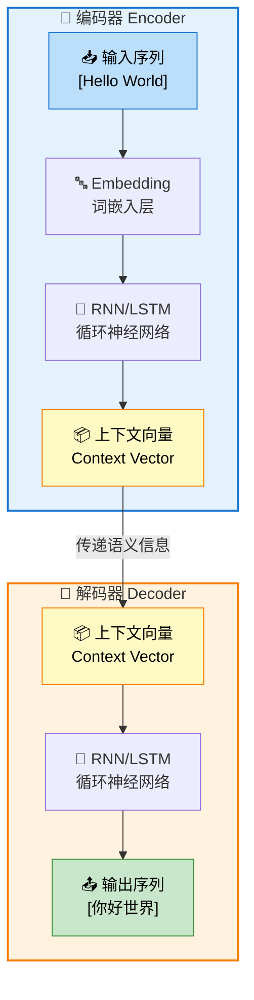

# 02-序列到序列模型

## 📝 摘要


## 1. 概述 📚


## 2. 什么是序列到序列模型 🤔

序列到序列（Sequence-to-Sequence，简称 Seq2Seq）是一种用于处理输入序列到输出序列映射的神经网络架构。它由 Google 团队在 2014 年提出，核心思想是将可变长度的输入序列转换为固定长度的"上下文向量"，再基于该向量生成可变长度的输出序列。😊

> 📖 **与Transformer的关系**：Transformer 本质上也是一种 Seq2Seq 架构，它继承了 Encoder-Decoder 的核心思想，但用注意力机制完全替代了 RNN。理解传统 Seq2Seq 是掌握 Transformer 的基础！

在上篇文档[01-Transformer基础概念](https://juejin.cn/post/7624451674656784394)（[CSDN](https://blog.csdn.net/2301_79239314/article/details/159824877)）中，我们已经了解了 Transformer 的整体架构。现在我们将深入探讨 Seq2Seq 这一更通用的概念，它不仅是 Transformer 的理论基础，也是理解现代大语言模型的关键。🚀

### 2.1 从神经网络到Seq2Seq：技术演进之路 🛤️

要理解 Seq2Seq 的重要性，我们需要回顾神经网络处理序列数据的技术演进历程。每一代技术都在解决前一代无法克服的局限。

#### 2.1.1 技术演进的三次突破

| 阶段 | 代表技术 | 解决的问题 | 遗留的局限 | 相关文档 |
|------|---------|-----------|-----------|---------|
| **第一代** | 前馈神经网络（MLP/CNN） | 静态数据的模式识别 | ❌ 无法处理序列数据<br>❌ 输入输出固定长度 | - |
| **第二代** | 循环神经网络（RNN/LSTM/GRU） | 变长序列的建模<br>捕捉时间依赖关系 | ❌ 输入输出长度必须相同<br>❌ 无法直接做序列转换 | [01c-RNN详解](https://juejin.cn/post/7632201056928268334) / [CSDN](https://blog.csdn.net/2301_79239314/article/details/160481070)<br>[01a1-LSTM/GRU](https://juejin.cn/post/7631179225043927067) / [CSDN](https://blog.csdn.net/2301_79239314/article/details/160415547) |
| **第三代** | **Seq2Seq（2014）** | **输入输出长度可不同的序列转换** | ❌ 信息瓶颈问题<br>❌ 长序列效果差 | **本文档** |
| **第四代** | Transformer（2017） | 并行计算<br>长距离依赖建模 | 💰 计算资源需求大 | [01-Transformer基础](https://juejin.cn/post/7624451674656784394) / [CSDN](https://blog.csdn.net/2301_79239314/article/details/159824877) |

#### 2.1.2 为什么需要Seq2Seq？

让我们用**机器翻译**这个经典场景来说明：

**场景：将英文翻译成中文**

```
输入（英文）：I love Deep Learning
             ↓ 翻译
输出（中文）：我爱深度学习
```

**各代技术的处理能力：**

| 技术 | 输入长度 | 输出长度 | 能否处理？ | 原因 |
|------|---------|---------|-----------|------|
| **MLP/CNN** | 4个词 | 5个字 | ❌ 不能 | 无法处理变长序列 |
| **标准RNN** | 4个词 | 5个字 | ❌ 不能 | RNN要求输入输出等长 |
| **Seq2Seq** | 4个词 | 5个字 | ✅ 能 | Encoder读取输入，Decoder独立生成输出 |

> 💡 **关键洞察**：RNN 能处理"变长输入"，但要求"输入输出等长"；而 Seq2Seq 通过 Encoder-Decoder 架构，让输入和输出长度完全解耦，这是质的飞跃！

#### 2.1.3 Seq2Seq解决了哪些具体问题？

Seq2Seq 主要解决了以下**序列转换任务**：

| 任务类型 | 输入示例 | 输出示例 | 长度关系 |
|---------|---------|---------|---------|
| **机器翻译** | "Hello world" (2词) | "你好世界" (4字) | 不同 |
| **文本摘要** | 长文章 (500词) | 摘要 (50词) | 输入 > 输出 |
| **对话生成** | "你好吗？" (3字) | "我很好，谢谢！" (6字) | 不同 |
| **语音识别** | 音频序列 (1000帧) | 文本 "你好" (2字) | 不同 |
| **代码生成** | "写一个排序函数" (7字) | Python代码 (20行) | 不同 |

**共同特点：**
- 🔄 输入是一个序列
- 🔄 输出也是一个序列
- 📏 **输入和输出长度可以不同**（这是核心！）

#### 2.1.4 Seq2Seq与RNN的关系澄清

很多初学者会混淆 Seq2Seq 和 RNN 的关系，这里需要明确：

**关系定位：**
- **RNN** 是"工具"（神经网络结构）
- **Seq2Seq** 是"架构"（组织工具的方式）

**实现方式：**
```
Seq2Seq 架构
    ├── Encoder（编码器）→ 通常用 RNN/LSTM/GRU 实现
    └── Decoder（解码器）→ 通常用 RNN/LSTM/GRU 实现
```

> 📚 **前置知识**：关于 RNN 的详细工作原理，请参考[01c-循环神经网络RNN详解](https://juejin.cn/post/7632201056928268334)（[CSDN](https://blog.csdn.net/2301_79239314/article/details/160481070)）。

**简单类比：**
- RNN 就像"发动机"（提供动力）
- Seq2Seq 就像"汽车设计"（用两个发动机分别驱动前后轮）
- Seq2Seq 不是改进发动机，而是**用发动机做新的事情**

### 2.2 Seq2Seq的基本概念

Seq2Seq 模型是为了解决传统神经网络无法处理"输入输出长度不同"的问题而诞生的。想象一下机器翻译的场景：输入一句中文，输出一句英文，这两句话的长度往往是不一样的。😊

> 💡 **补充说明**：传统神经网络（如 RNN）在处理序列时也会使用**填充（Padding）**技术，但这只是为了解决同一批次中不同样本长度不一致的问题（比如 batch 中有的句子5个词，有的20个词，需要填充到一样长才能矩阵运算）。而 Seq2Seq 解决的是更本质的**架构层面**问题——整个任务的输入和输出长度可以完全不同（如中文2个字翻译成长长的英文句子），这是传统"一个输入对应一个输出"的神经网络无法做到的。

**核心特点：**
- 🔄 **端到端学习**：直接从输入序列映射到输出序列
- 📏 **长度灵活**：输入和输出序列长度可以不同
- 🎯 **通用架构**：适用于翻译、摘要、对话等多种任务

**一个简单的例子：**
```
输入序列：我 喜欢 学习 人工智能
输出序列：I love learning AI
```

在这个例子中，输入有 5 个词，输出只有 4 个词，Seq2Seq 能够灵活处理这种长度不匹配的情况。💪

### 2.3 Seq2Seq vs RNN：架构与实现的关系 🤔

很多初学者容易混淆 Seq2Seq 和 RNN 的概念。让我们澄清这个重要的区别：😊

**核心区别：**

| 对比项 | Seq2Seq | RNN |
|--------|---------|-----|
| **本质** | 架构设计模式 | 神经网络结构 |
| **作用** | 定义"如何组织"模型 | 定义"如何计算"隐藏状态 |
| **组成** | Encoder + Decoder | 循环单元（Cell）|
| **关系** | 可以用RNN实现 | 可以作为Seq2Seq的组件 |

**通俗理解：**

可以把 Seq2Seq 想象成**建筑图纸**（设计了一套两室一厅的房子），而 RNN 是**建筑材料**（比如砖块）。🏠

- **Seq2Seq** 规定了你需要一个编码器（客厅）和一个解码器（卧室），以及它们如何协作
- **RNN/LSTM/GRU** 是构建这些组件的具体材料，负责处理序列数据的计算

**实现方式的演进：**

```
Seq2Seq 架构（Encoder-Decoder）
    ├── RNN-based Seq2Seq（2014）→ 使用RNN作为编码器和解码器
    ├── LSTM/GRU Seq2Seq（2015）→ 使用LSTM/GRU改进长序列处理
    └── Transformer Seq2Seq（2017）→ 使用注意力机制替代RNN
```

> 💡 **关键洞察**：Seq2Seq 是"做什么"（序列到序列映射），RNN 是"怎么做"（通过循环结构处理序列）。理解这一点对掌握深度学习架构至关重要！

### 2.4 编码器-解码器架构

Seq2Seq 模型由两个主要部分组成：编码器（Encoder）和解码器（Decoder）。这种架构设计灵感来自于人类翻译的过程：先理解源语言，再生成目标语言。😊

> 📖 **前置知识**：关于编码器-解码器架构的详细原理，请参考[01a-编码器解码器架构详解](https://juejin.cn/spost/7631034166373597210)（[CSDN](https://blog.csdn.net/2301_79239314/article/details/160380736)）。本文档重点讲解 Seq2Seq 如何将这一架构应用于序列转换任务。

**编码器（Encoder）：**
- 📝 **作用**：读取输入序列，将其压缩成一个固定长度的向量表示
- 🧠 **实现**：通常使用 RNN、LSTM 或 GRU 等循环神经网络
- 🎯 **输出**：上下文向量（Context Vector），包含输入序列的语义信息

**解码器（Decoder）：**
- 📝 **作用**：基于编码器生成的上下文向量，逐步生成输出序列
- 🧠 **实现**：同样是 RNN、LSTM 或 GRU
- 🎯 **工作方式**：逐个词生成输出，直到生成结束标记

**Seq2Seq 架构流程图：**



**数据流向说明：**

1. **编码阶段**：输入序列 → Embedding → RNN/LSTM → 上下文向量
2. **传递阶段**：上下文向量作为桥梁，传递给解码器
3. **解码阶段**：上下文向量 → RNN/LSTM → 逐个生成输出词

> 💡 **类比理解**：编码器就像一位翻译员在认真听演讲并做笔记（上下文向量），解码器则根据笔记内容用另一种语言重新讲述。

#### 2.2.1 Seq2Seq vs 标准编码器-解码器架构

你可能会有疑问：Seq2Seq 的编码器-解码器架构和标准的编码器-解码器架构有什么区别？🤔

**核心区别：**

| 对比项 | 标准编码器-解码器架构 | Seq2Seq 编码器-解码器 |
|--------|---------------------|---------------------|
| **输入输出** | 固定长度的输入和输出（如图像→图像） | 可变长度的序列输入和输出（如句子→句子） |
| **处理对象** | 静态数据（图像、特征向量） | 时序数据（文本、语音、时间序列） |
| **核心组件** | CNN、全连接网络 | RNN、LSTM、GRU（循环神经网络） |
| **信息传递** | 一次性编码传递 | 逐步编码，逐个解码生成 |
| **典型应用** | 图像去噪、图像生成、特征提取 | 机器翻译、文本摘要、对话系统 |

**结构上的核心区别：**

**1. 网络结构差异**

| 结构特性 | 标准编码器-解码器 | Seq2Seq 编码器-解码器 |
|---------|------------------|---------------------|
| **网络类型** | 前馈网络（Feedforward） | 循环网络（Recurrent） |
| **层间连接** | 层与层之间单向连接 | 时间步之间有循环连接 |
| **参数共享** | 不同位置使用不同参数 | 所有时间步共享同一套参数 |
| **状态传递** | 无隐藏状态传递 | 有隐藏状态 $h_t$ 传递 |

**2. 数据流动差异**

**标准编码器-解码器架构（如 VAE、图像分割）：**
```
输入图像 (256×256×3)
       ↓
┌─────────────────┐
│  编码器 CNN      │  ← 多层卷积，一次性处理整张图片
│  Conv → ReLU    │
│  Conv → ReLU    │
│  ...            │
└────────┬────────┘
       ↓
特征向量 (512维)  ← 只有一个输出
       ↓
┌─────────────────┐
│  解码器 CNN      │  ← 多层反卷积，一次性生成整张图片
│  Deconv → ReLU  │
│  Deconv → ReLU  │
│  ...            │
└────────┬────────┘
       ↓
输出图像 (256×256×3)
```
- 编码器：**一次性**处理整个输入，输出一个固定向量
- 解码器：**一次性**从向量生成整个输出
- 没有"时间步"的概念，所有操作是并行的

**Seq2Seq 编码器-解码器架构：**
```
输入序列：[我] → [喜欢] → [学习]
            ↓       ↓       ↓
        ┌─────────────────────────┐
        │      编码器 RNN          │
        │  ┌─────┐  ┌─────┐  ┌─────┐
        │  │ RNN │→│ RNN │→│ RNN │  ← 每个词逐个处理，有先后顺序
        │  │Cell │  │Cell │  │Cell │
        │  └──┬──┘  └──┬──┘  └──┬──┘
        │     h₁  →   h₂  →   h₃   ← 隐藏状态传递
        └─────┼───────────────────┘
              ↓
        上下文向量 c = h₃
              ↓
        ┌─────────────────────────┐
        │      解码器 RNN          │
        │  ┌─────┐  ┌─────┐  ┌─────┐
        │  │ RNN │→│ RNN │→│ RNN │  ← 逐个生成输出词
        │  │Cell │  │Cell │  │Cell │
        │  └──┬──┘  └──┬──┘  └──┬──┘
        │     s₁  →   s₂  →   s₃   ← 隐藏状态传递
        └─────┼───────────────────┘
              ↓       ↓       ↓
输出序列：[I]  → [love] → [learning]
```
- 编码器：**逐个**处理输入词，每个词处理后更新隐藏状态
- 解码器：**逐个**生成输出词，每个词依赖前一个词的输出
- 有明确的"时间步"概念，操作是顺序的

**3. 关键结构差异总结**

| 差异点 | 标准编码器-解码器 | Seq2Seq |
|-------|------------------|---------|
| **编码器输出** | 单一张量（如 512 维向量） | 多个隐藏状态，取最后一个作为上下文向量 |
| **解码器输入** | 一次性接收编码结果 | 每个时间步都接收上下文向量 + 上一时刻输出 |
| **连接方式** | 编码器输出 → 解码器输入（一次性） | 编码器最后状态 → 解码器初始状态（传递） |
| **生成方式** | 一次性生成完整输出 | 自回归生成（逐个词，依赖前文） |

> 💡 **核心洞察**：标准编码器-解码器是"并行处理、一次性完成"，而 Seq2Seq 是"顺序处理、逐步生成"。这种结构差异使得 Seq2Seq 能够处理变长序列，但也带来了信息瓶颈问题。

**关系总结：**

Seq2Seq 是编码器-解码器架构的一种**具体实现**，专门用于处理**序列到序列**的映射问题。可以把编码器-解码器看作是一个通用的"设计模式"，而 Seq2Seq 是这个模式在 NLP 领域的特化版本。

> 📖 **深入学习**：
> - 想了解更多关于**编码器-解码器架构的通用原理**（包括自编码器、VAE等），请参考[01a-编码器解码器架构详解](https://juejin.cn/spost/7631034166373597210)（[CSDN](https://blog.csdn.net/2301_79239314/article/details/160380736)）的**第2章**。
> - 想了解**编码器-解码器架构与 Seq2Seq 的关系对比**，请参考[01a-编码器解码器架构详解](https://juejin.cn/spost/7631034166373597210)（[CSDN](https://blog.csdn.net/2301_79239314/article/details/160380736)）的**2.3节**。
> - 想了解**解码器的详细工作机制**（输入输出、Teacher Forcing等），请参考[01a-编码器解码器架构详解](https://juejin.cn/spost/7631034166373597210)（[CSDN](https://blog.csdn.net/2301_79239314/article/details/160380736)）的**5.5节**。
> - 想了解**上下文向量的深入分析**（生成机制、信息瓶颈问题），请参考[01b-上下文向量与信息瓶颈](https://juejin.cn/post/7631595203976101915)（[CSDN](https://blog.csdn.net/2301_79239314/article/details/160419503)）。

### 2.5 上下文向量（Context Vector）

上下文向量是 Seq2Seq 架构的核心，它是编码器对输入序列的"总结"。😊

**什么是上下文向量？**
- 📦 一个固定长度的向量（比如 256 维、512 维）
- 🧠 包含了输入序列的全部语义信息
- 🔄 是编码器和解码器之间的"桥梁"

**工作原理：**
```
输入序列："我 喜欢 学习"  →  编码器处理  →  上下文向量：[0.2, -0.5, 0.8, ...]
                                                      ↓
                                              解码器读取  →  生成："I love learning"
```

**存在的问题：**
- 📏 **信息瓶颈**：无论输入多长，都要压缩成固定长度的向量
- 📉 **信息丢失**：长序列的信息容易被"挤"掉
- 🎯 **注意力分散**：对所有输入词一视同仁，无法突出重点

> ⚠️ **局限性**：当输入序列很长时（比如一篇长文章），上下文向量难以保存所有信息，这就是后来引入注意力机制的原因。

这些问题促使了注意力机制的诞生，我们将在第 6 章详细介绍。🚀

> 📖 **深入学习**：想了解更多关于**上下文向量的生成机制、数学表示和信息瓶颈问题**的深入分析，请参考[01b-上下文向量与信息瓶颈](https://juejin.cn/post/7631595203976101915)（[CSDN](https://blog.csdn.net/2301_79239314/article/details/160419503)）的**第2章**和**第4章**。


## 3. Seq2Seq的应用场景 🎯

Seq2Seq 模型因其能够处理"输入输出长度不同"的序列转换任务，在自然语言处理领域有着广泛的应用。😊 下面我们来看看几个最典型的应用场景。

### 3.1 机器翻译 🌐

**机器翻译是 Seq2Seq 最成功的应用**，也是 Google 团队提出 Seq2Seq 架构的初衷。

**工作原理：**
```
输入（英文）：The agreement was signed in August 1992.
       ↓
   [编码器处理]
       ↓
上下文向量：[0.3, -0.8, 0.5, ...]
       ↓
   [解码器生成]
       ↓
输出（法文）：L'accord a été signé en août 1992.
```

**为什么 Seq2Seq 适合机器翻译？**

| 特性 | 说明 |
|------|------|
| **长度灵活** | 英文4个词 → 法文7个词，长度可以不同 |
| **语义保持** | 编码器捕捉语义，解码器用另一种语言表达 |
| **端到端学习** | 无需人工设计翻译规则，数据驱动 |

**里程碑事件：**
- 2016年，Google Translate 全面转向神经机器翻译（NMT），错误率骤降 60%
- 2024年，Google 翻译日均处理超 1000 亿词，支持 133 种语言

> 💡 **典型案例**：输入 "The agreement on the European Economic Area was signed in August 1992."
> - Seq2Seq 输出："L'accord sur la zone économique européenne a été signé en août 1992."
> - 精准保留了时间、法律术语等关键信息！

### 3.2 文本摘要 📝

**任务目标**：将长文档压缩成简短摘要，保留核心信息。

**应用场景：**
- 📰 新闻摘要：将长篇报道浓缩成几句话
- 📄 论文摘要：自动生成学术论文的摘要
- 📧 邮件摘要：快速了解邮件核心内容

**工作流程：**
```
长文章（1000字）
    ↓
[编码器] 提取核心语义
    ↓
上下文向量（语义压缩）
    ↓
[解码器] 生成摘要
    ↓
短摘要（100字）
```

**挑战与局限：**
- ❌ **信息丢失**：长文章压缩到短摘要，细节难以保留
- ❌ **关键信息遗漏**：可能漏掉重要事实或数据
- ✅ **注意力机制改进**：引入 Attention 后，摘要质量提升 30%+

### 3.3 对话系统 💬

**应用模式**：编码器理解用户问题，解码器生成自然回复。

**典型场景：**
- 🤖 智能客服：自动回答用户咨询
- 🗣️ 聊天机器人：日常对话交互
- 📱 语音助手：Siri、Alexa 等

**工作流程：**
```
用户提问："明天北京天气怎么样？"
    ↓
[编码器] 理解意图（查询天气 + 地点北京 + 时间明天）
    ↓
上下文向量
    ↓
[解码器] 生成回复
    ↓
系统回复："明天北京晴，气温15-25℃，适合出行。"
```

**传统 Seq2Seq 的局限：**
- 😐 **安全回复问题**：倾向于生成"我不知道"、"好的"等通用回复
- 🔄 **缺乏多样性**：回复模式单一，不够自然
- 🧠 **无记忆能力**：无法理解多轮对话的上下文

> 💡 **改进方向**：结合 Attention 机制和外部知识库，提升对话质量。

### 3.4 语音识别 🎤

**任务目标**：将音频信号转换为文字序列。

**处理流程：**
```
音频波形 → 特征提取（MFCC）→ 声学特征序列 → [Seq2Seq] → 文字序列
```

**具体步骤：**
1. **特征提取**：将音频转换为梅尔频率倒谱系数（MFCC）特征序列
2. **编码器**：处理声学特征，捕捉语音模式
3. **解码器**：生成对应的文字转录

**应用场景：**
- 🎙️ 语音输入法：实时将语音转为文字
- 📹 视频字幕：自动生成视频字幕
- 📞 电话转录：记录通话内容

**技术挑战：**
- 🗣️ **口音差异**：不同口音的语音特征差异大
- 🔊 **噪声干扰**：背景噪声影响识别准确率
- ⚡ **实时性要求**：需要低延迟的实时转录

### 3.5 其他应用场景 🚀

Seq2Seq 的应用远不止这些，还包括：

| 应用领域 | 输入 | 输出 | 示例 |
|---------|------|------|------|
| **代码生成** | 自然语言描述 | 可执行代码 | "计算斐波那契数列" → Python代码 |
| **图像描述** | 图像特征 | 文字描述 | 图片 → "一只猫坐在沙发上" |
| **文本纠错** | 错误文本 | 正确文本 | "我爱北京天安们" → "我爱北京天安门" |
| **风格迁移** | 正式文本 | 口语化文本 | 论文 → 通俗科普文章 |

**总结：**

Seq2Seq 的通用性使其成为 NLP（Natural Language Processing，自然语言处理）领域的"瑞士军刀"，几乎所有"序列→序列"的转换任务都可以用它来解决。当然，不同任务需要根据具体特点调整模型结构（如加入 Attention、使用预训练模型等）。


## 4. RNN-based Seq2Seq 🔄

在 Transformer 出现之前，Seq2Seq 主要基于 **循环神经网络（RNN）** 及其变体实现。本节我们将深入了解这些经典的 Seq2Seq 实现方式。😊

### 4.1 传统RNN Seq2Seq结构

**RNN（Recurrent Neural Network，循环神经网络）** 是 Seq2Seq 最早使用的编码器和解码器基础结构。

> 📚 **前置知识**：如果你还不熟悉RNN的基本原理，建议先阅读《01c-循环神经网络RNN详解》：
> - **掘金**：[01c-循环神经网络RNN详解](https://juejin.cn/post/7632201056928268334)
> - **CSDN**：[01c-循环神经网络RNN详解](https://blog.csdn.net/2301_79239314/article/details/160481070)
> 
> 该文档对RNN的详细工作原理、数学公式和代码实现进行了深入讲解。

**RNN 的核心思想：**

RNN 通过引入**循环连接**，让隐藏状态在时间步之间传递，从而保留历史信息。就像一个有记忆的人，每读一个新词，都会结合之前的记忆来理解。🧠

**数学公式（简要回顾）：**

$$
h_t = \tanh(W_{xh} x_t + W_{hh} h_{t-1} + b_h)
$$

其中：
- $x_t$：第 $t$ 步的输入（如词向量）
- $h_t$：第 $t$ 步的隐藏状态（"记忆"）
- $W_{xh}, W_{hh}$：权重矩阵
- $\tanh$：激活函数，将状态压缩到 $(-1, 1)$ 区间

**RNN Seq2Seq 结构：**

```
输入序列：[我] → [喜欢] → [学习]
            ↓       ↓       ↓
        ┌─────────────────────────┐
        │      编码器 RNN          │
        │  ┌─────┐  ┌─────┐  ┌─────┐
        │  │ RNN │→│ RNN │→│ RNN │
        │  │Cell │  │Cell │  │Cell │
        │  └──┬──┘  └──┬──┘  └──┬──┘
        │     h₁  →   h₂  →   h₃   ← 隐藏状态传递
        └─────┼───────────────────┘
              ↓
        上下文向量 c = h₃
              ↓
        ┌─────────────────────────┐
        │      解码器 RNN          │
        │  ┌─────┐  ┌─────┐  ┌─────┐
        │  │ RNN │→│ RNN │→│ RNN │
        │  │Cell │  │Cell │  │Cell │
        │  └──┬──┘  └──┬──┘  └──┬──┘
        │     s₁  →   s₂  →   s₃
        └─────┼───────────────────┘
              ↓       ↓       ↓
输出序列：[I]  → [love] → [learning]
```

**工作流程：**

1. **编码阶段**：RNN 逐个读取输入词，更新隐藏状态
2. **传递阶段**：取最后一个隐藏状态作为上下文向量
3. **解码阶段**：另一个 RNN 从上下文向量开始，逐个生成输出词

### 4.2 LSTM/GRU改进版本

传统 RNN 有一个致命缺陷：**梯度消失/爆炸问题**。当序列很长时，早期的信息很难传递到后面。为了解决这个问题，研究者们提出了改进版本。🔧

#### 4.2.1 LSTM（长短期记忆网络）

> 📚 **详细文档**：如需深入了解LSTM和GRU的完整原理、数学公式和代码实现，请参考：
> - **掘金**：[01a1-LSTM与GRU门控机制详解](https://juejin.cn/post/7631179225043927067)
> - **CSDN**：[01a1-LSTM与GRU门控机制详解](https://blog.csdn.net/2301_79239314/article/details/160415547)

**LSTM（Long Short-Term Memory）**通过引入**门控机制**和**细胞状态**，实现了对信息的精细控制。

**核心组件：**

| 组件 | 作用 | 类比 |
|------|------|------|
| **遗忘门** | 决定丢弃哪些历史信息 | 大脑的"删除"功能 |
| **输入门** | 决定存储哪些新信息 | 大脑的"记录"功能 |
| **细胞状态** | 长期记忆的"传送带" | 笔记本的主页 |
| **输出门** | 决定输出哪些信息 | 大脑的"表达"功能 |

**LSTM 的优势：**
- ✅ 有效缓解梯度消失问题
- ✅ 能学习长序列中的长期依赖
- ✅ 通过门控灵活控制信息流

**在 Seq2Seq 中的应用：**

2014年 Google 的原始 Seq2Seq 论文就是使用 **4层 LSTM** 实现的，在英法翻译任务上取得了突破性成果。

#### 4.2.2 GRU（门控循环单元）

**GRU（Gated Recurrent Unit）** 是 LSTM 的简化版本，将三个门合并为两个门，参数更少但效果相当。

**GRU vs LSTM 对比：**

| 对比项 | LSTM | GRU |
|--------|------|-----|
| **门控数量** | 3个（遗忘、输入、输出） | 2个（更新、重置） |
| **参数数量** | 较多 | 较少（约少25%） |
| **训练速度** | 较慢 | 较快 |
| **效果** | 在长序列上略优 | 在多数任务上相当 |

**选择建议：**
- 📊 **数据量大、序列长** → 选 LSTM
- ⚡ **数据量小、需要快速训练** → 选 GRU
- 🎯 **实际应用中**，两者差异通常不大，都可以尝试

### 4.3 RNN Seq2Seq的局限性

尽管 RNN-based Seq2Seq 取得了很大成功，但它存在一些根本性的局限：⚠️

#### 4.3.1 信息瓶颈问题

**问题描述：**
无论输入序列多长，所有信息都要压缩到一个固定维度的上下文向量中。

**具体表现：**
- 📉 输入超过 20 个词时，翻译质量明显下降
- 📝 长句翻译容易遗漏细节
- 🔄 首尾信息难以同时保留

**实验数据：**
在 WMT 2014 基准测试中，当输入超过 20 词时，BLEU 值平均下降 12.3%。

实验数据参考资料：
- [Context Vector Limitations: Why Translation Model Fails on Long Sentences -- SotaAZ](https://blog.sotaaz.com/post/context-vector-limitation-en)

#### 4.3.2 长期依赖捕捉困难

**问题根源：**
即使使用 LSTM/GRU，当序列很长时，早期的信息仍然难以影响后期的输出。

**典型例子：**
```
输入："虽然昨天下了大雨，但是今天的天气____"
                          ↑
                    需要关联到句首的"天气"
```
RNN 在处理这种长距离依赖时表现不佳。

#### 4.3.3 串行计算效率低

**问题描述：**
RNN 必须按顺序处理序列，无法并行计算。

**影响：**
- ⏱️ **训练慢**：无法利用 GPU 的并行计算能力
- 🐌 **推理慢**：生成每个词都要等前一个词完成
- 📈 **难以扩展**：序列越长，计算时间越长

#### 4.3.4 梯度问题依然存在

虽然 LSTM/GRU 缓解了梯度消失，但并未完全解决：
- 🔻 **极长序列**（>100词）仍会出现信息丢失
- 🔺 **梯度裁剪**只能缓解爆炸，不能解决消失
- 🔄 **多层堆叠**会加剧梯度问题

> 💡 **总结**：RNN-based Seq2Seq 是 Seq2Seq 发展的重要里程碑，但它的局限性也促使了注意力机制和 Transformer 的诞生。正如一位研究者所说："Seq2Seq 的问题不是它不够好，而是它让我们看到了更好的可能性。"


## 5. Teacher Forcing机制 👨‍🏫


### 5.1 什么是Teacher Forcing

Teacher Forcing（教师强制）是一种在训练Seq2Seq模型时使用的技术。😊

**核心思想：**

在训练过程中，Decoder的输入不使用上一时刻的预测结果，而是直接使用真实的目标序列。这样可以让模型在"正确答案"的上下文中学习预测下一个词。

**工作流程：**

假设我们要翻译：
```
输入（中文）：我 爱 学习
输出（英文）：I love learning
```

训练时，Decoder的输入输出是这样设置的：

| 时间步 | Decoder输入 | 期望输出 |
|--------|------------|---------|
| 1 | `<SOS>`（开始符） | I |
| 2 | I | love |
| 3 | love | learning |
| 4 | learning | `<EOS>`（结束符） |

可以看到：每个时间步的输入都是**真实的上一个词**，而不是模型预测的词。

**为什么叫Teacher Forcing？**

就像老师教学生做题时，直接告诉学生正确答案，让学生直接在正确的基础上继续做下一步。🧑‍🏫

Teacher Forcing参考资料：
- [从 Encoder-Decoder 到 Teacher Forcing：Seq2Seq 机器翻译的完整原理与实现细节全解析 -- CSDN](https://blog.csdn.net/qq_62634342/article/details/158355291)
- [Teacher Forcing技术解析 -- CSDN](https://ask.csdn.net/questions/8707819)


### 5.2 Teacher Forcing的作用

Teacher Forcing在训练Seq2Seq模型时主要有以下作用：😊

**1. 加速训练收敛**

由于每一时刻都使用真实标签（ground truth），模型不必承受早期预测错误的累积，能够更快学习到正确的序列依赖关系。想象一下，如果老师不纠正学生的第一个错误，学生可能会在错误的基础上越走越远，浪费更多时间才能回到正轨。🚀

**2. 提高训练稳定性**

避免了因模型错误带来的梯度消失或梯度爆炸问题，使得训练过程更加平滑。在不使用Teacher Forcing的情况下，早期的预测错误会通过后续步骤不断累积，导致误差像滚雪球一样越来越大。❄️

**3. 训练效率高**

每个时间步都能快速对比预测值与实际值，误差能及时反馈，从而加速收敛。

**4. 减少梯度消失**

传统的自回归训练可能在长序列中累积误差，而Teacher Forcing让每个时间步的输入始终正确，有效缓解了长序列训练中的梯度消失问题。📉

Teacher Forcing作用参考资料：
- [Teacher Forcing技术解析 -- CSDN](https://blog.csdn.net/longtengzhangjie/article/details/151155632)
- [强制教学（Teacher Forcing）-- CSDN](https://blog.csdn.net/u013172930/article/details/145481992)

### 5.3 Teacher Forcing的缺点

Teacher Forcing虽然能加速训练，但也存在一些明显的缺陷：😟

**1. 曝光偏差（Exposure Bias）**

这是Teacher Forcing最核心的问题。训练时，模型始终使用真实标签作为输入，而推理时，模型只能使用自己之前的预测结果。这种"训练时吃山珍海味，推理时吃粗茶淡饭"的差异，导致模型在真实场景中表现下降。📉

**2. 训练与推理分布不一致**

训练阶段看到的输入分布（真实标签）与推理阶段看到的输入分布（模型预测）完全不同，模型没有机会学习如何从自己的错误中恢复。🔄

**3. 推理表现不稳定**

由于训练过程中没有模拟真实生成时的累积误差，模型在测试阶段容易出现"一步错，步步错"的情况。⚡

**4. 无法处理生成错误**

如果推理时某一步生成错误，错误会直接传递给后续所有时间步，而训练时这种情况几乎不会发生。🔗

Teacher Forcing缺点参考资料：
- [Teacher Forcing技术解析 -- CSDN](https://blog.csdn.net/longtengzhangjie/article/details/151155632)
- [强制教学（Teacher Forcing）-- CSDN](https://blog.csdn.net/u013172930/article/details/145481992)

### 5.4 训练与推理的区别

训练和推理是Seq2Seq模型两个完全不同的阶段，它们在输入、处理方式和效率上都有很大差异。😮

**核心区别：输入不同**

| 阶段 | Decoder每步的输入 | 特点 |
|------|-----------------|------|
| **训练** | 真实的目标词（Ground Truth） | 无论上一步预测对错，都使用正确答案 |
| **推理** | 模型自己预测的词 | 只能依赖之前的生成结果 |

**训练阶段（Teacher Forcing）**

训练时，我们手里有标准答案。为了加速收敛，直接把正确答案喂给Decoder：
- 解码器输入：`<SOS> I love learning`
- 期望输出：`I love learning <EOS>`
- 每个时间步使用的都是真实的上一个词

这种方式可以并行计算所有时间步的损失，训练速度快。⚡

**推理阶段（自回归生成）**

推理时，没有正确答案可用，模型必须自己一个字一个字地生成：
- 第一步：输入`<SOS>` → 预测输出`I`
- 第二步：输入`<SOS> I` → 预测输出`love`
- 第三步：输入`<SOS> I love` → 预测输出`learning`
- 第四步：输入`<SOS> I love learning` → 预测输出`<EOS>`，停止

这就是自回归生成——每一步的输出都依赖于之前生成的所有内容。🔄

**一个生动的比喻**

训练就像学骑自行车时教练扶着车后座，你每踩一步，教练都帮你稳住。
推理就像教练松手了，你必须自己保持平衡，一步一步骑下去。🚴

**其他区别**

| 对比项 | 训练 | 推理 |
|--------|------|------|
| 并行性 | 可以并行计算所有时间步 | 必须串行生成 |
| 损失计算 | 可以计算整个序列的交叉熵损失 | 只输出结果，不计算损失 |
| 解码策略 | Teacher Forcing | 贪心搜索/束搜索 |
| 速度 | 快 | 慢（需要逐步生成） |

训练与推理参考资料：
- [从 Encoder-Decoder 到 Teacher Forcing：Seq2Seq 机器翻译的完整原理与实现细节全解析 -- CSDN](https://blog.csdn.net/qq_62634342/article/details/158355291)
- [Seq2Seq模型解析 -- 腾讯云](https://cloud.tencent.cn/developer/article/2623310)
- [Seq2Seq的推理机制，训练机制 -- 掘金](https://aicoding.juejin.cn/post/7597266967138549794)


## 6. 注意力机制的引入 ✨

### 6.0 注意力机制是什么？

注意力机制（Attention Mechanism）是一种让深度学习模型"学会取舍"的技术。😊

**核心灵感来源于人类视觉**

当你看一张照片时，你不会同时看清每一个细节，而是有选择地关注重要的部分——比如画面中的人物、醒目的文字。这就是人类的"注意力"。

同理，注意力机制让神经网络在处理信息时，能够动态地决定应该"关注"输入的哪些部分，忽略哪些部分。👀

**注意力机制的核心思想**

注意力机制的核心是"按需获取"——需要什么信息，就去提取什么信息。

用数学语言来说，注意力机制的计算过程可以概括为三步：
1. **Query（查询）**：当前需要什么（解码器的当前状态）
2. **Key（键）**：每个输入位置的"索引"
3. **Value（值）**：每个位置的实际信息

通过计算Query和Key的相似度，得到每个位置的重要性权重，然后用这些权重对Value进行加权求和，就得到了"聚焦"后的结果。🧮

**一个简单的例子**

翻译英文 "The cat sat on the mat" → "猫坐在垫子上"

当解码器生成"猫"这个词时，注意力机制会让模型更关注输入中的"cat"，而不是其他词。
当解码器生成"垫子"时，模型会更多关注"mat"。

这就是"因时制宜"的智慧！✨

**注意力机制的意义**

注意力机制的提出是深度学习领域的一个里程碑：
- 它让模型能够处理更长的序列
- 它让模型能够更好地捕捉长距离依赖关系
- 它让模型具有更好的可解释性（可以看到模型关注了什么）
- 它是Transformer架构的核心组件

注意力机制参考资料：
- [什么是注意力机制? -- IBM](https://www.ibm.com/cn-zh/think/topics/attention-mechanism)
- [什么是注意力机制?从原理到实践的全面解析 -- CSDN](https://blog.csdn.net/qq_41803278/article/details/152253456)
- [Attention注意力机制:原理、实现与优化全解析 -- CSDN](https://blog.csdn.net/2401_85592132/article/details/154444698)

### 6.1 为什么需要注意力

传统的Seq2Seq模型有一个致命问题：无论输入多长，都要压缩成一个固定大小的上下文向量。这就像让你用一句话概括一本小说——肯定会丢失大量细节！

注意力机制就是来解决这个问题的：它允许解码器在生成每个词时，直接查看输入序列的所有位置，而不是只依赖那个小小的上下文向量。📝

### 6.2 注意力机制是如何实现的？

注意力机制的实现可以分为四个核心步骤。🧮

**第一步：生成Q、K、V矩阵**

首先，输入序列的每个词向量通过三个独立的线性层，分别生成Query（查询）、Key（键）和Value（值）三个向量。

- Query：代表"我当前需要什么信息"
- Key：代表"我这个位置包含什么信息"
- Value：代表"我这个位置的实际内容"

**第二步：计算注意力分数**

计算Query和Key的相似度，得到每个位置的重要性分数。方法是矩阵乘法：$Q \times K^T$

相似度越高，说明当前Query越需要关注这个Key对应的位置。

**第三步：缩放与Softmax归一化**

将注意力分数除以$\sqrt{d_k}$（$d_k$是Key的维度），这叫"缩放点积注意力"，目的是防止数值过大导致Softmax梯度消失。

然后对每行进行Softmax操作，把分数转换成概率分布（所有分数和为1）。

**第四步：加权求和**

用Softmax得到的权重对Value进行加权求和，得到最终的注意力输出。

**完整公式：**

$$Attention(Q, K, V) = softmax\left(\frac{QK^T}{\sqrt{d_k}}\right)V$$

**一个直观的例子**

假设我们要翻译 "I love AI" → "我爱人工智能"

当解码器生成"爱"时：
- 解码器的Query是"我想表达爱"
- 与Key"love"相似度最高
- 所以Value"love"的信息被更多地提取出来

这就是注意力机制"按需获取"的实现过程！🎯

注意力机制实现参考资料：
- [Attention注意力机制:原理、实现与优化全解析 -- CSDN](https://blog.csdn.net/2401_85592132/article/details/154444698)
- [Transformer中的Self-Attention机制到底在算什么 -- 腾讯云](https://cloud.tencent.com.cn/developer/article/2539651)
- [深入解析注意力机制:原理、实现与应用 -- CSDN](https://blog.csdn.net/ZuanShi1111/article/details/151261251)

### 6.3 注意力 vs 上下文向量

上下文向量和注意力机制是两种不同的信息传递方式，它们之间的区别就像"死记硬背"和"查阅资料"的区别。📚

**上下文向量：一次性压缩**

上下文向量的工作方式是：编码器把整个输入序列压缩成一个固定长度的向量，解码器生成每个词时都使用这同一个向量。

- 无论输入多长，都压缩成256维或512维的向量
- 解码器在生成每个词时，看到的是同一个"总结"
- 信息容易在压缩过程中丢失

**注意力机制：按需查阅**

注意力机制的工作方式是：解码器在生成每个词时，都会重新查看整个输入序列，根据当前需要动态决定关注哪些部分。

- 每个解码步骤都有自己独特的上下文
- 可以直接访问输入序列的任意位置
- 需要什么信息，就去提取什么信息

**核心对比**

| 对比项 | 上下文向量 | 注意力机制 |
|--------|-----------|-----------|
| **信息获取** | 一个固定向量用到底 | 每个步骤动态计算 |
| **长序列处理** | 效果差，信息丢失严重 | 效果好，能捕捉长距离依赖 |
| **计算方式** | 一次性编码 | 逐步加权求和 |
| **灵活性** | 低 | 高 |

**一个生动的比喻**

上下文向量就像一位听力不太好的翻译员：你把整段话说给他听，他努力记住全部内容，然后凭记忆翻译。由于记忆有限，说得太长就容易遗漏细节。

注意力机制就像一位拿着原文的翻译员：每翻译一个词，都可以回头查看原文中对应的部分，不需要完全靠记忆。这样即使原文很长，也能准确翻译。📝

**实际效果**

引入注意力机制后：
- 长句子翻译质量显著提升
- 模型能更好地处理长距离依赖（比如"他"指代的对象可能出现在句子开头）
- BLEU分数大幅提高

注意力 vs 上下文向量参考资料：
- [上下文向量与信息瓶颈 -- 掘金](https://juejin.cn/post/7631595203976101915)
- [序列到序列模型：Encoder-Decoder架构、注意力机制的本质 -- CSDN](https://blog.csdn.net/AladdinEdu/article/details/159958114)

> 💡 **拓展思考：注意力机制 vs RAG**
>
> 注意力机制和RAG（检索增强生成）有着相似的核心思想——都是"按需获取信息"，而不是一次性处理全部信息。区别在于：注意力机制是模型内部的数学运算，从自身输入序列中动态获取相关信息；RAG则是从外部知识库检索信息来增强生成效果。可以说，RAG是将"注意力"的思想扩展到了模型外部，让大模型也能"查资料"来回答问题。😊
>
> RAG技术近年来火到什么程度？根据最新数据：arXiv上RAG相关论文2024年超过1,200篇，比2023年增长13倍；全球80%以上实施生成式AI的企业正在使用RAG框架；Gartner预测到2025年将有68%的企业部署RAG系统。在智能客服、企业知识库、法律医疗等场景，RAG已成为标配技术。如果你对RAG感兴趣，可以学习[RAG技术专栏](https://juejin.cn/column/7603673564908863523)或[CSDN技术专栏](https://blog.csdn.net/2301_79239314/category_13128617.html)了解更多详细内容。📚

## 7. Transformer-based Seq2Seq ⚡


### 7.1 为什么Transformer更适合Seq2Seq

传统的Seq2Seq模型使用RNN（如LSTM、GRU）作为编码器和解码器，但RNN存在一些根本性的局限性。Transformer的出现完美解决了这些问题，让Seq2Seq模型的性能实现了质的飞跃。🚀

**1. 并行计算：速度大幅提升**

RNN的核心问题是它的"顺序依赖"——第t个词的处理必须等第t-1个词处理完才能进行。这就像一条流水线，每个工序必须等上一个完成才能开始。

Transformer采用自注意力机制，可以同时计算所有词之间的关系，不再有顺序依赖。这意味着：
- RNN处理1000个词需要1000个时间步
- Transformer一次矩阵运算就搞定所有词的关系
- 训练速度提升数十倍甚至上百倍

**2. 长距离依赖：任意位置直接"对话"**

RNN处理长序列时，早期的信息需要经过很多"传递"才能影响后期的输出，这中间早就"遗忘"得差不多了。心理学上叫"梯度消失"，实际上就是信息传不动了。

Transformer的任意两个位置之间只有一层注意力层的距离，不管隔多远，都能直接建立联系。"他"指代的是句子里哪个词？一眼就能看到！

**3. 注意力可视化：可解释性更强**

传统RNN的内部状态是个"黑箱"，我们很难知道模型到底关注了什么。Transformer的注意力权重可以直接可视化，我们可以清楚地看到每个词在关注哪些词，这让模型调试和问题分析变得更容易。

**4. 架构统一：编码器和解码器可以共享结构**

Transformer的编码器和解码器都使用同样的自注意力机制，只是Masked Attention有所不同。这种统一的架构让模型设计更简洁，也方便在不同任务间迁移学习。

Transformer vs RNN 对比：

| 对比项 | RNN (LSTM/GRU) | Transformer |
|--------|----------------|--------------|
| **计算方式** | 顺序计算，无法并行 | 完全并行，可利用GPU |
| **长距离依赖** | 距离越远，关系越弱 | 任意位置距离都是1 |
| **梯度传播** | 容易梯度消失/爆炸 | 路径短，梯度稳定 |
| **可解释性** | 内部状态不可见 | 注意力权重可可视化 |
| **计算复杂度** | O(n) 序列长度 | O(n²) 但可并行 |

为什么Transformer更适合Seq2Seq参考资料：
- [Transformer架构梳理 -- CSDN](https://blog.csdn.net/qq_43441284/article/details/160312755)
- [深入理解Transformer架构:从理论到实践 -- CSDN](https://blog.csdn.net/zuiyuelong/article/details/149214347)

### 7.2 Transformer Seq2Seq的优势

Transformer在Seq2Seq任务上展现了惊人的效果，特别是在机器翻译领域，直接刷新了当时的性能纪录。📈

**机器翻译效果显著提升**

在WMT 2014基准测试（机器翻译领域最权威的评测集）中：
- Transformer在英译德任务获得28.4的BLEU分数，比当时最好的结果还高出2分多
- 英译法任务同样取得当时最优成绩

这意味着Transformer不仅能翻译得更准确，而且训练速度还比RNN快好几倍！

**支持多任务统一架构**

Transformer的Seq2Seq架构非常通用，一个模型可以同时做：
- 机器翻译
- 文本摘要
- 对话生成
- 代码生成
- 语音识别（ASR）
- 图像描述生成

只需要预训练一个大型Transformer模型，就可以微调适配各种下游任务，这就是现在炙手可热的"预训练+微调"范式。

**强大的可扩展性**

Transformer架构具有良好的可扩展性：
- 增加层数：12层→24层→96层，模型越来越大，效果越来越好
- 增加注意力头数：多头注意力可以同时关注不同类型的关系
- 增大词向量维度：256→512→1024，模型能表达更丰富的信息

这就是GPT、BERT、T5等大模型的基础架构。

**位置编码的妙处**

RNN通过顺序处理天然带有位置信息，Transformer则通过正弦位置编码显式注入位置信号。这种编码方式有个好处：它能处理比训练时更长的序列，具备一定的"长度外推"能力。

Transformer Seq2Seq优势参考资料：
- [Attention Is All You Need -- CSDN](https://blog.csdn.net/2401_84080967/article/details/150929580)
- [Transformer如何颠覆了Seq2Seq -- CSDN文库](https://wenku.csdn.net/answer/lizpxj3m7wz)

## 8. 模型对比与选择 📊


### 8.1 RNN vs Transformer对比


### 8.2 如何选择合适的架构


## 9. 总结 📌


---

**最后更新时间**：2026-04-13
