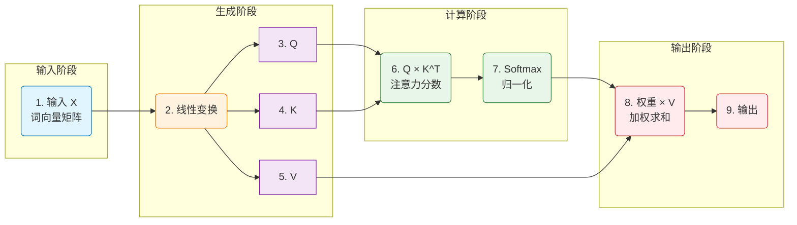
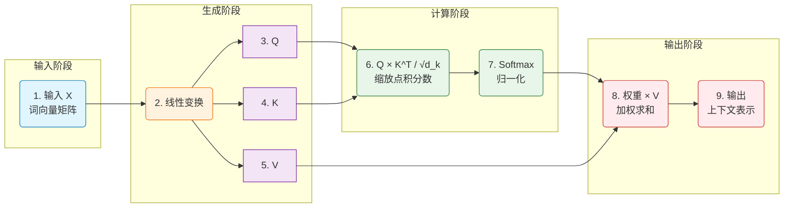
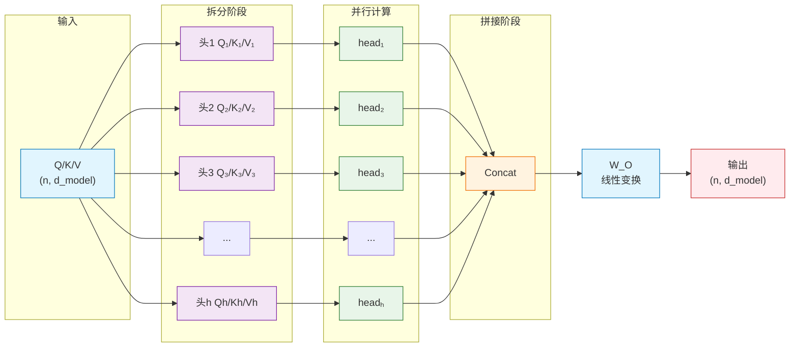

# 注意力机制基础 📚

通过上篇文档[02-序列到序列模型](./02-序列到序列模型.md)的学习，我们掌握了Seq2Seq架构的原理和工作流程。这一节我们要学习Transformer的核心——注意力机制，它是Transformer如此强大的关键所在 🎯

## 章节阅读路线图 🗺️

```mermaid
flowchart LR
    A["1. 什么是注意力机制"]:::concept --> B["2. 注意力机制的数学原理"]:::math
    B --> C["3. 点积注意力计算"]:::calc
    C --> D["4. 自注意力机制"]:::mechanism
    D --> E["5. 多头注意力"]:::advanced
    E --> F["6. 注意力机制的优势"]:::summary

    classDef concept fill:#e3f2fd,stroke:#1565c0
    classDef math fill:#f3e5f5,stroke:#6a1b9a
    classDef calc fill:#e8f5e9,stroke:#2e7d32
    classDef mechanism fill:#fff3e0,stroke:#ef6c00
    classDef advanced fill:#fce4ec,stroke:#c62828
    classDef summary fill:#e0f2f1,stroke:#00695c
```



**阅读顺序说明**：

- **第1章 → 第2章**：先建立注意力机制的概念认知，再深入Q、K、V的数学原理
- **第2章 → 第3章**：掌握Q、K、V定义和生成方式后，才能理解具体的点积计算流程
- **第3章 → 第4章**：理解基础缩放点积注意力后，学习自注意力这种特殊形式
- **第4章 → 第5章**：单头注意力机制掌握后，扩展到多头并行的丰富表示
- **第5章 → 第6章**：理解注意力机制原理后，总结其相比传统模型的独特优势

## 1. 什么是注意力机制 🤔

> 本章介绍注意力机制的基本概念和产生背景

### 1.1 注意力机制的定义 📝

> 本节介绍注意力机制的基本定义和核心思想

简单来说，注意力机制就是一种让模型学会"抓重点"的技术 🧠 它可以指示深度学习模型优先关注输入数据中最相关的部分，给重要信息分配高权重，给无关信息分配低权重。

注意力机制的核心思想是**加权求和**。整个过程可以分为三步：计算相似度、分配权重、加权求和。模型会先计算当前处理的位置与输入序列中各个位置的相似程度，然后根据相似度分配权重，最后把原始信息按权重相加，得到我们需要的输出。

举个例子，当我们读一句话时，大脑会自动聚焦于与当前任务相关的词汇。比如做命名实体识别时，我们会特别注意专有名词；在理解句子意思时，我们会关注动词和关键形容词。注意力机制就是让模型模拟这种能力，让它学会动态分配注意力，而不是像传统方法那样平等对待每个词 🧐

在Transformer出现之前，注意力机制主要用来解决RNN处理长序列时的信息丢失问题。因为RNN需要把所有信息压缩到一个隐藏状态里，距离一长，早期的信息就容易被忘记。注意力机制可以让模型直接"看"到输入序列的任意位置，需要什么信息就取什么信息，大大提升了模型处理长文本的能力 📈

---

**参考资料：**

- [什么是注意力机制 -- IBM](https://www.ibm.com/cn-zh/think/topics/attention-mechanism)
- [注意力机制深入理解 -- CSDN](https://blog.csdn.net/wendao76/article/details/146408709)
- [深入解析注意力机制 -- CSDN](https://blog.csdn.net/ZuanShi1111/article/details/151261251)

### 1.2 人类视觉注意力的启发 👁️

> 本节通过人类视觉注意力类比来理解注意力机制

注意力机制的灵感正是来自于人类视觉系统的工作方式 👀 当我们观察周围世界时，眼睛并不是平等地处理每一个细节，而是会自动扫描全景，然后快速锁定重点关注的区域。

具体来说，人类视觉系统有两个关键特点：一是**选择性**，我们只会关注视野中的重点区域，比如阅读时聚焦文字，交谈时注意对方表情；二是**快速扫描**，大脑会快速扫视整个场景，找到感兴趣的区域后再投入更多注意力去获取细节。

这种机制非常高效，因为我们的视觉系统每秒接收约8.96兆比特的数据，但大脑的处理能力有限。通过注意力机制，大脑可以过滤掉无关的背景信息，把有限的资源用在关键信息上。

深度学习中的注意力机制正是借鉴了这种思路 🧠 它让模型在处理输入数据时，学会自动判断哪些部分重要、哪些部分不重要，然后给重要的部分分配更高的权重。这样模型就能更高效地利用计算资源，专注于最关键的信息 📊

---

**参考资料：**

- [深度学习中的各种注意力机制 -- CSDN](https://blog.csdn.net/m0_61899108/article/details/129771661)
- [从生物视觉到AI -- CSDN](https://blog.csdn.net/oo7890/article/details/155660238)

### 1.3 注意力机制的起源与发展 📜

> 本节介绍注意力机制从2014年提出到Transformer的发展历程

注意力机制的发展可以分为几个重要阶段 📈

**第一阶段：奠基期（2014-2016）** 2014年，Bahdanau等人首次提出了注意力机制，发表论文《Neural Machine Translation by Jointly Learning to Align and Translate》。这是注意力机制的开端，当时主要是为了解决机器翻译中长序列信息丢失的问题。在此之前，RNN处理长句子时会把所有信息压缩到一个固定维度的向量里，距离一长，早期的信息就容易被遗忘。注意力机制让模型可以动态地"对齐"源语言和目标语言的对应关系，大大提升了翻译质量。

**第二阶段：扩展期（2016-2017）** 研究者们开始把注意力机制应用到其他任务，比如图像字幕生成、视觉问答等。同时也出现了各种改进版本，比如Luong等人提出的全局注意力和局部注意力。

**第三阶段：突破期（2017）** 2017年，谷歌发表了里程碑式的论文《Attention Is All You Need》，提出了Transformer模型。这篇论文彻底改变了游戏规则——Transformer完全摒弃了循环和卷积结构，只用注意力机制来处理序列建模。自注意力机制让每个词能够直接"看"到序列中的所有其他词，根据词与词之间的相关性动态分配权重。这种并行计算的方式大大提升了训练速度，也解决了长距离依赖的问题。

**后续发展** Transformer出现后，注意力机制就成了现代深度学习的基石。BERT、GPT系列等大模型都是基于Transformer架构。可以说，没有注意力机制，就没有今天的大语言模型。

---

**参考资料：**

- [什么是注意力机制 -- IBM](https://www.ibm.com/cn-zh/think/topics/attention-mechanism)
- [注意力机制发展历史 -- CSDN](https://blog.csdn.net/weixin_45556264/article/details/155308671)
- [注意力机制发展洞察报告 -- CSDN](https://blog.csdn.net/qq871325148/article/details/145987826)

## 2. 注意力机制的数学原理 🧮

> 本章讲解Q（查询）、K（键）、V（值）矩阵的概念和作用

上面我们从概念上理解了注意力机制，接下来我们要深入它的数学原理。注意力机制的核心就是三个矩阵：Q（查询）、K（键）、V（值）。这三个矩阵是怎么工作的？我们来细细拆解 🎯

下面这张图展示了注意力机制的完整数据流向，先有个全局观再深入细节：



> 💡 如果你对矩阵的基本运算还不熟悉，可以先看看 [02a-什么是矩阵](https://juejin.cn/post/7634874542255849510)（[CSDN](https://blog.csdn.net/2301_79239314/article/details/160720626)），里面详细介绍了矩阵的加减乘除、转置、求逆等运算规则。

### 2.1 Q、K、V的定义与角色 🎭

> 本节介绍Query查询、Key键、Value值的定义和各自作用

Q、K、V是注意力机制中最核心的概念，它们分别代表着不同的角色。

🔵 **Query（查询，简称Q）** 可以理解为"当前元素想要找什么"。当你处理某个词时，这个词会发出一个"查询"，想知道和其他哪些词有关系。比如处理"它"这个代词时，"它"会发出查询："我想知道前面哪个名词是我的指代对象"。Query代表了当前元素的关注意图。

🔵 **Key（键，简称K）** 可以理解为"每个元素的特征标识"，用来和其他元素的Query进行匹配。每个词都有一个Key，用来告诉别人"我有什么特征"。Query和Key的匹配过程就是计算相似度的过程，匹配度越高，注意力就越强。

🔵 **Value（值，简称V）** 是"实际要传递的信息内容"。当Query找到了相关的Key之后，就需要从对应的Value中获取信息。Value才是真正包含语义内容的向量，最终的输出就是根据注意力权重对Value进行加权求和的结果。

用一个生活的例子来类比：你可以把Q看成是"搜索关键词"，K是"文档的标签"，V是"文档的实际内容"。当你用关键词搜索时，系统会匹配关键词和标签的相似度，然后返回匹配度高的文档内容。这里的搜索关键词就是Query，文档标签就是Key，文档内容就是Value。

---

**参考资料：**

- [注意力机制:查询(Query)、键(Key)、值(Value) -- CSDN](https://blog.csdn.net/u013172930/article/details/145523956)
- [自注意力机制中的 Q，K、V 矩阵是什么 -- CSDN](https://blog.csdn.net/kingdom_java/article/details/154536435)
- [大模型入门必备:Transformer注意力机制完全指南 -- CSDN](https://blog.csdn.net/weixin_59191169/article/details/155533576)

### 2.2 如何生成Q、K、V矩阵 🧩

> 本节讲解通过线性变换生成三个矩阵的过程

Q、K、V 不是凭空产生的，而是通过三个可训练的权重矩阵（$W_Q$、$W_K$、$W_V$）对输入向量做线性变换得到的。公式很简单：

```
Q = X × W_Q
K = X × W_K
V = X × W_V
```

这里 X 是输入的词向量矩阵，形状是 (seq_len, d_model)，seq_len 是序列长度，d_model 是词向量维度。$W_Q$、$W_K$、$W_V$ 是三个形状为 (d_model, d_k) 的矩阵，d_k 是 Q、K 的维度（V 的维度通常是 d_v）。在标准 Transformer 中，d_k = d_v = d_model / num_heads。

为什么要用三个不同的权重矩阵？因为 Q、K、V 虽然都来自同一个输入 X，但它们的作用完全不同，需要用不同的线性变换来"投影"到不同的语义空间。这样模型就能学习到更丰富的表示。

🔴 **这些权重矩阵是需要训练的**。训练前随机初始化（常用 Xavier 或 He 初始化），训练过程中通过反向传播和梯度下降不断更新，最终学会什么样的 Q、K、V 组合最有用。推理时直接使用训练好的固定权重。

QKV生成参考资料：
- [Transformer QKV机制 -- CSDN](https://blog.csdn.net/m0_74053237/article/details/154045029)
- [Q/K/V权重矩阵 -- 技术栈](https://jishuzhan.net/article/1980830611054067714)

### 2.3 Q与K的点积相似度计算 📐

> 本节介绍Query和Key如何计算相似度

计算出 Q 和 K 之后，下一步就是计算它们之间的相似度。我们需要知道每个"查询"和其他所有"键"有多匹配，这样才能决定从哪些"值"中获取信息。Transformer 用的是**点积**来计算相似度，公式是：

```
分数 = Q × K^T
```

具体来说，Q 的形状是 (n, d_k)，K^T 的形状是 (d_k, n)，相乘后得到 (n, n) 的矩阵。每一行 i、列 j 的值就代表第 i 个查询与第 j 个键的相似度。

为什么要用点积？因为点积本质上就是计算两个向量的相似度。点积越大，说明两个向量越"像"，相关性越强。

🔴 **缩放因子**。Transformer 论文还加了一个缩放因子 1/√d_k：

```
分数 = Q × K^T / √d_k
```

这是因为当 d_k 很大时，点积的值会很大，导致 Softmax 函数的梯度变得很小（想象一下 Softmax 输入很大时，输出会趋近于 one-hot）。除以 √d_k 可以让方差归一化，保证训练稳定。

点积相似度参考资料：
- [注意力机制数学本质 -- CSDN](https://blog.csdn.net/2301_80079642/article/details/148118963)
- [缩放点积注意力 -- 51CTO](https://blog.51cto.com/u_16213673/14578238)

### 2.4 Softmax归一化与注意力权重 🎯

> 本节讲解如何将相似度转换为概率分布

算完 Q 和 K 的点积之后，我们得到的是一堆分数。这些分数有正有负，数值也大小不一，不能直接用来做加权。我们需要把它们转换成"权重"——也就是每个位置应该被关注多少。

这就轮到 **Softmax** 出场了。Softmax 的公式是：

```
权重 = exp(分数) / sum(exp(分数))
```

Softmax 有几个重要作用：

1. **归一化**：让所有权重加起来等于 1，变成合法的概率分布
2. **放大差异**：指数函数 `exp()` 会把大的分数拉得更大，小的分数压得更小。这样模型就能更清楚地"抓住重点"
3. **消除负数**：`exp()` 永远是正数，所以负的分数也会变成正的权重。为什么负数必须变成0？因为注意力机制的目标是"聚焦有用信息"，如果允许负权重存在，相当于让某些值向量"反着作用"，会抵消有用信息。这不符合注意力机制的设计逻辑——我们只需要关注"多或少"，不需要"正或负"。

举个例子，假设三个位置的分数是 [3, 1, -1]，Softmax 之后变成 [0.88, 0.12, 0]，你会发现第一个位置几乎拿到了全部注意力。这就是"抓重点"的效果。

Softmax归一化参考资料：
- [Transformer自注意力中的Softmax归一化详解 -- CSDN](https://blog.csdn.net/qq_41803278/article/details/151754381)

### 2.5 加权求和得到最终输出 📊

> 本节介绍如何根据权重对Value进行加权求和

到了最后一步，我们手里有了注意力权重（每个位置该关注多少），也有了值向量 V（每个位置存放的信息）。现在只需要把信息按权重加起来，就得到最终输出了。

公式是：

```
输出 = 权重 × V
```

具体来说，权重矩阵的形状是 (n, n)，V 的形状是 (n, d_v)，相乘后得到 (n, d_v) 的输出矩阵。每一行就是对应位置的"新的表示"，这个新表示融合了全序列的上下文信息。

举个例子来加深理解。假设我们处理"猫坐在垫子上"这句话，当处理"它"这个词时：

- "它"的注意力可能会更多地看向"猫"和"垫子"
- 权重分配可能是：猫(0.5)、坐在(0.1)、垫子上(0.4)
- 最终"它"的输出 = 0.5×猫的向量 + 0.1×坐在的向量 + 0.4×垫子上的向量

这就是为什么注意力机制能让每个词"看到"上下文的原因——它的输出不是孤立的，而是综合了全句信息的新表示。

🔴 **完整公式回顾**：

```
Attention(Q, K, V) = softmax(Q × K^T / √d_k) × V
```

这就是Transformer最核心的缩放点积注意力公式。

加权求和参考资料：
- [Transformer中的核心机制 -- Timd](http://timd.cn/transformer/attention/)

## 3. 点积注意力计算 ⚡

> 本章详细介绍注意力分数的计算方式和softmax归一化

前面我们已经了解了Q、K、V各自的含义和生成方式，也知道了注意力机制的核心公式是 `Attention(Q, K, V) = softmax(Q × K^T / √d_k) × V`。但公式是死的，计算过程是活的。接下来我们将深入拆解这个公式的每一步，看看数据在注意力模块里到底是怎么流转的。我们会先梳理完整的计算流程，再解释为什么需要缩放因子来保证数值稳定，最后看看注意力权重长什么样。

### 3.0.1 什么是缩放点积注意力 🤔

> 本节介绍缩放点积注意力的定义、核心思想和为什么叫"缩放"

**缩放点积注意力**（Scaled Dot-Product Attention）是 Transformer 架构中最核心、最基础的注意力计算方式，最早由 Google 在 2017 年的论文《Attention Is All You Need》中提出。这个名字听起来有点长，但拆开来看就很容易理解："点积"是计算相似度的方法，"缩放"是为了数值稳定做的除法操作，"注意力"是整个机制的目的。

它的核心思想可以用一句话概括：**用查询（Query）去找键（Key），找到之后从值（Value）里取信息**。具体来说，模型先计算每个 Query 和所有 Key 的点积相似度，然后用 Softmax 把这些相似度转换成概率分布（也就是注意力权重），最后用这些权重对 Value 做加权求和，得到输出。

为什么要"缩放"？因为当向量维度 d_k 很大时，点积的结果会变得非常大。想象一下，两个 64 维的向量做点积，每个维度都贡献一点数值，累加起来很容易变成几十甚至上百。这时候再丢给 Softmax，输出会极度偏向最大值（接近 one-hot 分布），梯度变得非常小，模型训练就不稳定了。除以 √d_k 可以把数值范围"压"回到一个合理的区间，让 Softmax 的梯度保持健康。

> 💡 提示：除以 √d_k 是为了防止点积值过大导致 Softmax 梯度消失

你可以把缩放点积注意力想象成一个"智能检索系统"：Query 是你输入的搜索关键词，Key 是图书馆里每本书的标签，Value 是书的实际内容。系统先匹配关键词和标签的相似度（点积），然后按匹配度排序（Softmax），最后把最相关的几本书的内容综合起来返回给你（加权求和）。只不过这个"图书馆"里的每本书都对应着输入序列中的一个词，而"检索"是并行完成的。

缩放点积注意力的标准公式是：

```
Attention(Q, K, V) = softmax(Q × K^T / √d_k) × V
```

🔴 这个公式是整个 Transformer 的基石。不管是编码器里的自注意力，还是解码器里的交叉注意力，底层都是这个计算在支撑。理解了它，你就理解了 Transformer 的核心机制。

---

**参考资料：**

- [一文看懂注意力机制：点积注意力机制、QKV含义 -- CSDN](https://blog.csdn.net/Tracycoder/article/details/155852253)
- [缩放点积注意力机制是什么？为什么要缩放？ -- CSDN文库](https://wenku.csdn.net/answer/6ubw2j4mh4)
- [工程师学AI之第三篇：线性代数点积运算助你理解大模型注意力机制 -- 掘金](https://juejin.cn/post/7574821757665869865)

### 3.1 缩放点积注意力的完整流程 🔄

> 本节梳理从Q、K、V到最终输出的完整计算步骤

缩放点积注意力的计算可以拆解为四个清晰的步骤。我们假设输入序列长度为 n，每个词的向量维度为 d_model，Q 和 K 的维度为 d_k，V 的维度为 d_v。下面一步步来看数据是怎么流转的。

**第一步：生成 Q、K、V 矩阵**

输入的词向量矩阵 X 形状是 (n, d_model)。通过三个可训练的权重矩阵 W_Q、W_K、W_V（形状都是 d_model × d_k 或 d_model × d_v），做线性变换得到：

```
Q = X × W_Q    → 形状 (n, d_k)
K = X × W_K    → 形状 (n, d_k)
V = X × W_V    → 形状 (n, d_v)
```

这三个权重矩阵是模型训练出来的，它们把输入向量"投影"到不同的语义空间，让 Q、K、V 各自承担不同的角色。

**第二步：计算注意力分数并缩放**

用 Q 和 K 的转置做点积，得到 (n, n) 的分数矩阵，然后除以 √d_k 进行缩放：

```
分数 = Q × K^T / √d_k    → 形状 (n, n)
```

矩阵中第 i 行第 j 列的值，表示第 i 个位置的词对第 j 个位置的词的"关注程度"。除以 √d_k 是为了防止维度太大时点积值爆炸，导致 Softmax 梯度消失。

**第三步：Softmax 归一化**

对分数矩阵的每一行做 Softmax，把分数转换成概率分布（注意力权重）：

```
权重 = softmax(分数, dim=-1)    → 形状 (n, n)
```

每一行的权重之和等于 1。权重越大，说明对应位置的 V 向量对当前输出的贡献越大。

**第四步：加权求和得到输出**

用注意力权重对 V 矩阵做加权求和，得到最终的注意力输出：

```
输出 = 权重 × V    → 形状 (n, d_v)
```

输出的每一行就是对应位置词的新表示，这个新表示融合了全序列的上下文信息。

把四步合起来，就是论文中的标准公式：

```
Attention(Q, K, V) = softmax(Q × K^T / √d_k) × V
```

下面这张图展示了完整的四步流程，可以和上面的文字对照着看：



> 💡 注意：这张图和第 2 章的图是同一个流程，但这里我们把第 6 步明确写成了"Q × K^T / √d_k"，突出了缩放操作的重要性。

**举个例子加深理解**

假设我们处理"猫坐在垫子上"这句话，n = 5。当模型处理"它"这个词时（假设后面有个"它"），Q_它 会和所有 K 做点积，可能得到这样的分数（未缩放前）：

| | 猫 | 坐 | 在 | 垫子 | 上 |
|---|---|---|---|---|---|
| 它 | 8.5 | 2.1 | 1.3 | 7.2 | 0.9 |

缩放并 Softmax 后，注意力权重可能变成：

| | 猫 | 坐 | 在 | 垫子 | 上 |
|---|---|---|---|---|---|
| 它 | 0.52 | 0.08 | 0.05 | 0.32 | 0.03 |

可以看到，"它"把大部分注意力放在了"猫"和"垫子"上，这正是我们期望的指代消解行为。最终"它"的输出向量 = 0.52 × V_猫 + 0.08 × V_坐 + 0.05 × V_在 + 0.32 × V_垫子 + 0.03 × V_上，这个向量就包含了"猫"和"垫子"的语义信息。

---

**参考资料：**

- [Transformer 的注意力到底怎么计算 -- 今日头条](http://m.toutiao.com/group/7571302334454809103/)
- [大厂特邀大咖万字深度穿透：Transformer核心模块实现细节 -- 掘金](https://juejin.cn/post/7514242912378945570)
- [缩放点积注意力机制完整计算过程举例与详解 -- CSDN](https://blog.csdn.net/chenjialehhh/article/details/154641402)

### 3.2 注意力分数的数值稳定性 ⚖️

> 本节介绍缩放因子√d_k的作用和防止梯度消失的原理

前面我们知道了注意力分数的计算公式是 `Q × K^T / √d_k`，但这个除以 √d_k 的操作到底在防什么？为什么偏偏是 √d_k，而不是 d_k 或者别的数？这一节我们就从数学原理上把这个问题讲清楚。

#### 3.2.1 为什么点积值会爆炸 🔥

> 本节从方差角度解释点积值随维度增大的增长规律

假设 Q 和 K 的每个元素都是独立随机变量，均值为 0，方差为 1（这是神经网络初始化时的常见假设）。那么两个 d_k 维向量的点积 q·k 等于 d_k 个独立随机变量相乘再求和。

根据概率论，每个 q_i × k_i 的方差大约是 1，d_k 个这样的项相加，总方差就是 d_k。这意味着点积的标准差是 √d_k。

举个例子：当 d_k = 64 时，点积的标准差是 8。根据正态分布的性质，大约 95% 的点积值会落在 ±16 的范围内，但仍有约 5% 的值会超过 16 甚至更大。当 d_k = 512 时，标准差变成 22.6，极端值轻松突破 50。

这些大数值丢给 Softmax 会发生什么？Softmax 的公式是 `exp(x) / sum(exp(x))`。当输入值很大时，exp(x) 会爆炸式增长，最大的那个值会吃掉几乎所有的概率质量，输出接近 one-hot（一个位置是 1，其他都是 0）。这时候 Softmax 的梯度变得极小，模型就几乎学不动了。

🔴 **这就是梯度消失**。不是梯度变成 0，而是变得太小，参数更新微乎其微，训练效率极低。

#### 3.2.2 缩放因子为什么选 √d_k 🎯

> 本节解释除以√d_k的数学依据

既然点积的标准差是 √d_k，那把点积除以 √d_k，新的标准差就变成了 1。这样无论 d_k 是 64 还是 512，缩放后的点积分布都稳定在一个合理的范围内。

论文原文说："We suspect that for large values of d_k, the dot products grow large in magnitude, pushing the softmax function into regions where it has extremely small gradients. To counteract this effect, we scale the dot products by 1/√d_k."

翻译过来就是：当 d_k 很大时，点积值会变得很大，把 Softmax 推入梯度极小的区域。为了抵消这个效应，我们用 1/√d_k 来缩放点积。

🟢 **关键 insight**：除以 √d_k 不是随便选的，而是为了让缩放后的点积方差归一化为 1，保持数值稳定。

#### 3.2.3 不缩放会怎样 ⚠️

> 本节通过对比说明缩放的必要性

如果不除以 √d_k，训练早期就会出现问题：

1. **Softmax 饱和**：少数几个点积值特别大，Softmax 输出接近 one-hot，模型丧失"软选择"的能力
2. **梯度消失**：反向传播时梯度被压缩，参数更新缓慢，训练时间大幅延长
3. **注意力退化**：模型倾向于只关注某一个位置，失去捕捉多位置关系的能力

有研究者做过实验：在同样的训练设置下，不缩放的注意力机制收敛速度明显慢于缩放版本，而且最终效果也更差。这个看似简单的除法，实际上是 Transformer 能够稳定训练的关键设计之一。

> 💡 提示：除以 √d_k 的操作在代码中通常写作 `scores = scores / math.sqrt(d_k)`，或者直接用 `scores = scores / d_k ** 0.5`。

---

**参考资料：**

- [Transformer缩放注意力机制：为什么除以√d_k是深度学习的精妙设计？ -- 掘金](https://juejin.cn/post/7570984341413904399)
- [缩放点积模型：如何巧妙化解Softmax梯度消失难题？ -- CSDN](https://blog.csdn.net/m0_72427326/article/details/148580086)
- [为什么Scaled Dot-Product Attention要除以√dₖ来稳住训练梯度？ -- CSDN文库](https://wenku.csdn.net/answer/c6qfa89sa9q6)
- [Scaled Dot-Product Attention 的数学剖析](https://suxilan.github.io/notes/scaled_dot_product_attention/)

### 3.3 注意力权重的可视化解读 👁️

> 本节通过热力图展示注意力权重的分布规律

前面我们学习了注意力分数的计算和缩放原理，但数字终究是抽象的。这一节我们要把抽象的权重矩阵变成直观的热力图，看看模型到底在"看"什么。

#### 3.3.1 热力图怎么看 🔥

> 本节介绍注意力热力图的基本读法

注意力权重是一个 n×n 的矩阵，n 是序列长度。用热力图可视化时，通常用颜色深浅表示权重大小：

- **X轴（横轴）**：Key 位置，表示"被谁看"
- **Y轴（纵轴）**：Query 位置，表示"看谁"
- **颜色深浅**：注意力权重的大小，越深表示关注度越高

举个例子，处理"猫坐在垫子上"这句话时，热力图的第 i 行第 j 列的颜色深浅，就表示第 i 个词对第 j 个词的关注程度。

下面是一个简化的注意力热力图示例，展示了"猫 坐 在 垫子 上"这句话中，每个词对其他词的关注程度：

|  | 猫 | 坐 | 在 | 垫子 | 上 |
|---|---|---|---|---|---|
| **猫** | <mark>0.45</mark> | 0.15 | 0.05 | 0.25 | 0.10 |
| **坐** | 0.30 | <mark>0.35</mark> | 0.20 | 0.10 | 0.05 |
| **在** | 0.05 | 0.20 | <mark>0.40</mark> | 0.25 | 0.10 |
| **垫子** | 0.20 | 0.10 | 0.15 | <mark>0.40</mark> | 0.15 |
| **上** | 0.10 | 0.15 | 0.25 | 0.30 | <mark>0.20</mark> |

> 数值仅为示意，实际权重经过 Softmax 归一化后每行和为 1。对角线（加粗）表示自身注意力，通常较高。

🔵 **自身注意力**：对角线通常比较深，因为每个词都会关注自己。这有助于保持词本身的语义信息。

🔵 **局部依赖**：相邻位置之间通常有较强的注意力，比如"坐"会关注"猫"和"在"。

🔵 **长距离关联**：代词会关注其指代的名词，比如"它"会强烈关注"猫"或"垫子"。

#### 3.3.2 常见的注意力模式 🎯

> 本节介绍注意力权重中反复出现的典型模式

通过观察大量热力图，研究者发现了几种常见的注意力模式：

**（1）对角线模式**

每个词主要关注自己和邻近的词。这种模式在底层注意力头中比较常见，负责捕捉局部语法结构。

**（2）垂直条纹模式**

某些词（通常是冠词、介词）会均匀地关注所有位置。这说明这些词在整合全局信息。

**（3）块状模式**

句子中不同短语之间形成明显的注意力块。比如"猫坐在垫子上"中，"猫"和"垫子"之间、"坐"和"在"之间会形成较强的注意力连接。

**（4）稀疏模式**

某些注意力头只关注极少数位置，大部分权重集中在 1-2 个词上。这种头通常负责捕捉特定的语义关系，如指代消解。

#### 3.3.3 多头注意力的可视化差异 🌈

> 本节说明不同注意力头可能关注不同的信息

> 🔵 **多头注意力**（Multi-Head Attention）是 Transformer 中广泛采用的注意力机制扩展形式，它通过并行运行多个独立的注意力头，在不同的特征子空间中分别捕捉输入序列的多元语义关系，最终将所有头的输出聚合，形成更全面的全局上下文表示。

在多头注意力中，每个头学到的模式往往不同：

- **句法头**：关注主谓宾关系、修饰关系等语法结构
- **语义头**：关注同义词、反义词、上下位词等语义关联
- **位置头**：关注相邻词、固定搭配等位置信息
- **罕见头**：某些头的模式难以解释，可能捕捉到了人类难以察觉的统计规律

这种专业化分工正是多头注意力的价值所在——不同的头从不同的角度理解同一个句子，最终综合起来形成更丰富的表示。我们会在第5章中详细讲解多头注意力的数学原理和实现细节。

> 💡 提示：如果你想亲自观察注意力热力图，可以用 Python 的 `matplotlib` 或 `seaborn` 库绘制。`seaborn.heatmap()` 函数非常适合这个任务，只需要传入注意力权重矩阵即可。

---

**参考资料：**

- [注意力权重可视化帮助理解 -- CSDN](https://blog.csdn.net/weixin_31938351/article/details/155210932)
- [保姆级教程：用Matplotlib和Seaborn可视化Transformer注意力权重 -- CSDN文库](https://wenku.csdn.net/column/238hu1jljv1)
- [注意力机制可视化案例全解析 -- CSDN](https://blog.csdn.net/gitblog_00758/article/details/154553471)
- [注意力矩阵是怎么把词语之间的语义关系'画'出来的？ -- CSDN文库](https://wenku.csdn.net/answer/8x0ip8me2cqw)

## 4. 自注意力机制 🔄

> 本章讲解自注意力如何让序列中的每个词与其他所有词建立关联

前面我们学习了注意力机制的基本计算流程：用 Query 去找 Key，找到后从 Value 里取信息。但这里有一个关键问题没有回答——Query、Key、Value 到底从哪里来？

> 🔵 **交叉注意力**（Cross-Attention）是一种让两个不同序列之间建立关注关系的机制。在 Seq2Seq 模型中，解码器用自身的 Query 去查询编码器输出的 Key 和 Value，从而动态地从源序列中获取相关信息，实现精准的词对齐。
>
> 交叉注意力参考资料：
> - [什么是Cross Attention(交叉注意力)？详细解析与应用 -- CSDN](https://blog.csdn.net/shizheng_Li/article/details/146213459)
> - [深度学习的数学原理——交叉注意力 -- CSDN](https://blog.csdn.net/xiaolaji600/article/details/160087680)

在传统的 Seq2Seq 模型中，Q 来自解码器，K 和 V 来自编码器，这种就是交叉注意力。但在 Transformer 中，有一种更特殊的注意力形式：**自注意力**（Self-Attention）。它的特点是 Q、K、V 都来自同一个输入序列，也就是说，序列中的每个词都在"看"序列中的其他所有词。

自注意力是 Transformer 架构的核心创新。它让模型能够直接捕捉序列中任意两个位置之间的关系，不管它们相隔多远。这种能力彻底解决了 RNN 处理长序列时的信息丢失问题，也让 Transformer 能够并行计算，大大提升了训练效率。

接下来我们将深入讲解自注意力的本质特征，以及它与交叉注意力的区别。

### 4.1 自注意力与交叉注意力的区别 ⚔️

> 本节对比自注意力（Q、K、V同源）和交叉注意力（Q来自解码器，K、V来自编码器）的差异

自注意力和交叉注意力的核心区别只有一个：**输入来源不同**。

**自注意力**中，Query、Key、Value 都来自同一个序列。序列中的每个元素都与其他所有元素计算注意力，目的是捕捉序列内部的依赖关系。比如在句子"猫坐在垫子上"中，"坐"会通过自注意力关注到"猫"和"垫子"，从而理解这个动作的主体和客体。

**交叉注意力**中，Query 来自一个序列（通常是解码器的当前状态），而 Key 和 Value 来自另一个序列（通常是编码器的输出）。它的目的是建立两个序列之间的关联，让解码器能够动态地从源序列中提取信息。比如在机器翻译中，解码器生成"cat"时，会通过交叉注意力去查看源语言"猫"对应的编码表示。

| 对比维度 | 自注意力（Self-Attention） | 交叉注意力（Cross-Attention） |
|---|---|---|
| **Q 的来源** | 同一序列 | 解码器序列 |
| **K、V 的来源** | 同一序列 | 编码器序列 |
| **关注对象** | 序列内部元素间的关系 | 两个序列间的对齐关系 |
| **典型位置** | Transformer 编码器各层 | Transformer 解码器中间层 |
| **作用** | 理解上下文、捕捉依赖 | 实现源目标对齐、信息提取 |

> 🔴 **注意**：在 Transformer 的解码器中，这两种注意力会同时出现。第一层是掩码自注意力（只看已生成的词），第二层就是交叉注意力（去编码器取信息）。

自注意力与交叉注意力核心区别参考资料：
- [自注意力(Self-Attention) vs 交叉注意力(Cross-Attention) -- CSDN](https://blog.csdn.net/weixin_54259684/article/details/146401517)
- [笔记 | Transformer中的四种注意力 -- InfoQ](https://xie.infoq.cn/article/99c8b06c668b1e1ed7fb845f4)

### 4.2 自注意力的双向上下文感知 🧭

> 本节讲解自注意力如何同时捕捉左侧和右侧上下文信息

自注意力最显著的特征就是**双向性**——序列中的每个词在计算注意力时，都能看到自己左边和右边的所有词。这与传统的 RNN 形成了鲜明对比：RNN 只能从左到右（或从右到左）逐步传递信息，后面的词要依赖前面词的状态才能间接获取信息，距离越远信息丢失越严重。

举个例子，当模型处理"银行"这个词时：

- 如果前文是"我去银行"，后文是"取钱"，双向注意力能让"银行"同时看到"取钱"，从而确认这是金融机构
- 如果后文是"岸边"，模型就能判断这是河流的意思

这种左右兼顾的能力，让自注意力能够直接捕捉长距离依赖关系，不管两个词相隔多远，它们的注意力分数都是一步计算出来的。

> 🔵 **BERT** 就是典型的双向自注意力应用。它通过掩码语言模型（MLM）训练，随机遮盖句子中 15% 的词，让模型根据左右上下文预测被遮盖的词。这种训练方式迫使模型必须同时利用两侧信息，从而学到更丰富的语义表示。

双向上下文感知能力直接决定了模型的理解深度。在问答、命名实体识别、情感分析等需要完整上下文理解的任务中，双向自注意力都表现出了明显优势。

双向上下文感知参考资料：
- [BERT的双向机制 vs GPT的单向机制 -- CSDN](https://blog.csdn.net/qq_43664407/article/details/148429816)
- [BERT与GPT-1在预训练目标和架构上有何核心区别？ -- CSDN问答](https://ask.csdn.net/questions/9455529)

### 4.3 因果掩码与单向注意力 🔒

> 本节介绍GPT等生成模型中使用的掩码机制，防止看到未来信息

前面我们讲了自注意力的双向性，但这带来了一个问题：在文本生成任务中，模型必须逐个词生成输出，第 t 个词只能基于前 t-1 个词来预测。如果模型能看到后面的词，就等于"偷看答案"，训练就失去了意义。

**因果掩码**（Causal Mask）就是解决这个问题的机制。它在注意力分数矩阵上应用一个上三角掩码，将所有"未来"位置的分数设为负无穷。这样经过 Softmax 后，未来位置的注意力权重就变成 0，信息被完全阻断。

举个例子，对于序列"你 好 啊"，掩码后的注意力矩阵是这样的：

|  | 你 | 好 | 啊 |
|---|---|---|---|
| **你** | ✓ | ✗ | ✗ |
| **好** | ✓ | ✓ | ✗ |
| **啊** | ✓ | ✓ | ✓ |

> ✓ 表示可以看到，✗ 表示被掩码遮挡

🔵 **GPT** 系列模型就是典型的因果掩码应用。它采用自回归（Autoregressive）方式训练，每次只预测下一个词。这种单向注意力虽然限制了信息流动，但确保了生成的因果性和连贯性。

因果掩码与单向注意力参考资料：
- [Transformer自回归关键技术：掩码注意力原理与PyTorch完整实现 -- 阿里云](https://developer.aliyun.com/article/1683287)
- [【Transformer专栏】解码器与序列生成：自回归、Beam Search与长度惩罚 -- CSDN](https://blog.csdn.net/m0_50709695/article/details/158539126)
- [一文搞懂 Transformer Decoder：从原理到 LLM 应用 -- CSDN](https://blog.csdn.net/m0_56902859/article/details/160317521)

## 5. 多头注意力 💪

> 本章介绍多头注意力的并行计算和丰富表示能力的优势

前面我们学习了自注意力的原理：每个词通过 Q、K、V 计算与序列中其他词的关联。但这里有一个局限——单套 Q、K、V 只能学到一种注意力模式。比如模型可能只学会了关注语法关系，却忽略了语义关联或位置信息。

**多头注意力**（Multi-Head Attention）就是为了解决这个问题而设计的。它的核心思想很简单：与其只用一套 Q、K、V，不如并行使用多套，每套都在不同的子空间里学习不同的注意力模式。有的头关注语法结构，有的头关注语义关联，有的头关注位置信息——最终把它们的结果拼接起来，就能得到更丰富、更全面的表示。

这种设计带来了三个明显优势：一是**表达能力更强**，不同头可以捕捉不同类型的依赖关系；二是**训练更稳定**，多个子空间降低了单头注意力可能陷入局部最优的风险；三是**并行计算效率高**，所有头可以同时计算，不会增加时间开销。

接下来我们将从直观理解、数学实现和专业化分工三个角度，深入讲解多头注意力是如何工作的。

### 5.1 多头并行的直观理解 🧠

> 本节用"多视角观察"类比解释为什么需要多个注意力头

理解多头注意力的最好方式是做一个类比：想象你和几个朋友一起读一篇文章。每个人关注的重点不同——有人关注情节发展，有人关注人物关系，有人关注作者的写作手法。最后大家把各自的发现汇总起来，就能对文章形成更全面的理解。

多头注意力就是这个思路的数学实现。模型不再只用一个注意力头去"读"输入序列，而是同时启动多个头，每个头都在不同的子空间里学习不同的关注点：

- **头 1**：关注主谓宾关系，理解"谁做了什么"
- **头 2**：关注修饰关系，理解"什么样的东西"
- **头 3**：关注指代关系，理解"它"指的是谁
- **头 4**：关注位置信息，理解词语之间的远近关系

每个头都有自己的一套 Q、K、V 投影矩阵，所以它们看到的"世界"是不同的。虽然输入数据相同，但经过不同的线性变换后，每个头都在不同的子空间里计算注意力，捕捉到的模式自然也不同。

> 💡 提示：你可以把多头注意力想象成给模型戴上了多副不同颜色的眼镜。红色眼镜只看语法结构，蓝色眼镜只看语义关联，绿色眼镜只看位置信息——最终把多副眼镜看到的内容拼起来，就能得到一幅完整的画面。

这种"多视角观察"的方式让模型能够同时从多个维度理解输入数据，避免了单头注意力的"视角偏差"问题。

多头注意力直观理解参考资料：
- [通俗理解多头注意力(Multi-Head Attention) -- CSDN](https://dalian.blog.csdn.net/article/details/157133998)
- [Transformer 模型中多头注意力层的工作原理学习 -- 华为云](https://bbs.huaweicloud.com/blogs/453571)

### 5.2 头的拆分与拼接操作 🧩

> 本节讲解如何将Q、K、V拆分成多组，计算后再拼接的数学过程

理解了多头并行的直观概念后，我们来看看具体的数学实现。多头注意力的计算可以分为四个步骤：**拆分、并行计算、拼接、线性变换**。

**第一步：Q、K、V的拆分**

原始的 Q、K、V 矩阵形状都是 (n, d_model)，n 是序列长度，d_model 是模型维度。现在我们要把它拆成 h 个头，每个头的维度是 d_k = d_model / h。

拆分的方式其实就是一个简单的 reshape。假设 d_model = 512，h = 8，那么每个头的维度 d_k = 64：

```python
# 拆分前 Q 的形状: (batch, seq_len, d_model)
# 拆分后 Q 的形状: (batch, num_heads, seq_len, d_k)
Q_reshaped = Q.view(batch, seq_len, num_heads, d_k).transpose(1, 2)
```

这一步没有改变任何数值，只是把一个大的矩阵"切分"成了 h 个小矩阵，每个小矩阵对应一个注意力头。

**第二步：并行计算注意力**

拆分之后，每个头都在自己的子空间里独立做缩放点积注意力。每个头的计算公式和之前一模一样：

```
head_i = Attention(Q_i, K_i, V_i) = softmax(Q_i × K_i^T / √d_k) × V_i
```

因为 h 个头是独立计算的，而且它们的计算可以并行进行，所以多头注意力的时间复杂度和单头注意力是同一个量级——并没有因为"多头"而增加多少时间开销，只是多了一些矩阵切分的操作。

**第三步：拼接所有头的输出**

计算完 h 个头之后，我们得到 h 个形状为 (n, d_v) 的输出矩阵。现在要把它们拼接起来，变成一个大的矩阵：

```
Concat(head_1, head_2, ..., head_h) → 形状 (n, h × d_v)
```

这个拼接操作也很简单，就是沿着特征维度做 concatenation。比如每个头的输出是 (n, 64)，拼接 8 个头就是 (n, 512)，正好回到原始的 d_model 维度。

**第四步：最终线性变换**

拼接后的矩阵还要经过一个输出权重矩阵 W_O 做线性变换：

```
Output = Concat(head_1, ..., head_h) × W_O
```

W_O 的形状是 (h × d_v, d_model)，它的作用是把拼接后的高维向量投影回原始的 d_model 空间，同时整合 h 个头学到的不同信息。

**完整流程回顾**



用一个具体数字来加深理解。假设输入序列长度 n=10，d_model=512，num_heads=8：

- 拆分前：Q 形状是 (10, 512)
- 拆分后：8 个头，每个 Q_i 形状是 (10, 64)
- 每个头独立计算，得到 8 个 (10, 64) 的输出
- 拼接后变成 (10, 512)
- 再经过 W_O 变换，输出仍然是 (10, 512)

整个过程中，序列长度 n 保持不变，输出维度 d_model 保持不变——变化的只是模型内部在做什么"事"。

---

**参考资料：**

- [Transformer之多头自注意力机制深度解析 -- CSDN](https://blog.csdn.net/ZuanShi1111/article/details/151187378)
- [通俗理解多头注意力(Multi-Head Attention) -- CSDN](https://dalian.blog.csdn.net/article/details/157133998)
- [Transformer核心技术深度解析:多头注意力机制与架构精粹 -- 腾讯云](https://cloud.tencent.com.cn/developer/article/2550576)
- [Multi-Head Attention -- mingzhe.space](https://mingzhe.space/blog/2026/multi_head_attention/)

### 5.3 不同注意力头的专业化分工 🎭

> 本节介绍不同头可能分别关注语法、语义、位置等不同信息

## 6. 注意力机制的优势 🌟

> 本章总结注意力机制相比传统RNN/CNN的独特优势

### 6.1 并行计算效率 🚀

> 本节对比RNN串行计算和注意力并行计算的速度差异

### 6.2 长距离依赖建模 📏

> 本节讲解注意力如何直接连接任意距离的词，解决长程依赖问题

### 6.3 可解释性提升 🔍

> 本节介绍注意力权重如何帮助理解模型的决策依据

---

**参考资料：**

- [Transformer模型架构 -- 百科](https://m.baike.com/wiki/Transformer%E6%A8%A1%E5%9E%8B%E6%9E%B6%E6%9E%84/7541592050249940992)
- [一文理解 Transformer 机制 -- 腾讯云](https://cloud.tencent.com.cn/developer/article/2648317)
- [一文搞懂Transformer架构的三种注意力机制 -- 阿里云](https://developer.aliyun.com/article/1508394)
- [Transformer基础之注意力机制 -- CSDN](https://blog.csdn.net/lonelymanontheway/article/details/151452335)

最后更新时间：2026-05-01
