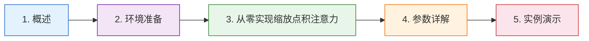

# 04-缩放点积注意力代码实现 📚

## 章节阅读路线图 🗺️

**阅读顺序说明**：

- **第1章 → 第2章**：先了解缩放点积注意力的概念，再准备编程环境
- **第2章 → 第3章**：环境准备好后，开始动手写代码
- **第3章 → 第4章**：写完代码后，深入理解每个参数的含义和作用
- **第4章 → 第5章**：理解参数后，用实际数据跑一遍代码，看输出结果

## 1. 概述 📝

## 2. 环境准备 ⚙️

### 2.1 PyTorch安装

### 2.2 验证安装成功

## 3. 从零实现缩放点积注意力 💻

## 4. 参数详解 🔧

## 5. 实例演示 🧪

