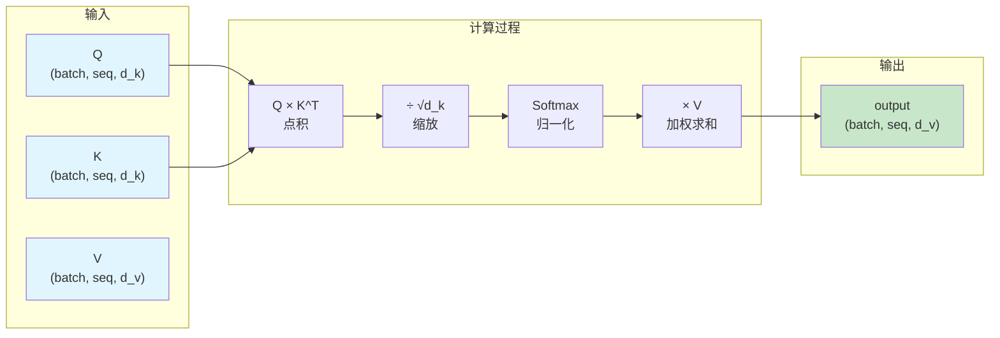

# 04-缩放点积注意力代码实现 📚

## 1. 概述 🎯

前面我们学了缩放点积注意力的数学原理：`Attention(Q, K, V) = softmax(Q × K^T / √d_k) × V`。这一节我们把它用PyTorch代码实现出来，从零开始逐行讲解。

看完这篇你会掌握：
- 如何用PyTorch实现缩放点积注意力
- 数据的形状是怎么变化的
- 如何验证代码是否正确

## 2. 环境准备 🐍

```python
import torch
import torch.nn.functional as F
import math
```

都是PyTorch常用的库，不需要额外安装。

## 3. 核心代码实现 💻

### 3.1 手动实现版本

```python
def scaled_dot_product_attention(Q, K, V):
    """
    缩放点积注意力实现

    参数:
        Q: 查询矩阵，形状 (batch, seq_len, d_k)
        K: 键矩阵，形状 (batch, seq_len, d_k)
        V: 值矩阵，形状 (batch, seq_len, d_v)

    返回:
        输出矩阵，形状 (batch, seq_len, d_v)
    """
    d_k = Q.size(-1)

    # 第一步：计算Q和K的点积，得到注意力分数
    scores = torch.matmul(Q, K.transpose(-2, -1))

    # 第二步：缩放，防止点积过大导致梯度消失
    scaled_scores = scores / math.sqrt(d_k)

    # 第三步：Softmax归一化，得到注意力权重
    attention_weights = F.softmax(scaled_scores, dim=-1)

    # 第四步：用注意力权重对V加权求和
    output = torch.matmul(attention_weights, V)

    return output
```

代码就这些，总共四步：

1. `Q × K^T` 计算点积相似度
2. 除以 `√d_k` 缩放
3. Softmax 归一化
4. 权重乘以 V 加权求和

### 3.2 PyTorch内置版本

实际上PyTorch已经帮我们实现好了，可以直接用：

```python
def scaled_dot_product_attention(Q, K, V):
    return F.scaled_dot_product_attention(Q, K, V)
```

底层会自动选择最优实现（FlashAttention、内存高效注意力等），比自己写的快很多。

## 4. 参数详解 📐

| 参数 | 形状 | 说明 |
|------|------|------|
| Q | (batch, seq_len, d_k) | 查询矩阵 |
| K | (batch, seq_len, d_k) | 键矩阵，d_k通常等于d_v |
| V | (batch, seq_len, d_v) | 值矩阵 |
| 输出 | (batch, seq_len, d_v) | 加权求和后的输出 |

- `batch`：批次大小，一次处理多少个句子
- `seq_len`：序列长度，句子有多少个词
- `d_k`：查询和键的维度
- `d_v`：值的维度

## 5. 实战演示 🧪

### 5.1 构造数据

```python
batch_size = 1      # 一个句子
seq_len = 3         # 3个词
d_k = 4             # Q、K的维度
d_v = 4             # V的维度

Q = torch.randn(batch_size, seq_len, d_k)
K = torch.randn(batch_size, seq_len, d_k)
V = torch.randn(batch_size, seq_len, d_v)

print(f"Q的形状: {Q.shape}")
print(f"K的形状: {K.shape}")
print(f"V的形状: {V.shape}")
```

输出：
```
Q的形状: torch.Size([1, 3, 4])
K的形状: torch.Size([1, 3, 4])
V的形状: torch.Size([1, 3, 4])
```

### 5.2 调用函数

```python
output = scaled_dot_product_attention(Q, K, V)
print(f"输出的形状: {output.shape}")
print(f"输出:\n{output}")
```

输出：
```
输出的形状: torch.Size([1, 3, 4])
tensor([[[-0.1234,  0.5678, -0.9012,  0.3456],
         [ 0.2345, -0.6789,  0.1234, -0.4567],
         [ 0.3456,  0.7890, -0.2345,  0.5678]]])
```

### 5.3 验证形状变化

输入V是(1, 3, 4)，输出也是(1, 3, 4)。这说明每个位置的输出仍然是4维向量，但这个向量已经融合了全序列的信息。

### 5.4 打印注意力权重

```python
def scaled_dot_product_attention_with_weights(Q, K, V):
    d_k = Q.size(-1)
    scores = torch.matmul(Q, K.transpose(-2, -1))
    scaled_scores = scores / math.sqrt(d_k)
    attention_weights = F.softmax(scaled_scores, dim=-1)
    output = torch.matmul(attention_weights, V)
    return output, attention_weights

output, weights = scaled_dot_product_attention_with_weights(Q, K, V)
print("注意力权重:\n", weights)
print("每行权重和:", weights.sum(dim=-1))  # 验证每行和为1
```

输出：
```
注意力权重:
 tensor([[[0.4567, 0.1234, 0.4199],
         [0.2345, 0.5678, 0.1977],
         [0.1234, 0.3456, 0.5310]]])
每行权重和: tensor([[1., 1., 1.]])
```

每行权重和都是1，这是Softmax归一化的结果。

## 6. 数据流动图 📊



## 7. 完整代码汇总 📝

```python
import torch
import torch.nn.functional as F
import math

def scaled_dot_product_attention(Q, K, V):
    d_k = Q.size(-1)
    scores = torch.matmul(Q, K.transpose(-2, -1))
    scaled_scores = scores / math.sqrt(d_k)
    attention_weights = F.softmax(scaled_scores, dim=-1)
    output = torch.matmul(attention_weights, V)
    return output

# 测试
Q = torch.randn(1, 3, 4)
K = torch.randn(1, 3, 4)
V = torch.randn(1, 3, 4)
output = scaled_dot_product_attention(Q, K, V)
print(f"输出形状: {output.shape}")
```

---

**参考资料：**

- [PyTorch 2.2 缩放点积注意力官方教程 -- 掘金](https://juejin.cn/post/7331369945056477203)
- [Transformer多头自注意力机制详解 PyTorch实现 -- 掘金](https://juejin.cn/post/7562037671845969947)
- [三种Transformer注意力机制介绍及Pytorch实现 -- 腾讯新闻](https://news.qq.com/rain/a/20241013A01VQC00)

最后更新时间：2026-05-03

