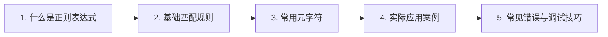

# 05-正则表达式基础 🔍

正则表达式（Regular Expression，简称regex）是处理文本的利器，它能帮我们从一堆文字里快速找到想要的内容。不管是验证手机号、提取邮箱地址，还是批量替换文本，正则表达式都能搞定。学会它，你的文本处理效率会提升好几个档次。

## 章节阅读路线图 🗺️



我们先从概念入手，理解正则表达式到底是什么东西。掌握了基本概念后，再学习最基础的匹配规则，这是后续所有复杂模式的地基。然后我们会认识那些看起来怪怪的元字符，它们其实是正则表达式的核心武器。接着通过几个实际案例，把前面学的知识串起来用一用。最后聊聊新手常犯的错误，以及遇到问题怎么调试。这样学下来，正则表达式就基本入门了。

## 1. 什么是正则表达式 📚

正则表达式本质上就是一种**描述文本模式的规则语言**。你可以把它想象成一个超级聪明的搜索助手，你告诉它"我要找这样的文字"，它就能帮你从海量文本里精准定位。

举个例子，你想从一篇文章里找出所有的手机号。如果没有正则表达式，你可能要手动一个个找。但有了正则表达式，你只需要写一条规则，比如 `1[3-9]\d{9}`，就能一次性把所有符合格式的手机号都挑出来。这就是正则表达式的威力。

> 🔵 **术语**：**正则表达式**（Regular Expression）是一种用于匹配字符串中字符组合的模式，最早由数学家Stephen Kleene在1956年提出。

正则表达式几乎存在于所有编程语言中，Python、JavaScript、Java、Go等都支持。虽然各语言的语法略有差异，但核心概念是相通的。学会一套，其他地方基本都能直接用。

## 2. 基础匹配规则 🔧

### 2.1 精确匹配字符 🎯

最简单的正则表达式就是直接写你要找的字符。比如你想找"cat"这个词，直接写 `cat` 就行。正则表达式会逐个字符匹配，找到完全一样的就返回。

```python
import re

text = "I have a cat and a dog"
result = re.findall(r"cat", text)
print(result)  # ['cat']
```

这里 `re.findall()` 是Python里用来查找所有匹配项的函数，`r"cat"` 前面的 `r` 表示这是一个原始字符串，避免反斜杠被转义。

### 2.2 匹配任意字符 🌟

有时候我们不知道某个位置具体是什么字符，只知道那里应该有个字符。这时候可以用点号 `.`，它能匹配任意单个字符（除了换行符）。

比如 `c.t` 可以匹配 "cat"、"cut"、"cot"，甚至 "c1t"、"c_t"。只要中间有个字符就行。

```python
text = "cat cut cot c1t c_t"
result = re.findall(r"c.t", text)
print(result)  # ['cat', 'cut', 'cot', 'c1t', 'c_t']
```

> 💡 **提示**：`.` 虽然方便，但范围太广了。实际使用中，我们通常会配合其他符号来缩小匹配范围。

### 2.3 匹配次数 🔢

光找到字符还不够，我们还需要控制字符出现的次数。正则表达式提供了几个量词：

| 符号 | 含义 | 示例 |
|------|------|------|
| `*` | 出现0次或多次 | `ca*t` 匹配 "ct"、"cat"、"caat" |
| `+` | 出现1次或多次 | `ca+t` 匹配 "cat"、"caat"，不匹配 "ct" |
| `?` | 出现0次或1次 | `ca?t` 匹配 "ct"、"cat" |
| `{n}` | 恰好出现n次 | `a{3}` 匹配 "aaa" |
| `{n,m}` | 出现n到m次 | `a{2,4}` 匹配 "aa"、"aaa"、"aaaa" |

这些量词是正则表达式里最常用的工具之一。比如你想匹配一个三位数的区号，可以写 `\d{3}`，表示恰好3位数字。

```python
text = "电话号码是 010-12345678"
result = re.findall(r"\d{3}", text)
print(result)  # ['010', '123', '456', '78']
```

> 🔴 **注意**：`{n,m}` 里的逗号后面不能有空格，写成 `{n, m}` 就会报错。<mark>正则表达式对格式要求很严格</mark>。

前面我们学习了精确匹配、任意字符匹配和次数控制，掌握了这些基础规则后，接下来我们要认识正则表达式里的"特殊符号"——元字符。它们看起来怪怪的，但功能超级强大。

## 3. 常用元字符 🧰

### 3.1 字符类 📋

字符类用方括号 `[]` 表示，意思是"匹配这里面的任意一个字符"。比如 `[abc]` 匹配 "a"、"b" 或 "c"。

更实用的是范围表示法。`[a-z]` 匹配任意小写字母，`[A-Z]` 匹配任意大写字母，`[0-9]` 匹配任意数字。你还可以组合使用，比如 `[a-zA-Z0-9]` 匹配任意字母或数字。

```python
text = "Hello 123 World"
result = re.findall(r"[a-z]+", text)
print(result)  # ['ello', 'orld']
```

这里 `[a-z]+` 表示"一个或多个小写字母"，所以匹配到了 "ello" 和 "orld"。

### 3.2 预定义字符类 ⚡

有些常用的字符类有简写形式，不用每次都写方括号：

| 简写 | 等价于 | 含义 |
|------|--------|------|
| `\d` | `[0-9]` | 数字 |
| `\w` | `[a-zA-Z0-9_]` | 单词字符 |
| `\s` | `[ \t\n\r\f]` | 空白字符 |
| `\D` | `[^0-9]` | 非数字 |
| `\W` | `[^a-zA-Z0-9_]` | 非单词字符 |
| `\S` | `[^ \t\n\r\f]` | 非空白字符 |

> 🔵 **术语**：`\d` 中的 `d` 代表 **digit**（数字），`\w` 中的 `w` 代表 **word**（单词），`\s` 中的 `s` 代表 **space**（空白）。

这些预定义字符类大大简化了正则表达式的写法。比如匹配一个邮箱地址，用 `\w+@\w+\.\w+` 就比用方括号简洁多了。

### 3.3 位置锚点 📍

有时候我们关心的不是字符本身，而是字符出现的位置。正则表达式提供了几个锚点：

| 符号 | 含义 |
|------|------|
| `^` | 字符串开头 |
| `$` | 字符串结尾 |
| `\b` | 单词边界 |

比如 `^hello` 匹配以 "hello" 开头的字符串，`world$` 匹配以 "world" 结尾的字符串。`\bcat\b` 匹配独立的单词 "cat"，不会匹配 "category" 里的 "cat"。

```python
text = "cat category concatenate"
result = re.findall(r"\bcat\b", text)
print(result)  # ['cat']
```

如果没有 `\b`，就会把所有包含 "cat" 的都匹配出来，包括 "category" 和 "concatenate"。

> 🟢 **建议**：写正则表达式时，尽量用 `\b` 限定单词边界，避免匹配到不相关的内容。

我们已经认识了字符类、预定义字符类和位置锚点，掌握了正则表达式的核心武器。现在让我们把这些知识串起来，看看在实际场景中怎么用。

## 4. 实际应用案例 💼

### 4.1 验证手机号 📱

中国大陆的手机号格式是：1开头，第二位是3-9之间的数字，后面跟着9位数字，总共11位。

用正则表达式可以写成：

```python
import re

def validate_phone(phone):
    pattern = r"^1[3-9]\d{9}$"
    return bool(re.match(pattern, phone))

# 测试
print(validate_phone("13800138000"))  # True
print(validate_phone("1380013800"))   # False，只有10位
print(validate_phone("23800138000"))  # False，不是1开头
```

这里 `^` 和 `$` 确保整个字符串就是手机号，不会匹配到 "我的手机号是13800138000" 这种包含手机号的句子。

### 4.2 提取邮箱地址 📧

从一段文本中提取所有邮箱地址：

```python
text = """
联系我们：
技术支持：support@example.com
商务合作：business@company.cn
个人邮箱：john.doe_123@mail.org
"""

pattern = r"\b[A-Za-z0-9._%+-]+@[A-Za-z0-9.-]+\.[A-Z|a-z]{2,}\b"
result = re.findall(pattern, text)
print(result)
# ['support@example.com', 'business@company.cn', 'john.doe_123@mail.org']
```

这个正则表达式虽然看起来有点长，但拆开看就简单了：
- `[A-Za-z0-9._%+-]+`：用户名部分，可以包含字母、数字和一些特殊字符
- `@`：分隔符
- `[A-Za-z0-9.-]+`：域名部分
- `\.`：点号
- `[A-Z|a-z]{2,}`：顶级域名，至少2个字母

### 4.3 替换敏感词 🛡️

把文本中的敏感词替换成星号：

```python
text = "这个产品的质量真的很差，太差了！"
pattern = r"差"
result = re.sub(pattern, "*", text)
print(result)  # 这个产品的质量真的很*，太*了！
```

`re.sub()` 是替换函数，把匹配到的内容替换成指定的字符串。实际应用中，敏感词库通常是从配置文件读取的列表。

通过这几个案例，我们可以看到正则表达式在验证、提取、替换等场景中的强大能力。但新手在使用正则表达式时，经常会遇到一些坑，下一章我们就来聊聊常见的错误和调试技巧。

## 5. 常见错误与调试技巧 🐛

### 5.1 贪婪匹配陷阱 ⚠️

正则表达式默认是贪婪的，会尽可能多地匹配字符。这常常导致意外结果。

比如你想提取HTML标签里的内容：

```python
text = "<div>内容1</div><div>内容2</div>"
result = re.findall(r"<div>(.*)</div>", text)
print(result)  # ['内容1</div><div>内容2']
```

本来想要 `['内容1', '内容2']`，结果贪婪匹配把中间所有内容都吞了。解决办法是在量词后面加 `?`，变成非贪婪匹配：

```python
result = re.findall(r"<div>(.*?)</div>", text)
print(result)  # ['内容1', '内容2']
```

> 🔴 **警告**：处理HTML/XML时，<mark>不要用正则表达式</mark>。应该用专门的解析库，比如Python的BeautifulSoup。正则表达式适合处理简单的文本模式，复杂的嵌套结构是它的弱项。

### 5.2 转义字符问题 🔧

正则表达式里很多符号有特殊含义，比如 `.`、`*`、`+`、`?`、`(`、`)`、`[`、`]`、`{`、`}`、`^`、`$`、`|`、`\`。如果你想匹配这些字符本身，需要在前面加反斜杠 `\` 转义。

```python
text = "价格是 $100"
result = re.findall(r"\$\d+", text)
print(result)  # ['$100']
```

这里 `\$` 表示匹配美元符号本身，而不是正则表达式里的位置锚点。

> 💡 **提示**：在Python里写正则表达式，建议在字符串前面加 `r`，写成原始字符串。这样 `\` 就不会被Python解释器转义一次，避免双重转义的混乱。

### 5.3 调试工具推荐 🛠️

写正则表达式时，调试是必不可少的。推荐几个好用的在线工具：

- [regex101](https://regex101.com)：支持多种语言，实时显示匹配结果，还有详细的解释
- [regexr](https://regexr.com)：界面简洁，适合快速测试
- [RegExPal](https://www.regexpal.com)：老牌工具，稳定可靠

这些工具都能帮你逐字符分析正则表达式的匹配过程，遇到问题先在上面测试，能省很多时间。

正则表达式入门并不难，但要熟练掌握需要多练习。建议从简单的模式开始，逐步增加复杂度。遇到问题时，善用调试工具，多尝试不同的写法。相信通过不断实践，你一定能成为正则表达式的高手！

---

**最后更新时间：2026-05-03**
