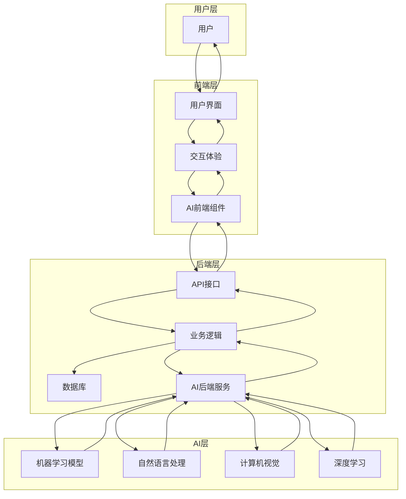

# 🚀 前端、后端与人工智能的协同关系详解

## 📝 摘要

在 2025 年的数字化浪潮中，前端、后端与人工智能的深度融合正在重塑整个软件开发行业！🌟 这不仅仅是技术的简单叠加，而是一场革命性的变革。想象一下：用户可以通过自然语言与你的应用对话，AI 能够实时分析用户行为并个性化推荐，后端系统能够智能预测和自动优化性能。这种协同关系让应用变得更加智能、更加人性化，用户体验达到了前所未有的高度。无论是智能电商的个性化推荐，还是医疗 AI 的精准诊断，都离不开前端、后端与 AI 的完美配合。掌握这种协同关系，你就能在 2025 年的技术竞争中占据制高点！🚀

## 📋 目录
- [概述](#概述)
- [前端与人工智能的融合](#前端与人工智能的融合)
- [后端与人工智能的结合](#后端与人工智能的结合)
- [三者协同工作模式](#三者协同工作模式)
- [实际应用场景](#实际应用场景)
- [技术架构图](#技术架构图)
- [未来发展趋势](#未来发展趋势)
- [总结](#总结)

---

## 🎯 概述

在 2025 年的现代软件开发中，**前端**、**后端** 和 **人工智能（AI）** 三者的融合日益紧密，共同推动了应用程序的智能化和用户体验的提升。这种协同关系不仅改变了传统的开发模式，更为用户带来了前所未有的智能化体验。

### 🔍 核心概念
- **前端**：负责用户界面和交互体验
- **后端**：处理业务逻辑和数据管理
- **人工智能**：提供智能分析和决策支持

---

## 🎨 前端与人工智能的融合

### 💡 智能化用户界面
前端开发者通过集成 AI 技术，能够实现更智能的用户交互和个性化服务：

#### 🗣️ 自然语言处理
- **语音识别**：用户可以通过语音与应用程序进行交互
- **语音合成**：应用程序能够以自然语音回复用户
- **文本理解**：智能解析用户输入的文本意图

#### 🖼️ 计算机视觉
- **图像识别**：自动标注和分类图片
- **人脸识别**：提供个性化的用户体验
- **OCR 技术**：识别图片中的文字内容

#### 🤖 AI 驱动的开发工具
- **GitHub Copilot**：AI 代码助手
- **Cursor AI**：智能代码编辑器
- **v0.dev**：AI 驱动的 UI 设计生成
- **Tabnine**：智能代码补全
- **Claude Sonnet**：AI 编程助手
- **AI 设计工具**：自动生成 UI 设计

### 📊 实时数据分析
前端可以利用 AI 进行实时数据分析，提供动态的用户反馈和个性化推荐。

---

## ⚙️ 后端与人工智能的结合

### 🧠 智能数据处理
后端主要负责数据处理和业务逻辑，通过引入 AI，可以实现更复杂的数据分析和预测功能：

#### 📈 机器学习模型
- **用户行为分析**：分析用户行为模式
- **个性化推荐**：基于用户偏好提供精准推荐
- **预测分析**：预测用户需求和市场趋势

#### 🔒 智能安全防护
- **异常检测**：实时监控系统异常
- **风险评估**：智能评估安全风险
- **自动化响应**：快速响应安全威胁

#### 🎯 资源优化
- **负载均衡**：AI 驱动的智能负载分配
- **缓存优化**：智能缓存策略
- **数据库优化**：AI 辅助的查询优化

### 🚀 AI 模型管理
后端还负责管理和部署 AI 模型，确保其高效运行和持续更新。

---

## 🤝 三者协同工作模式

### 🔄 数据流转过程

在全栈开发中，前端、后端和 AI 需要紧密协作，共同构建智能化的应用程序：

1. **数据收集**：前端收集用户输入和行为数据
2. **数据处理**：后端对数据进行预处理和验证
3. **AI 分析**：AI 模型对数据进行分析和决策
4. **结果返回**：后端将 AI 分析结果返回给前端
5. **用户展示**：前端将结果以友好的方式展示给用户

### 🏗️ 协同架构特点
- **松耦合设计**：各组件独立可扩展
- **实时通信**：支持实时数据交换
- **容错机制**：确保系统稳定性
- **性能优化**：AI 辅助的性能调优

---

## 🌟 实际应用场景

### 🛒 智能电商系统
```
用户浏览商品 → 前端收集行为数据 → 后端处理数据 → AI 分析用户偏好 → 生成个性化推荐 → 前端展示推荐结果
```

### 🎵 智能音乐推荐
```
用户播放音乐 → 前端记录播放行为 → 后端存储用户数据 → AI 分析音乐偏好 → 推荐相似音乐 → 前端更新播放列表
```

### 🏥 智能医疗诊断
```
患者上传症状 → 前端收集医疗数据 → 后端验证数据完整性 → AI 分析症状模式 → 生成诊断建议 → 前端展示诊断结果
```

### 🚗 智能驾驶系统
```
传感器采集数据 → 前端处理实时数据 → 后端协调各系统 → AI 进行决策分析 → 控制车辆行为 → 前端显示驾驶状态
```

---

## 🏛️ 技术架构图



---

## 🔮 未来发展趋势

### 🌐 2025 年技术趋势

#### 🚀 前端 AI 化
- **AI 原生界面**：完全由 AI 驱动的用户界面
- **智能交互**：更加自然的人机交互方式
- **自适应设计**：根据用户行为自动调整界面

#### ⚡ 后端智能化
- **边缘计算**：AI 模型部署到边缘设备
- **实时推理**：毫秒级的 AI 决策响应
- **自动化运维**：AI 驱动的系统运维

#### 🧠 AI 技术演进
- **大语言模型**：GPT-5、Claude-4、Gemini Ultra 等更强大的语言理解和生成能力
- **多模态 AI**：同时处理文本、图像、音频、视频等多种数据
- **联邦学习**：保护隐私的分布式 AI 训练
- **边缘 AI**：在设备端直接运行 AI 模型
- **AI Agent**：自主执行复杂任务的智能代理

---

## 🎯 总结

前端、后端与人工智能的深度融合，为现代软件开发带来了革命性的变化：

### ✨ 核心价值
1. **用户体验提升**：更智能、更个性化的交互体验
2. **开发效率提高**：AI 辅助开发工具大幅提升开发效率
3. **系统智能化**：从被动响应到主动预测的转变
4. **业务价值增长**：通过 AI 实现业务创新和价值创造

### 🛠️ 技术要点
- **前端**：专注于 AI 驱动的用户界面和交互体验
- **后端**：负责 AI 模型的管理、部署和数据处理
- **AI**：提供智能分析和决策支持，连接前后端

### 🚀 发展建议
1. **持续学习**：跟上 AI 技术发展的步伐
2. **实践应用**：在实际项目中应用 AI 技术
3. **团队协作**：培养跨领域的协作能力
4. **创新思维**：探索 AI 在业务中的创新应用

### 💪 开发者激励
亲爱的开发者们！🌟 你们正站在技术革命的最前沿！前端、后端与 AI 的融合不是遥不可及的梦想，而是触手可及的现实。每一个你正在编写的代码，都可能成为改变世界的起点！🚀 

不要害怕挑战，拥抱变化！AI 不是来替代我们的，而是来增强我们的能力。让我们一起用代码创造更智能、更美好的数字世界！记住：**最好的时代就是现在，最好的开发者就是你！** 💪✨

加油，未来的技术领袖们！你们有能力改变一切！🎉

---

## 📚 参考资料
- 百度开发者社区 - AI 技术应用案例
- 千帆市场 - AI 模型部署指南
- 阿里云开发者社区 - 视频智能分析技术
- Wikipedia - 人工智能应用技术

---

**厦门工学院人工智能创作坊 -- 郑恩赐**  
**2025 年 10 月 3 日**
