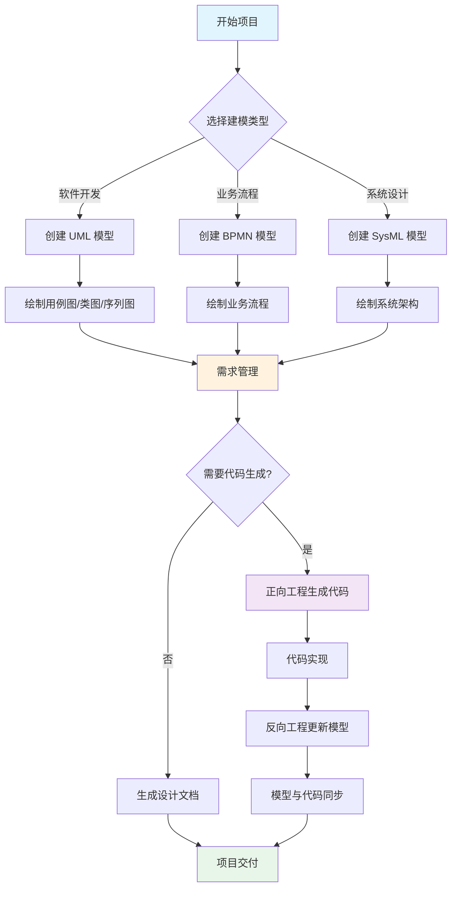

# Enterprise Architect是什么-如何从UML建模直达代码生成的神器指南

摘要：Enterprise Architect（EA，企业架构师）是什么？用生活化方式讲清 UML（统一建模语言）建模、需求管理、代码生成等核心功能，并提供使用流程图与场景建议，助你快速上手系统设计。

---

## Enterprise Architect（EA，企业架构师）是什么

**生活化比喻**：Enterprise Architect 就像建筑师的**全套绘图工具包**，但不是画房子，而是画软件系统、业务流程和数据结构的“蓝图”。

- **专业定义**：由澳大利亚 Sparx Systems 公司开发的综合性建模和设计工具，支持 UML（Unified Modeling Language，统一建模语言）、BPMN（Business Process Model and Notation，业务流程建模与标注）、SysML（Systems Modeling Language，系统建模语言）等多种建模语言。
- **核心价值**：从需求分析到代码实现的**全生命周期支持**，让复杂系统的设计与开发变得可视化、可管理。

---

## 主要功能与应用场景

### 1. UML 建模支持

支持完整的 UML 2.x 标准，包括：
- **用例图（Use Case Diagram）**：描述系统功能与用户交互
- **类图（Class Diagram）**：展示系统的静态结构
- **序列图（Sequence Diagram）**：描述对象间的交互时序
- **活动图（Activity Diagram）**：展示业务流程与工作流
- **状态图（State Diagram）**：描述对象的状态转换
- **组件图（Component Diagram）**：展示系统的物理结构
- **部署图（Deployment Diagram）**：描述系统的部署架构

**应用场景**：软件开发中的需求分析、系统设计、架构规划。

### 2. 需求管理

- **层次化需求模型**：按功能、非功能、业务需求分类组织
- **需求跟踪**：从需求到模型元素、再到代码实现的完整链路追踪
- **影响分析**：评估需求变更对系统的影响范围
- **需求报表**：自动生成需求文档与变更报告

**应用场景**：大型项目的需求变更管理、合规性追踪。

### 3. 代码生成与逆向工程

- **正向工程（Forward Engineering）**：从 UML 模型自动生成代码（支持 Java、C#、Python、C++ 等）
- **反向工程（Reverse Engineering）**：从现有代码生成 UML 模型，实现模型与代码的同步
- **双向工程（Round-trip Engineering）**：模型与代码双向同步，保持一致性

**应用场景**：敏捷开发中的快速原型、遗留系统的文档化。

### 4. 数据建模

- **概念模型到物理模型**：从 ER 图到数据库表结构的完整转换
- **数据库正向/反向工程**：支持 MySQL、PostgreSQL、Oracle、SQL Server 等主流数据库
- **SQL 脚本生成**：自动生成建表、索引、约束等 SQL 语句

**应用场景**：数据库设计与重构、数据迁移规划。

### 5. 业务建模与分析

支持多种业务建模语言：
- **BPMN（Business Process Model and Notation）**：业务流程建模与标注
- **BMM（Business Motivation Model）**：业务动机模型
- **VDML（Value Delivery Modeling Language）**：价值交付建模语言

**应用场景**：企业流程优化、业务分析、数字化转型。

### 6. 项目管理与协作

- **任务分配与跟踪**：甘特图、看板图、资源分配
- **版本控制**：模型版本管理、分支与合并
- **团队协作**：多用户同时编辑、权限管理、变更日志
- **文档生成**：自动生成 HTML、PDF、Word 等格式的项目文档

**应用场景**：大型团队的协作开发、项目进度跟踪。

---

## Enterprise Architect 使用流程（Mermaid）

---

## 版本选择与获取方式

### 版本对比

| 版本 | 适用人群 | 核心功能 |
|------|----------|----------|
| **专业版（Professional）** | 个人开发者、小团队 | 基础 UML 建模、代码生成、文档生成 |
| **企业版（Corporate）** | 中型团队 | 专业版功能 + 团队协作、版本控制 |
| **联合版（Unified）** | 大型组织 | 企业版功能 + 高级需求管理、业务流程建模 |
| **完全版（Ultimate）** | 企业级用户 | 所有功能 + SysML、数据建模、高级分析 |

### 获取方式

- **官方网站**：[Sparx Systems](https://sparxsystems.com/products/ea/)
- **试用下载**：提供 30 天免费试用版，功能完整
- **中文官网**：[Sparx Systems 中文](https://sparxsystems.cn/)
- **授权方式**：按用户数或按服务器许可

---

## 快速上手实践建议

### 第一步：安装与配置

🔥 Must（必做实践）

1. **下载安装**：从官网下载对应版本的安装程序
2. **创建项目**：新建项目文件（.eap 或 .qea 格式）
3. **选择模板**：根据项目类型选择 UML、BPMN 等模板
4. **配置选项**：设置代码生成路径、数据库连接等

**依赖说明**：Windows/macOS/Linux 均支持；首次使用建议选择“基础 UML 建模”模板。

### 第二步：创建第一个模型

⭐ Should（建议实践）

1. **用例图入门**：
   - 拖拽“用例（Use Case）”元素到画布
   - 添加“参与者（Actor）”
   - 用关联线连接用例与参与者
   - 保存模型

2. **类图入门**：
   - 创建类（Class）元素
   - 添加属性（Attribute）和方法（Method）
   - 定义类之间的关系（继承、关联、依赖）

**实践建议**：先画简单的“用户登录”用例图，再画“用户类”与“订单类”的关系图。

### 第三步：代码生成实践

⭐ Should（建议实践）

1. **设置代码生成选项**：
   - 工具 → 选项 → 代码生成 → 选择目标语言（如 Java）
   - 配置代码风格、命名规范

2. **生成代码**：
   - 选中类图或包（Package）
   - 右键 → 代码工程 → 生成代码
   - 选择输出目录

3. **验证代码**：
   - 查看生成的 .java 文件
   - 检查类、方法、属性是否正确

**实践建议**：先用简单类图（2-3 个类）测试，熟悉后再处理复杂模型。

### 第四步：需求管理实践

💡 Could（可选实践）

1. **创建需求模型**：
   - 新建需求包（Requirements Package）
   - 添加功能需求、非功能需求

2. **需求跟踪**：
   - 将需求关联到用例或类
   - 使用“可追溯性（Traceability）”视图查看关系

3. **生成需求文档**：
   - 文档 → 生成文档 → 选择需求模板
   - 导出为 Word 或 PDF

**实践建议**：小型项目可跳过此步；大型项目建议建立完整的需求跟踪链。

---

## 常见问题与解决方案

### 问题一：模型文件过大，打开缓慢

**原因**：模型包含大量元素、图片或复杂关系。

**解决方案**：
1. 使用模型分割（Model Split）功能，将大模型拆分成多个子模型
2. 启用模型压缩选项
3. 定期清理未使用的元素和关系

### 问题二：代码生成后需要手动修改

**原因**：模型与代码的映射规则不完善。

**解决方案**：
1. 使用代码模板（Code Templates）自定义生成规则
2. 配置代码生成选项，调整命名规范与代码风格
3. 使用双向工程保持模型与代码同步

### 问题三：团队协作冲突

**原因**：多人同时编辑同一模型元素。

**解决方案**：
1. 启用版本控制（Version Control），使用 Git/SVN 集成
2. 使用模型锁定功能，避免同时编辑
3. 定期合并模型分支，解决冲突

---

## 典型应用场景

### 场景一：Web 应用开发

🔥 Must（必做实践）

**流程**：
1. 用例图定义功能需求（用户注册、登录、购物车等）
2. 类图设计数据模型（User、Product、Order 类）
3. 序列图描述关键流程（下单流程、支付流程）
4. 正向工程生成 Java/C# 代码框架
5. 开发团队基于代码框架实现业务逻辑

**价值**：减少沟通成本，确保设计与实现一致。

### 场景二：企业流程优化

💡 Could（可选实践）

**流程**：
1. 使用 BPMN 绘制现有业务流程
2. 识别瓶颈与冗余环节
3. 设计优化后的业务流程
4. 生成流程文档，指导业务改进

**价值**：可视化业务流程，便于分析与优化。

### 场景三：系统架构设计

⭐ Should（建议实践）

**流程**：
1. 组件图展示系统模块划分
2. 部署图描述系统部署架构
3. 活动图描述系统间交互流程
4. 生成架构设计文档

**价值**：清晰展示系统架构，降低技术风险。

---

## 学习资源与参考资料

### 官方资源

- **官方网站**：[Sparx Systems](https://sparxsystems.com/)
- **用户指南**：[Enterprise Architect User Guide](https://sparxsystems.com/enterprise_architect_user_guide/)
- **在线教程**：[Sparx Systems Tutorials](https://sparxsystems.com/resources/tutorials/)
- **中文支持**：[Sparx Systems 中文官网](https://sparxsystems.cn/)

### 社区资源

- **官方论坛**：[Sparx Systems Community Forum](https://sparxsystems.com/forums/)
- **视频教程**：YouTube 搜索 "Enterprise Architect tutorial"
- **中文社区**：CSDN、博客园等平台有丰富的 EA 使用经验分享

### 参考书籍

- **《UML 和模式应用》**：深入理解 UML 建模思想
- **《企业应用架构模式》**：学习系统架构设计模式
- **《软件工程：实践者的研究方法》**：了解软件工程全流程

---

## 总结

Enterprise Architect 作为一款功能强大的建模工具，为软件开发、系统设计和业务流程分析提供了**可视化的设计蓝图**。通过 UML 建模、需求管理、代码生成等核心功能，它帮助团队**降低沟通成本、提高开发效率、确保设计一致性**。

**核心价值回顾**：
- ✅ **全生命周期支持**：从需求到代码，一站式管理
- ✅ **多种建模语言**：UML、BPMN、SysML，适应不同场景
- ✅ **代码双向工程**：模型与代码保持同步，提升开发效率
- ✅ **团队协作能力**：支持多用户协作、版本控制，适合大型项目

**学习建议**：
1. **从简单开始**：先掌握用例图和类图的基本绘制
2. **实践为主**：通过实际项目练习，逐步掌握高级功能
3. **循序渐进**：从建模到代码生成，从个人使用到团队协作
4. **关注最佳实践**：学习 UML 建模规范和架构设计模式

**继续加油，未来的系统架构师！** 让 Enterprise Architect 成为你设计复杂系统的得力助手，用可视化的方式构建清晰、可维护的软件架构。

---

厦门工学院人工智能创作坊 -- 郑恩赐  
2025 年 11 月 02 日

