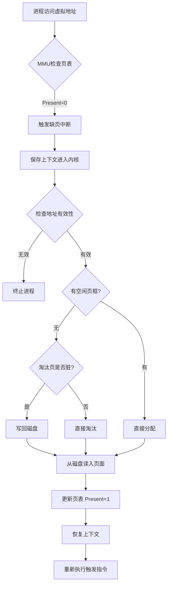

# 缺页中断与一般中断的主要区别

<!-- 全文摘要说明：以下段落是本文档的全文摘要，必须精炼概括文档核心内容，字数不能超过100个字 -->
本文档详细对比缺页中断与一般中断的核心区别，涵盖触发时机、处理流程、硬件响应、可屏蔽性等维度，并深入讲解软缺页与硬缺页的分类、缺页中断的三大特性，以及完整的处理流程 📚
<!-- 全文摘要结束 -->

## 章节阅读路线图 🗺️

1. **什么是缺页中断** → 理解缺页中断的基本概念与本质
2. **中断的分类体系** → 掌握外中断、内中断、异常、陷阱的分类
3. **核心区别对比** → 六大维度全面对比缺页中断与一般中断
4. **缺页中断的类型** → 软缺页、硬缺页、无效缺页的区别
5. **缺页中断处理流程** → 完整的10步处理流程详解
6. **总结** → 回顾核心要点

---

## 1. 什么是缺页中断 📖

> 本章理解缺页中断的基本概念与本质

**缺页中断（Page Fault）**，又称页缺失、硬错误、硬中断、分页错误、寻页缺失、页故障等，是指当程序试图访问已映射在虚拟地址空间中，但**目前并未被加载在物理内存中**的分页时，由 CPU 的**内存管理单元（MMU）**所发出的中断信号。

举个例子，假设进程要访问虚拟地址 `0x12345678`，MMU 查找页表后发现该地址对应的物理页的 **Present Bit（存在位）为 0**，说明页面不在内存中，此时 MMU 立即触发缺页中断，暂停当前指令执行，将控制权交给操作系统的缺页中断处理程序。

> 💡 虽然名为"页缺失"错误，但实际上这**不一定是错误**。缺页中断是利用虚拟内存来增加程序可用内存空间的操作系统中**常见且必要**的机制。

### 1.1 缺页中断的本质

缺页中断的本质是：**CPU 访问的这段虚拟内存背后没有物理内存与之映射**。具体表现形式主要有三种：

| 情况 | 说明 | 示例 |
|------|------|------|
| 页面未分配 | 虚拟地址尚未映射到任何物理页 | 首次访问 `malloc` 分配的内存 |
| 页面在磁盘 | 页面已被换出到交换空间或文件 | 内存不足时被 swap 出去的页面 |
| 权限不足 | 访问权限与页表项不匹配 | 用户程序试图写入只读页面 |

---

## 2. 中断的分类体系 🔀

> 本章掌握外中断、内中断、异常、陷阱的分类体系

在学习区别之前，先明确中断的分类体系。宏观的**中断（Interrupt Event）**分为两大类：

### 2.1 外中断（External Interrupt）

**外中断**，又称硬件中断（Hardware Interrupt），由 **CPU 外部设备**发起，通过中断引脚或消息信号传递给 CPU。

常见的外中断包括：
- **键盘中断**：按下键盘按键时触发
- **定时器中断**：硬件定时器到期时触发
- **网卡中断**：网络数据包到达时触发
- **磁盘中断**：磁盘 I/O 完成时触发

外中断的特点是**异步发生**——与 CPU 当前执行的指令无关，随时可能触发。

### 2.2 内中断（Internal Interrupt）

**内中断**，又称异常（Exception），由**正在 CPU 内部执行的指令本身**引发。内中断进一步细分为：

| 类型 | 英文名 | 特点 | 示例 |
|------|--------|------|------|
| **故障（Fault）** | Fault | 可恢复，处理后可重新执行触发指令 | **缺页中断**、除零错误 |
| **陷阱（Trap）** | Trap | 处理完后执行下一条指令 | 系统调用（syscall）、断点调试 |
| **终止（Abort）** | Abort | 不可恢复，通常终止进程 | 硬件故障、严重错误 |

**关键结论**：缺页中断的真正名称应当是**缺页异常（Page Fault）**，它属于内中断中的**故障（Fault）**类型，是**同步中断**——其触发与当前正在执行的指令**直接相关且同步发生**。

---

## 3. 核心区别对比 ⚡

> 本章从六大维度全面对比缺页中断与一般中断（外中断）的区别

### 3.1 触发源与路径

**缺页中断**：
- 由 CPU **内部的 MMU 硬件**直接检测并生成
- MMU 检测到缺页的瞬间，通过**专用的内部硬件信号路径**（物理直连，无中间缓冲）立即向 CPU 核心的执行/异常单元发送信号
- **不依赖外部中断引脚**，也不需要经过外部中断控制器（如 I/O APIC 或 8259A）进行路由和管理

**一般中断（外中断）**：
- 由**外部设备**通过中断引脚（如 INTR、NMI）或消息信号（如 MSI）发起
- 信号首先到达**中断控制器**（如 I/O APIC），进行优先级仲裁和管理
- CPU 核心通过本地 APIC（LAPIC）在指令边界或特定流水线阶段结束时，**周期性地采样**来自中断控制器的请求信号
- 需要经过"引脚采样 + IF 标志检查"这两级关卡才能被 CPU 响应

### 3.2 触发时机

**缺页中断**：
- 在**指令执行期间**产生和处理（具体在内存访问阶段）
- 当 MMU 发现页面不存在时，**立即触发**，不等指令执行完成

**一般中断（外中断）**：
- CPU 通常在**执行完一条指令后**，才检查是否有中断请求到达
- 允许当前指令完整执行，在**指令边界**处响应

> 💡 **核心区别**：缺页中断是在指令执行期间立即响应，而一般中断需要等待当前指令执行完毕。

### 3.3 对流水线的影响

**缺页中断**：
- 触发发生在指令执行过程中（内存访问阶段）
- 一旦触发，硬件会**立即阻塞流水线**的后续阶段（因为内存访问失败，指令本身无法完成）
- 通常需要**清空或回滚**该指令之后已进入流水线的所有指令（因为它们的状态可能已无效）
- 整个流水线会被"冻结"，直到异常处理完毕，然后**重新执行触发异常的指令**

**一般中断（外中断）**：
- 检测发生在指令或流水线阶段完成之后
- **允许当前指令完成**其操作
- 中断处理程序的执行会延迟下一条指令的开始，但**不会破坏或回滚**当前指令的执行结果

### 3.4 返回后的执行位置

**缺页中断**：
- 处理完成后，**重新执行引发中断的那条指令**
- 因为该指令没有执行完成（内存访问失败），必须重试

**一般中断（外中断）**：
- 处理完成后，**执行下一条指令**
- 因为当前指令已经执行完毕，只需继续后续流程

> 💡 **核心区别**：缺页中断返回后重新执行当前指令，一般中断返回后执行下一条指令。

### 3.5 可屏蔽性

**缺页中断**：
- 作为关键的内核级错误条件，**不可屏蔽**
- 操作系统必须处理它以保证程序正确性或系统稳定性

**一般中断（外中断）**：
- **可以被软件屏蔽**
- 通过清除标志寄存器中的中断允许标志（如 x86 的 IF，使用 CLI 指令）或配置中断控制器的屏蔽寄存器，可以阻止大部分外中断被 CPU 响应

### 3.6 一条指令可能产生的中断次数

**缺页中断**：
- **一条指令在执行期间，可能产生多次缺页中断**
- 例如，一条指令需要访问多个内存页面，每个页面都可能触发缺页中断

**一般中断（外中断）**：
- 一条指令执行期间**最多响应一次中断**
- 因为中断检查只在指令结束时进行一次

---

### 3.7 核心区别总结表

| 对比维度 | 缺页中断 | 一般中断（外中断） |
|---------|---------|-------------------|
| **中断类型** | 内中断（异常-故障） | 外中断（硬件中断） |
| **触发源** | CPU 内部 MMU | 外部设备（键盘、网卡等） |
| **触发时机** | 指令执行期间立即触发 | 指令执行完成后检查 |
| **同步性** | 同步（与当前指令相关） | 异步（与当前指令无关） |
| **流水线影响** | 阻塞并回滚当前指令 | 不破坏当前指令 |
| **返回后执行** | 重新执行当前指令 | 执行下一条指令 |
| **可屏蔽性** | 不可屏蔽 | 可屏蔽 |
| **中断次数** | 一条指令可能多次 | 一条指令最多一次 |
| **路径** | MMU 直连 CPU 核心 | 经中断控制器路由 |

---

## 4. 缺页中断的类型 🎯

> 本章深入理解软缺页、硬缺页、无效缺页的区别

缺页中断根据页面是否在物理内存中，分为三种类型：

### 4.1 软缺页（Soft Page Fault / Minor Page Fault）

**定义**：页面**已经在物理内存中**，但没有向 MMU 注册（页表项未建立映射）。

**处理过程**：
- 操作系统只需要在 MMU 中**更新页表**，建立虚拟地址到物理地址的映射
- **不需要磁盘 I/O 操作**，速度非常快

**发生场景**：
- 多个进程共享同一块物理内存（如共享库），操作系统已为其中一个进程注册了页面，但未为其他进程注册
- 页面已被从 CPU 的工作集中移除，但尚未被交换到磁盘上（放在空闲页表中）

**性能影响**：极小，仅需修改页表项

### 4.2 硬缺页（Hard Page Fault / Major Page Fault）

**定义**：页面**不在物理内存中**，需要从磁盘（交换空间或文件系统）加载。

**处理过程**：
1. 寻找空闲的物理页框，或选择一页调出到磁盘（如果被修改过需先写回）
2. 通过磁盘 I/O 将缺失的页面**从磁盘读入内存**
3. 更新页表，向 MMU 注册该页

**性能影响**：**非常大**，以 7200rpm 机械硬盘为例：
- 平均寻道时间：8.5 毫秒
- 读入内存：0.05 毫秒
- DDR3 内存访问延迟：数十到 100 纳秒
- **性能差距：8 万到 22 万倍**

> 💡 当硬缺页过于频繁发生时，称为**系统颠簸（Thrashing）**，系统性能会急剧下降。

### 4.3 无效缺页（Invalid Page Fault）

**定义**：程序访问的虚拟地址**不存在于进程的虚拟地址空间中**，或是非法访问。

**处理过程**：
- 操作系统判断为无效访问，向进程发送信号或**终止进程**
- 类 Unix 系统：发送 `SIGSEGV` 信号（段错误 Segmentation Fault）
- Windows：使用异常机制报告访问违规

**发生场景**：
- 空指针解引用（访问地址 `0x0`）
- 访问已释放的内存（悬垂指针）
- 数组越界访问到未分配区域

**性能影响**：进程终止，是最严重的缺页类型

---

### 4.4 三种类型对比

| 类型 | 页面位置 | 需要磁盘 I/O | 处理方式 | 性能影响 |
|------|---------|-------------|---------|---------|
| **软缺页** | 已在物理内存 | ❌ 否 | 更新页表 | 极小 |
| **硬缺页** | 在磁盘中 | ✅ 是 | 磁盘读入 + 更新页表 | 极大 |
| **无效缺页** | 不存在 | ❌ 否 | 终止进程 | 进程崩溃 |

---

## 5. 缺页中断处理流程 🔧

> 本章详细讲解缺页中断的完整 10 步处理流程

当进程执行过程中发生缺页中断时，操作系统按以下步骤处理：

### 5.1 硬件自动响应阶段（步骤 1-2）

**步骤 1：硬件陷入内核**

CPU 暂停当前进程的执行，**保存程序计数器（PC）**和其他状态信息到内核堆栈。大多数机器将当前指令的各种状态信息保存在特殊的 CPU 寄存器中（如 x86 的 CR2 寄存器保存引发缺页的线性地址）。

```
数据流动：进程执行 → MMU发现缺页 → 触发异常 → 保存PC到内核栈 → 进入内核态
```

**步骤 2：保存通用寄存器**

启动一个汇编代码例程，保存通用寄存器和其他易失的信息，以免被操作系统破坏。这个例程将操作系统作为一个函数来调用。

```
数据流动：通用寄存器 → 压栈保存 → 调用操作系统处理函数
```

### 5.2 操作系统处理阶段（步骤 3-7）

**步骤 3：确定缺失的虚拟页面**

操作系统尝试发现需要哪个虚拟页面：
- 通常一个硬件寄存器包含了这一信息（如 x86 的 CR2 寄存器）
- 如果没有，操作系统必须检索程序计数器，取出这条指令，用软件分析这条指令，看看它在缺页中断时正在做什么

```
数据流动：CR2寄存器 → 获取虚拟地址 → 确定缺失页面
```

**步骤 4：检查地址有效性与保护**

操作系统检查这个地址是否有效，并检查存取与保护是否一致：
- **如果不一致**：向进程发出信号或杀掉进程（无效缺页）
- **如果有效且无保护错误**：检查是否有空闲页框，如果没有则执行页面置换算法寻找淘汰页

```
数据流动：虚拟地址 → 检查VMA → 有效？→ 是：继续 / 否：终止进程
```

**步骤 5：处理脏页（如果需要页面置换）**

如果选择的页框"脏"了（被修改过）：
- 安排该页写回磁盘
- 发生一次上下文切换，挂起产生缺页中断的进程
- 让其他进程运行直至磁盘传输结束
- 该页框被标记为忙，以免被其他进程占用

如果页面未被修改，直接淘汰即可。

```
数据流动：检查页是否脏 → 是：写回磁盘 → 挂起进程 / 否：直接淘汰
```

**步骤 6：从磁盘加载页面**

操作系统查找所需页面在磁盘上的地址，通过磁盘操作将其装入：
- 该页面被装入后，产生缺页中断的进程仍然被挂起
- 如果有其他可运行的用户进程，则选择另一个用户进程运行

```
数据流动：磁盘地址 → 磁盘I/O → 读入内存页框 → 进程仍挂起
```

**步骤 7：更新页表**

当磁盘中断发生时，表明该页已经被装入：
- 页表已经更新可以反映它的位置
- 页框被标记为正常状态（Present Bit = 1）

```
数据流动：页表项 → 更新物理页框号 → 设置Present=1 → 页框标记为正常
```

### 5.3 恢复执行阶段（步骤 8-10）

**步骤 8：恢复指令状态**

恢复发生缺页中断指令以前的状态，**程序计数器重新指向这条指令**（不是下一条）。

```
数据流动：PC → 重置为触发指令地址 → 准备重新执行
```

**步骤 9：调度进程**

调度引发缺页中断的进程，操作系统返回调用它的汇编语言例程。

```
数据流动：进程调度器 → 选中缺页进程 → 恢复上下文
```

**步骤 10：恢复寄存器**

汇编例程恢复寄存器和其他状态信息，进程继续执行。

```
数据流动：内核栈 → 弹出寄存器值 → 恢复用户态 → 重新执行触发指令
```

---

### 5.4 处理流程总结



> 💡 **关键理解**：缺页中断处理的核心思想是**延迟加载**——只在真正需要时才将页面调入内存，这样可以让系统运行更多进程，提高内存利用率。

---

## 6. 总结 📝

本节我们详细对比了缺页中断与一般中断的主要区别，核心要点回顾：

| 核心区别 | 缺页中断 | 一般中断 |
|---------|---------|---------|
| **类型** | 内中断（异常-故障） | 外中断（硬件中断） |
| **触发时机** | 指令执行期间 | 指令执行完成后 |
| **返回执行** | 重新执行当前指令 | 执行下一条指令 |
| **可屏蔽性** | 不可屏蔽 | 可屏蔽 |
| **中断次数** | 一条指令可能多次 | 一条指令最多一次 |

🔴 **关键理解**：

- 缺页中断的**真正名称是缺页异常（Page Fault）**，属于内中断中的故障类型
- 三大类型：**软缺页**（页在内存，仅需更新页表）、**硬缺页**（页在磁盘，需 I/O 加载）、**无效缺页**（非法访问，终止进程）
- 缺页中断处理完成后**重新执行触发指令**，这是与一般中断最显著的区别之一
- 硬缺页的性能损耗极大（8 万到 22 万倍），应尽量避免频繁的硬缺页导致系统颠簸

---

**参考资料：**

- [缺页中断与外部中断的区别 -- CSDN](https://blog.csdn.net/lkai312/article/details/149142631) ⭐值得阅读
- [深入理解缺页中断及FIFO、LRU、OPT这三种置换算法 -- 腾讯云](https://cloud.tencent.com/developer/article/1683163) ⭐值得阅读
- [缺页中断（Page Fault）详解 -- CSDN](https://blog.csdn.net/weixin_42692164/article/details/148332702) ⭐值得阅读
- [一文聊透Linux缺页异常的处理——图解Page Faults -- 博客园](https://www.cnblogs.com/binlovetech/p/17918733.html) ⭐值得阅读
- [页缺失 -- 维基百科](https://zh.wikipedia.org/zh-cn/%E9%A1%B5%E7%BC%BA%E5%A4%B1)
- [程序员的自我修养（七）：内存缺页错误 -- 始终](https://liam.page/2017/09/01/page-fault/) ⭐值得阅读
- [图解什么是缺页错误Page Fault -- 知乎](https://zhuanlan.zhihu.com/p/676243873)

**最后更新时间**：2026-06-02
