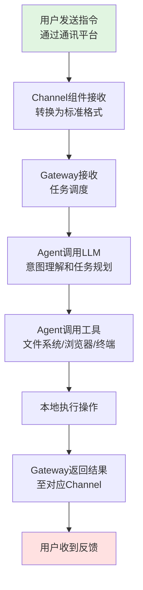
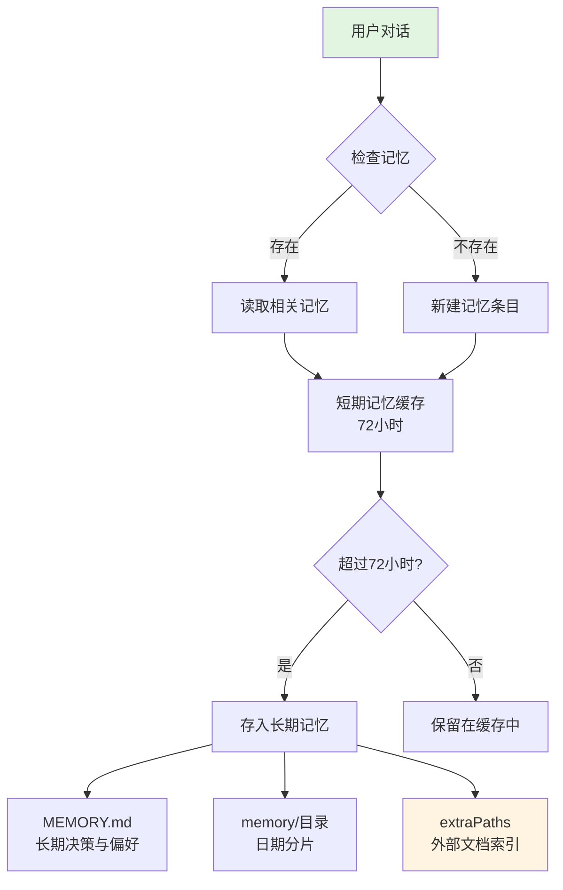

# OpenClaw 完全指南

## 1. 概述

OpenClaw是2026年爆火的开源本地优先AI代理平台，通过自然语言指令实现PC全功能自动化，真正替用户做事而非仅回答问题，具备本地优先、隐私可控、模型自由等核心优势，可构建7×24小时在线的私人智能助理。

## 2. OpenClaw 是什么

**OpenClaw**（原名Clawdbot/Moltbot）是2026年爆火的开源本地优先AI代理与自动化平台，由PSPDFKit创始人Peter Steinberger创建。

从本质上讲，OpenClaw与传统AI助手最大的不同在于：它不仅仅是聊天机器人，而是一个能真正"干活"的AI数字员工。用户通过Telegram、WhatsApp等消息应用发送自然语言指令，OpenClaw就能自动调用浏览器、文件系统、邮件等工具，完成整理文档、处理邮件、管理日历、办理航班值机等实际任务。

**OpenClaw的核心特点：**

- **本地优先**：所有数据储存在用户自己的本地工作区，无需上传到云端
- **隐私可控**：文件和日志完全留存本地，满足用户隐私需求
- **模型自由**：支持Claude、ChatGPT、文心、DeepSeek等多种AI模型，可灵活切换
- **主动自动化**：不仅能响应指令，还能自主规划和执行多步操作
- **多平台接入**：支持Telegram、WhatsApp、钉钉、飞书等多种通讯平台

实际上，OpenClaw本质上是一个AI智能体的"编排层"，它将本地编排层连接至主流AI模型，让AI不再局限于被动应答，而是能主动规划、调用工具、串联多步操作，真正像一个数字世界的"全能助理"。

## 3. OpenClaw 的核心功能

OpenClaw的核心价值在于"具身操作"能力——能够像真人一样操作电脑桌面，真正执行任务而非仅提供建议。

**3.1 办公场景**

在办公方面，OpenClaw能够完成：

- **邮件管理**：自动整理未读邮件、分类归档、自动回复
- **文档处理**：生成会议纪要、将PPT自动转换为PDF、整理文档
- **服务器监控**：实时监控服务器状态并预警异常
- **代码编写**：支持代码编写、调试、代码审查

**3.2 生活服务**

在日常生活中，OpenClaw能够为生活提供便利：

- **信息查询**：查询天气、预订餐厅、管理日程
- **在线办事**：办理航班值机、网购抢购、火车票订购
- **智能提醒**：结合天气预报自动调整提醒内容，如"每天早上8点提醒带伞"
- **偏好记忆**：记住用户偏好，如点咖啡时记住喜欢的口味

**3.3 技术操作**

在技术领域，OpenClaw展现出强大的操作能力：

- **文件操作**：读写文件、跨平台文件传输、整理文件夹
- **浏览器控制**：浏览网页、填写表单、截图识别界面元素
- **系统调用**：调用系统功能、执行终端命令、安装软件
- **自动化测试**：模拟人类操作完成自动化测试

**3.4 跨设备管理**

在多设备协同场景下，OpenClaw提供了便捷的管理方式：

- **多设备绑定**：可同时绑定家庭与公司电脑
- **远程操控**：通过微信等通讯工具点选设备名称即可远程操控
- **实时同步**：实时截图和执行过程，让用户随时了解任务进展
- **无缝切换**：在不同设备间切换操作，无需中断

**3.5 定时任务系统**

OpenClaw支持用自然语言创建定时任务：

- **自然语言描述**：用日常语言描述任务，如"提醒我两分钟后关煤气"
- **自动执行**：设定时间后自动执行，无需人工干预
- **灵活调整**：可随时修改或取消定时任务

**3.6 长期记忆能力**

OpenClaw具备强大的记忆功能：

- **本地存储**：记忆存储在本地，数据安全可控
- **越用越聪明**：随着使用次数增加，越来越了解用户习惯
- **精准回调**：从过往对话中精准回调用户偏好设置
- **持续学习**：自动学习和记住新的用户偏好

## 4. 技术架构

OpenClaw采用清晰的分层设计，主要由Gateway(网关)、Agent(智能体)、Skills(技能)、Memory(记忆)四大核心组件构成。

**4.1 整体架构**

从本质上讲，OpenClaw本质是AI智能体的"编排层"，通过将本地编排层连接至主流AI模型（如Claude、ChatGPT、文心、DeepSeek等），实现AI从被动应答到主动执行的转变。

**4.2 核心组件**

**4.2.1 频道适配器(Channel Adapter)**

频道适配器负责接收并处理来自不同通讯平台的消息。每种消息平台（Telegram、WhatsApp、微信、钉钉、飞书等）都有自己的专用适配器。

频道适配器的主要功能包括：
- 接收消息并进行标准化处理
- 提取附件和多媒体内容
- 将不同平台的消息格式转换为统一格式
- 向原始平台返回执行结果

**4.2.2 网关服务器(Gateway Server)**

网关服务器是任务/会话的协调者，是OpenClaw的核心组件。它负责将消息传递到正确的会话，并能够处理多个重叠的请求。

网关服务器的主要功能包括：
- 会话管理和路由
- 多任务协调和调度
- 使用基于车道(Lane)的命令队列序列化操作
- 每个会话有专用车道，低风险可并行执行的任务可在不同车道上并行执行

**4.2.3 Agent执行器**

Agent执行器负责实际的AI推理和工具执行。OpenClaw集成了Pi引擎作为"通用引擎"，提供模型抽象、流式推理、agent loop、工具执行等底层机制。

Agent执行器的特点：
- 通过SDK方式将Pi引擎嵌入到Gateway架构中
- 使用createAgentSession()实例化AgentSession
- 在进程内承担推理与工具循环
- 支持多种LLM API（Anthropic、OpenAI、本地模型等）

**4.3 执行流程**

一个典型的任务在OpenClaw中的执行流程如下：

**流程说明：**

1. **指令接收**：用户通过集成的通讯平台（如Telegram）发送自然语言指令
2. **消息处理**：消息被对应平台的Channel组件接收，转换为标准格式后发送至Gateway
3. **任务调度**：Gateway将指令和上下文提交给配置的Agent
4. **AI推理**：Agent调用配置的LLM进行意图理解和任务规划
5. **工具调用**：Agent根据任务规划调用相应的工具（文件系统、浏览器、终端等）
6. **执行操作**：在本地设备上执行实际操作
7. **结果返回**：将执行结果通过Gateway返回给对应的Channel
8. **用户反馈**：通过原始通讯平台将结果发送给用户

**4.4 架构优势**

OpenClaw的技术架构具有以下优势：

- **模块化设计**：各组件职责清晰，易于扩展和维护
- **并发处理**：基于车道(Lane)的队列系统支持并行执行多个低风险任务
- **统一接口**：Gateway作为统一协调中心，简化了多平台接入
- **本地执行**：所有操作在本地设备上执行，保证隐私安全
- **模型无关**：支持多种LLM API和本地模型，可根据需求灵活切换
- **进程内集成**：Pi引擎以SDK方式嵌入，减少进程间通信开销

## 5. 记忆系统

OpenClaw的双模记忆架构是其核心竞争力之一，通过本地化设计解决了传统AI助手的"健忘"问题，支持跨会话个性化服务。

**5.1 双模记忆架构**

记忆系统采用双层存储机制：

| 记忆类型 | 存储方式 | 持续时间 | 主要功能 |
|---------|---------|---------|---------|
| **短期记忆** | 内存缓存 | 72小时内 | 缓存对话上下文，确保多轮交互连贯 |
| **长期记忆** | SQLite数据库 + Markdown文件 | 永久持久化 | 存储用户偏好、习惯、重要决策等信息 |

**5.2 长期记忆存储结构**

OpenClaw的长期记忆通过三层文件结构实现持久化：

**5.2.1 MEMORY.md**

MEMORY.md文件存储用户的长期决策与偏好设置，包括：
- 用户的核心偏好和习惯
- 重要决策和选择
- 系统配置信息
- 个人化的工作流程

**5.2.2 memory/ 目录**

memory/目录下按日期分片存储日常笔记，例如：
- `memory/2026-01-30.md`
- `memory/2026-01-31.md`

每个文件记录当天的：
- 重要事件和对话
- 任务执行结果
- 用户反馈和调整
- 临时性的偏好变化

**5.2.3 extraPaths**

extraPaths支持外部文档索引，可以：
- 索引用户指定的外部文档
- 集成知识库和参考资料
- 扩展记忆系统的覆盖范围

**5.3 记忆系统架构**

**5.4 记忆系统的优势**

OpenClaw记忆系统具有以下核心优势：

- **本地存储**：所有记忆数据储存在用户本地工作区，完全掌控数据主权
- **隐私可控**：无需上传到云端，避免隐私泄露风险
- **持续学习**：随着使用时间增加，越来越了解用户习惯和偏好
- **跨会话连贯**：短期缓存确保多轮对话的上下文连贯性
- **精准回调**：从长期记忆中精准召回用户偏好和历史决策
- **可编辑性**：记忆文件以Markdown格式存储，用户可直接查看和编辑

**5.5 记忆持久化机制**

记忆持久化遵循以下原则：

- **自动保存**：重要决策和偏好自动存入MEMORY.md
- **按日归档**：日常记录按日期分片存入memory/目录
- **灵活扩展**：通过extraPaths集成外部知识库
- **结构清晰**：三层存储结构便于管理和检索
- **版本可控**：所有文件都是文本格式，易于版本管理

## 6. 应用场景

OpenClaw凭借"具身操作"能力，在个人和企业场景中展现出广泛的应用价值。

**6.1 个人应用场景**

对于个人用户而言，OpenClaw是一个7×24小时工作的私人智能助理，能够通过语音、文字发送指令，完成多种日常任务：

| 场景类型 | 具体任务 | 实际案例 |
|---------|---------|---------|
| **文件管理** | 整理文件、清理垃圾、分类归档 | 自动整理下载文件夹，按类型分类文件 |
| **日程管理** | 提醒事项、预约服务、查看日历 | "每天早上8点提醒带伞"，结合天气预报调整 |
| **邮件处理** | 清理邮件、分类归档、自动回复 | 自动清理7.5万封未读邮件，分类归档 |
| **浏览器自动化** | 填写表单、浏览网页、在线办事 | 办理航班值机、火车票订购、网购抢购 |
| **数据查询** | 本地搜索、信息检索、数据分析 | 查找文件内容、搜索本地数据库 |
| **内容创作** | 生成文档、发布帖子、制作汇报 | 将PPT转换为PDF、生成会议纪要 |
| **生活服务** | 查询天气、预订餐厅、管理订阅 | 查看天气预报、预订餐厅、管理订阅服务 |

**6.2 企业应用场景**

对于企业用户，OpenClaw能适配多种业务场景，降低人力成本，提升办公效率：

| 场景类型 | 具体应用 | 效果 |
|---------|---------|------|
| **智能客服** | 自动回复客户咨询、处理常见问题 | 7×24小时在线，减少人工投入 |
| **办公自动化** | 批量处理文档、生成报表、数据整理 | 提升办公效率40%以上 |
| **系统集成** | 对接CRM/ERP系统、自动化业务流程 | 定制化集成，无需复杂技术部署 |
| **数据处理** | 批量分析数据、生成统计报告 | 快速处理大量数据，节省时间 |
| **合规管理** | 自动化审计、生成合规报告 | 保障数据安全合规 |
| **内部运维** | 监控服务器状态、自动预警异常 | 实时监控系统，及时发现问题 |

**6.3 典型使用案例**

**案例一：航班值机自动化**

通过编写Skills脚本，OpenClaw可以完全自主完成航班值机：
1. 查找身份证、护照等证件文件
2. 提取证件信息
3. 填写值机表单
4. 完成值机并发送登机牌给用户

**案例二：活动智能推荐**

用户看到线下活动海报时，拍照发送给OpenClaw：
1. 自动识别活动信息
2. 查看用户日历和日程
3. 建议合适的参与时间
4. 搜索活动评价
5. 根据评价决定是否推荐参加

**案例三：批量文档处理**

企业用户可以一次性处理大量文档：
1. 将PPT批量转换为PDF
2. 提取文档内容生成摘要
3. 整理成统一格式发送给客户
4. 无需人工干预，自动完成

**6.4 场景优势**

OpenClaw在不同场景中展现出显著优势：

- **降低门槛**：无需编程知识，通过自然语言即可完成任务
- **提升效率**：自动处理重复性工作，据测试可提升办公效率40%以上
- **降低成本**：一台Mac Mini即可7×24小时运行，节省人力成本
- **保障隐私**：所有操作在本地执行，数据不离开用户设备
- **灵活扩展**：通过Skills脚本自定义任务，满足个性化需求
- **持续学习**：长期记忆系统能够记住用户偏好，越用越智能

## 7. 所需要的算力

OpenClaw的部署需要一定的硬件基础和算力支持，同时在选择使用场景时需要权衡成本与收益。

**7.1 硬件要求**

| 配置类型 | CPU | 内存 | 存储 | 操作系统 | 适用场景 |
|---------|------|------|------|---------|---------|
| **最低配置** | ≥2核 | ≥2GB（必须≥2GB） | ≥40GB SSD | macOS / Linux / Windows | 学习测试，轻度使用 |
| **推荐配置** | ≥4核 | ≥4GB | ≥60GB SSD | macOS / Linux / Windows WSL2 | 日常使用，中等负载 |
| **理想配置** | ≥4核（支持虚拟化） | ≥8GB | ≥100GB SSD | macOS / Linux / Windows WSL2 | 重度使用，多任务并行 |

**7.2 软件依赖**

必备工具：
- **Node.js** ≥22（必须）
- **Git**（必须）
- **Ollama** ≥0.15.4（本地模型运行核心，可选但推荐）

可选工具：
- **Docker**（推荐用于沙箱隔离）
- **Python** 3.10-3.11（禁止3.12+，避免依赖冲突）

**7.3 值得使用的场景**

在以下场景中，OpenClaw能够发挥最大价值：

| 场景类型 | 说明 | 性价比 |
|---------|------|--------|
| **个人探索测试** | 学习Agent技术，体验AI自动化 | ⭐⭐⭐⭐⭐ |
| **重复性文件整理** | 自动清理垃圾邮件、整理下载文件夹 | ⭐⭐⭐⭐⭐ |
| **简单邮件处理** | 分类归档、自动回复常见邮件 | ⭐⭐⭐⭐ |
| **定时任务执行** | 固定时间的提醒、备份、数据同步 | ⭐⭐⭐⭐⭐ |
| **个人日程管理** | 简单的日程安排和提醒 | ⭐⭐⭐⭐ |
| **开发辅助** | 代码审查、文档生成、测试辅助 | ⭐⭐⭐ |

**为什么值得？**

- **一次性部署，长期收益**：部署完成后可7×24小时自动运行
- **节省大量时间**：自动处理重复性工作，据测试提升办公效率40%以上
- **学习成本低**：无需编程知识，通过自然语言即可完成任务
- **可定制化**：通过Skills脚本满足个性化需求

**7.4 不值得使用的场景**

在以下场景中，使用OpenClaw可能得不偿失：

| 场景类型 | 不推荐原因 | 风险等级 |
|---------|-----------|---------|
| **企业生产环境** | 安全风险大，缺乏统一治理 | 🔴 高 |
| **涉密岗位** | 数据安全无法保障，存在泄密风险 | 🔴 高 |
| **高同质化任务** | Token消耗巨大，成本不可控 | 🟡 中 |
| **硬件配置低的用户** | 普通PC无法为OpenClaw提供足够算力 | 🟡 中 |
| **对成本敏感的场景** | 账单可能达到数亿Token级别 | 🟠 高 |
| **需要实时响应** | LLM推理存在延迟，无法保证实时性 | 🟢 低 |
| **简单查询任务** | 使用搜索引擎更快捷 | 🟢 低 |

**7.5 成本与算力分析**

**7.5.1 Token消耗问题**

OpenClaw使用过程中存在严重的Token消耗问题：

- **上下文膨胀**：context可能堆到61K，每次对话都要为历史买单
- **ReAct轮次累积**：多轮推理导致Token消耗呈指数增长
- **工具回填**：工具执行结果需要回填到上下文
- **系统提示词开销**：固定的系统提示词占用大量Token

实际案例：
- 有人一周账单跑到1.8亿Token
- 轻松对话几百万Token是常态
- 高同质化任务建议使用缓存，可优化90%的Token使用

**7.5.2 硬件性能瓶颈**

- **普通PC限制**：淘汰的PC配置无法为OpenClaw提供足够支撑
- **云部署性能问题**：即使部署到云端，性能瓶颈仍然存在
- **GPU需求**：虽然主要依赖LLM推理，但本地运行模型需要GPU支持

**7.5.3 安全风险**

- **恶意附加组件**：技能市场发现数百个恶意Skills
- **工具调用失控**：Gateway缺乏统一治理，安全风险陡然上升
- **数据泄露**：本地部署虽然隐私较好，但仍需谨慎处理敏感数据

**7.6 选择建议**

**建议使用OpenClaw的情况：**

- 硬件配置满足推荐要求（4核CPU，4GB+内存）
- 主要是个人使用或学习测试
- 任务具有一定的重复性和自动化价值
- 能够承担相应的API调用成本
- 不涉及敏感或机密数据

**不建议使用OpenClaw的情况：**

- 计划用于企业生产环境
- 工作涉及涉密或敏感信息
- 硬件配置低于最低要求
- 对成本非常敏感
- 需要实时响应或高频交互
- 任务可以通过传统工具更高效完成

## 8. OpenClaw 与智谱 AutoGLM 对比

前段时间爆火的智谱AutoGLM与OpenClaw同属AI Agent领域，但定位和应用场景存在明显差异。

**8.1 核心定位对比**

| 维度 | OpenClaw | 智谱 AutoGLM |
|------|-----------|--------------|
| **目标平台** | PC/桌面环境 | 安卓移动设备 |
| **核心能力** | 本地优先、隐私可控 | 视觉识别、触控模拟 |
| **交互方式** | CLI/GUI + 多平台通讯 | 实时屏幕识别 + 语音/文本 |
| **模型支持** | 多种LLM自由切换 | 基于GLM-4系列 |
| **部署门槛** | 需要技术配置，支持云服务 | 开源免费，降低使用门槛 |

**8.2 技术特点对比**

OpenClaw的技术优势：
- **本地优先架构**：所有数据存储在用户本地工作区，完全掌控数据主权
- **多平台接入**：支持Telegram、WhatsApp、钉钉、飞书等多种通讯平台
- **双模记忆系统**：短期缓存72小时，长期记忆通过SQLite+Markdown持久化
- **模型灵活性**：支持Claude、ChatGPT、文心、DeepSeek等多种模型
- **技能扩展**：通过Skills脚本自定义任务，满足个性化需求

智谱AutoGLM的技术优势：
- **视觉识别能力**：集成OCR技术，精准识别屏幕内容
- **触控模拟**：通过ADB桥接模拟触摸、滑动等人机交互
- **跨应用操作**：无需APP适配，理论上可操作任何安卓应用
- **零代码建模**：支持自然语言描述建模需求，自动完成特征工程
- **多模态支持**：GLM-4系列支持文本、数值、类别混合数据建模

**8.3 应用场景对比**

| 场景类型 | OpenClaw 适用性 | 智谱AutoGLM 适用性 |
|---------|-----------------|---------------------|
| **文件处理** | ⭐⭐⭐⭐⭐ | ⭐⭐ |
| **邮件管理** | ⭐⭐⭐⭐ | ⭐⭐ |
| **日程管理** | ⭐⭐⭐⭐ | ⭐⭐⭐ |
| **移动端操作** | ⭐⭐ | ⭐⭐⭐⭐⭐ |
| **网购下单** | ⭐⭐⭐ | ⭐⭐⭐⭐⭐ |
| **社交互动** | ⭐⭐ | ⭐⭐⭐⭐⭐ |
| **办公自动化** | ⭐⭐⭐⭐ | ⭐⭐⭐⭐ |
| **开发辅助** | ⭐⭐⭐⭐ | ⭐⭐⭐ |

**8.4 选择建议**

选择OpenClaw的场景：
- 主要在PC/桌面环境工作
- 需要处理邮件、文档、代码等桌面任务
- 重视数据隐私和本地存储
- 需要整合多种通讯平台
- 硬件配置较好（4核CPU，4GB+内存）

选择智谱AutoGLM的场景：
- 主要使用移动设备（安卓手机/平板）
- 需要移动端自动化操作
- 需要视觉识别和屏幕理解
- 对成本敏感，不想承担高额API费用
- 想要快速体验AI Agent能力

## 9. 总结

OpenClaw通过"具身操作"能力突破传统AI助手局限，实现从被动应答到主动执行的转变。其核心价值在于本地优先、隐私可控、模型自由，通过双模记忆系统解决"健忘"问题。在个人和企业场景中展现出显著优势，但也面临硬件要求、Token消耗、安全风险等挑战。用户需根据自身需求、硬件配置和成本预算，合理选择使用方案。

