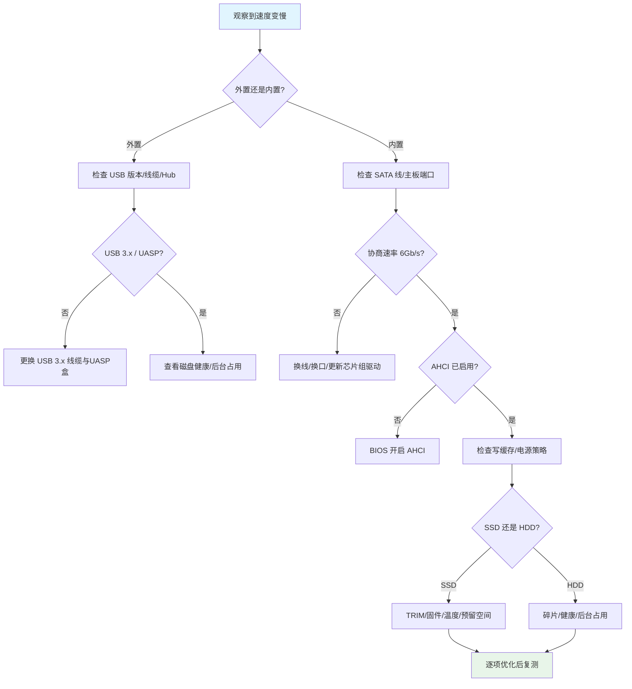

# SATA硬盘完全指南-速度变慢的原因与解决办法

摘要：SATA 硬盘是什么？本文用通俗方式讲清原理、基准速度、常见变慢原因与排查步骤，并提供逐项解决办法，帮你快速恢复性能。

---

## 什么是 SATA（串行 ATA）硬盘
- **SATA（Serial ATA，串行 ATA）**：主流的硬盘/固态硬盘传输接口，取代旧的 PATA（并行 ATA）。
- **代际与理论带宽**：
  - SATA I：1.5 Gbps（约 150 MB/s）
  - SATA II：3.0 Gbps（约 300 MB/s）
  - SATA III：6.0 Gbps（约 600 MB/s）
- **介质类型**：
  - HDD（机械硬盘）：顺序读写可达 150-220 MB/s，随机性能较低。
  - SATA SSD（固态硬盘）：顺序读写常见 400-550 MB/s，受主控/闪存影响。
- **关键特性**：AHCI（高级主控接口）、NCQ（原生指令队列）、TRIM（回收/维护 SSD 性能）。

---

## 出现“读取/写入速度变低”的常见原因清单（关联术语已标注中英）
- **链路降级/握手速率变低（Link speed downshift）**：SATA III 设备仅以 SATA II/I 速率协商，常因线材/接口/控制器问题。
- **线材/端口问题（Cable/Port issue）**：SATA 线接触不良、线缆过长/质量差、供电不稳，或主板接口老化。
- **模式不当（IDE vs AHCI）**：BIOS/UEFI 将控制器设为 IDE，禁用了 AHCI（Advanced Host Controller Interface）与 NCQ。
- **驱动老旧（Outdated driver）**：芯片组/SATA 控制器/存储驱动陈旧（如 Intel RST、AMD 芯片组）。
- **节能策略限速（Power saving throttling）**：Windows 电源计划省电、PCI Express 链路状态节能（Link State Power Management），移动硬盘盒固件省电。
- **硬盘健康下降（Degraded health）**：S.M.A.R.T 指标异常、坏扇区（bad sectors）、重映射扇区上升。
- **温度过高限速（Thermal throttling）**：SSD/桥接芯片温度过高降速。
- **文件系统问题（Filesystem issue）**：分区 4K 未对齐（Alignment）、严重碎片（HDD）、BitLocker/实时压缩开销。
- **容量逼近满盘（Near full capacity）**：SSD 预留空间不足（OP 不足）、HDD 外圈→内圈速度自然下降。
- **写缓存/策略关闭（Write cache disabled）**：设备写缓存或策略被禁用，导致同步写慢。
- **外置方案瓶颈（External bottleneck）**：
  - USB 仅 2.0（≈ 30-40 MB/s）或走 BOT（Bulk-Only Transport）而非 UASP（USB Attached SCSI）。
  - 劣质 USB-SATA 桥接（Bridge）或集线器（Hub）共享带宽。
- **后台占用（Background workload）**：杀毒扫描、索引、同步、下载、系统更新占用磁盘。
- **固件/主控问题（Firmware/Controller）**：SSD 固件老旧、主控异常、TRIM 未生效。

---

## 快速诊断流程（Mermaid）

---

## 逐项解决办法（按原因对应）
- **链路降级/握手速率变低**：
  1) 更换高质量 SATA 线（带卡扣），长度≤50cm；
  2) 更换主板端口（避免共享/旁路芯片口），优先 CPU 直连或主芯片组口；
  3) 更新主板 BIOS/UEFI 与存储控制器驱动；
  4) 在 Windows 用 CrystalDiskInfo 查看“传输模式：SATA/600（当前）”；Linux 用 `smartctl -a`/`hdparm -I` 查询。
- **线材/端口问题**：
  1) 重新插拔并清洁触点；
  2) 换一根线、换一口口（尽量不与光驱/扩展控制器混用）；
  3) 检查电源线分支，必要时独立供电。
- **模式不当（IDE→AHCI）**：
  1) 先在系统中启用 AHCI 驱动项（避免蓝屏），再进 BIOS 切换 IDE→AHCI；
  2) 参考微软文档启用 `msahci`/`storahci` 或厂商驱动（Intel RST）。
- **驱动老旧**：
  1) 安装最新芯片组驱动（Intel/AMD）与存储控制器驱动（RST/RAID）；
  2) Windows Update 完整打齐；
  3) 服务器/工作站优先用厂商认证版本。
- **节能策略限速**：
  1) Windows 选择“高性能/卓越性能”，磁盘休眠设为“从不”；
  2) 关闭 PCIe 链路状态节能（L1/L1.2）与 USB 选择性暂停；
  3) 移动硬盘盒若可配置，关闭过 aggressive 省电策略。
- **硬盘健康下降**：
  1) CrystalDiskInfo/厂商工具检查 S.M.A.R.T；
  2) 发现“黄色/红色”指示或重映射/待映射上升，及时备份并更换；
  3) HDD 可用完整表面扫描确认坏道，SSD 谨慎写入大数据以免加速磨损。
- **温度过高**：
  1) 提升通风/加散热贴/远离热源；
  2) 外置盒选择金属外壳与良好导热结构。
- **文件系统问题**：
  1) 检查 4K 对齐（新建分区通常自动对齐，历史克隆盘需校验修复）；
  2) HDD 执行碎片整理（SSD 禁止碎片整理，使用 TRIM）；
  3) 关闭不必要的实时压缩/加密（视安全策略权衡）。
- **容量逼近满盘**：
  1) SSD 预留 10-20% 空间（OP），清理大文件/临时文件；
  2) HDD 清理/归档低频数据；
  3) 若经常满盘，考虑更大容量或上 NVMe。
- **写缓存/策略**：
  1) 设备管理器 → 磁盘驱动器 → 策略：启用设备上的写缓存（注意断电风险，配合 UPS）；
  2) 服务器场景考虑写缓存+断电保护（PLP）。
- **外置方案瓶颈**：
  1) 确认 USB 端口为 USB 3.x（蓝色/SS 标识），线缆支持 5Gbps/10Gbps；
  2) 选用支持 UASP（USB Attached SCSI）的硬盘盒/桥接；
  3) 避免接在低速 Hub 上；
  4) BOT→UASP 可显著改善 4K 随机与队列性能。
- **后台占用**：
  1) 任务管理器排查高磁盘占用进程；
  2) 安排杀毒/索引在空闲时段；
  3) 关闭不必要的同步/下载。
- **固件/主控/TRIM**：
  1) 厂商工具更新 SSD 固件；
  2) Windows 检查 TRIM：`fsutil behavior query DisableDeleteNotify`，返回 `0` 表示开启；
  3) 手动维护：设置 → 存储 → 驱动器优化，确保 SSD 定期优化（即发送 TRIM）。

---

## 期望速度“基准线”（方便对照）
- 内置 SATA SSD：顺序读写 450-550 MB/s；4K Q1T1 读 20-50 MB/s（视主控/颗粒）。
- 内置 HDD（7200RPM）：顺序读写 150-220 MB/s；大量小文件场景远低于顺序。
- 外置 USB 3.0 + SATA 盒：顺序读写 350-450 MB/s（UASP 更佳）；USB 2.0 仅 30-40 MB/s。

---

## 常见问答（FAQ）
- Q：SATA SSD 为什么不如 NVMe SSD 快？
  - A：受限于 6 Gbps 的 SATA 接口上限与协议开销；NVMe 走 PCIe 通道，带宽与并发更高。
- Q：更换 SATA 线真的有用吗？
  - A：老化/劣质线会导致误码与降级握手，换优质短线可显著稳定速率。
- Q：HDD 碎片整理对 SSD 是否有害？
  - A：SSD 禁止传统碎片整理；保持 TRIM 与空闲空间即可。

---

## 参考链接（可点击）
- 标准与背景：
  - [Serial ATA International Organization](https://sata-io.org/)｜[Wikipedia · Serial ATA](https://en.wikipedia.org/wiki/Serial_ATA)
- 操作系统与驱动：
  - [Microsoft Docs · storahci](https://learn.microsoft.com/windows-hardware/drivers/storage/storahci-controller)
  - [Intel RST](https://www.intel.com/content/www/us/en/download/17750/intel-rapid-storage-technology-driver-installation-software-with-intel-optane-memory-9th-10th-gen-platforms.html)｜[AMD Chipset Drivers](https://www.amd.com/en/support)
- 诊断与维护工具：
  - [CrystalDiskInfo](https://crystalmark.info/en/software/crystaldiskinfo/)｜[CrystalDiskMark](https://crystalmark.info/en/software/crystaldiskmark/)
  - [smartmontools](https://www.smartmontools.org/)｜[hdparm](https://sourceforge.net/projects/hdparm/)
- 厂商支持：
  - [Seagate Support](https://www.seagate.com/support/)｜[Western Digital Support](https://support.wdc.com/)

---

厦门工学院人工智能创作坊 -- 郑恩赐  
2025 年 10 月 30 日
