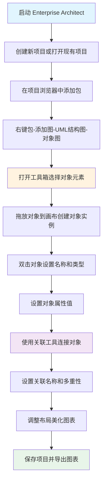

# 如何用Enterprise Architect绘制机票预订系统对象图-从零开始的实操指南

摘要：如何用 Enterprise Architect（EA）绘制 UML 对象图（Object Diagram）？本文以机票预订系统为案例，教你创建对象图、添加对象实例、建立关联关系，快速掌握核心技能。

---

## 对象图（Object Diagram）是什么

**生活化比喻**：如果说类图（Class Diagram）是“房屋设计图纸”，那么对象图就是“房屋建成后的实景照片”，展示的是系统在**某个特定时刻**的真实对象实例及其关系。

- **专业定义**：对象图是 UML（Unified Modeling Language，统一建模语言）中的一种结构图，用于展示系统在某一时刻的对象实例（Object Instance）、属性值以及对象之间的链接（Link）关系。
- **核心价值**：帮助开发者理解系统运行时的具体状态，验证类图设计的正确性，辅助系统调试和测试。

---

## 为什么选择机票预订系统

机票预订系统是我们日常生活中**最常见**的业务场景之一，包含：
- **用户**（User）：旅客信息
- **航班**（Flight）：航班详细信息
- **预订**（Booking）：预订记录
- **支付**（Payment）：支付信息

通过这个熟悉场景，你可以快速理解对象图的核心概念，并将其应用到其他业务系统中。

---

## 准备工作

<p align="right"><span style="background:#e53935;color:#fff;padding:2px 6px;border-radius:4px">🔥 Must（必做实践）｜依赖：已安装 Enterprise Architect</span></p>

### 前置条件检查

1. **已安装 Enterprise Architect**：确保 EA 已正确安装（专业版或更高版本）
2. **了解基本操作**：熟悉 EA 的基本界面和工具箱操作
3. **项目文件准备**：准备一个空白的 EA 项目文件（.eap 或 .qea 格式）

**如果没有 EA**：可从 [Sparx Systems 官网](https://sparxsystems.com/) 下载 30 天免费试用版。

---

## 绘制对象图完整流程（Mermaid）



---

## 第一步：创建项目和对象图

<p align="right"><span style="background:#e53935;color:#fff;padding:2px 6px;border-radius:4px">🔥 Must（必做实践）</span></p>

### 1.1 启动 EA 并创建项目

1. **启动 Enterprise Architect**：双击桌面图标或在开始菜单中打开 EA
2. **创建新项目**：
   - 点击菜单栏 **文件（File）** → **新建项目（New Project）**
   - 选择保存位置，输入文件名（如 `TicketBookingSystem.eap`）
   - 点击 **保存（Save）**

### 1.2 添加包和对象图

1. **在项目浏览器中添加包**：
   
   **方法一：使用"加根节点..."创建新模型**
   - 在左侧项目浏览器（浏览器，Browser）中，找到并右键点击 **Model** 节点（或根节点）
   - 从右键菜单中选择 **加根节点...（Add Root Node...）**
   - 弹出 **"创建新模型(根结点)"（Create New Model (Root Node)）** 对话框
   - 在 **"模型名:"（Model Name:）** 输入框中输入：`机票预订系统` 或 `TicketBookingSystem`
   - 点击 **确定(O)（OK(O)）** 按钮

   **方法二：使用"加视图..."创建包**
   - 在左侧项目浏览器中，右键点击 **Model** 节点
   - 从右键菜单中选择 **加视图...（Add View...）**
   - 弹出 **"新建包"（New Package）** 对话框
   - **"拥有"（Owner）** 字段：默认显示 `Model`，如需修改可点击右侧 **选择（Select）** 按钮
   - **"名称"（Name）** 字段：将默认的 `Package1` 修改为 `机票预订系统` 或 `TicketBookingSystem`
   - **"初始内容"（Initial Content）** 选项：选择以下选项之一
     - **"选择并使用模型模式"（Select and use model mode）**：使用预定义的模型模板（推荐用于快速创建）
     - **"创建新图"（Create new diagram）**：创建包的同时创建新图表
     - **"仅包"（Package only）**：仅创建包，不包含其他内容
   - 点击 **确定(O)（OK(O)）** 按钮

   **提示**：首次创建建议选择 **"仅包"** 选项，后续可以再单独添加对象图。

2. **创建对象图**：
   - 在项目浏览器中，右键点击刚创建的包（如 `机票预订系统` 或 `TicketBookingSystem`）
   - 从右键菜单中选择 **加图（Add Diagram）**
   - 在弹出的 **"新建图"（New Diagram）** 对话框中：
     - 选择图表类型为 **UML 结构图（UML Structural）** → **对象图（Object Diagram）**
     - 在 **"名称"（Name）** 字段输入：`机票预订系统对象图` 或 `TicketBookingObjectDiagram`
   - 点击 **确定(O)（OK(O)）** 按钮

   **提示**：
   - 右键菜单中还有其他常用选项：
     - **新建包（New Package）**：在当前包下创建子包
     - **新元素（New Element）**：添加新的模型元素
     - **特性（Properties）**：查看和编辑包属性
     - **规范管理器（Specification Manager）**：快捷键 **Ctrl+0**，管理包的规范说明
   - 如果创建包时选择了 **"创建新图"** 选项，可以在创建包的同时直接创建对象图

**提示**：
- 对象图会在右侧画布区域打开，工具箱（工具箱，Toolbox）会自动显示在右侧面板
- 如果工具箱未显示，可以通过顶部功能区 **开始（Start）** 标签页 → **外观（Appearance）** 区域 → **视图（View）** 来显示工具箱
- 工具箱默认会折叠显示，点击 **公共元素（Public Elements）** 和 **常见关系（Common Relationships）** 前的三角形图标可以展开查看

---

## 第二步：添加对象实例

<p align="right"><span style="background:#e53935;color:#fff;padding:2px 6px;border-radius:4px">🔥 Must（必做实践）</span></p>

### 2.1 了解对象图工具箱

打开对象图后，工具箱会显示以下常用元素：
- **对象（Object）**：用于创建对象实例
- **关联（Association）**：用于连接对象
- **链接（Link）**：对象之间的具体链接关系
- **注释（Note）**：添加说明文字

### 2.2 创建对象实例

**操作步骤**：

1. **拖放对象元素**：
   - 在工具箱中找到 **对象（Object）** 元素（通常显示为矩形图标）
   - 将对象元素**拖拽**到画布上
   - 重复操作，创建 4 个对象（对应用户、航班、预订、支付）

2. **设置对象名称和类型**：
   - **双击**画布上的对象，打开属性对话框
   - 在 **名称（Name）** 字段输入对象实例名称（如 `user1 : User`）
   - 在 **类型（Type）** 字段输入对象类型（如 `User`）
   - 点击 **确定（OK）**

**机票预订系统对象示例**：

| 对象实例名称 | 对象类型 | 说明 |
|------------|---------|------|
| `user1 : User` | `User` | 用户对象实例 |
| `flight1 : Flight` | `Flight` | 航班对象实例 |
| `booking1 : Booking` | `Booking` | 预订对象实例 |
| `payment1 : Payment` | `Payment` | 支付对象实例 |

**格式说明**：对象实例名称格式为 `实例名 : 类型名`，其中实例名用于区分同一类型的不同对象，类型名对应类图中的类。

---

## 第三步：设置对象属性值

<p align="right"><span style="background:#fb8c00;color:#fff;padding:2px 6px;border-radius:4px">⭐ Should（建议实践）</span></p>

对象图的核心是展示对象的**具体属性值**，而不是抽象的类定义。

### 3.1 为对象添加属性

1. **打开对象属性对话框**：双击对象，打开属性对话框
2. **切换到属性（Attributes）标签页**
3. **添加属性值**：
   - 点击 **添加（Add）** 按钮
   - 输入属性名称和值

### 3.2 机票预订系统对象属性示例

**user1 : User 对象属性**：
```
username = "JohnDoe"
email = "johndoe@example.com"
phoneNumber = "13800138000"
```

**flight1 : Flight 对象属性**：
```
flightNumber = "CA123"
departureCity = "北京"
arrivalCity = "上海"
departureTime = "2025-11-02 08:00"
arrivalTime = "2025-11-02 10:30"
price = 1000
```

**booking1 : Booking 对象属性**：
```
bookingNumber = "B001"
status = "已确认"
bookingDate = "2025-11-01"
seatNumber = "12A"
```

**payment1 : Payment 对象属性**：
```
paymentNumber = "P001"
amount = 1000
paymentMethod = "信用卡"
paymentStatus = "已支付"
paymentDate = "2025-11-01 14:30"
```

**提示**：属性值应该反映系统在**某个特定时刻**的真实状态，而不是类定义中的默认值或类型信息。

---

## 第四步：建立对象之间的关联

<p align="right"><span style="background:#e53935;color:#fff;padding:2px 6px;border-radius:4px">🔥 Must（必做实践）</span></p>

对象之间的关联关系用**链接（Link）**表示，链接是关联（Association）的具体实例。

### 4.1 创建链接

1. **选择关联工具**：
   - 在工具箱中选择 **关联（Association）** 或 **链接（Link）** 工具
   - 或者在画布上右键点击对象，选择 **添加连接（Add Connector）**

2. **连接对象**：
   - 点击一个对象（如 `user1`），然后**拖动**到另一个对象（如 `booking1`）
   - 松开鼠标，链接线会自动创建

### 4.2 机票预订系统对象关联关系

**关联关系示例**：

| 源对象 | 目标对象 | 关联名称 | 说明 |
|--------|---------|---------|------|
| `user1` | `booking1` | `创建` | 用户创建了预订 |
| `booking1` | `flight1` | `对应` | 预订对应一个航班 |
| `booking1` | `payment1` | `关联` | 预订关联一个支付 |

**操作步骤**：

1. **连接 user1 和 booking1**：
   - 点击 `user1` 对象，拖动到 `booking1` 对象
   - 双击链接线，打开属性对话框
   - 在 **名称（Name）** 字段输入：`创建`
   - 点击 **确定**

2. **连接 booking1 和 flight1**：
   - 点击 `booking1` 对象，拖动到 `flight1` 对象
   - 设置关联名称：`对应`

3. **连接 booking1 和 payment1**：
   - 点击 `booking1` 对象，拖动到 `payment1` 对象
   - 设置关联名称：`关联`

---

## 第五步：设置关联属性

<p align="right"><span style="background:#fb8c00;color:#fff;padding:2px 6px;border-radius:4px">⭐ Should（建议实践）</span></p>

### 5.1 设置多重性（Multiplicity）

多重性用于描述关联关系的数量约束。

**操作步骤**：

1. **双击链接线**，打开关联属性对话框
2. **切换到源端（Source）标签页**，设置源端多重性
3. **切换到目标端（Target）标签页**，设置目标端多重性

**机票预订系统多重性示例**：

| 关联关系 | 源端多重性 | 目标端多重性 | 说明 |
|---------|-----------|------------|------|
| `user1` → `booking1` | `1` | `*`（多） | 一个用户可以创建多个预订 |
| `booking1` → `flight1` | `*`（多） | `1` | 多个预订可以对应同一个航班 |
| `booking1` → `payment1` | `1` | `1` | 一个预订对应一个支付 |

**多重性符号说明**：
- `1`：恰好一个
- `*` 或 `0..*`：零个或多个
- `1..*`：一个或多个
- `0..1`：零个或一个

### 5.2 设置关联方向

在关联属性对话框中，可以设置关联的方向：
- **无方向**：双向关联
- **源到目标**：单向关联（从源对象指向目标对象）
- **目标到源**：反向关联

**机票预订系统建议**：使用单向关联，从 `user1` 指向 `booking1`，表示用户创建预订的关系。

---

## 第六步：调整布局和美化图表

<p align="right"><span style="background:#1e88e5;color:#fff;padding:2px 6px;border-radius:4px">💡 Could（可选实践）</span></p>

### 6.1 调整对象位置

1. **拖拽对象**：选中对象，拖动到合适位置
2. **对齐工具**：选中多个对象，使用 **格式（Format）** → **对齐（Align）** 菜单对齐对象
3. **自动布局**：点击 **图表（Diagram）** → **自动布局（Auto Layout）** 让 EA 自动排列对象

### 6.2 美化图表

1. **设置对象样式**：
   - 右键点击对象，选择 **外观（Appearance）**
   - 可以设置填充颜色、边框样式、字体等

2. **添加注释**：
   - 从工具箱拖拽 **注释（Note）** 元素到画布
   - 双击注释输入说明文字
   - 使用虚线连接注释和对象，表示注释指向的对象

3. **导出图表**：
   - 右键点击图表标签，选择 **保存图像为（Save Image As）**
   - 选择导出格式（PNG、JPG、PDF 等）
   - 保存到本地文件夹

---

## 完整对象图示例

<p align="right"><span style="background:#fb8c00;color:#fff;padding:2px 6px;border-radius:4px">⭐ Should（建议实践）</span></p>

### 机票预订系统对象图结构

**对象实例**：
- `user1 : User`
  - username = "JohnDoe"
  - email = "johndoe@example.com"
- `flight1 : Flight`
  - flightNumber = "CA123"
  - departureCity = "北京"
  - arrivalCity = "上海"
- `booking1 : Booking`
  - bookingNumber = "B001"
  - status = "已确认"
- `payment1 : Payment`
  - paymentNumber = "P001"
  - amount = 1000

**关联关系**：
- `user1` --[创建: 1..*]--> `booking1`
- `booking1` --[对应: *..1]--> `flight1`
- `booking1` --[关联: 1..1]--> `payment1`

**说明**：对象图展示的是系统在**某个特定时刻**的快照，所有对象的属性值都是具体的、已确定的。

---

## 常见问题与解决方案

### 问题一：工具箱中没有对象图元素

**原因**：可能选择了错误的图表类型，或工具箱被隐藏。

**解决方案**：
1. 确认创建的是 **UML 结构图** → **对象图（Object Diagram）**
2. 如果工具箱未显示，点击 **视图（View）** → **工具箱（Toolbox）**
3. 如果工具箱中没有对象元素，右键点击工具箱，选择 **UML 结构图（UML Structural）**

### 问题二：对象属性值无法输入

**原因**：可能未正确打开对象属性对话框，或属性字段未启用编辑。

**解决方案**：
1. 双击对象，确保打开的是 **属性（Properties）** 对话框
2. 切换到 **属性（Attributes）** 标签页
3. 点击 **添加（Add）** 按钮添加新属性，然后输入属性名称和值

### 问题三：关联线无法连接到对象

**原因**：可能未选中正确的连接工具，或对象未正确创建。

**解决方案**：
1. 确保使用工具箱中的 **关联（Association）** 或 **链接（Link）** 工具
2. 点击源对象，然后**拖动**到目标对象（不是点击，而是拖动）
3. 确保对象已正确创建，没有被锁定或隐藏

### 问题四：对象图与类图混淆

**区别说明**：
- **类图**：展示类的**定义**和类之间的关系（抽象、通用）
- **对象图**：展示对象的**实例**和具体属性值（具体、特定时刻）

**判断标准**：对象图中的对象名称格式为 `实例名 : 类型名`，且属性值都是**具体的值**（如 `username = "JohnDoe"`），而不是类型定义。

---

## 实践练习建议

<p align="right"><span style="background:#fb8c00;color:#fff;padding:2px 6px;border-radius:4px">⭐ Should（建议实践）</span></p>

### 练习一：扩展机票预订系统

在现有对象图基础上，添加以下对象：
- **座位（Seat）对象**：座位号、座位类型（经济舱/商务舱）
- **机场（Airport）对象**：机场代码、机场名称

建立新的关联关系：
- `flight1` 关联多个 `Seat` 对象
- `flight1` 关联 `departureAirport` 和 `arrivalAirport`

### 练习二：创建不同时刻的快照

对象图展示的是系统在**某个特定时刻**的状态。尝试创建：
1. **预订前**：只有 `user1` 和 `flight1` 对象
2. **预订后**：添加 `booking1` 对象，关联 `user1` 和 `flight1`
3. **支付后**：添加 `payment1` 对象，关联 `booking1`

对比三个快照，理解对象图如何展示系统的**动态变化**。

### 练习三：应用到其他业务系统

将对象图的绘制方法应用到：
- **电商系统**：用户、商品、订单、支付
- **图书管理系统**：读者、图书、借阅记录、罚款
- **学生选课系统**：学生、课程、选课记录、成绩

---

## 学习资源与参考资料

### 官方资源

- **Sparx Systems 官方文档**：[Enterprise Architect User Guide](https://sparxsystems.com/enterprise_architect_user_guide/)
- **UML 对象图规范**：[UML 2.5 Specification - Object Diagram](https://www.omg.org/spec/UML/2.5.1/)
- **EA 在线教程**：[Sparx Systems Tutorials](https://sparxsystems.com/resources/tutorials/)

### 社区资源

- **EA 官方论坛**：[Sparx Systems Community Forum](https://sparxsystems.com/forums/)
- **UML 中文社区**：CSDN、博客园等平台有丰富的 UML 对象图教程

### 参考书籍

- **《UML 和模式应用》**：深入理解 UML 对象图与类图的关系
- **《企业应用架构模式》**：学习如何将对象图应用到实际业务系统

---

## 总结

通过本文的实战练习，你已经掌握了使用 Enterprise Architect 绘制机票预订系统对象图的**完整流程**：从创建项目、添加对象实例、设置属性值，到建立关联关系和美化图表。对象图作为 UML 中的一种重要图表类型，能够帮助你**可视化系统在特定时刻的状态**，验证类图设计的正确性，提升系统设计和调试效率。

**核心要点回顾**：
- ✅ **对象图 vs 类图**：对象图展示实例，类图展示定义
- ✅ **对象实例格式**：`实例名 : 类型名`，属性值为具体值
- ✅ **关联关系**：使用链接（Link）连接对象，设置多重性和方向
- ✅ **特定时刻快照**：对象图展示系统在某个时刻的真实状态

**继续加油，未来的系统架构师！** 将对象图的绘制技能应用到更多业务场景中，用可视化的方式理解和设计复杂系统，让系统建模变得更加直观和高效。

---

厦门工学院人工智能创作坊 -- 郑恩赐  
2025 年 11 月 02 日

