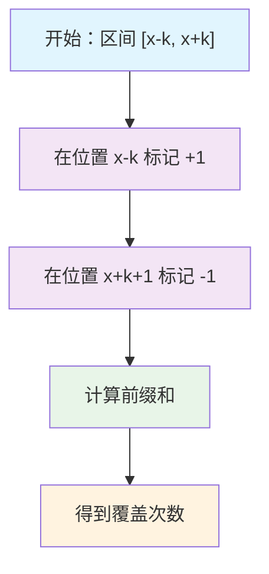
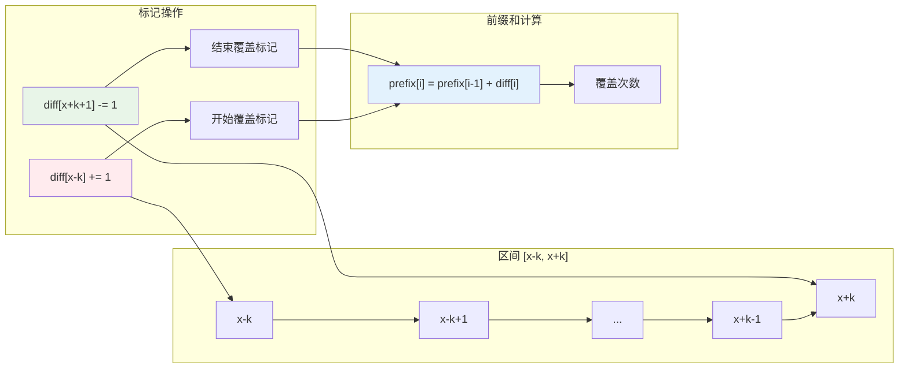

# 差分数组区间覆盖原理理论完全指南 - 从暴力枚举到 O(1) 标记的算法优化利器

## 📋 摘要

想掌握区间覆盖的 O(1) 优化理论？差分数组是关键！本指南揭秘标记原理的数学本质，教你从暴力枚举快速进阶为算法优化高手！

## 📚 目录导航

- [差分数组核心概念](#差分数组核心概念)
- [生活化比喻理解](#生活化比喻理解) 🎯 重要
- [区间覆盖标记原理](#区间覆盖标记原理)
- [数学原理深度解析](#数学原理深度解析)
- [应用场景理论分析](#应用场景理论分析)
- [算法设计思维](#算法设计思维)
- [学习路径建议](#学习路径建议)
- [理论总结](#理论总结)

## ⚠️ 重要说明

**关于理论学习**：本文档专注于差分数组区间覆盖的理论概念和设计思维，重点关注：

- **理论理解**：深入理解差分数组的数学原理和标记思想
- **掌握设计思维**：学会标记思维和优化思维
- **理解复杂度分析**：掌握时间复杂度和空间复杂度的权衡
- **培养算法直觉**：建立对算法优化的直觉和判断力

**学习建议**：
- ✅ **重点关注理论理解**：深入理解差分数组的数学本质
- ✅ **掌握设计思维**：学会标记和优化的设计思想
- ✅ **理解复杂度分析**：掌握性能分析的理论方法
- ✅ **培养算法直觉**：建立对算法优化的直觉判断

**建议**：学习时重点关注理论原理和设计思维，而非具体的代码实现。

## 🔍 差分数组核心概念

### 什么是差分数组？

差分数组（Difference Array）是一种用于高效处理区间更新操作的数据结构（Data Structure），通过记录相邻元素之间的差值，可以在 O(1) 时间复杂度内完成区间修改操作。

**核心思想**：将区间更新转化为两个端点的标记操作，用空间换取时间效率。

**生活化比喻**：想象一个停车场 🅿️
- **传统方法**：每次停车都要逐个检查每个车位（O(n) 时间复杂度）
- **差分数组优化**：在入口和出口设置标记，快速统计车位使用情况（O(1) 时间复杂度）

### 差分数组的理论特性

| 特性 | 暴力枚举 | 差分数组 |
|------|----------|----------|
| **区间更新时间** | O(n) | O(1) |
| **空间复杂度** | O(1) | O(n) |
| **适用场景** | 单次更新 | 多次更新 |
| **设计思想** | 直接修改 | 标记优化 |

### 差分数组的数学本质

差分数组是前缀和的逆运算，它记录了相邻元素之间的变化量。对于一个数组 A，其差分数组 D 定义为：

- **D[0] = A[0]**
- **D[i] = A[i] - A[i-1]** （i > 0）

通过差分数组，我们可以通过前缀和计算还原原始数组：
- **A[i] = A[i-1] + D[i]**

这种设计使得区间更新操作变得极其高效。

## 🎯 生活化比喻理解

### 比喻一：停车场车位管理系统 🅿️

**场景设定**：假设你管理一个停车场，需要统计不同时间段的车位使用情况

**传统方法的问题**：
- 每次统计都要逐个检查每个车位
- 统计第1-5号车位的使用情况需要检查5个车位
- 统计第6-10号车位的使用情况又要重新检查5个车位
- 重复检查导致效率低下

**差分数组优化方案**：
- 在停车场入口和出口设置计数器
- 车辆进入时在入口计数器+1，离开时在出口计数器-1
- 统计任意时间段只需查看两个计数器的差值
- 无论统计多少次，每次都是常数时间

**核心思想**：将重复检查转化为一次标记，后续统计直接使用标记结果。

### 比喻二：教室座位占用统计系统 🪑

**场景设定**：学校需要统计不同时间段教室座位的占用情况

**传统统计方法**：
- 每次统计都要逐个检查每个座位
- 统计第1-10排的占用情况需要检查10排座位
- 统计第11-20排的占用情况又要重新检查10排座位

**差分数组优化方案**：
- 在教室前门和后门设置占用标记
- 学生进入时在前门标记+1，离开时在后门标记-1
- 统计任意排数只需查看两个标记的差值
- 大幅提升统计效率

**设计思维**：标记 + 快速统计 = 高效系统

### 比喻三：图书馆借阅统计系统 📚

**场景设定**：图书馆需要统计不同时间段的图书借阅情况

**传统分析方法**：
- 每次分析都要重新统计借阅记录
- 分析第1-5天的借阅情况需要统计5天的记录
- 分析第6-10天的借阅情况又要重新统计5天的记录

**差分数组优化方案**：
- 预先在借阅开始和结束时间设置标记
- 借阅开始时在开始时间标记+1，归还时在结束时间标记-1
- 分析任意时间段只需一次减法运算
- 支持快速的多时间段对比分析

**优化价值**：从 O(n) 统计优化到 O(1) 统计，性能提升显著。

## ⚙️ 区间覆盖标记原理

### 核心标记公式

**目标**：标记区间 [x-k, x+k] 的覆盖次数

**标记操作**：
1. **diff[x-k] += 1**：在区间起点标记 +1
2. **diff[x+k+1] -= 1**：在区间终点+1标记 -1

### 标记原理详解

**差分数组标记原理**：

1. **diff[x-k] += 1：在区间起点标记 +1**
   - 表示从位置 x-k 开始，覆盖次数增加 1
   - 相当于在区间 [x-k, x+k] 的起点设置"开始覆盖"标记

2. **diff[x+k+1] -= 1：在区间终点+1标记 -1**
   - 表示从位置 x+k+1 开始，覆盖次数减少 1
   - 相当于在区间 [x-k, x+k] 的终点+1设置"结束覆盖"标记

3. **前缀和还原：通过前缀和计算得到实际覆盖次数**
   - 对差分数组进行前缀和计算
   - 前缀和数组的每个元素表示对应位置的覆盖次数

4. **数学原理**：
   - 区间 [x-k, x+k] 内的所有位置都会受到 +1 的影响
   - 区间 [x+k+1, ∞) 内的所有位置都会受到 -1 的影响
   - 两者抵消，只有区间 [x-k, x+k] 内的位置覆盖次数增加 1

### 前缀和还原过程

**前缀和计算过程**：
- **prefix_sum[0] = diff_array[0]**
- **prefix_sum[i] = prefix_sum[i-1] + diff_array[i]** （i > 0）

**覆盖情况分析**：
- 前缀和数组的每个元素表示对应位置的覆盖次数
- 通过前缀和计算，我们可以得到每个位置被覆盖的次数
- 这种方法利用了差分数组的特性，使得对多个区间的覆盖标记操作变得高效

## 📊 差分数组工作原理可视化

### 标记过程流程图



### 差分数组标记原理图



## 📐 数学原理深度解析

### 差分数组的数学定义

给定一个数组 A = [a₀, a₁, a₂, ..., aₙ₋₁]，其差分数组 D 定义为：

**D[i] = A[i] - A[i-1]** （i > 0）
**D[0] = A[0]**

### 区间覆盖的数学原理

**目标**：标记区间 [x-k, x+k] 的覆盖次数

**数学操作**：
1. **D[x-k] += 1**：在区间起点标记增量
2. **D[x+k+1] -= 1**：在区间终点+1标记减量

**数学推导**：
- 区间 [x-k, x+k] 内的所有位置都会受到 +1 的影响
- 区间 [x+k+1, ∞) 内的所有位置都会受到 -1 的影响
- 通过前缀和计算，只有区间 [x-k, x+k] 内的位置覆盖次数增加 1

### 前缀和还原的数学公式

**还原公式**：
```
A[i] = A[i-1] + D[i]
```

**覆盖次数计算**：
```
coverage[i] = Σ(D[j]) for j = 0 to i
```

### 数学性质分析

#### 1. 线性性（Linearity）
- 差分数组的标记操作具有线性性质
- 多个区间的标记可以叠加，结果等于各个区间标记的线性组合

#### 2. 可逆性（Reversibility）
- 给定差分数组 D，可以唯一确定原数组 A
- 通过前缀和计算可以完全还原原始数组

#### 3. 结合性（Associativity）
- 区间标记操作满足结合律
- 标记的顺序不影响最终结果

## 🎯 应用场景理论分析

### 场景一：学生座位占用统计 📚

**理论背景**：
- **问题特征**：需要统计不同时间段教室座位的占用情况
- **传统方法**：每次统计都要逐个检查每个座位
- **差分数组优化**：通过标记进入和离开时间，支持 O(1) 统计

**理论优势**：
- **时间复杂度**：从 O(n) 优化到 O(1)
- **统计效率**：支持实时座位占用统计
- **扩展性**：易于扩展到多教室、多时间段统计

**理论价值**：
- 为学校管理系统提供高效工具
- 支持实时座位监控和预警
- 提升教室资源利用效率

### 场景二：网络流量监控 📊

**理论背景**：
- **问题特征**：需要监控不同时间段的网络流量
- **传统方法**：每次监控都要重新统计流量数据
- **差分数组优化**：通过标记流量开始和结束时间，支持快速统计

**理论优势**：
- **监控效率**：大幅提升网络流量监控速度
- **算法优化**：为流量分析、预警等算法提供基础
- **实时性**：支持实时网络流量监控

**理论价值**：
- 为网络管理系统提供高效算法基础
- 支持实时流量分析和预警
- 提升网络监控系统的性能

### 场景三：区间覆盖问题 🎯

**理论背景**：
- **问题特征**：需要计算多个区间对某个范围的覆盖情况
- **传统方法**：每次计算都要重新遍历所有区间
- **差分数组优化**：通过标记区间起点和终点，支持 O(1) 覆盖计算

**理论优势**：
- **计算效率**：将 O(n) 计算优化到 O(1)
- **整体复杂度**：显著降低区间覆盖算法的时间复杂度
- **算法设计**：为复杂区间问题提供优化思路

**理论价值**：
- 为区间覆盖算法提供优化工具
- 支持更复杂的区间问题求解
- 提升算法竞赛和实际应用的性能

## 🧠 算法设计思维

### 标记思维（Marking Thinking）

**核心思想**：将区间更新转化为两个端点的标记操作，通过标记记录变化量。

**设计原则**：
1. **识别区间操作**：找出问题中的区间更新模式
2. **设计标记方案**：设计高效的标记策略
3. **权衡标记成本**：考虑标记的时间空间成本

**应用场景**：
- 多次区间更新相同类型的问题
- 需要频繁计算区间覆盖的问题
- 状态转移中有重复计算的问题

### 问题转换思维（Problem Transformation）

**核心思想**：将复杂问题转化为简单的差分数组问题。

**转换策略**：
1. **问题抽象**：将实际问题抽象为数学问题
2. **模型建立**：建立差分数组数学模型
3. **公式应用**：应用差分数组公式求解

**转换示例**：
- 区间覆盖问题 → 差分数组标记
- 动态规划优化 → 差分数组状态转移
- 时间序列分析 → 差分数组变化量计算

### 优化思维（Optimization Thinking）

**核心思想**：从时间和空间两个维度进行算法优化。

**优化层次**：
1. **时间复杂度优化**：从 O(n) 优化到 O(1)
2. **空间复杂度权衡**：用空间换时间
3. **整体性能平衡**：在时间和空间之间找到平衡点

**优化策略**：
- **空间换时间**：使用额外存储空间换取时间效率
- **预处理优化**：将在线计算转化为离线预处理
- **查询优化**：将复杂查询转化为简单运算

## 🛤️ 学习路径建议

### 小白（零基础）
1. **理论理解**：理解差分数组的基本概念和数学原理
2. **生活化比喻**：通过停车场等比喻理解差分数组思想
3. **简单应用**：理解差分数组在简单场景中的应用

### 初级（入门不久）
1. **数学原理**：掌握差分数组的数学定义和公式推导
2. **复杂度分析**：理解时间复杂度和空间复杂度的权衡
3. **应用场景**：了解差分数组在不同领域的应用价值

### 中级（入门一段时间）
1. **设计思维**：掌握标记思维和优化思维
2. **复杂应用**：理解差分数组在复杂问题中的优化作用
3. **理论分析**：能够分析算法的理论优势和局限性

### 高级（资深开发者）
1. **创新思维**：能够设计新的差分数组优化方案
2. **系统设计**：考虑大规模系统中的差分数组应用
3. **理论创新**：在差分数组理论基础上进行创新和扩展

## 💡 理论总结

### 核心理论要点

#### 1. 数学基础
- **严格定义**：D[i] = A[i] - A[i-1]
- **核心公式**：区间标记 = diff[x-k] += 1, diff[x+k+1] -= 1
- **数学性质**：线性性、可逆性、结合性

#### 2. 复杂度分析
- **时间复杂度**：标记 O(1)，前缀和 O(n)
- **空间复杂度**：O(n) 额外存储空间
- **性能权衡**：空间换时间的经典案例

#### 3. 设计思想
- **标记思维**：将区间更新转化为两个端点的标记操作
- **问题转换**：将复杂问题转化为简单的差分数组问题
- **优化思维**：从 O(n) 更新优化到 O(1) 更新

### 理论价值

#### 1. 算法价值
- **优化思想**：为算法优化提供重要思路
- **复杂度权衡**：展示时间和空间的权衡艺术
- **问题建模**：为复杂问题提供简化建模方法

#### 2. 实践价值
- **系统优化**：为系统性能优化提供理论基础
- **算法设计**：为算法设计提供重要的设计模式
- **问题解决**：为实际问题提供高效的解决方案

### 学习建议

#### 1. 理论学习
- **数学基础**：扎实掌握数学定义和公式推导
- **复杂度分析**：深入理解时间复杂度和空间复杂度
- **设计思维**：培养标记和优化的设计思维

#### 2. 实践应用
- **场景识别**：学会识别适合差分数组的应用场景
- **问题转换**：掌握将复杂问题转化为差分数组问题的方法
- **优化策略**：学会在不同场景下选择合适的优化策略

## 🎉 总结

差分数组是解决区间更新问题的高效工具，它通过标记区间起点和终点+1，将区间更新时间复杂度从 O(n) 优化到 O(1)。掌握差分数组不仅能提高算法效率，更能培养标记思维和优化思维，为学习更复杂的算法打下坚实基础。

记住，每一个优秀的算法工程师都是从理解基础算法开始的。差分数组就像是你算法工具箱中的瑞士军刀 🛠️，简单、高效、实用。继续探索，继续学习，你一定能成为算法优化的高手！

---

**厦门工学院人工智能创作坊 -- 郑恩赐**  
**2025 年 10 月 23 日**
