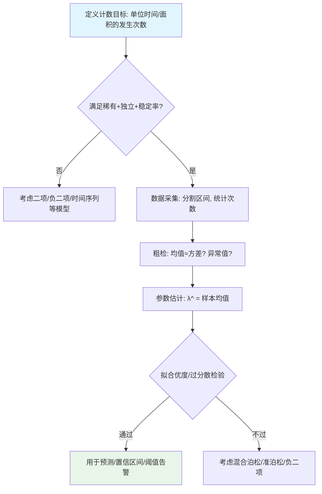

# 泊松分布完全指南-从生活例子到参数估计与应用

摘要：用生活化例子讲清泊松分布与参数 λ 的含义、何时使用、如何估计与检验，并配建模流程图与常见误区，助你快速上手与落地应用。

---

## 泊松分布（Poisson distribution，泊松分布）是什么
- 用于刻画“单位时间/单位面积/单位长度”内**稀有且独立**事件发生次数的离散分布。
- 参数：λ（rate，发生率/强度），含义是单位区间内事件的平均发生次数。
- 概率质量函数（PMF）：`P(X = k) = e^{-λ} · λ^k / k!`，`k = 0,1,2,...`
- 期望与方差：`E[X] = λ`，`Var(X) = λ`。

符号说明（Notation）
- `X`：随机变量（单位区间内事件发生的“次数”）。
- `k`：非负整数，表示具体的次数取值（0,1,2,...）。
- `λ`（lambda，拉姆达）：发生率/强度，单位区间的平均发生次数。
- `e`：自然常数，约等于 2.71828。
- `P(·)`：概率（probability）。
- `E[X]`：期望/平均值（expectation）。
- `Var(X)`：方差（variance）。
- `~`：读作“服从”（distributed as），例如 `X ~ Bin(n, p)` 表示“X 服从二项分布”。
- `Bin(n, p)`：二项分布（Binomial distribution，二项分布），表示 `n` 次相互独立、单次成功概率为 `p` 的试验中“成功次数”的分布。
- 关联符号：`n`（试验次数）、`p`（单次成功概率），二项分布近似时使用。

---

## 为什么是这个公式（来源与直观推导）
> 目标：解释 `P(X = k) = e^{-λ} · λ^k / k!` 从哪里来，让非数学背景也能理解。

路径一：来自二项分布的“稀有事件极限”
1) 把单位时间切成很多很小的等份：`n` 份；每一份内“发生一次”的概率很小，记为 `p`。
2) 一整个单位时间内发生 `k` 次的概率可近似看作：`X ~ Bin(n, p)`（每小份独立地“发生/不发生”）。
3) 设总平均次数固定为 `λ`，令 `n` 很大、`p` 很小，且 `n·p = λ`（保持总期望不变）。
4) 二项分布的概率：`P(X = k) = C(n,k) · p^k · (1-p)^{n-k}`。

一步一步到极限（代入与拆分）：
- 令 `p = λ/n`，代入得到：
  `P(X = k) = C(n,k) · (λ/n)^k · (1 - λ/n)^{n-k}`。
- 化简组合数并显式展开：
  `C(n,k) = n! / (k! · (n-k)!) = [n · (n-1) · ... · (n-k+1)] / k!`。
  因而
  `C(n,k) · (λ/n)^k = ([n · (n-1) · ... · (n-k+1)] / k!) · (λ^k / n^k)`。
- 将 `(1 - λ/n)^{n-k}` 拆成两部分：
  `(1 - λ/n)^{n-k} = (1 - λ/n)^{n} · (1 - λ/n)^{-k}`。
- 于是整体写成四个因子之积：
  `P(X = k) = [n(n-1)...(n-k+1)/n^k] · [λ^k/k!] · (1 - λ/n)^{n} · (1 - λ/n)^{-k}`。

逐因子取极限（`n → ∞`）：
- 因子 A：`A_n = n(n-1)...(n-k+1)/n^k`
  = `(n/n) · ((n-1)/n) · ... · ((n-k+1)/n)`
  = `1 · (1 - 1/n) · (1 - 2/n) · ... · (1 - (k-1)/n)`。
  固定任意有限 `k` 时，每一项 `(1 - j/n) → 1`，故乘积 `A_n → 1`。
- 因子 B：`B_n = λ^k/k!` 与 `n` 无关，极限即自身。
- 因子 C：`C_n = (1 - λ/n)^{n}`。
  设 `x_n = λ/n`，当 `n → ∞` 时 `x_n → 0`，有经典极限 `lim_{m→∞} (1 - x_m)^{1/x_m} = e^{-1}`，从而
  `(1 - λ/n)^{n} = [(1 - λ/n)^{n/(λ)}]^{λ} → e^{-λ}`。
  若需更细：取对数 `ln(1 - λ/n) = -λ/n + O(1/n^2)`，则 `n · ln(1 - λ/n) → -λ`，指数即 `e^{-λ}`。
- 因子 D：`D_n = (1 - λ/n)^{-k}`。固定有限 `k` 时，底数 `→ 1`，故 `D_n → 1`。

综合四个因子：`P(X = k) → 1 · (λ^k/k!) · e^{-λ} · 1 = e^{-λ} · λ^k / k!`（得证）。

推导步骤可视化（Mermaid）
```mermaid
graph TD
    S0[起点: P(X=k)=C(n,k)p^k(1-p)^{n-k}] --> S1[代入 p=λ/n]
    S1 --> S2[展开 C(n,k)=n(n-1)...(n-k+1)/k!]
    S2 --> S3[写成四因子: A·B·C·D]
    S3 --> S3A[A_n=n(n-1).../n^k]
    S3 --> S3B[B_n=λ^k/k!]
    S3 --> S3C[C_n=(1-λ/n)^n]
    S3 --> S3D[D_n=(1-λ/n)^{-k}]
    S3A --> L1[极限 A_n→1]
    S3B --> L2[极限 B_n→λ^k/k!]
    S3C --> L3[极限 C_n→e^{-λ}]
    S3D --> L4[极限 D_n→1]
    L1 --> R[合并极限]
    L2 --> R
    L3 --> R
    L4 --> R
    R --> END[结论: e^{-λ}·λ^k/k!]
    style S0 fill:#e1f5fe
    style END fill:#e8f5e9
```

直观理解：把一个小时切成很多“极短”的瞬间，每个瞬间“来一次电话”的概率很小、彼此独立，整小时内来电总次数就服从泊松分布。

路径二：来自“泊松过程”的三条小假设
假设（对单位时间 t=1）：
- 极小时间段 `Δt` 内：`P(1 次) ≈ λ · Δt`（与长度成正比）、`P(≥2 次) = o(Δt)`（几乎不可能多次）。
- 不重叠小段之间相互独立。

推出（略去微分方程细节，给出关键结论）：
1) 恰好 0 次的概率满足：`P0'(t) = -λ · P0(t)`，解得：`P0(t) = e^{-λt}`。
2) 用递推可得：`Pk(t) = e^{-λt} · (λt)^k / k!`。取 `t=1`，得到：
   - `P(X = k) = e^{-λ} · λ^k / k!`。

直观理解：在足够小的时间片里，几乎只会发生 0 次或 1 次；把很多小时间片独立“拼接”起来，总次数满足上式。

---

## 何时使用（判定条件）
- 事件彼此**独立**，且发生概率**很小**（稀有）；
- 在单位区间内的发生率**稳定**（stationary rate）；
- 同一区间内**不同时发生**（同一瞬间多发概率可以忽略）。

与二项分布（Binomial distribution，二项分布）的联系：
- 当试验次数 `n` 很大、单次概率 `p` 很小且 `n·p = λ` 固定时，`Bin(n,p) ≈ Pois(λ)`。

---

## 建模与应用流程（Mermaid）


---

## 参数估计与区间
- 极大似然估计（MLE）：`λ_hat = 样本均值 = mean(x)`。
- 近似置信区间（样本量较大时）：`λ_hat ± z_{α/2} · sqrt(λ_hat / n)`。
- 精确区间（基于卡方，略）：若总计数 `y = Σx_i`，可参考 NIST/Stats 文档给出卡方法区间。

---

## 预测与区间计算
- 单个区间发生 `k` 次的概率：`P(X = k) = e^{-λ} · λ^k / k!`。
- 至少一次：`P(X ≥ 1) = 1 - e^{-λ}`。
- 多个独立区间合并：`X1 + X2 ~ Pois(λ1 + λ2)`。

---

## 常见误区与对策
- 误区：均值≈方差就一定是泊松。
  - 对策：做拟合优度检验；若方差明显 > 均值（过分散），考虑准泊松/负二项（Negative binomial，负二项分布）。
- 误区：泊松过程（Poisson process，泊松过程）到处成立。
  - 对策：检查“独立同分布”和“稳定率”假设；若存在季节性/趋势，用非齐次泊松或时间序列。
- 误区：把到达“间隔时间”也当泊松。
  - 对策：到达间隔服从指数分布（Exponential，指数分布），与泊松过程互为补充。

---

## 典型业务场景
- 可靠性：单位时间故障数、MTBF（平均无故障时间）评估。
- 运维告警：一分钟内错误数 ≥ 阈值的概率，动态阈值告警。
- 医疗急诊：小时到诊数预测与排班。
- 运营营销：每日用户投诉数、工单生成量的预测。

---

## 计算小抄（便签式）
- 估计：`λ_hat = mean(x)`。
- 概率：`P(X = k) = e^{-λ} · λ^k / k!`。
- 至少一次：`1 - e^{-λ}`。
- 两区间合并：`λ_total = λ1 + λ2`。
- 判断：均值≈方差 + 拟合优度检验。

---

## FAQ
- Q：样本不多也能用吗？
  - A：可以，但区间估计更不确定；尽量汇总更多区间，或用贝叶斯法加入先验。
- Q：过分散怎么办？
  - A：考虑准泊松或负二项；检查是否存在隐含分层/聚集性。
- Q：如何做拟合优度检验？
  - A：可用卡方拟合优度检验，将计数分组比较“观测频数 vs 理论频数”。

---

## 参考链接（可点击）
- 综合入门：
  - [Wikipedia · Poisson distribution](https://en.wikipedia.org/wiki/Poisson_distribution)
  - [Khan Academy · Poisson](https://www.khanacademy.org/math/statistics-probability/probability-library)
- 工程与统计指南：
  - [NIST/SEMATECH Handbook · Poisson](https://www.itl.nist.gov/div898/handbook/pmc/section3/pmc331.htm)
  - [Statlect · Poisson distribution](https://www.statlect.com/probability-distributions/poisson-distribution)
- Python 实用：
  - [SciPy stats · poisson](https://docs.scipy.org/doc/scipy/reference/generated/scipy.stats.poisson.html)

---

厦门工学院人工智能创作坊 -- 郑恩赐  
2025 年 10 月 30 日
