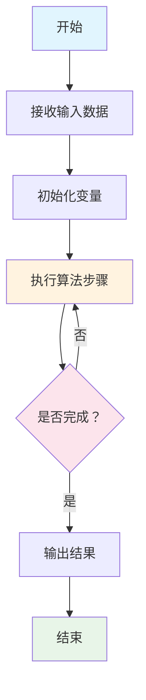

# 算法解密宝典 - 从菜鸟到高手的编程进阶之路

## 📋 摘要

想成为编程高手？算法是关键！本宝典揭秘算法核心奥秘，教你一眼识别好算法与坏算法，掌握复杂度分析技巧，从编程菜鸟快速进阶为算法高手！

## 📚 目录导航

- [算法基础概念](#算法基础概念)
- [重要认知：每一行代码都是算法的一部分](#重要认知每一行代码都是算法的一部分)
- [算法的五大特性](#算法的五大特性)
- [好算法 vs 坏算法](#好算法-vs-坏算法)
- [游戏中的算法对比：王者荣耀 vs 和平精英](#游戏中的算法对比王者荣耀-vs-和平精英)
- [生活中的算法：导航系统](#生活中的算法导航系统)
- [生活中的算法：短视频推荐](#生活中的算法短视频推荐)
- [算法复杂度分析](#算法复杂度分析)
- [常见问题预警](#常见问题预警)
- [学习路径建议](#学习路径建议)
- [最佳实践总结](#最佳实践总结)

---

## 🔄 算法执行流程图



---

## 🔍 算法基础概念

### 什么是算法（Algorithm）？

算法就像**烹饪食谱**一样，是一套明确的步骤说明。当你按照食谱的步骤操作时，就能做出美味的菜肴。同样，算法告诉计算机如何一步步解决问题。

**生活化比喻**：
- **算法** = 烹饪食谱
- **输入** = 食材（数据）
- **处理步骤** = 烹饪过程（计算）
- **输出** = 美味菜肴（结果）

### 算法的核心价值

1. **提高效率**：用更少的时间和资源完成任务
2. **保证正确性**：确保结果准确无误
3. **可重复使用**：一次设计，多次应用
4. **便于维护**：清晰的逻辑结构，易于修改

### 💎 重要认知：每一行代码都是算法的一部分

**核心观点**：每一行代码都很重要，因为它们都是算法的重要组成部分！

#### 🔍 深度理解

**算法与代码的关系**：
- **算法** = 解决问题的**完整思路**（如烹饪食谱）
- **代码** = 算法的**具体实现**（如具体的烹饪动作）
- **每一行代码** = 算法的一个**关键步骤**（如食谱中的每个步骤）

#### 📝 具体例子

**简单赋值**：
```python
x = 5  # 这是算法的一部分：数据初始化
```

**条件判断**：
```python
if x > 0:  # 这是算法的一部分：条件判断步骤
    print("正数")
```

**循环操作**：
```python
for i in range(10):  # 这是算法的一部分：重复执行步骤
    print(i)
```

#### ⚠️ 为什么每一行代码都很重要？

1. **整体性**：每一行代码都是算法整体的一部分
2. **逻辑性**：每行代码都有其特定的逻辑作用
3. **效率性**：每行代码都影响算法的执行效率
4. **正确性**：每行代码的错误都可能导致算法失败

#### 🎯 实际意义

- **重视代码质量**：每一行代码都要精心编写
- **理解代码作用**：明白每行代码在算法中的具体作用
- **优化代码性能**：从每一行代码开始优化算法
- **培养算法思维**：将每行代码都视为算法的一部分

**记住**：优秀的程序员不仅会写代码，更会理解每一行代码在算法中的重要作用！ 🚀

---

## ⭐ 算法的五大特性

### 1. 输入（Input）
- **定义**：算法需要的数据
- **特点**：可以有零个或多个输入
- **示例**：排序算法需要待排序的数组

### 2. 输出（Output）
- **定义**：算法产生的结果
- **特点**：至少有一个输出
- **示例**：排序后的数组

### 3. 有穷性（Finiteness）
- **定义**：算法必须在有限步骤内结束
- **重要性**：避免无限循环
- **示例**：查找算法必须能找到目标或确认不存在

### 4. 确定性（Definiteness）
- **定义**：每个步骤都有明确的含义
- **特点**：不存在歧义
- **示例**：比较操作的结果只能是大于、小于或等于

### 5. 可行性（Effectiveness）
- **定义**：每个步骤都是可执行的
- **要求**：在有限时间内完成
- **示例**：基本的算术运算

---

## 🆚 好算法 vs 坏算法

### 好算法的特征

#### 🚀 高效性（Efficiency）
- **时间复杂度低**：执行速度快
- **空间复杂度低**：占用内存少
- **实际表现**：处理大数据时依然快速

#### 🔧 可扩展性（Scalability）
- **适应性强**：能处理不同规模的问题
- **性能稳定**：数据量增加时性能不会急剧下降
- **实际应用**：从 100 条记录到 100 万条记录都能高效处理

#### 🛡️ 鲁棒性（Robustness）
- **异常处理**：能处理各种边界情况
- **错误容忍**：输入异常时不会崩溃
- **实际表现**：空数组、负数、超大数值等都能正确处理

#### 📖 可维护性（Maintainability）
- **逻辑清晰**：代码结构清晰易懂
- **易于修改**：需求变化时容易调整
- **团队协作**：其他开发者容易理解和维护

### 坏算法的特征

#### 🐌 低效性
- **执行缓慢**：处理小数据都很慢
- **资源浪费**：占用大量内存和 CPU
- **实际影响**：用户体验差，系统响应慢

#### 📉 不可扩展
- **性能急剧下降**：数据量增加时变得极慢
- **内存溢出**：处理大数据时程序崩溃
- **实际后果**：无法处理实际业务需求

#### 💥 脆弱性
- **容易出错**：边界情况处理不当
- **不稳定**：相同输入可能产生不同结果
- **实际风险**：生产环境频繁出错

#### 🔀 难以维护
- **逻辑混乱**：代码结构不清晰
- **修改困难**：小改动可能引发大问题
- **团队负担**：增加开发和维护成本

### 🎮 游戏中的算法对比：王者荣耀 vs 和平精英

#### 王者荣耀：匹配算法的重要性

**坏算法的影响**：
- **匹配时间过长**：等待 5-10 分钟才能开始游戏
- **实力差距巨大**：钻石玩家匹配到青铜玩家
- **游戏体验极差**：一边倒的碾压局，毫无乐趣
- **玩家流失严重**：因为匹配问题而卸载游戏

**好算法的效果**：
- **快速匹配**：30 秒内找到合适的队友和对手
- **实力均衡**：同段位玩家之间的精彩对决
- **游戏体验佳**：势均力敌的激烈战斗
- **玩家粘性高**：因为良好的匹配体验而持续游戏

#### 和平精英：子弹轨迹计算算法

**坏算法的影响**：
- **子弹穿墙**：子弹能够穿过墙壁击中敌人
- **命中判定错误**：明明瞄准了却打不中，没瞄准却意外命中
- **轨迹计算延迟**：子弹飞行轨迹显示延迟，影响射击体验
- **物理效果异常**：子弹重力、风速影响计算错误

**好算法的效果**：
- **真实物理**：子弹严格按照物理规律飞行
- **精确判定**：命中判定准确无误，公平竞技
- **实时计算**：子弹轨迹实时计算，无延迟显示
- **沉浸体验**：真实的弹道物理效果，增强代入感

#### 💡 游戏算法的重要性

**为什么游戏算法如此重要？**

1. **直接影响用户体验**：算法好坏直接决定玩家是否愿意继续游戏
2. **影响游戏平衡性**：匹配算法影响游戏的公平性和趣味性
3. **决定游戏性能**：优化算法能够支持更多玩家同时在线
4. **影响商业成功**：好的算法带来更好的用户留存和收入

**记住**：每一款成功的游戏背后，都有优秀的算法在支撑！ 🎮

### 🚗 生活中的算法：导航系统

#### 高德地图：路径规划算法

**坏算法的影响**：
- **绕路严重**：明明有近路却要走远路，多花 30 分钟
- **实时性差**：不知道前方堵车，继续走拥堵路段
- **计算错误**：预估时间不准确，相差 1 小时以上
- **用户体验差**：频繁重新规划路线，导航混乱

**好算法的效果**：
- **最优路径**：自动选择最快、最短的路线
- **实时更新**：根据交通状况动态调整路线
- **准确预估**：到达时间误差在 5 分钟以内
- **智能导航**：语音提示清晰，操作简单

### 📱 生活中的算法：短视频推荐

#### 抖音：全球顶尖推荐算法

**坏算法的影响**：
- **推荐无关内容**：总是推送不感兴趣的视频
- **重复内容过多**：同一个视频反复出现
- **个性化差**：无法理解用户喜好
- **用户流失**：因为内容质量差而卸载应用

**好算法的效果**：
- **精准推荐**：根据用户行为精准推送感兴趣内容
- **内容多样**：避免重复，保持内容新鲜度
- **个性化强**：深度理解用户兴趣和偏好
- **用户粘性高**：因为优质内容而持续使用

**抖音算法的核心优势**：
- **多维度分析**：观看时长、点赞、评论、分享、关注等
- **实时学习**：根据用户实时行为调整推荐策略
- **深度学习**：使用先进的机器学习技术
- **全球领先**：在全球短视频平台中算法水平顶尖

#### 🎯 算法对比总结

| 应用领域 | 坏算法后果 | 好算法效果 | 用户体验差异 |
|----------|------------|------------|--------------|
| **游戏匹配** | 等待时间长、实力不均 | 快速匹配、实力均衡 | 从痛苦等待到即时享受 |
| **物理计算** | 子弹穿墙、判定错误 | 真实物理、精确判定 | 从虚假到真实体验 |
| **路径规划** | 绕路严重、时间不准 | 最优路径、准确预估 | 从迷路到精准导航 |
| **推荐系统** | 推荐无关内容、重复过多 | 精准推荐、个性化强 | 从垃圾信息到有用内容 |

---

## 📊 算法复杂度分析：判断算法好坏的核心标准

### 🎯 为什么复杂度分析如此重要？

**核心观点**：算法好坏主要看时间和空间复杂度！复杂度越低，算法越好！

#### 🔍 复杂度分析的意义

1. **性能预测**：预测算法在不同数据规模下的表现
2. **算法选择**：帮助选择最适合的算法
3. **优化指导**：指导算法优化方向
4. **资源规划**：预估系统资源需求

### ⏰ 时间复杂度（Time Complexity）

时间复杂度描述算法执行时间随输入规模增长的趋势。

#### 📈 时间复杂度增长趋势图

```
输入规模(n) → 执行时间
O(1)        → 恒定不变
O(log n)    → 缓慢增长
O(n)        → 线性增长
O(n log n)  → 较快增长
O(n²)       → 快速增长
O(2ⁿ)       → 爆炸式增长
```

#### 🔢 常见复杂度类型详解

| 复杂度 | 表示法 | 描述 | 示例算法 | 性能评价 |
|--------|--------|------|----------|----------|
| **常数时间** | O(1) | 执行时间固定，与输入规模无关 | 数组索引访问、哈希表查找 | ⭐⭐⭐⭐⭐ 极优 |
| **对数时间** | O(log n) | 执行时间随输入对数增长 | 二分查找、平衡树操作 | ⭐⭐⭐⭐ 优秀 |
| **线性时间** | O(n) | 执行时间与输入成正比 | 线性搜索、数组遍历 | ⭐⭐⭐ 良好 |
| **线性对数时间** | O(n log n) | 介于线性和平方之间 | 快速排序、归并排序 | ⭐⭐ 一般 |
| **平方时间** | O(n²) | 执行时间与输入平方成正比 | 冒泡排序、选择排序 | ⭐ 较差 |
| **指数时间** | O(2ⁿ) | 执行时间呈指数增长 | 暴力破解、递归斐波那契 | ❌ 极差 |

#### 💡 时间复杂度实际影响

**数据规模对比**（假设每秒处理 1000 次操作）：

| 复杂度 | n=10 | n=100 | n=1000 | n=10000 |
|--------|------|-------|--------|---------|
| O(1) | 0.001秒 | 0.001秒 | 0.001秒 | 0.001秒 |
| O(log n) | 0.003秒 | 0.007秒 | 0.010秒 | 0.013秒 |
| O(n) | 0.010秒 | 0.100秒 | 1.000秒 | 10.000秒 |
| O(n log n) | 0.033秒 | 0.664秒 | 9.966秒 | 132.877秒 |
| O(n²) | 0.100秒 | 10.000秒 | 16.667分钟 | 27.778小时 |
| O(2ⁿ) | 1.024秒 | 4.02×10²⁷年 | 无法计算 | 无法计算 |

### 💾 空间复杂度（Space Complexity）

空间复杂度描述算法运行过程中所需的内存空间。

#### 🏠 空间复杂度类型详解

| 复杂度 | 描述 | 示例 | 内存使用评价 |
|--------|------|------|-------------|
| **O(1)** | 固定空间，与输入规模无关 | 变量交换、简单计算 | ⭐⭐⭐⭐⭐ 极优 |
| **O(log n)** | 对数空间，随输入对数增长 | 递归深度、树的高度 | ⭐⭐⭐⭐ 优秀 |
| **O(n)** | 线性空间，与输入成正比 | 数组复制、列表存储 | ⭐⭐⭐ 良好 |
| **O(n log n)** | 线性对数空间 | 归并排序的辅助数组 | ⭐⭐ 一般 |
| **O(n²)** | 平方空间，与输入平方成正比 | 二维数组、邻接矩阵 | ⭐ 较差 |
| **O(2ⁿ)** | 指数空间 | 递归树的完整存储 | ❌ 极差 |

#### 💡 空间复杂度实际影响

**内存使用对比**（假设每个元素占用 1KB）：

| 复杂度 | n=1000 | n=10000 | n=100000 |
|--------|--------|---------|----------|
| O(1) | 1KB | 1KB | 1KB |
| O(log n) | 10KB | 13KB | 17KB |
| O(n) | 1MB | 10MB | 100MB |
| O(n log n) | 10MB | 130MB | 1.7GB |
| O(n²) | 1GB | 100GB | 10TB |

### 🏆 算法好坏判断标准

#### ✅ 好算法的特征

1. **时间复杂度低**：O(1) > O(log n) > O(n) > O(n log n) > O(n²) > O(2ⁿ)
2. **空间复杂度低**：尽量使用 O(1) 或 O(n) 空间
3. **可扩展性强**：数据规模增加时性能不会急剧下降
4. **实际可用**：在合理时间内完成计算

#### ❌ 坏算法的特征

1. **时间复杂度高**：O(n²) 及以上通常不可接受
2. **空间复杂度高**：占用过多内存资源
3. **不可扩展**：数据规模增加时性能急剧下降
4. **实际不可用**：计算时间过长或内存不足

#### 🎯 复杂度选择建议

| 数据规模 | 推荐时间复杂度 | 推荐空间复杂度 | 说明 |
|----------|----------------|----------------|------|
| **小规模** (< 100) | O(n²) 可接受 | O(n) 可接受 | 简单算法即可 |
| **中等规模** (100-10000) | O(n log n) 最佳 | O(n) 最佳 | 需要高效算法 |
| **大规模** (> 10000) | O(n) 或 O(log n) | O(1) 或 O(log n) | 必须优化算法 |

### 💡 复杂度分析的重要性

**记住**：复杂度分析是判断算法好坏的核心标准！一个好的算法必须同时考虑时间复杂度和空间复杂度，在保证功能正确的前提下，选择复杂度最低的算法！

---


## ⚠️ 常见问题预警

### 问题一：忽视算法复杂度
**错误做法**：
- 只关注功能实现，不考虑性能
- 使用简单但低效的算法

**正确做法**：
- 分析问题规模，选择合适的算法
- 考虑时间复杂度和空间复杂度

### 问题二：过度优化
**错误做法**：
- 为了微小的性能提升增加代码复杂度
- 过早优化，影响代码可读性

**正确做法**：
- 先保证正确性，再考虑优化
- 在性能瓶颈处进行针对性优化

### 问题三：忽略边界情况
**错误做法**：
- 只考虑正常输入情况
- 不处理空数组、负数等异常情况

**正确做法**：
- 充分考虑各种边界情况
- 添加必要的输入验证和异常处理

### 问题四：算法选择不当
**错误做法**：
- 对所有问题使用相同的算法
- 不了解不同算法的适用场景

**正确做法**：
- 根据问题特点选择合适的算法
- 了解各种算法的优缺点和适用场景

---

## 🛤️ 学习路径建议

### 小白（零基础）
1. **理解基本概念**：什么是算法，为什么重要
2. **学习简单算法**：排序、搜索等基础算法
3. **掌握复杂度概念**：理解时间和空间复杂度
4. **实践练习**：用编程语言实现简单算法

### 初级（入门不久）
1. **深入学习排序算法**：冒泡、选择、插入、快速排序
2. **掌握搜索算法**：线性搜索、二分搜索
3. **学习数据结构**：数组、链表、栈、队列
4. **算法设计思维**：分治法、贪心法

### 中级（入门一段时间）
1. **高级排序算法**：归并排序、堆排序
2. **图算法**：深度优先搜索、广度优先搜索
3. **动态规划**：背包问题、最长公共子序列
4. **算法优化技巧**：空间换时间、预处理

### 高级（资深开发者）
1. **复杂算法**：最短路径、最小生成树
2. **算法分析**：平摊分析、概率分析
3. **并行算法**：多线程、分布式算法
4. **算法创新**：设计新算法，解决实际问题

---

## 💡 最佳实践总结

### 算法设计原则
1. **正确性优先**：确保算法能正确解决问题
2. **效率考虑**：在正确的基础上追求高效
3. **简洁明了**：保持代码清晰易懂
4. **可维护性**：便于后续修改和扩展

### 性能优化建议
1. **选择合适的算法**：根据问题特点选择最优算法
2. **避免重复计算**：使用缓存或记忆化技术
3. **空间换时间**：在内存充足时使用额外空间提高速度
4. **并行处理**：利用多核 CPU 提高处理速度

### 代码质量保证
1. **充分测试**：包括正常情况和边界情况
2. **文档注释**：详细说明算法思路和实现细节
3. **代码审查**：团队协作，互相检查代码质量
4. **持续优化**：根据实际使用情况不断改进

---

## 🎉 总结

算法是程序设计的核心，掌握好算法与坏算法的区别，能够帮助我们：

- **提高程序效率**：选择合适算法，显著提升性能
- **保证代码质量**：编写健壮、可维护的代码
- **解决实际问题**：用算法思维解决复杂业务问题
- **提升职业竞争力**：成为更优秀的开发者

记住，**好的算法不仅仅是技术实现，更是一种解决问题的思维方式**。从理解基础概念开始，逐步掌握算法设计技巧，你就能在编程道路上越走越远！

**加油，未来的算法大师！** 🚀

---

**厦门工学院人工智能创作坊 -- 郑恩赐**  
**2025 年 10 月 22 日**
