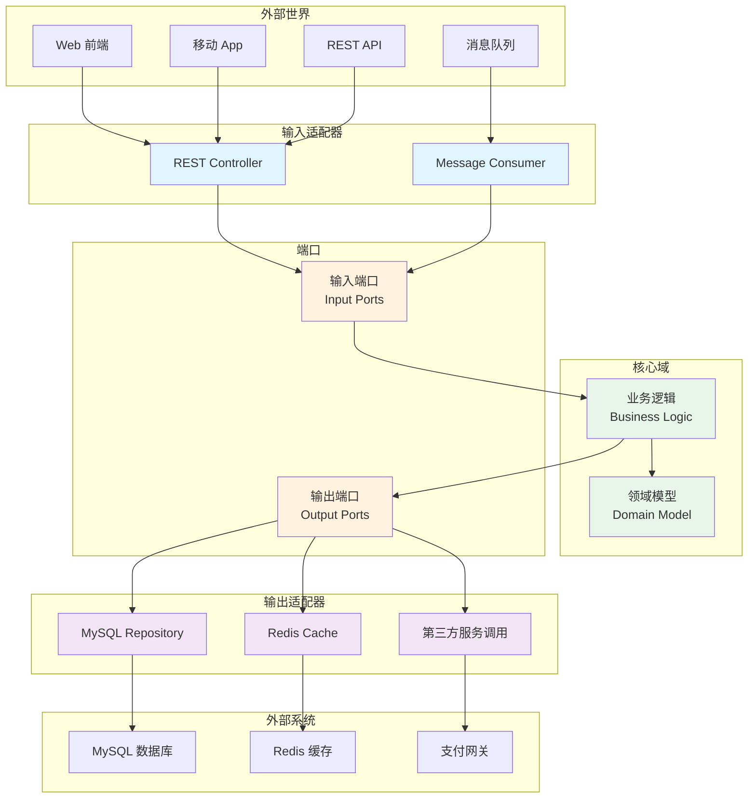

# 阿里巴巴六边形架构-从解耦到可测试的架构设计利器

摘要：如何构建灵活可测试的系统架构？六边形架构（Hexagonal Architecture）通过端口与适配器模式，将核心业务逻辑与外部接口解耦。解析核心思想与实践方法，助你构建高内聚低耦合的企业级系统。

---

## 六边形架构（Hexagonal Architecture）是什么

**生活化比喻**：想象你的房子（核心业务逻辑）有多个门（端口 Ports），每个门外面都有不同的通道（适配器 Adapters）连接外界。无论是快递员（API 接口）、水管工（数据库）、还是邻居（第三方服务），都必须通过这些通道进入你的房子，而你的房子内部结构（业务逻辑）完全不受外部影响。

- **专业定义**：六边形架构，又称**端口与适配器架构（Ports and Adapters Architecture）**，由 Alistair Cockburn 于 2005 年提出。它将应用程序的核心业务逻辑与外部接口（用户界面、数据库、第三方服务等）解耦，形成清晰的分层结构。
- **核心价值**：让核心业务逻辑**独立于技术细节**，提高系统的可测试性、可维护性和灵活性。

---

## 为什么大型互联网公司需要六边形架构

大型互联网公司（如阿里巴巴、腾讯、字节跳动）面临的核心挑战：

### 1. 业务复杂度高

- **业务域众多**：电商、支付、物流、云计算、文娱等多个业务域
- **业务规则频繁变化**：促销活动、风控规则、业务策略不断调整
- **跨系统集成**：需要与数百个外部系统集成

### 2. 技术栈多样化

- **数据库**：MySQL、PostgreSQL、MongoDB、Redis 等多种存储
- **消息队列**：RabbitMQ、Kafka、RocketMQ 等不同中间件
- **第三方服务**：支付网关、物流 API、短信服务等

### 3. 系统演进需求

- **快速迭代**：业务需求快速变化，需要快速响应
- **技术升级**：数据库迁移、框架升级不能影响业务逻辑
- **系统扩展**：新增功能不能破坏现有系统稳定性

**六边形架构的价值**：通过**解耦核心逻辑与外部接口**，让系统像"可插拔"的组件，轻松应对业务变化和技术演进。

---

## 六边形架构核心概念

### 1. 核心域（Core Domain）

**定义**：应用程序的核心业务逻辑，包含业务规则和领域模型（Domain Model）。

**特点**：
- **无依赖**：不依赖任何外部框架、数据库、UI 等技术细节
- **纯业务逻辑**：只关注"做什么"（What），不关心"怎么做"（How）
- **可测试**：可以在没有数据库、网络连接的情况下进行单元测试

**示例**：电商系统中的"订单处理"、"库存管理"、"价格计算"等核心业务规则。

### 2. 端口（Ports）

**定义**：定义核心域与外部世界交互的**接口（Interface）**，描述输入和输出的方式。

**类型**：
- **输入端口（Input Ports）**：驱动端口（Driving Ports），接收外部请求
  - 例如：用户服务接口（UserService）、订单服务接口（OrderService）
- **输出端口（Output Ports）**：被驱动端口（Driven Ports），向外部发送请求
  - 例如：仓储接口（Repository）、消息发送接口（MessageSender）

**特点**：
- **抽象接口**：只定义方法签名，不包含具体实现
- **业务导向**：接口设计基于业务需求，而非技术实现
- **稳定不变**：接口定义稳定，不会因为技术变化而改变

### 3. 适配器（Adapters）

**定义**：实现端口接口的**具体技术实现**，将外部请求转换为核心逻辑可处理的形式。

**类型**：
- **输入适配器（Input Adapters）**：实现输入端口，接收外部请求
  - 例如：REST API 控制器（REST Controller）、消息队列消费者（MQ Consumer）、WebSocket 处理器
- **输出适配器（Output Adapters）**：实现输出端口，连接外部系统
  - 例如：MySQL 仓储实现（MySQL Repository）、Redis 缓存实现（Redis Cache）、第三方支付服务调用

**特点**：
- **技术实现**：包含具体的技术细节（框架、数据库、协议等）
- **可替换**：可以轻松替换不同的适配器实现，不影响核心逻辑
- **单向依赖**：适配器依赖核心域，核心域不依赖适配器

---

## 六边形架构结构图（Mermaid）



**图例说明**：
- **绿色**：核心域（业务逻辑和领域模型）
- **橙色**：端口（接口定义）
- **蓝色**：输入适配器（接收外部请求）
- **紫色**：输出适配器（连接外部系统）

---

## 六边形架构 vs 传统分层架构

### 传统分层架构的问题

**架构特点**：
```
表现层（Presentation Layer）
    ↓ 依赖
业务层（Business Layer）
    ↓ 依赖
数据访问层（Data Access Layer）
    ↓ 依赖
数据库（Database）
```

**问题**：
1. **技术依赖**：业务层依赖数据访问层，无法独立测试
2. **难以替换**：更换数据库需要修改整个数据访问层
3. **耦合度高**：上层依赖下层，形成紧密耦合

### 六边形架构的优势

**架构特点**：
```
外部系统 ←→ 适配器 ←→ 端口 ←→ 核心域 ←→ 端口 ←→ 适配器 ←→ 外部系统
```

**优势**：
1. **核心独立**：核心域不依赖任何外部系统，可以独立测试
2. **易于替换**：更换数据库只需替换输出适配器，不影响核心逻辑
3. **低耦合**：通过端口接口解耦，依赖方向由外向内（依赖倒置原则）

### 对比示例

**场景**：电商订单系统需要从 MySQL 迁移到 PostgreSQL。

| 对比项 | 传统分层架构 | 六边形架构 |
|--------|------------|-----------|
| **核心逻辑修改** | 需要修改 | 无需修改 |
| **测试影响** | 需要重新测试整个系统 | 只需测试新的适配器 |
| **迁移成本** | 高（影响多个层次） | 低（只影响适配器层） |
| **风险** | 高（可能破坏业务逻辑） | 低（核心逻辑不变） |

---

## 六边形架构实现示例

### Java 示例：订单处理系统

**核心域：订单领域模型**

```java
// 核心域：订单实体（无外部依赖）
public class Order {
    private String orderId;
    private String userId;
    private BigDecimal amount;
    private OrderStatus status;
    
    // 业务逻辑：计算订单总价
    public BigDecimal calculateTotal() {
        // 纯业务逻辑，不依赖外部系统
        return amount;
    }
    
    // 业务逻辑：确认订单
    public void confirm() {
        if (status != OrderStatus.PENDING) {
            throw new IllegalStateException("订单状态不正确");
        }
        this.status = OrderStatus.CONFIRMED;
    }
}

// 输出端口：订单仓储接口（定义在核心域，实现在适配器）
public interface OrderRepository {
    void save(Order order);
    Order findById(String orderId);
    List<Order> findByUserId(String userId);
}

// 输入端口：订单服务接口
public interface OrderService {
    String createOrder(String userId, BigDecimal amount);
    void confirmOrder(String orderId);
    Order getOrder(String orderId);
}
```

**核心域：订单服务实现**

```java
// 核心域：订单服务实现（依赖端口接口，不依赖具体实现）
public class OrderServiceImpl implements OrderService {
    private final OrderRepository orderRepository; // 依赖接口，不依赖具体实现
    
    public OrderServiceImpl(OrderRepository orderRepository) {
        this.orderRepository = orderRepository;
    }
    
    @Override
    public String createOrder(String userId, BigDecimal amount) {
        // 核心业务逻辑
        Order order = new Order(UUID.randomUUID().toString(), userId, amount);
        orderRepository.save(order); // 调用端口接口
        return order.getOrderId();
    }
    
    @Override
    public void confirmOrder(String orderId) {
        Order order = orderRepository.findById(orderId);
        order.confirm(); // 调用业务逻辑
        orderRepository.save(order);
    }
    
    @Override
    public Order getOrder(String orderId) {
        return orderRepository.findById(orderId);
    }
}
```

**输出适配器：MySQL 仓储实现**

```java
// 输出适配器：MySQL 仓储实现（包含技术细节）
@Repository
public class MySQLOrderRepository implements OrderRepository {
    private final JdbcTemplate jdbcTemplate; // 依赖 Spring JDBC
    
    @Autowired
    public MySQLOrderRepository(JdbcTemplate jdbcTemplate) {
        this.jdbcTemplate = jdbcTemplate;
    }
    
    @Override
    public void save(Order order) {
        // 具体的技术实现：SQL 语句
        String sql = "INSERT INTO orders (order_id, user_id, amount, status) VALUES (?, ?, ?, ?)";
        jdbcTemplate.update(sql, order.getOrderId(), order.getUserId(), 
                           order.getAmount(), order.getStatus().name());
    }
    
    @Override
    public Order findById(String orderId) {
        String sql = "SELECT * FROM orders WHERE order_id = ?";
        return jdbcTemplate.queryForObject(sql, this::mapRowToOrder, orderId);
    }
    
    @Override
    public List<Order> findByUserId(String userId) {
        String sql = "SELECT * FROM orders WHERE user_id = ?";
        return jdbcTemplate.query(sql, this::mapRowToOrder, userId);
    }
    
    private Order mapRowToOrder(ResultSet rs, int rowNum) throws SQLException {
        // 数据映射逻辑
        return new Order(rs.getString("order_id"), 
                        rs.getString("user_id"),
                        rs.getBigDecimal("amount"),
                        OrderStatus.valueOf(rs.getString("status")));
    }
}
```

**输入适配器：REST API 控制器**

```java
// 输入适配器：REST API 控制器（接收外部 HTTP 请求）
@RestController
@RequestMapping("/api/orders")
public class OrderController {
    private final OrderService orderService; // 依赖端口接口
    
    @Autowired
    public OrderController(OrderService orderService) {
        this.orderService = orderService;
    }
    
    @PostMapping
    public ResponseEntity<OrderResponse> createOrder(@RequestBody CreateOrderRequest request) {
        // 将 HTTP 请求转换为业务调用
        String orderId = orderService.createOrder(request.getUserId(), request.getAmount());
        return ResponseEntity.ok(new OrderResponse(orderId));
    }
    
    @PutMapping("/{orderId}/confirm")
    public ResponseEntity<Void> confirmOrder(@PathVariable String orderId) {
        orderService.confirmOrder(orderId);
        return ResponseEntity.ok().build();
    }
    
    @GetMapping("/{orderId}")
    public ResponseEntity<Order> getOrder(@PathVariable String orderId) {
        Order order = orderService.getOrder(orderId);
        return ResponseEntity.ok(order);
    }
}
```

**关键点说明**：
- **核心域（Order、OrderService）**：纯 Java 类，无框架依赖，可以独立测试
- **端口（OrderRepository、OrderService 接口）**：定义在核心域，描述业务需求
- **适配器（MySQLOrderRepository、OrderController）**：包含技术细节，实现端口接口

---

## 六边形架构最佳实践

### 1. 依赖方向：从外向内

<p align="right"><span style="background:#e53935;color:#fff;padding:2px 6px;border-radius:4px">🔥 Must（必做实践）</span></p>

**原则**：适配器依赖核心域，核心域不依赖适配器。

**正确示例**：
```java
// ✅ 正确：适配器依赖核心域的接口
public class MySQLOrderRepository implements OrderRepository { ... }
public class OrderController {
    private final OrderService orderService; // 依赖接口
}
```

**错误示例**：
```java
// ❌ 错误：核心域依赖适配器
public class OrderService {
    private MySQLOrderRepository repository; // 依赖具体实现
}
```

### 2. 端口设计：业务导向

<p align="right"><span style="background:#fb8c00;color:#fff;padding:2px 6px;border-radius:4px">⭐ Should（建议实践）</span></p>

**原则**：端口接口基于业务需求设计，而非技术实现。

**正确示例**：
```java
// ✅ 正确：业务导向的接口
public interface OrderRepository {
    void save(Order order);           // 业务语言：保存订单
    Order findById(String orderId);   // 业务语言：根据 ID 查找订单
}
```

**错误示例**：
```java
// ❌ 错误：技术导向的接口
public interface OrderRepository {
    void insert(String sql);          // 技术语言：SQL 插入
    ResultSet query(String sql);      // 技术语言：SQL 查询
}
```

### 3. 适配器隔离：一个适配器一种技术

<p align="right"><span style="background:#fb8c00;color:#fff;padding:2px 6px;border-radius:4px">⭐ Should（建议实践）</span></p>

**原则**：每种技术实现一个独立的适配器，便于替换和测试。

**示例**：
```java
// MySQL 适配器
public class MySQLOrderRepository implements OrderRepository { ... }

// PostgreSQL 适配器
public class PostgreSQLOrderRepository implements OrderRepository { ... }

// MongoDB 适配器
public class MongoDBOrderRepository implements OrderRepository { ... }
```

**好处**：更换数据库只需修改配置，注入不同的适配器实现即可。

### 4. 核心域测试：Mock 适配器

<p align="right"><span style="background:#e53935;color:#fff;padding:2px 6px;border-radius:4px">🔥 Must（必做实践）</span></p>

**原则**：核心域测试时，使用 Mock 对象替代真实适配器。

**示例**：
```java
@Test
public void testCreateOrder() {
    // Mock 仓储适配器
    OrderRepository mockRepository = Mockito.mock(OrderRepository.class);
    
    // 创建服务（核心域）
    OrderService orderService = new OrderServiceImpl(mockRepository);
    
    // 测试业务逻辑（无需数据库）
    String orderId = orderService.createOrder("user123", new BigDecimal("100.00"));
    
    // 验证业务逻辑正确
    assertNotNull(orderId);
    verify(mockRepository).save(any(Order.class));
}
```

---

## 六边形架构在大型互联网公司的应用场景

### 场景一：多数据源支持

<p align="right"><span style="background:#fb8c00;color:#fff;padding:2px 6px;border-radius:4px">⭐ Should（建议实践）</span></p>

**需求**：系统需要同时支持 MySQL、PostgreSQL、MongoDB 等多种数据库。

**解决方案**：
```java
// 定义端口
public interface UserRepository {
    User findById(String userId);
    void save(User user);
}

// 实现多个适配器
public class MySQLUserRepository implements UserRepository { ... }
public class PostgreSQLUserRepository implements UserRepository { ... }
public class MongoDBUserRepository implements UserRepository { ... }

// 通过配置选择适配器
@Configuration
public class RepositoryConfig {
    @Bean
    public UserRepository userRepository(@Value("${db.type}") String dbType) {
        switch (dbType) {
            case "mysql": return new MySQLUserRepository();
            case "postgresql": return new PostgreSQLUserRepository();
            case "mongodb": return new MongoDBUserRepository();
            default: throw new IllegalArgumentException("Unsupported DB type");
        }
    }
}
```

**价值**：核心业务逻辑不变，只需切换适配器即可支持不同数据库。

### 场景二：第三方服务集成

<p align="right"><span style="background:#fb8c00;color:#fff;padding:2px 6px;border-radius:4px">⭐ Should（建议实践）</span></p>

**需求**：支付系统需要支持多个支付网关（支付宝、微信支付、银联）。

**解决方案**：
```java
// 定义端口
public interface PaymentGateway {
    PaymentResult pay(PaymentRequest request);
    RefundResult refund(RefundRequest request);
}

// 实现多个适配器
public class AlipayAdapter implements PaymentGateway { ... }
public class WeChatPayAdapter implements PaymentGateway { ... }
public class UnionPayAdapter implements PaymentGateway { ... }

// 核心域使用端口接口
public class PaymentService {
    private final PaymentGateway paymentGateway; // 依赖接口
    
    public PaymentResult processPayment(PaymentRequest request) {
        // 核心业务逻辑
        return paymentGateway.pay(request);
    }
}
```

**价值**：新增支付渠道只需实现新的适配器，不影响核心支付逻辑。

### 场景三：多端接口支持

<p align="right"><span style="background:#1e88e5;color:#fff;padding:2px 6px;border-radius:4px">💡 Could（可选实践）</span></p>

**需求**：同一业务逻辑需要支持 REST API、GraphQL、gRPC 等多种接口协议。

**解决方案**：
```java
// 核心域：用户服务接口（端口）
public interface UserService {
    User getUser(String userId);
    void updateUser(User user);
}

// 输入适配器：REST API
@RestController
public class UserRestController {
    private final UserService userService;
    // REST 端点实现
}

// 输入适配器：GraphQL
@Controller
public class UserGraphQLController {
    private final UserService userService;
    // GraphQL 解析器实现
}

// 输入适配器：gRPC
public class UserGrpcService extends UserServiceGrpc.UserServiceImplBase {
    private final UserService userService;
    // gRPC 服务实现
}
```

**价值**：业务逻辑复用，不同接口协议只需实现不同的适配器。

---

## 常见问题与解决方案

### 问题一：如何确定哪些代码属于核心域？

**判断标准**：
1. **业务规则**：包含业务逻辑和领域知识
2. **无技术依赖**：不依赖任何框架、数据库、外部服务
3. **可独立测试**：可以在没有外部依赖的情况下测试

**示例**：
- ✅ **核心域**：订单确认逻辑、价格计算、库存检查
- ❌ **非核心域**：SQL 查询、HTTP 请求处理、JSON 序列化

### 问题二：端口接口如何设计？

**设计原则**：
1. **业务语言**：使用业务领域的术语（Order、User），而非技术术语（SQL、HTTP）
2. **最小接口**：只定义必需的接口，避免过度设计
3. **稳定不变**：接口定义稳定，不会因为技术变化而改变

**示例**：
```java
// ✅ 正确：业务导向的接口
public interface OrderRepository {
    void save(Order order);
    Order findById(String orderId);
}

// ❌ 错误：技术导向的接口
public interface OrderRepository {
    void executeSQL(String sql);
    ResultSet query(String sql);
}
```

### 问题三：适配器是否可以使用框架？

**答案**：可以，但需要隔离。

**原则**：
- **适配器层**：可以使用 Spring、MyBatis、Hibernate 等框架
- **核心域**：不能依赖任何框架，保持纯 Java 代码

**示例**：
```java
// ✅ 正确：适配器使用 Spring
@Repository
public class MySQLOrderRepository implements OrderRepository {
    @Autowired
    private JdbcTemplate jdbcTemplate; // Spring 框架
}

// ❌ 错误：核心域使用 Spring
@Service  // 不应该在核心域使用 @Service
public class OrderServiceImpl implements OrderService {
    // ...
}
```

---

## 学习资源与参考资料

### 官方资源

- **Alistair Cockburn 官网**：[Hexagonal Architecture](https://alistair.cockburn.us/hexagonal-architecture/)
- **领域驱动设计（DDD）**：六边形架构与 DDD 密切相关，推荐学习 Eric Evans 的《领域驱动设计》

### 社区资源

- **GitHub 示例项目**：搜索 "hexagonal-architecture" 可以找到大量开源实现示例
- **技术博客**：InfoQ、ThoughtWorks 等技术社区有丰富的架构设计文章

### 参考书籍

- **《实现领域驱动设计》**：Vaughn Vernon 著，深入讲解 DDD 和六边形架构
- **《架构整洁之道》**：Robert C. Martin 著，讲解依赖倒置和架构设计原则

---

## 总结

六边形架构通过**端口与适配器模式**，将核心业务逻辑与外部接口解耦，构建出高内聚、低耦合的系统架构。对于大型互联网公司来说，六边形架构不仅提高了系统的**可测试性**和**可维护性**，更重要的是让系统具备了**快速响应业务变化**和**技术演进**的能力。

**核心要点回顾**：
- ✅ **核心域独立**：业务逻辑不依赖任何外部系统，可独立测试和演进
- ✅ **端口定义接口**：通过接口描述业务需求，而非技术实现
- ✅ **适配器隔离技术**：技术细节封装在适配器层，可以轻松替换
- ✅ **依赖从外向内**：适配器依赖核心域，核心域不依赖适配器

**实践建议**：
1. **从核心域开始**：先识别核心业务逻辑，再定义端口接口
2. **渐进式重构**：可以在现有系统中逐步引入六边形架构，不需要一次性重构
3. **测试驱动**：通过 Mock 适配器测试核心域，确保业务逻辑正确性
4. **团队协作**：明确核心域和适配器的边界，便于团队分工和协作

**继续加油，未来的架构师！** 六边形架构不仅是技术方案，更是架构思维的体现。掌握它，你就能构建出既灵活又可靠的企业级系统，让技术在业务变化中保持稳定，在技术演进中保持领先。

---

厦门工学院人工智能创作坊 -- 郑恩赐  
2025 年 11 月 02 日

