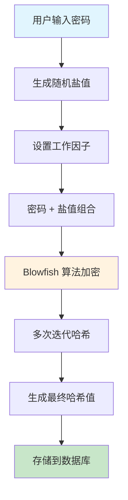
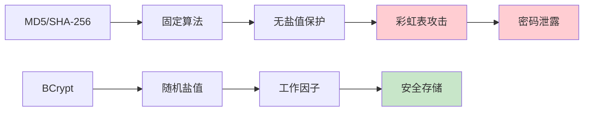
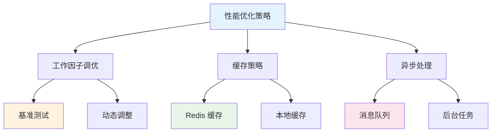
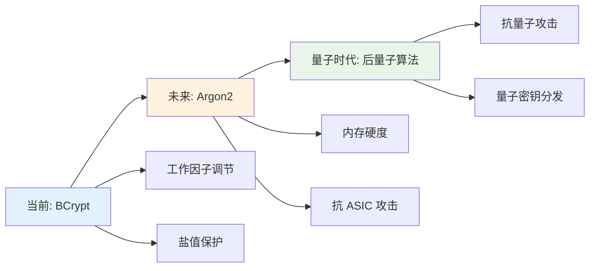

# 🔐 BCrypt 密码加密技术详解

## 📋 摘要

BCrypt 是当今最受信赖的密码哈希算法之一，专为安全存储用户密码而设计。它通过引入随机盐值和工作因子机制，有效抵御彩虹表攻击和暴力破解，成为现代 Web 应用和移动应用的首选密码保护方案。本文将深入解析 BCrypt 的工作原理、优势特性、实际应用场景，并提供完整的代码实现示例，帮助开发者构建更加安全的用户认证系统。

---

## 📚 目录

- [什么是 BCrypt](#什么是-bcrypt)
- [BCrypt 工作原理](#bcrypt-工作原理)
- [BCrypt 的优势特性](#bcrypt-的优势特性)
- [BCrypt vs 其他加密算法](#bcrypt-vs-其他加密算法)
- [实际应用场景](#实际应用场景)
- [Java 实现示例](#java-实现示例)
- [Python 实现示例](#python-实现示例)
- [Spring Boot 集成](#spring-boot-集成)
- [最佳实践与注意事项](#最佳实践与注意事项)
- [性能优化建议](#性能优化建议)
- [总结](#总结)

---

## 🔍 什么是 BCrypt

BCrypt 是一种基于 Blowfish 加密算法的密码哈希函数，由 Niels Provos 和 David Mazières 于 1999 年开发。它专门设计用于安全地存储用户密码，是目前业界公认的最安全的密码哈希算法之一。

### 🎯 核心特点

- **🛡️ 随机盐值**：每次加密都生成唯一的随机盐值
- **⚙️ 可调节工作因子**：可根据硬件性能调整计算复杂度
- **🔒 单向哈希**：不可逆的加密过程
- **🌍 跨平台支持**：支持多种编程语言和操作系统

---

## ⚙️ BCrypt 工作原理

### 🔄 加密流程



### 📊 哈希值结构解析

BCrypt 生成的哈希值具有固定的格式结构：

```
$2a$12$R9h/cIPz0gi.URNNX3kh2OPST9/PgBkqquzi.Ss7KIUgO2t0jWMUW
```

| 部分 | 说明 | 示例 |
|------|------|------|
| `$2a$` | 算法标识符 | BCrypt 版本标识 |
| `12` | 工作因子 | 2^12 = 4096 次迭代 |
| `R9h/cIPz0gi.URNNX3kh2O` | 盐值 | 22 字符 Base64 编码 |
| `PST9/PgBkqquzi.Ss7KIUgO2t0jWMUW` | 哈希值 | 31 字符 Base64 编码 |

### 🔢 工作因子详解

工作因子决定了哈希计算的复杂度，直接影响安全性：

| 工作因子 | 迭代次数 | 计算时间 | 安全级别 |
|----------|----------|----------|----------|
| 8 | 2^8 = 256 | ~10ms | 基础 |
| 10 | 2^10 = 1024 | ~40ms | 推荐 |
| 12 | 2^12 = 4096 | ~160ms | 高安全 |
| 14 | 2^14 = 16384 | ~640ms | 极高安全 |

---

## 🏆 BCrypt 的优势特性

### 🛡️ 安全优势

1. **防止彩虹表攻击**
   - 随机盐值确保相同密码产生不同哈希
   - 攻击者无法使用预计算的哈希表

2. **抵御暴力破解**
   - 可调节的工作因子增加破解难度
   - 计算时间随硬件性能提升而增加

3. **自适应性**
   - 可根据系统性能调整安全级别
   - 未来硬件升级时仍保持安全性

### 📈 技术优势

- **🔧 易于实现**：多种语言都有成熟库支持
- **⚡ 性能可控**：通过工作因子平衡安全与性能
- **🔄 向后兼容**：支持不同版本的 BCrypt 实现
- **📊 标准化**：遵循 OpenBSD 标准实现

---

## ⚖️ BCrypt vs 其他加密算法

### 📊 算法对比表

| 特性 | BCrypt | MD5 | SHA-256 | Argon2 |
|------|--------|-----|---------|--------|
| 安全性 | ⭐⭐⭐⭐⭐ | ⭐ | ⭐⭐⭐ | ⭐⭐⭐⭐⭐ |
| 防彩虹表 | ✅ | ❌ | ❌ | ✅ |
| 可调节强度 | ✅ | ❌ | ❌ | ✅ |
| 计算速度 | 中等 | 快 | 快 | 慢 |
| 内存使用 | 低 | 低 | 低 | 高 |
| 推荐使用 | ✅ | ❌ | ❌ | ✅ |

### 🚨 为什么不用 MD5 和 SHA-256？



---

## 🎯 实际应用场景

### 🌐 Web 应用场景

1. **用户注册系统**
   - 新用户密码加密存储
   - 防止数据库泄露导致密码暴露

2. **登录验证系统**
   - 密码比对验证
   - 支持密码更新功能

3. **API 认证**
   - 客户端密钥加密
   - 服务间通信安全

### 📱 移动应用场景

- **用户账户管理**
- **生物识别备份**
- **本地数据加密**

---

## ☕ Java 实现示例

### 🔧 基础实现

```java
import org.springframework.security.crypto.bcrypt.BCryptPasswordEncoder;
import org.springframework.security.crypto.password.PasswordEncoder;

public class BCryptExample {
    
    private static final PasswordEncoder passwordEncoder = new BCryptPasswordEncoder(12);
    
    /**
     * 加密密码
     * @param rawPassword 原始密码
     * @return 加密后的密码
     */
    public static String encodePassword(String rawPassword) {
        return passwordEncoder.encode(rawPassword);
    }
    
    /**
     * 验证密码
     * @param rawPassword 原始密码
     * @param encodedPassword 加密后的密码
     * @return 是否匹配
     */
    public static boolean verifyPassword(String rawPassword, String encodedPassword) {
        return passwordEncoder.matches(rawPassword, encodedPassword);
    }
    
    public static void main(String[] args) {
        // 示例使用
        String password = "mySecurePassword123";
        
        // 加密密码
        String hashedPassword = encodePassword(password);
        System.out.println("加密后的密码: " + hashedPassword);
        
        // 验证密码
        boolean isValid = verifyPassword(password, hashedPassword);
        System.out.println("密码验证结果: " + isValid);
    }
}
```

### 🏗️ 企业级实现

```java
import org.springframework.stereotype.Service;
import org.springframework.security.crypto.bcrypt.BCryptPasswordEncoder;
import org.springframework.security.crypto.password.PasswordEncoder;

@Service
public class PasswordService {
    
    private final PasswordEncoder passwordEncoder;
    
    public PasswordService() {
        // 设置工作因子为 12，平衡安全性和性能
        this.passwordEncoder = new BCryptPasswordEncoder(12);
    }
    
    /**
     * 用户注册时加密密码
     */
    public String hashPasswordForRegistration(String rawPassword) {
        validatePasswordStrength(rawPassword);
        return passwordEncoder.encode(rawPassword);
    }
    
    /**
     * 用户登录时验证密码
     */
    public boolean verifyPasswordForLogin(String rawPassword, String hashedPassword) {
        if (rawPassword == null || hashedPassword == null) {
            return false;
        }
        return passwordEncoder.matches(rawPassword, hashedPassword);
    }
    
    /**
     * 密码强度验证
     */
    private void validatePasswordStrength(String password) {
        if (password == null || password.length() < 8) {
            throw new IllegalArgumentException("密码长度至少 8 位");
        }
        
        if (password.length() > 72) {
            throw new IllegalArgumentException("密码长度不能超过 72 位");
        }
        
        // 可以添加更多密码强度检查
        if (!password.matches(".*[A-Z].*")) {
            throw new IllegalArgumentException("密码必须包含大写字母");
        }
        
        if (!password.matches(".*[a-z].*")) {
            throw new IllegalArgumentException("密码必须包含小写字母");
        }
        
        if (!password.matches(".*\\d.*")) {
            throw new IllegalArgumentException("密码必须包含数字");
        }
    }
}
```

---

## 🐍 Python 实现示例

### 🔧 基础实现

```python
import bcrypt
import secrets
import string

class BCryptManager:
    
    def __init__(self, rounds=12):
        """
        初始化 BCrypt 管理器
        :param rounds: 工作因子，默认 12
        """
        self.rounds = rounds
    
    def hash_password(self, password: str) -> str:
        """
        加密密码
        :param password: 原始密码
        :return: 加密后的密码
        """
        # 将字符串转换为字节
        password_bytes = password.encode('utf-8')
        
        # 生成盐值并加密
        salt = bcrypt.gensalt(rounds=self.rounds)
        hashed = bcrypt.hashpw(password_bytes, salt)
        
        return hashed.decode('utf-8')
    
    def verify_password(self, password: str, hashed_password: str) -> bool:
        """
        验证密码
        :param password: 原始密码
        :param hashed_password: 加密后的密码
        :return: 是否匹配
        """
        password_bytes = password.encode('utf-8')
        hashed_bytes = hashed_password.encode('utf-8')
        
        return bcrypt.checkpw(password_bytes, hashed_bytes)
    
    def generate_secure_password(self, length=16) -> str:
        """
        生成安全密码
        :param length: 密码长度
        :return: 生成的密码
        """
        characters = string.ascii_letters + string.digits + "!@#$%^&*"
        password = ''.join(secrets.choice(characters) for _ in range(length))
        return password

# 使用示例
def main():
    bcrypt_manager = BCryptManager(rounds=12)
    
    # 生成安全密码
    secure_password = bcrypt_manager.generate_secure_password()
    print(f"生成的密码: {secure_password}")
    
    # 加密密码
    hashed_password = bcrypt_manager.hash_password(secure_password)
    print(f"加密后的密码: {hashed_password}")
    
    # 验证密码
    is_valid = bcrypt_manager.verify_password(secure_password, hashed_password)
    print(f"密码验证结果: {is_valid}")
    
    # 错误密码验证
    wrong_password = "wrong_password"
    is_invalid = bcrypt_manager.verify_password(wrong_password, hashed_password)
    print(f"错误密码验证结果: {is_invalid}")

if __name__ == "__main__":
    main()
```

### 🏗️ 企业级实现

```python
import bcrypt
import re
from typing import Optional
from dataclasses import dataclass

@dataclass
class PasswordPolicy:
    """密码策略配置"""
    min_length: int = 8
    max_length: int = 72
    require_uppercase: bool = True
    require_lowercase: bool = True
    require_digits: bool = True
    require_special_chars: bool = True
    special_chars: str = "!@#$%^&*()_+-=[]{}|;:,.<>?"

class EnterpriseBCryptService:
    
    def __init__(self, rounds: int = 12, policy: Optional[PasswordPolicy] = None):
        self.rounds = rounds
        self.policy = policy or PasswordPolicy()
    
    def hash_password(self, password: str) -> str:
        """加密密码"""
        self._validate_password(password)
        
        password_bytes = password.encode('utf-8')
        salt = bcrypt.gensalt(rounds=self.rounds)
        hashed = bcrypt.hashpw(password_bytes, salt)
        
        return hashed.decode('utf-8')
    
    def verify_password(self, password: str, hashed_password: str) -> bool:
        """验证密码"""
        if not password or not hashed_password:
            return False
            
        password_bytes = password.encode('utf-8')
        hashed_bytes = hashed_password.encode('utf-8')
        
        return bcrypt.checkpw(password_bytes, hashed_bytes)
    
    def _validate_password(self, password: str) -> None:
        """验证密码强度"""
        if not password:
            raise ValueError("密码不能为空")
        
        if len(password) < self.policy.min_length:
            raise ValueError(f"密码长度至少 {self.policy.min_length} 位")
        
        if len(password) > self.policy.max_length:
            raise ValueError(f"密码长度不能超过 {self.policy.max_length} 位")
        
        if self.policy.require_uppercase and not re.search(r'[A-Z]', password):
            raise ValueError("密码必须包含大写字母")
        
        if self.policy.require_lowercase and not re.search(r'[a-z]', password):
            raise ValueError("密码必须包含小写字母")
        
        if self.policy.require_digits and not re.search(r'\d', password):
            raise ValueError("密码必须包含数字")
        
        if self.policy.require_special_chars:
            special_pattern = f"[{re.escape(self.policy.special_chars)}]"
            if not re.search(special_pattern, password):
                raise ValueError(f"密码必须包含特殊字符: {self.policy.special_chars}")
    
    def get_password_strength(self, password: str) -> dict:
        """获取密码强度分析"""
        strength_score = 0
        feedback = []
        
        if len(password) >= 8:
            strength_score += 1
        else:
            feedback.append("密码长度至少 8 位")
        
        if re.search(r'[A-Z]', password):
            strength_score += 1
        else:
            feedback.append("建议包含大写字母")
        
        if re.search(r'[a-z]', password):
            strength_score += 1
        else:
            feedback.append("建议包含小写字母")
        
        if re.search(r'\d', password):
            strength_score += 1
        else:
            feedback.append("建议包含数字")
        
        if re.search(r'[!@#$%^&*()_+\-=\[\]{}|;:,.<>?]', password):
            strength_score += 1
        else:
            feedback.append("建议包含特殊字符")
        
        strength_levels = ["很弱", "弱", "一般", "强", "很强"]
        strength_level = strength_levels[min(strength_score, 4)]
        
        return {
            "score": strength_score,
            "level": strength_level,
            "feedback": feedback
        }
```

---

## 🚀 Spring Boot 集成

### 📦 依赖配置

```xml
<!-- pom.xml -->
<dependencies>
    <dependency>
        <groupId>org.springframework.boot</groupId>
        <artifactId>spring-boot-starter-security</artifactId>
    </dependency>
    <dependency>
        <groupId>org.springframework.boot</groupId>
        <artifactId>spring-boot-starter-web</artifactId>
    </dependency>
</dependencies>
```

### ⚙️ 配置类

```java
import org.springframework.context.annotation.Bean;
import org.springframework.context.annotation.Configuration;
import org.springframework.security.crypto.bcrypt.BCryptPasswordEncoder;
import org.springframework.security.crypto.password.PasswordEncoder;

@Configuration
public class SecurityConfig {
    
    @Bean
    public PasswordEncoder passwordEncoder() {
        // 设置工作因子为 12
        return new BCryptPasswordEncoder(12);
    }
}
```

### 🎮 控制器实现

```java
import org.springframework.beans.factory.annotation.Autowired;
import org.springframework.http.ResponseEntity;
import org.springframework.security.crypto.password.PasswordEncoder;
import org.springframework.web.bind.annotation.*;

@RestController
@RequestMapping("/api/auth")
public class AuthController {
    
    @Autowired
    private PasswordEncoder passwordEncoder;
    
    @Autowired
    private UserService userService;
    
    @PostMapping("/register")
    public ResponseEntity<?> register(@RequestBody RegisterRequest request) {
        try {
            // 加密密码
            String hashedPassword = passwordEncoder.encode(request.getPassword());
            
            // 创建用户
            User user = new User();
            user.setUsername(request.getUsername());
            user.setEmail(request.getEmail());
            user.setPassword(hashedPassword);
            
            // 保存用户
            userService.save(user);
            
            return ResponseEntity.ok("用户注册成功");
        } catch (Exception e) {
            return ResponseEntity.badRequest().body("注册失败: " + e.getMessage());
        }
    }
    
    @PostMapping("/login")
    public ResponseEntity<?> login(@RequestBody LoginRequest request) {
        try {
            // 查找用户
            User user = userService.findByUsername(request.getUsername());
            
            if (user == null) {
                return ResponseEntity.badRequest().body("用户不存在");
            }
            
            // 验证密码
            boolean isValid = passwordEncoder.matches(request.getPassword(), user.getPassword());
            
            if (isValid) {
                return ResponseEntity.ok("登录成功");
            } else {
                return ResponseEntity.badRequest().body("密码错误");
            }
        } catch (Exception e) {
            return ResponseEntity.badRequest().body("登录失败: " + e.getMessage());
        }
    }
}
```

---

## 📋 最佳实践与注意事项

### ✅ 推荐做法

1. **🔧 合理设置工作因子**
   - 开发环境：8-10
   - 生产环境：10-12
   - 高安全要求：12-14

2. **🛡️ 密码策略**
   - 最小长度：8 位
   - 最大长度：72 位（BCrypt 限制）
   - 包含大小写字母、数字、特殊字符

3. **🔄 定期更新**
   - 定期检查工作因子是否合适
   - 考虑硬件性能提升的影响

### ⚠️ 注意事项

1. **🚫 不要做的事情**
   - 不要使用 MD5 或 SHA-256 存储密码
   - 不要在客户端进行密码加密
   - 不要使用固定的盐值

2. **🔒 安全考虑**
   - 使用 HTTPS 传输密码
   - 实施账户锁定机制
   - 记录登录失败尝试

### 📊 性能优化



---

## 🎯 性能优化建议

### ⚡ 性能调优策略

1. **🔧 工作因子优化**
   ```java
   // 根据系统性能动态调整
   public class DynamicBCryptConfig {
       private static final int MIN_ROUNDS = 8;
       private static final int MAX_ROUNDS = 14;
       
       public static int getOptimalRounds() {
           // 基准测试确定最佳工作因子
           long startTime = System.currentTimeMillis();
           BCryptPasswordEncoder testEncoder = new BCryptPasswordEncoder(10);
           testEncoder.encode("test_password");
           long duration = System.currentTimeMillis() - startTime;
           
           // 根据执行时间调整工作因子
           if (duration < 100) {
               return Math.min(MAX_ROUNDS, 12);
           } else if (duration > 500) {
               return Math.max(MIN_ROUNDS, 10);
           } else {
               return 11;
           }
       }
   }
   ```

2. **💾 缓存策略**
   ```java
   @Service
   public class CachedPasswordService {
       
       @Autowired
       private RedisTemplate<String, String> redisTemplate;
       
       private static final String CACHE_PREFIX = "password_hash:";
       private static final Duration CACHE_TTL = Duration.ofMinutes(30);
       
       public String getCachedHash(String password) {
           String cacheKey = CACHE_PREFIX + password.hashCode();
           return redisTemplate.opsForValue().get(cacheKey);
       }
       
       public void cacheHash(String password, String hash) {
           String cacheKey = CACHE_PREFIX + password.hashCode();
           redisTemplate.opsForValue().set(cacheKey, hash, CACHE_TTL);
       }
   }
   ```

3. **🔄 异步处理**
   ```java
   @Service
   public class AsyncPasswordService {
       
       @Async
       public CompletableFuture<String> hashPasswordAsync(String password) {
           BCryptPasswordEncoder encoder = new BCryptPasswordEncoder(12);
           String hash = encoder.encode(password);
           return CompletableFuture.completedFuture(hash);
       }
       
       @Async
       public CompletableFuture<Boolean> verifyPasswordAsync(String password, String hash) {
           BCryptPasswordEncoder encoder = new BCryptPasswordEncoder(12);
           boolean isValid = encoder.matches(password, hash);
           return CompletableFuture.completedFuture(isValid);
       }
   }
   ```

---

## 📈 监控与日志

### 📊 性能监控

```java
@Component
public class BCryptMetrics {
    
    private final MeterRegistry meterRegistry;
    private final Timer hashTimer;
    private final Timer verifyTimer;
    
    public BCryptMetrics(MeterRegistry meterRegistry) {
        this.meterRegistry = meterRegistry;
        this.hashTimer = Timer.builder("bcrypt.hash.duration")
                .description("BCrypt hash operation duration")
                .register(meterRegistry);
        this.verifyTimer = Timer.builder("bcrypt.verify.duration")
                .description("BCrypt verify operation duration")
                .register(meterRegistry);
    }
    
    public String hashWithMetrics(String password) {
        return hashTimer.record(() -> {
            BCryptPasswordEncoder encoder = new BCryptPasswordEncoder(12);
            return encoder.encode(password);
        });
    }
    
    public boolean verifyWithMetrics(String password, String hash) {
        return verifyTimer.record(() -> {
            BCryptPasswordEncoder encoder = new BCryptPasswordEncoder(12);
            return encoder.matches(password, hash);
        });
    }
}
```

### 📝 安全日志

```java
@Component
public class SecurityLogger {
    
    private static final Logger logger = LoggerFactory.getLogger(SecurityLogger.class);
    
    public void logPasswordHash(String username, boolean success) {
        if (success) {
            logger.info("密码哈希成功 - 用户: {}", username);
        } else {
            logger.warn("密码哈希失败 - 用户: {}", username);
        }
    }
    
    public void logPasswordVerify(String username, boolean success) {
        if (success) {
            logger.info("密码验证成功 - 用户: {}", username);
        } else {
            logger.warn("密码验证失败 - 用户: {}", username);
        }
    }
    
    public void logSuspiciousActivity(String username, String activity) {
        logger.error("可疑活动检测 - 用户: {}, 活动: {}", username, activity);
    }
}
```

---

## 🔮 未来发展趋势

### 🚀 技术演进

1. **🔧 Argon2 算法**
   - 2015 年密码哈希竞赛获胜者
   - 更好的内存硬度和抗 ASIC 攻击能力
   - 可能成为 BCrypt 的继任者

2. **☁️ 云安全服务**
   - 云端密码管理服务
   - 硬件安全模块（HSM）集成
   - 零知识证明技术

3. **🔐 量子安全**
   - 后量子密码学算法
   - 抗量子攻击的哈希函数
   - 量子密钥分发

### 📊 技术对比



---

## 📚 总结

BCrypt 作为现代密码安全的核心技术，通过其独特的设计理念和强大的安全特性，为我们的数字世界提供了坚实的保护屏障。从随机盐值到可调节工作因子，从跨平台支持到企业级集成，BCrypt 展现了密码安全技术的最佳实践。

### 🎯 关键要点

- **🛡️ 安全性**：BCrypt 通过随机盐值和工作因子机制，有效抵御各种攻击
- **⚡ 性能**：可调节的工作因子平衡了安全性和性能需求
- **🔧 易用性**：多种编程语言的成熟库支持，降低集成难度
- **📈 适应性**：随着硬件性能提升，可以动态调整安全级别

### 🚀 行动建议

1. **立即行动**：将现有系统的 MD5/SHA-256 密码存储迁移到 BCrypt
2. **合理配置**：根据系统性能选择合适的的工作因子
3. **持续监控**：建立性能监控和安全日志系统
4. **关注趋势**：关注 Argon2 等新兴密码哈希算法的发展

在数字化时代，密码安全不仅是技术问题，更是责任问题。选择 BCrypt，就是选择了对用户数据安全的承诺。让我们共同努力，构建更加安全的数字世界！

---

**厦门工学院人工智能创作坊 -- 郑恩赐**  
**2025 年 10 月 3 日**
