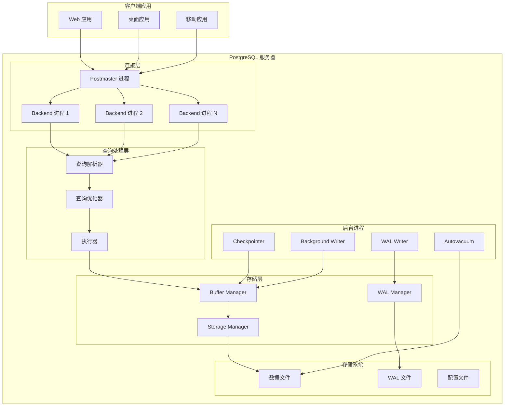
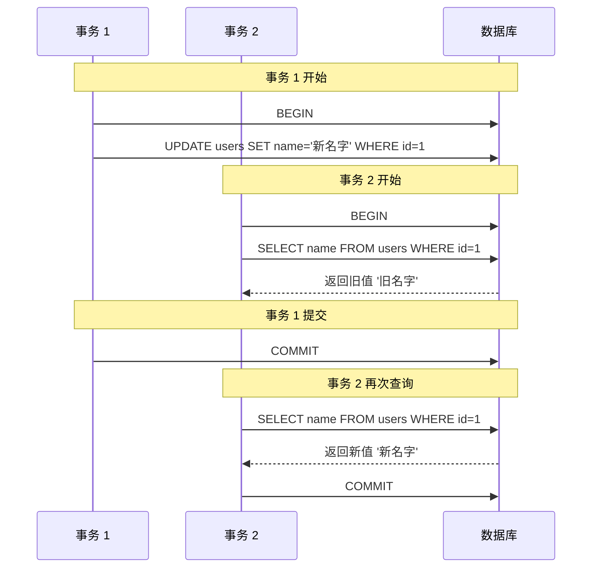
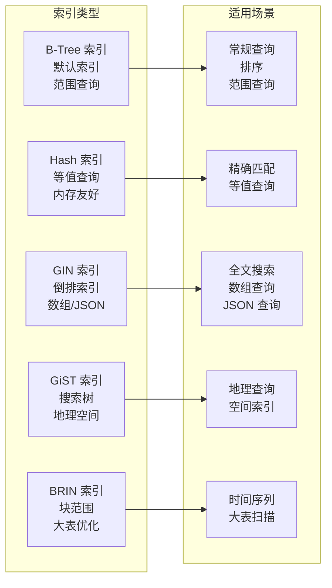
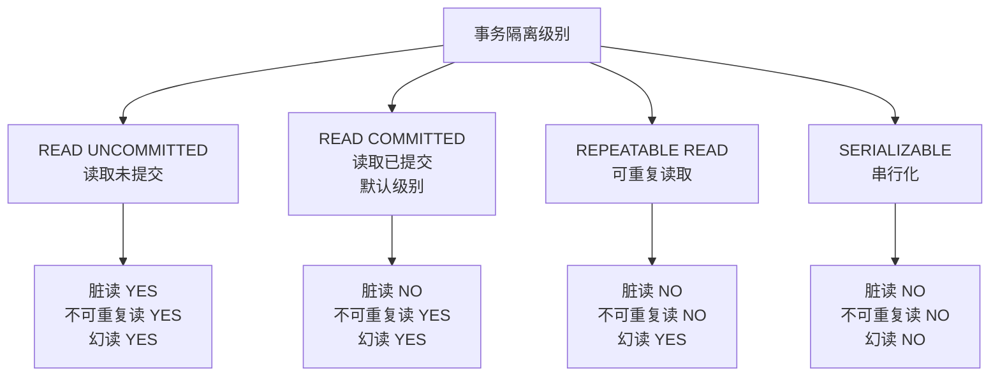
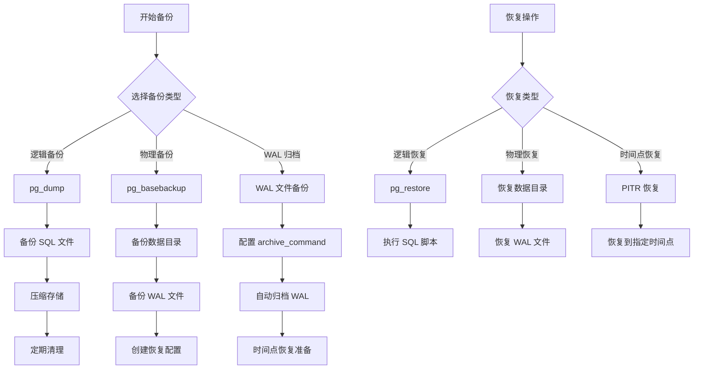
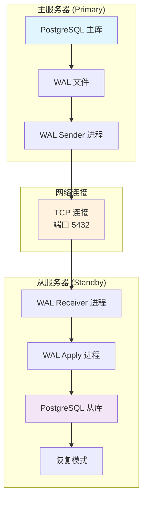

# 🐘 PostgreSQL 数据库技术详解

## 📋 摘要

PostgreSQL 作为世界上最先进的开源关系型数据库管理系统，以其强大的功能、卓越的性能和极高的可靠性征服了全球开发者。从金融系统到 Web 应用，从数据仓库到地理信息系统，PostgreSQL 无处不在。本文将带你深入了解这个数据库巨兽的核心技术、最新特性和最佳实践，无论你是数据库新手还是资深专家，都能从中获得宝贵的知识和实战经验。让我们一起探索 PostgreSQL 的无限可能！

---

## 📚 目录

- [PostgreSQL 简介](#postgresql-简介)
- [核心特性与优势](#核心特性与优势)
- [系统架构](#系统架构)
- [数据类型详解](#数据类型详解)
- [索引技术](#索引技术)
- [事务与并发控制](#事务与并发控制)
- [安装与配置](#安装与配置)
- [性能优化](#性能优化)
- [高可用与备份](#高可用与备份)
- [扩展与插件](#扩展与插件)
- [最佳实践](#最佳实践)
- [总结](#总结)

---

## PostgreSQL 简介

### 🎯 什么是 PostgreSQL

PostgreSQL 是一个功能强大的开源对象关系型数据库管理系统（ORDBMS），以其高扩展性和对 SQL 标准的高度兼容性而著称。自 1996 年发布以来，PostgreSQL 在全球范围内被广泛应用于各种规模的应用程序中。

### 📈 发展历程

- **1986 年**：加州大学伯克利分校启动 POSTGRES 项目
- **1996 年**：项目更名为 PostgreSQL，正式支持 SQL
- **1997 年**：发布 PostgreSQL 6.0，引入多列索引、序列等特性
- **2000 年代**：持续发展，引入 WAL、表空间、时间点恢复等功能
- **2010 年代**：JSON 支持、并行查询、逻辑复制等重大更新
- **2020 年代**：分区表改进、JIT 编译、增量备份等性能优化

### 🌟 为什么选择 PostgreSQL

1. **🔒 数据完整性**：严格的 ACID 事务支持
2. **🚀 高性能**：多版本并发控制（MVCC）技术
3. **🔧 高扩展性**：丰富的扩展和自定义功能
4. **📊 丰富的数据类型**：支持 JSON、数组、地理空间等
5. **🌍 标准兼容**：高度符合 SQL 标准
6. **💰 开源免费**：无许可证费用，社区活跃

---

## 核心特性与优势

### 🔐 ACID 事务支持

PostgreSQL 完全支持事务的 ACID 特性：

- **原子性（Atomicity）**：事务要么全部成功，要么全部失败
- **一致性（Consistency）**：数据库始终保持一致状态
- **隔离性（Isolation）**：并发事务相互隔离
- **持久性（Durability）**：已提交的事务永久保存

### 🔄 多版本并发控制（MVCC）

MVCC 是 PostgreSQL 的核心技术之一：

```sql
-- 示例：MVCC 工作原理
BEGIN;
UPDATE users SET name = '新名字' WHERE id = 1;
-- 此时其他事务仍能看到旧数据
COMMIT;
-- 提交后，新数据对所有事务可见
```

### 📦 丰富的数据类型

PostgreSQL 支持超过 40 种数据类型：

| 类型分类 | 具体类型 | 示例 |
|---------|---------|------|
| 数值类型 | INTEGER, BIGINT, DECIMAL | `123`, `1234567890123456789` |
| 字符类型 | VARCHAR, TEXT, CHAR | `'Hello World'` |
| 日期时间 | TIMESTAMP, DATE, TIME | `'2025-10-03 10:30:00'` |
| 布尔类型 | BOOLEAN | `true`, `false` |
| 数组类型 | INTEGER[], TEXT[] | `{1,2,3}`, `{'a','b','c'}` |
| JSON 类型 | JSON, JSONB | `'{"name": "张三"}'` |
| 地理空间 | POINT, POLYGON | `POINT(116.3974, 39.9093)` |

### 🔧 扩展性

PostgreSQL 允许用户：

- 创建自定义数据类型
- 定义新的操作符
- 编写自定义函数
- 开发新的索引方法
- 实现存储过程和触发器

---

## 系统架构

PostgreSQL 采用客户端/服务器架构，主要组件包括：

### 🏗️ 核心组件

1. **Postmaster 进程**：主进程，负责启动和监控
2. **Backend 进程**：处理客户端连接和查询
3. **WAL Writer**：写前日志写入器
4. **Checkpointer**：检查点进程
5. **Background Writer**：后台写入器
6. **Autovacuum**：自动清理进程

### 📊 内存结构

- **Shared Buffers**：共享缓冲区
- **WAL Buffers**：WAL 缓冲区
- **Work Memory**：工作内存
- **Maintenance Work Memory**：维护工作内存

### 🏛️ PostgreSQL 架构图



### 🔄 MVCC 工作原理图



---

## 数据类型详解

### 🔢 数值类型

```sql
-- 整数类型
CREATE TABLE numbers (
    id SERIAL PRIMARY KEY,           -- 自增整数
    small_num SMALLINT,              -- 2 字节整数 (-32768 到 32767)
    normal_num INTEGER,              -- 4 字节整数
    big_num BIGINT,                  -- 8 字节整数
    decimal_num DECIMAL(10,2),       -- 精确小数
    float_num REAL,                  -- 单精度浮点数
    double_num DOUBLE PRECISION      -- 双精度浮点数
);
```

### 📝 字符类型

```sql
-- 字符类型示例
CREATE TABLE text_examples (
    id SERIAL PRIMARY KEY,
    fixed_char CHAR(10),             -- 固定长度字符
    var_char VARCHAR(255),           -- 可变长度字符
    unlimited_text TEXT,             -- 无限制文本
    name CITEXT                      -- 大小写不敏感文本
);

-- 插入数据
INSERT INTO text_examples (fixed_char, var_char, unlimited_text, name)
VALUES ('Hello', 'World', 'This is a long text...', 'JOHN DOE');
```

### 📅 日期时间类型

```sql
-- 日期时间类型
CREATE TABLE datetime_examples (
    id SERIAL PRIMARY KEY,
    birth_date DATE,                 -- 日期
    work_time TIME,                  -- 时间
    created_at TIMESTAMP,            -- 时间戳
    updated_at TIMESTAMPTZ,          -- 带时区的时间戳
    duration INTERVAL                -- 时间间隔
);

-- 插入数据
INSERT INTO datetime_examples (birth_date, work_time, created_at, updated_at, duration)
VALUES ('1990-01-01', '09:30:00', '2025-10-03 10:30:00', 
        '2025-10-03 10:30:00+08', '1 day 2 hours 30 minutes');
```

### 📋 数组类型

```sql
-- 数组类型示例
CREATE TABLE array_examples (
    id SERIAL PRIMARY KEY,
    numbers INTEGER[],               -- 整数数组
    names TEXT[],                    -- 文本数组
    matrix INTEGER[][]               -- 二维数组
);

-- 插入数组数据
INSERT INTO array_examples (numbers, names, matrix)
VALUES ('{1,2,3,4,5}', '{"张三","李四","王五"}', '{{1,2},{3,4}}');

-- 查询数组
SELECT * FROM array_examples WHERE 2 = ANY(numbers);
SELECT names[1] FROM array_examples;  -- 获取第一个名字
```

### 📄 JSON 类型

```sql
-- JSON 类型示例
CREATE TABLE json_examples (
    id SERIAL PRIMARY KEY,
    user_info JSON,                  -- JSON 类型
    user_data JSONB                  -- 二进制 JSON 类型
);

-- 插入 JSON 数据
INSERT INTO json_examples (user_info, user_data)
VALUES ('{"name": "张三", "age": 25, "city": "北京"}',
        '{"name": "李四", "age": 30, "hobbies": ["读书", "游泳"]}');

-- JSON 查询
SELECT user_data->>'name' FROM json_examples;  -- 获取名字
SELECT user_data->'hobbies' FROM json_examples;  -- 获取爱好数组
SELECT * FROM json_examples WHERE user_data @> '{"age": 30}';  -- 查询年龄为 30 的用户
```

---

## 索引技术

### 🔍 索引类型

PostgreSQL 支持多种索引类型：

#### 1. B-Tree 索引（默认）

```sql
-- 创建 B-Tree 索引
CREATE INDEX idx_users_email ON users(email);
CREATE INDEX idx_users_name_age ON users(name, age);  -- 复合索引
```

#### 2. Hash 索引

```sql
-- 创建 Hash 索引（仅支持等值查询）
CREATE INDEX idx_users_id_hash ON users USING hash(id);
```

#### 3. GIN 索引（通用倒排索引）

```sql
-- 用于数组和 JSON 数据
CREATE INDEX idx_users_tags_gin ON users USING gin(tags);
CREATE INDEX idx_users_data_gin ON users USING gin(user_data);
```

#### 4. GiST 索引（通用搜索树）

```sql
-- 用于地理空间数据
CREATE INDEX idx_locations_gist ON locations USING gist(coordinates);
```

#### 5. BRIN 索引（块范围索引）

```sql
-- 用于大表的范围查询
CREATE INDEX idx_logs_brin ON logs USING brin(created_at);
```

### 🔍 索引类型对比图



---

## 事务与并发控制

### 🔄 事务隔离级别

PostgreSQL 支持四种事务隔离级别：

```sql
-- 设置事务隔离级别
BEGIN TRANSACTION ISOLATION LEVEL READ COMMITTED;
-- 执行操作
COMMIT;

-- 隔离级别说明
-- READ UNCOMMITTED: 读取未提交数据（PostgreSQL 中实际为 READ COMMITTED）
-- READ COMMITTED: 读取已提交数据（默认）
-- REPEATABLE READ: 可重复读取
-- SERIALIZABLE: 串行化
```

### 📊 事务隔离级别对比



### 🔒 锁机制

```sql
-- 表级锁
LOCK TABLE users IN SHARE MODE;     -- 共享锁
LOCK TABLE users IN EXCLUSIVE MODE; -- 排他锁

-- 行级锁（自动）
UPDATE users SET name = '新名字' WHERE id = 1;  -- 自动加行级排他锁

-- 查看锁信息
SELECT * FROM pg_locks WHERE relation = 'users'::regclass;
```

### ⚡ MVCC 示例

```sql
-- 会话 1
BEGIN;
UPDATE users SET balance = balance - 100 WHERE id = 1;
-- 此时事务未提交

-- 会话 2（同时执行）
SELECT balance FROM users WHERE id = 1;  -- 仍看到旧值

-- 会话 1
COMMIT;  -- 提交后，会话 2 的下次查询将看到新值
```

---

## 安装与配置

### 💻 Windows 安装

#### 1. 下载安装包

访问 [PostgreSQL 官网](https://www.postgresql.org/download/windows/) 下载最新版本。

#### 2. 安装步骤

1. 运行安装程序
2. 选择安装路径
3. 设置超级用户密码
4. 选择端口（默认 5432）
5. 选择语言环境

#### 3. 验证安装

```bash
# 检查 PostgreSQL 服务状态
sc query postgresql-x64-16

# 连接到数据库
psql -U postgres -h localhost -p 5432
```

### 🐧 Linux 安装

#### Ubuntu/Debian

```bash
# 更新包列表
sudo apt update

# 安装 PostgreSQL
sudo apt install postgresql postgresql-contrib

# 启动服务
sudo systemctl start postgresql
sudo systemctl enable postgresql

# 切换到 postgres 用户
sudo -u postgres psql
```

#### CentOS/RHEL

```bash
# 安装 PostgreSQL
sudo yum install postgresql-server postgresql-contrib

# 初始化数据库
sudo postgresql-setup initdb

# 启动服务
sudo systemctl start postgresql
sudo systemctl enable postgresql
```

### ⚙️ 基本配置

#### postgresql.conf 配置

```ini
# 连接设置
listen_addresses = '*'          # 监听所有地址
port = 5432                     # 端口号
max_connections = 100           # 最大连接数

# 内存设置
shared_buffers = 256MB          # 共享缓冲区
work_mem = 4MB                  # 工作内存
maintenance_work_mem = 64MB     # 维护工作内存

# 日志设置
log_destination = 'stderr'      # 日志目标
logging_collector = on          # 启用日志收集
log_directory = 'log'           # 日志目录
log_filename = 'postgresql-%Y-%m-%d_%H%M%S.log'
log_min_duration_statement = 1000  # 记录慢查询（毫秒）

# 性能设置
random_page_cost = 1.1          # 随机页面成本
effective_cache_size = 1GB      # 有效缓存大小
```

#### pg_hba.conf 配置

```ini
# 本地连接
local   all             all                                     trust
# IPv4 本地连接
host    all             all             127.0.0.1/32            md5
# IPv6 本地连接
host    all             all             ::1/128                 md5
# 网络连接
host    all             all             0.0.0.0/0               md5
```

---

## 性能优化

### 📈 查询优化

#### 1. 使用 EXPLAIN 分析查询

```sql
-- 基本查询分析
EXPLAIN SELECT * FROM users WHERE email = 'test@example.com';

-- 详细分析（包含实际执行时间）
EXPLAIN (ANALYZE, BUFFERS, VERBOSE) 
SELECT u.name, p.title 
FROM users u 
JOIN posts p ON u.id = p.user_id 
WHERE u.active = true;
```

#### 2. 索引优化

```sql
-- 创建合适的索引
CREATE INDEX CONCURRENTLY idx_users_email_active 
ON users(email) WHERE active = true;

-- 复合索引优化
CREATE INDEX idx_posts_user_status_date 
ON posts(user_id, status, created_at);

-- 部分索引
CREATE INDEX idx_recent_posts 
ON posts(created_at) WHERE created_at > '2025-01-01';
```

#### 3. 查询重写

```sql
-- 优化前：使用子查询
SELECT * FROM users WHERE id IN (
    SELECT user_id FROM orders WHERE total > 1000
);

-- 优化后：使用 JOIN
SELECT DISTINCT u.* FROM users u
JOIN orders o ON u.id = o.user_id
WHERE o.total > 1000;
```

### 🔧 配置优化

#### 内存配置

```ini
# 根据系统内存调整
shared_buffers = 25% of RAM        # 共享缓冲区
work_mem = 4MB                     # 工作内存
maintenance_work_mem = 256MB       # 维护工作内存
effective_cache_size = 75% of RAM  # 有效缓存大小
```

#### 磁盘 I/O 优化

```ini
# 随机页面成本（SSD 推荐 1.1，机械硬盘 4.0）
random_page_cost = 1.1

# 顺序页面成本
seq_page_cost = 1.0

# 检查点设置
checkpoint_completion_target = 0.9
wal_buffers = 16MB
```

### 📊 监控与调优

#### 1. 查看慢查询

```sql
-- 启用慢查询日志
ALTER SYSTEM SET log_min_duration_statement = 1000;
SELECT pg_reload_conf();

-- 查看当前活动连接
SELECT * FROM pg_stat_activity WHERE state = 'active';

-- 查看数据库统计信息
SELECT * FROM pg_stat_database WHERE datname = current_database();
```

#### 2. 表统计信息

```sql
-- 更新表统计信息
ANALYZE users;

-- 查看表大小
SELECT 
    schemaname,
    tablename,
    pg_size_pretty(pg_total_relation_size(schemaname||'.'||tablename)) as size
FROM pg_tables 
ORDER BY pg_total_relation_size(schemaname||'.'||tablename) DESC;
```

---

## 高可用与备份

### 🔄 主从复制

#### 1. 配置主服务器

```bash
# 创建复制用户
sudo -u postgres psql
CREATE USER replicator REPLICATION LOGIN CONNECTION LIMIT 3 ENCRYPTED PASSWORD 'password';

# 配置 pg_hba.conf
echo "host replication replicator 192.168.1.0/24 md5" >> /etc/postgresql/16/main/pg_hba.conf

# 重启服务
sudo systemctl restart postgresql
```

#### 2. 配置从服务器

```bash
# 停止 PostgreSQL
sudo systemctl stop postgresql

# 备份主服务器数据
pg_basebackup -h 192.168.1.100 -D /var/lib/postgresql/16/main -U replicator -v -P -W

# 配置 recovery.conf
echo "standby_mode = 'on'" > /var/lib/postgresql/16/main/recovery.conf
echo "primary_conninfo = 'host=192.168.1.100 port=5432 user=replicator password=password'" >> /var/lib/postgresql/16/main/recovery.conf

# 启动从服务器
sudo systemctl start postgresql
```

### 💾 备份策略

#### 1. pg_dump 备份

```bash
# 备份整个数据库
pg_dump -h localhost -U postgres -d mydb > backup.sql

# 备份特定表
pg_dump -h localhost -U postgres -d mydb -t users > users_backup.sql

# 压缩备份
pg_dump -h localhost -U postgres -d mydb | gzip > backup.sql.gz

# 并行备份
pg_dump -h localhost -U postgres -d mydb -j 4 -f backup_dir/
```

#### 2. pg_basebackup 物理备份

```bash
# 完整备份
pg_basebackup -h localhost -U postgres -D /backup/basebackup -Ft -z -P

# 增量备份（需要 WAL 归档）
pg_basebackup -h localhost -U postgres -D /backup/incremental -Ft -z -P --checkpoint=fast
```

#### 3. 时间点恢复（PITR）

```bash
# 配置 WAL 归档
echo "archive_mode = on" >> postgresql.conf
echo "archive_command = 'cp %p /backup/wal/%f'" >> postgresql.conf

# 恢复数据库
pg_restore -h localhost -U postgres -d mydb backup.sql
```

### 💾 备份恢复流程图



### 🔄 主从复制架构图



---

## 扩展与插件

### 🔌 常用扩展

#### 1. PostGIS（地理空间数据）

```sql
-- 安装 PostGIS
CREATE EXTENSION postgis;

-- 创建地理空间表
CREATE TABLE locations (
    id SERIAL PRIMARY KEY,
    name VARCHAR(100),
    coordinates GEOMETRY(POINT, 4326)
);

-- 插入地理数据
INSERT INTO locations (name, coordinates) 
VALUES ('北京', ST_GeomFromText('POINT(116.3974 39.9093)', 4326));

-- 地理查询
SELECT name, ST_Distance(coordinates, ST_GeomFromText('POINT(121.4737 31.2304)', 4326)) as distance
FROM locations;
```

#### 2. pg_stat_statements（查询统计）

```sql
-- 安装扩展
CREATE EXTENSION pg_stat_statements;

-- 查看最耗时的查询
SELECT query, calls, total_time, mean_time, rows
FROM pg_stat_statements 
ORDER BY total_time DESC 
LIMIT 10;
```

#### 3. uuid-ossp（UUID 生成）

```sql
-- 安装扩展
CREATE EXTENSION "uuid-ossp";

-- 使用 UUID
CREATE TABLE users (
    id UUID PRIMARY KEY DEFAULT uuid_generate_v4(),
    name VARCHAR(100)
);
```

#### 4. hstore（键值对存储）

```sql
-- 安装扩展
CREATE EXTENSION hstore;

-- 创建 hstore 列
CREATE TABLE products (
    id SERIAL PRIMARY KEY,
    name VARCHAR(100),
    attributes HSTORE
);

-- 插入数据
INSERT INTO products (name, attributes) 
VALUES ('手机', 'brand=>"苹果", color=>"黑色", price=>"6999"');

-- 查询
SELECT * FROM products WHERE attributes @> 'brand=>苹果';
```

### 🛠️ 自定义扩展开发

#### 1. 创建简单扩展

```sql
-- 创建扩展目录结构
-- myextension/
--   ├── myextension.control
--   ├── myextension--1.0.sql
--   └── Makefile

-- myextension.control
comment = 'My custom extension'
default_version = '1.0'
module_pathname = '$libdir/myextension'
relocatable = true

-- myextension--1.0.sql
CREATE OR REPLACE FUNCTION my_function()
RETURNS TEXT AS $$
BEGIN
    RETURN 'Hello from my extension!';
END;
$$ LANGUAGE plpgsql;
```

---

## 最佳实践

### 🏗️ 数据库设计

#### 1. 命名规范

```sql
-- 表名：使用复数形式，小写，下划线分隔
CREATE TABLE user_accounts (
    id SERIAL PRIMARY KEY,
    email VARCHAR(255) UNIQUE NOT NULL,
    created_at TIMESTAMP DEFAULT CURRENT_TIMESTAMP
);

-- 列名：小写，下划线分隔
CREATE TABLE blog_posts (
    post_id SERIAL PRIMARY KEY,
    user_id INTEGER REFERENCES user_accounts(id),
    post_title VARCHAR(255) NOT NULL,
    post_content TEXT,
    is_published BOOLEAN DEFAULT FALSE,
    created_at TIMESTAMP DEFAULT CURRENT_TIMESTAMP,
    updated_at TIMESTAMP DEFAULT CURRENT_TIMESTAMP
);

-- 索引名：idx_表名_列名
CREATE INDEX idx_blog_posts_user_id ON blog_posts(user_id);
CREATE INDEX idx_blog_posts_created_at ON blog_posts(created_at);
```

#### 2. 数据类型选择

```sql
-- 选择合适的数值类型
CREATE TABLE products (
    id SERIAL PRIMARY KEY,           -- 自增主键
    price DECIMAL(10,2),             -- 价格使用 DECIMAL
    quantity INTEGER,                -- 数量使用 INTEGER
    weight REAL                      -- 重量使用 REAL
);

-- 选择合适的字符类型
CREATE TABLE articles (
    id SERIAL PRIMARY KEY,
    title VARCHAR(255),              -- 标题使用 VARCHAR
    content TEXT,                    -- 内容使用 TEXT
    slug VARCHAR(100) UNIQUE         -- URL 标识使用 VARCHAR
);
```

#### 3. 约束设计

```sql
-- 外键约束
CREATE TABLE orders (
    id SERIAL PRIMARY KEY,
    user_id INTEGER NOT NULL REFERENCES users(id) ON DELETE CASCADE,
    total_amount DECIMAL(10,2) NOT NULL CHECK (total_amount > 0),
    status VARCHAR(20) DEFAULT 'pending' CHECK (status IN ('pending', 'paid', 'shipped', 'delivered'))
);

-- 唯一约束
CREATE TABLE user_profiles (
    user_id INTEGER PRIMARY KEY REFERENCES users(id),
    username VARCHAR(50) UNIQUE NOT NULL,
    email VARCHAR(255) UNIQUE NOT NULL
);
```

### 🔒 安全最佳实践

#### 1. 用户权限管理

```sql
-- 创建应用用户
CREATE USER app_user WITH PASSWORD 'secure_password';

-- 创建只读用户
CREATE USER readonly_user WITH PASSWORD 'readonly_password';

-- 授予权限
GRANT CONNECT ON DATABASE mydb TO app_user;
GRANT USAGE ON SCHEMA public TO app_user;
GRANT SELECT, INSERT, UPDATE, DELETE ON ALL TABLES IN SCHEMA public TO app_user;
GRANT USAGE, SELECT ON ALL SEQUENCES IN SCHEMA public TO app_user;

-- 只读权限
GRANT CONNECT ON DATABASE mydb TO readonly_user;
GRANT USAGE ON SCHEMA public TO readonly_user;
GRANT SELECT ON ALL TABLES IN SCHEMA public TO readonly_user;
```

#### 2. 连接安全

```ini
# pg_hba.conf 安全配置
# 本地连接使用 peer 认证
local   all             all                                     peer

# 网络连接使用 SCRAM-SHA-256
host    all             all             127.0.0.1/32            scram-sha-256
host    all             all             ::1/128                 scram-sha-256

# 特定 IP 段使用证书认证
hostssl all             all             10.0.0.0/8              cert
```

### 📊 性能最佳实践

#### 1. 查询优化

```sql
-- 使用 LIMIT 限制结果集
SELECT * FROM users WHERE active = true LIMIT 100;

-- 使用适当的 WHERE 条件
SELECT * FROM orders WHERE created_at >= '2025-01-01' AND created_at < '2025-02-01';

-- 避免 SELECT *
SELECT id, name, email FROM users WHERE active = true;

-- 使用 EXISTS 而不是 IN（对于大表）
SELECT * FROM users u WHERE EXISTS (
    SELECT 1 FROM orders o WHERE o.user_id = u.id AND o.total > 1000
);
```

#### 2. 索引策略

```sql
-- 为经常查询的列创建索引
CREATE INDEX idx_users_email ON users(email);
CREATE INDEX idx_users_active ON users(active) WHERE active = true;

-- 复合索引优化
CREATE INDEX idx_orders_user_status ON orders(user_id, status, created_at);

-- 表达式索引
CREATE INDEX idx_users_lower_email ON users(lower(email));
```

#### 3. 分区表

```sql
-- 按时间分区
CREATE TABLE logs (
    id SERIAL,
    log_level VARCHAR(20),
    message TEXT,
    created_at TIMESTAMP DEFAULT CURRENT_TIMESTAMP
) PARTITION BY RANGE (created_at);

-- 创建分区
CREATE TABLE logs_2025_01 PARTITION OF logs
FOR VALUES FROM ('2025-01-01') TO ('2025-02-01');

CREATE TABLE logs_2025_02 PARTITION OF logs
FOR VALUES FROM ('2025-02-01') TO ('2025-03-01');
```

### 🔧 维护最佳实践

#### 1. 定期维护

```sql
-- 更新统计信息
ANALYZE;

-- 重建索引
REINDEX DATABASE mydb;

-- 清理死元组
VACUUM ANALYZE;

-- 完全清理
VACUUM FULL;
```

#### 2. 监控脚本

```bash
#!/bin/bash
# monitor_postgresql.sh

# 检查连接数
CONNECTIONS=$(psql -t -c "SELECT count(*) FROM pg_stat_activity;")
echo "当前连接数: $CONNECTIONS"

# 检查数据库大小
DB_SIZE=$(psql -t -c "SELECT pg_size_pretty(pg_database_size('mydb'));")
echo "数据库大小: $DB_SIZE"

# 检查慢查询
SLOW_QUERIES=$(psql -t -c "SELECT count(*) FROM pg_stat_statements WHERE mean_time > 1000;")
echo "慢查询数量: $SLOW_QUERIES"
```

---

## 总结

🎉 **恭喜你！** 你已经完成了 PostgreSQL 数据库技术的深入学习之旅！

通过本文的详细讲解，你已经掌握了：

- ✅ **PostgreSQL 的核心特性和优势**
- ✅ **系统架构和数据类型详解**
- ✅ **索引技术和性能优化策略**
- ✅ **事务处理和并发控制机制**
- ✅ **安装配置和最佳实践**
- ✅ **高可用备份和扩展开发**

PostgreSQL 作为世界上最先进的开源数据库，为你的项目提供了强大而可靠的数据存储解决方案。无论是构建 Web 应用、数据仓库还是地理信息系统，PostgreSQL 都能满足你的需求。

🚀 **现在就开始你的 PostgreSQL 之旅吧！** 从简单的 CRUD 操作到复杂的查询优化，从单机部署到集群架构，PostgreSQL 将陪伴你成长为数据库专家。记住，实践是最好的老师，多动手、多思考、多总结，你一定能成为 PostgreSQL 的高手！

💪 **加油，未来的数据库专家！** 让 PostgreSQL 的强大功能为你的项目插上腾飞的翅膀！

---

**厦门工学院人工智能创作坊 -- 郑恩赐**  
**2025 年 10 月 3 日**
