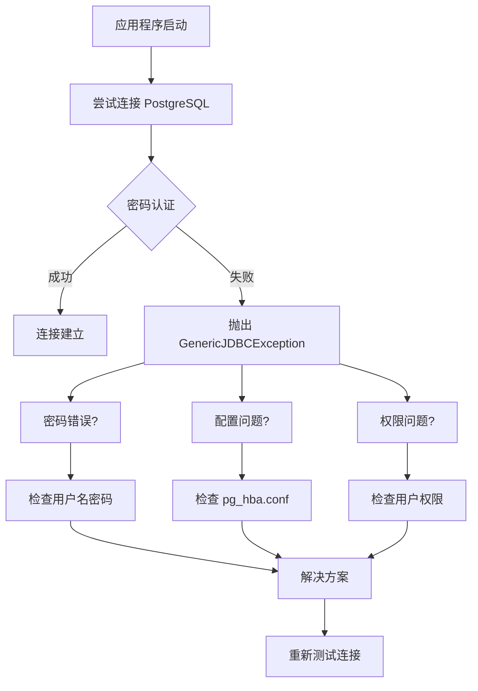
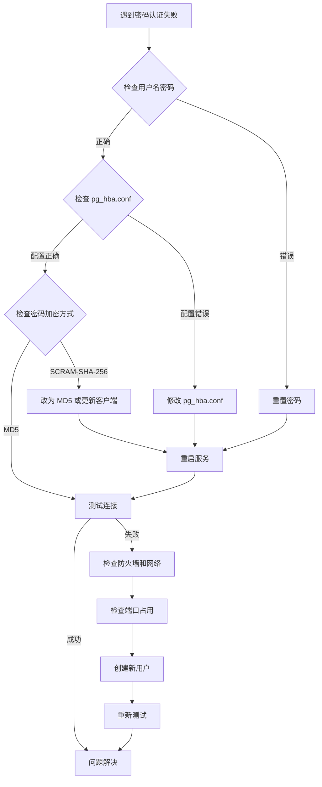

# 🔐 SpringBoot+PostgreSQL密码认证失败Windows系统解决方案

## 📋 摘要

遇到 `org.hibernate.exception.GenericJDBCException: unable to obtain isolated JDBC connection [FATAL: password authentication failed for user "postgres"]` 错误？别慌！这份专门针对 Spring Boot + PostgreSQL + Windows 系统的解决方案将带你从零开始，系统性地解决密码认证失败问题。从错误分析到密码重置，一步步帮你彻底解决！ 🚀

**⚠️ 重要提示：文档中的版本号（如 15、18 等）仅为示例，请根据您实际安装的 PostgreSQL 版本进行替换！**

---

## 🎯 问题分析

### 错误信息解读

当你看到这个错误时：

```
org.hibernate.exception.GenericJDBCException: unable to obtain isolated JDBC connection 
[FATAL: password authentication failed for user "postgres"]
```

这表示：
- 🔴 **Hibernate** 无法获取独立的 JDBC 连接
- 🔴 **PostgreSQL** 拒绝了用户 "postgres" 的密码认证
- 🔴 应用程序无法连接到数据库

### 问题流程图



---

## 🛠️ 解决方案

### 方案一：检查并修正连接配置（密码已知时使用）

#### 1. 检查 Spring Boot 配置

在 `application.yml` 或 `application.properties` 中检查数据库连接配置：

**application.yml 配置：**
```yaml
spring:
  datasource:
    url: jdbc:postgresql://localhost:5432/your_database
    username: postgres
    password: your_password
    driver-class-name: org.postgresql.Driver
  jpa:
    hibernate:
      ddl-auto: update
    show-sql: true
```

**application.properties 配置：**
```properties
spring.datasource.url=jdbc:postgresql://localhost:5432/your_database
spring.datasource.username=postgres
spring.datasource.password=your_password
spring.datasource.driver-class-name=org.postgresql.Driver
```


### 方案二：重置 PostgreSQL 用户密码（忘记密码时的解决方案）

**🎯 重要：忘记密码时，必须先使用命令行重置，无法使用图形界面！**

#### 1. 使用单用户模式重置密码（真正不需要密码的方法）

**⚠️ 重要：这种方法不需要知道当前密码，但需要停止 PostgreSQL 服务**

**🔧 关键说明：**
- 使用 `postgres.exe` 命令（不是 `psql.exe`）
- `psql` 是客户端工具，不支持 `--single` 选项
- `postgres` 是服务器程序，支持单用户模式
- **重要**：`ALTER USER` 是 SQL 命令，必须在 PostgreSQL 单用户模式中执行，不是在 Windows 命令提示符中执行

**Windows 系统：**
```cmd
# 1. 停止 PostgreSQL 服务（注意：18 是示例版本号，请替换为您的实际版本）
net stop postgresql-x64-18

# 2. 以单用户模式启动 PostgreSQL，连接到 postgres 数据库（注意：18 是示例版本号，请替换为您的实际版本）
"C:\Program Files\PostgreSQL\18\bin\postgres.exe" --single -D "C:\Program Files\PostgreSQL\18\data" postgres

# 3. 等待 PostgreSQL 启动，会看到类似 "PostgreSQL stand-alone backend" 的提示
# 4. 在单用户模式下输入 SQL 命令（不需要输入当前密码）
ALTER USER postgres WITH PASSWORD 'new_password';

# 5. 输入完成后按回车执行命令
# 6. 退出单用户模式（按 Ctrl+C）
# 7. 重新启动 PostgreSQL 服务（注意：18 是示例版本号，请替换为您的实际版本）
net start postgresql-x64-18
```


#### 2. 使用 pgAdmin 图形界面重置密码（密码重置成功后使用）

**⚠️ 重要说明：pgAdmin 需要先连接到数据库才能管理用户，但忘记密码就无法连接。**

**使用场景：** 只有在使用单用户模式重置密码成功后，才能使用 pgAdmin 进行后续管理。

**使用 pgAdmin 的步骤：**

1. **打开 pgAdmin**
   - 从开始菜单搜索 "pgAdmin" 或点击桌面快捷方式

2. **连接到 PostgreSQL 服务器**
   - 在 pgAdmin 主界面左侧的 "Object Explorer" 面板中
   - 找到 "Servers (1)" 下的目标服务器（如 "PostgreSQL 18"）
   - **重要**：如果服务器旁边有红色 X 图标，说明未连接
   - 双击服务器名称或右键选择 "Connect Server" 进行连接
   - 输入重置后的 postgres 用户密码
   - 连接成功后，红色 X 图标消失，服务器图标变为绿色

3. **导航到用户管理**
   - 服务器连接成功后，在左侧 "Object Explorer" 面板中，依次展开：
     - "Servers (1)" → "PostgreSQL 18"（或您的版本）→ "Login/Group Roles"
   - 在 "Login/Group Roles" 下找到 "postgres" 用户

4. **打开用户属性**
   - 右键点击 "postgres" 用户
   - 从右键菜单中选择 "Properties..."（属性）
   - 快捷键：Alt + Shift + E

5. **修改密码**
   - 在弹出的 "Login Role - postgres" 窗口中
   - 点击 "Definition" 标签页（默认已选中）
   - 在 "Password" 字段中输入新密码
   - 可以设置 "Account expires"（账户过期时间，留空表示永不过期）
   - 可以调整 "Connection limit"（连接限制，-1 表示无限制）

6. **保存更改**
   - 点击窗口底部的 "Save" 按钮（蓝色高亮按钮）
   - 如果保存成功，会显示确认消息
   - 点击 "Close" 按钮关闭窗口

**注意事项：**
- 如果无法连接到服务器，请检查 PostgreSQL 服务是否正在运行
- 确保您有足够的权限修改用户密码
- 新密码应该符合 PostgreSQL 的密码策略要求
- 修改密码后，需要更新应用程序中的数据库连接配置

**界面说明：**
- pgAdmin 4 使用深色主题，左侧是浏览器面板（用于导航和对象管理）
- 工具栏显示 "Default Workspace" 按钮，表示当前工作空间
- 左侧面板约占窗口宽度的 1/4，右侧主内容区域占 3/4
- 服务器连接后，状态栏会显示 "Servers > PostgreSQL 18" 等信息
- 右键菜单包含 "Properties..." 选项，快捷键为 Alt + Shift + E
- 界面底部有设置齿轮图标，可用于配置选项
- 用户属性窗口标题为 "Login Role - postgres"，包含多个标签页
- "Definition" 标签页用于设置密码、过期时间和连接限制

**常见问题解决：**

**问题 1：忘记 postgres 密码怎么办？**
- **核心问题**：忘记密码时无法使用普通 psql 命令和 pgAdmin 图形界面
- **正确流程**：
  1. **必须使用单用户模式重置**：见上面的"方案二：使用单用户模式重置密码"
  2. **单用户模式特点**：不需要输入当前密码，但需要停止服务
  3. **重置成功后**：才能使用普通 psql 和 pgAdmin 进行后续管理
  4. **不要尝试**：在忘记密码的情况下使用普通 psql 命令

**问题 1.1：出现 "illegal option -- single" 错误**
- **错误原因**：使用了 `psql.exe` 而不是 `postgres.exe`
- **正确命令**：`"C:\Program Files\PostgreSQL\18\bin\postgres.exe" --single -D "C:\Program Files\PostgreSQL\18\data"`
- **错误命令**：`"C:\Program Files\PostgreSQL\18\bin\psql.exe" --single -D "C:\Program Files\PostgreSQL\18\data"`
- **说明**：`psql` 是客户端工具，`postgres` 是服务器程序

**问题 1.2：出现 "'ALTER' is not recognized" 错误**
- **错误原因**：在 Windows 命令提示符中直接输入 SQL 命令
- **正确做法**：先启动单用户模式，然后在 PostgreSQL 环境中输入 SQL 命令
- **步骤**：
  1. 执行 `postgres.exe --single` 命令
  2. 等待看到 "PostgreSQL stand-alone backend" 提示
  3. 在 PostgreSQL 环境中输入：`ALTER USER postgres WITH PASSWORD 'new_password';`
  4. 按回车执行，然后按 Ctrl+C 退出

**问题 2：找不到 "Login/Group Roles"**
- **主要原因**：服务器未连接（红色 X 图标表示断开状态）
- **解决方法**：
  1. 检查服务器状态：如果看到红色 X 图标，说明未连接
  2. 双击服务器名称或右键选择 "Connect Server"
  3. 输入正确的密码进行连接
  4. 连接成功后，红色 X 消失，服务器图标变绿
  5. 只有连接成功后，才会显示 "Login/Group Roles" 等子节点
- 如果仍然看不到，尝试刷新左侧 Object Explorer 面板（F5 键）

**问题 3：无法保存密码**
- 确保两个密码字段输入完全一致
- 检查密码是否符合复杂度要求
- 确保有足够的数据库权限

**问题 4：pgAdmin 无法启动**
- Windows：检查是否以管理员身份运行
- Linux：确保安装了正确的依赖包
- macOS：检查安全设置是否阻止了应用运行

**界面操作提示：**
- 如果左侧浏览器面板太窄，可以拖拽中间的分隔线调整宽度
- 使用工具栏的搜索功能可以快速找到特定对象
- 右键点击服务器名称可以访问更多管理选项
- 左侧面板主要用于导航和对象管理，右侧是主工作区域

### 方案三：配置 pg_hba.conf 文件（高级配置）

#### 1. 找到配置文件

**Windows 系统：**
```cmd
# PostgreSQL 安装目录下的配置文件（注意：15 是示例版本号，请替换为您的实际版本）
C:\Program Files\PostgreSQL\15\data\pg_hba.conf

# 或者使用 PowerShell 查找
Get-ChildItem -Path "C:\Program Files\PostgreSQL" -Name "pg_hba.conf" -Recurse
```


#### 2. 修改认证方式

编辑 `pg_hba.conf` 文件，确保包含以下配置：

```
# "local" is for Unix domain socket connections only
local   all             all                                     scram-sha-256
# IPv4 local connections:
host    all             all             127.0.0.1/32            scram-sha-256
# IPv6 local connections:
host    all             all             ::1/128                 scram-sha-256
# Allow replication connections from localhost, by a user with the
# replication privilege.
local   replication     all                                     scram-sha-256
host    replication     all             127.0.0.1/32            scram-sha-256
host    replication     all             ::1/128                 scram-sha-256
```

**说明：**
- 这是 PostgreSQL 的默认配置
- 使用 `scram-sha-256` 认证方式（比 `md5` 更安全）
- 如果遇到兼容性问题，可以将 `scram-sha-256` 改为 `md5`

#### 3. 重启 PostgreSQL 服务

**Windows 系统：**
```cmd
# 方法一：使用 net 命令（注意：15 是示例版本号，请替换为您的实际版本）
net stop postgresql-x64-15
net start postgresql-x64-15

# 方法二：使用服务管理器
# 1. 按 Win + R，输入 services.msc
# 2. 找到 "postgresql-x64-15" 服务（注意：15 是示例版本号）
# 3. 右键点击，选择 "重新启动"

# 方法三：使用 PowerShell（注意：15 是示例版本号，请替换为您的实际版本）
Restart-Service postgresql-x64-15
```


### 方案四：检查密码加密方式（高级配置）

#### 1. 查看当前加密方式

**Windows 系统：**
```cmd
# 1. 打开命令提示符
# 2. 连接到 PostgreSQL（使用完整路径）
"C:\Program Files\PostgreSQL\15\bin\psql.exe" -U postgres -h localhost -p 5432

# 3. 在 PostgreSQL 命令行中执行
SHOW password_encryption;
```


#### 2. 修改加密方式（如果需要）

**所有系统通用 SQL 命令：**
```sql
-- 设置为 MD5 加密（兼容性更好）
SET password_encryption = 'md5';

-- 重新设置密码
ALTER USER postgres WITH PASSWORD 'your_new_password';

-- 退出
\q
```

#### 3. 重启服务

**Windows 系统：**
```cmd
net stop postgresql-x64-15
net start postgresql-x64-15
```


---

## 🔧 高级解决方案（密码重置成功后的优化）

### 方案五：创建新的数据库用户

如果 postgres 用户有问题，可以创建新用户：

```sql
-- 创建新用户
CREATE USER myapp_user WITH PASSWORD 'secure_password';

-- 授予权限
GRANT ALL PRIVILEGES ON DATABASE your_database TO myapp_user;

-- 授予 schema 权限
GRANT ALL PRIVILEGES ON SCHEMA public TO myapp_user;
```

然后更新应用程序配置：

```yaml
spring:
  datasource:
    username: myapp_user
    password: secure_password
```

### 方案六：使用环境变量

为了安全起见，使用环境变量存储密码：

```yaml
spring:
  datasource:
    username: ${DB_USERNAME:postgres}
    password: ${DB_PASSWORD}
```

设置环境变量：

**Windows 系统：**
```cmd
# 临时设置（当前会话有效）
set DB_PASSWORD=your_password

# 永久设置（系统环境变量）
# 1. 右键 "此电脑" -> "属性" -> "高级系统设置"
# 2. 点击 "环境变量"
# 3. 在 "系统变量" 中点击 "新建"
# 4. 变量名：DB_PASSWORD，变量值：your_password
```


---

## 🧪 测试连接

### 1. 使用命令行测试

**Windows 系统：**
```cmd
# 打开命令提示符或 PowerShell
# 使用完整路径连接数据库
"C:\Program Files\PostgreSQL\15\bin\psql.exe" -U postgres -h localhost -p 5432 -d your_database
# 输入密码后按回车
```


### 2. 使用 Java 代码测试

```java
@Test
public void testDatabaseConnection() {
    try {
        Connection connection = DriverManager.getConnection(
            "jdbc:postgresql://localhost:5432/your_database",
            "postgres",
            "your_password"
        );
        System.out.println("✅ 数据库连接成功！");
        connection.close();
    } catch (SQLException e) {
        System.out.println("❌ 数据库连接失败：" + e.getMessage());
    }
}
```

### 3. 使用 Spring Boot 测试

```java
@SpringBootTest
class DatabaseConnectionTest {
    
    @Autowired
    private DataSource dataSource;
    
    @Test
    void testConnection() throws SQLException {
        try (Connection connection = dataSource.getConnection()) {
            assertThat(connection).isNotNull();
            System.out.println("✅ Spring Boot 数据库连接成功！");
        }
    }
}
```

---

## 🔧 Windows 系统特殊问题解决

### 问题：'psql' is not recognized as an internal or external command

**错误信息：**
```
'psql' is not recognized as an internal or external command,
operable program or batch file.
```

**原因分析：**
PostgreSQL 的命令行工具 `psql.exe` 没有添加到系统的 PATH 环境变量中，导致系统无法识别该命令。

**解决方案：**

#### 方案一：使用完整路径（临时解决）
```cmd
# 直接使用完整路径运行 psql
"C:\Program Files\PostgreSQL\15\bin\psql.exe" -U postgres -h localhost -p 5432
```

#### 方案二：切换到 PostgreSQL 目录（临时解决）
```cmd
# 1. 切换到 PostgreSQL bin 目录
cd "C:\Program Files\PostgreSQL\15\bin"

# 2. 运行 psql 命令
psql -U postgres -h localhost -p 5432
```

#### 方案三：添加到 PATH 环境变量（永久解决）

**步骤详解：**

1. **打开环境变量设置**
   - 右键点击 "此电脑" 或 "我的电脑"
   - 选择 "属性"
   - 点击 "高级系统设置"
   - 点击 "环境变量" 按钮

2. **编辑系统 PATH 变量**
   - 在 "系统变量" 区域找到 "Path"
   - 选中 "Path"，点击 "编辑"
   - 点击 "新建"
   - 添加：`C:\Program Files\PostgreSQL\15\bin`
   - 点击 "确定" 保存所有更改

3. **验证设置**
   - 关闭当前命令提示符
   - 重新打开命令提示符
   - 输入：`psql --version`
   - 如果显示版本信息，说明设置成功

**PowerShell 快速设置方法：**
```powershell
# 以管理员身份运行 PowerShell
$env:PATH += ";C:\Program Files\PostgreSQL\15\bin"

# 永久添加到系统 PATH（需要管理员权限）
[Environment]::SetEnvironmentVariable("PATH", $env:PATH + ";C:\Program Files\PostgreSQL\15\bin", "Machine")
```

#### 方案四：检查 PostgreSQL 安装

如果上述方法都不行，可能是 PostgreSQL 没有正确安装：

```cmd
# 检查 PostgreSQL 是否安装
dir "C:\Program Files\PostgreSQL"

# 如果目录不存在，需要重新安装 PostgreSQL
# 下载地址：https://www.postgresql.org/download/windows/
```

---

## 🚨 常见问题排查

### 问题 1：忘记 postgres 用户密码

**Windows 系统解决方案：**
```cmd
# 1. 停止 PostgreSQL 服务
net stop postgresql-x64-15

# 2. 以单用户模式启动
"C:\Program Files\PostgreSQL\15\bin\postgres.exe" --single -D "C:\Program Files\PostgreSQL\15\data"

# 3. 在单用户模式下重置密码
ALTER USER postgres WITH PASSWORD 'new_password';

# 4. 退出单用户模式（Ctrl+C）
# 5. 重启服务
net start postgresql-x64-15
```


### 问题 2：权限不足

**解决方案：**
```sql
-- 授予所有权限
GRANT ALL PRIVILEGES ON DATABASE your_database TO postgres;
GRANT ALL PRIVILEGES ON SCHEMA public TO postgres;
```

### 问题 3：端口被占用

**Windows 系统解决方案：**
```cmd
# 查看端口占用
netstat -ano | findstr :5432

# 杀死占用进程（替换 <PID> 为实际的进程 ID）
taskkill /PID <PID> /F

# 或者使用 PowerShell
Get-NetTCPConnection -LocalPort 5432 | Select-Object OwningProcess
Stop-Process -Id <PID> -Force
```


### 问题 4：防火墙阻止连接

**Windows 系统解决方案：**
```cmd
# 使用 Windows 防火墙
# 1. 打开 "Windows Defender 防火墙"
# 2. 点击 "高级设置"
# 3. 选择 "入站规则" -> "新建规则"
# 4. 选择 "端口" -> "TCP" -> "特定本地端口" -> 输入 "5432"
# 5. 选择 "允许连接" -> 完成

# 或者使用 PowerShell
New-NetFirewallRule -DisplayName "PostgreSQL" -Direction Inbound -Protocol TCP -LocalPort 5432 -Action Allow
```


---

## 📊 问题解决流程图



---

## 🎉 总结

恭喜你！🎊 通过这份详细的指南，你已经掌握了解决 PostgreSQL 密码认证失败问题的所有方法。从基础的配置检查到高级的用户管理，每一个步骤都经过精心设计，确保你能快速定位并解决问题。

记住，数据库连接问题虽然看起来复杂，但只要我们按照系统性的方法一步步排查，总能找到解决方案。每一次解决问题的过程都是你技术成长的机会！

继续加油，未来的数据库专家！🌟 你的每一次努力都在为成为更优秀的开发者铺路。相信自己，你一定能征服所有的技术挑战！💪

---

**厦门工学院人工智能创作坊 -- 郑恩赐**  
**2025 年 10 月 7 日**
