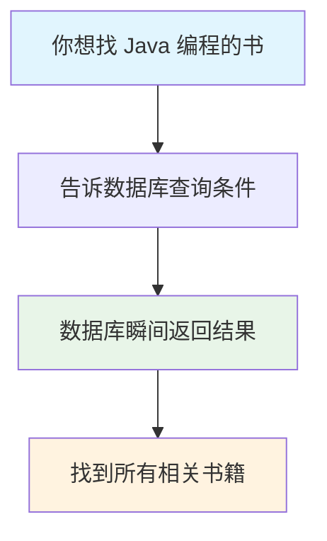
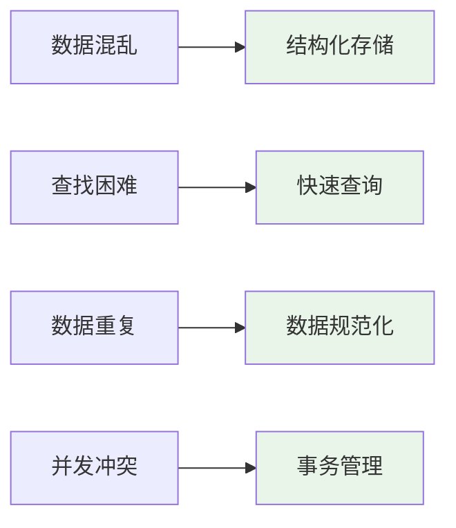
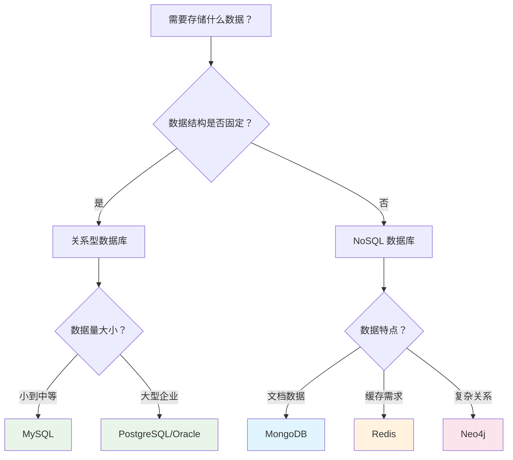

# 数据库基础完全指南 - 从零开始理解数据存储与管理的核心利器

## 📋 摘要

数据库是存储和管理数据的智能仓库，解决数据混乱、丢失、重复等问题。通过结构化存储、快速查询、安全保护等功能，让数据管理变得简单高效，是现代应用开发的基础技能。

---

## 🎯 目录

- [前置知识点](#前置知识点)
- [什么是数据库](#什么是数据库)
- [为什么需要数据库](#为什么需要数据库)
- [数据库的基本结构](#数据库的基本结构)
- [数据库的核心功能](#数据库的核心功能)
- [数据库的类型](#数据库的类型)
- [数据库的应用场景](#数据库的应用场景)
- [数据库 vs 文件存储](#数据库-vs-文件存储)
- [学习数据库的价值](#学习数据库的价值)
- [学习路径建议](#学习路径建议)
- [总结与展望](#总结与展望)

---

## 📚 前置知识点

### 基础知识点（小白必学）
- **计算机基础**：了解计算机如何存储和处理信息
- **数据概念**：理解什么是数据，数据的基本形式
- **文件操作**：知道如何创建、读取、修改文件

### 进阶知识点（有基础后学习）
- **编程基础**：了解编程语言的基本概念
- **网络基础**：理解客户端和服务器（Client-Server）的概念
- **系统架构**：了解应用程序的基本结构

---

## 🏪 什么是数据库

### 生活化比喻

数据库就像**超级智能的图书馆**，但比普通图书馆更强大：

- **普通图书馆**：书籍按分类摆放，需要人工查找
- **数据库**：数据按规则存储，可以瞬间找到任何信息

想象一下，如果你有一个包含 100 万本书的图书馆，你想找一本关于"Java 编程"的书：



### 专业定义

**数据库（Database）** 是一个有组织的数据集合，通过数据库管理系统（DBMS）进行管理，支持数据的存储、检索、更新和删除操作。

### 核心特点

1. **结构化存储**：数据按照预定义的结构组织
2. **高效查询**：可以快速找到需要的数据
3. **数据完整性**：确保数据的准确性和一致性
4. **并发访问**：多个用户可以同时使用
5. **安全保护**：防止数据丢失和未授权访问

---

## 🤔 为什么需要数据库

### 没有数据库的问题

想象一下，如果不用数据库，你的应用会是什么样子：

#### 问题 1：数据存储混乱
```
用户信息.txt
张三,25,北京,程序员
李四,30,上海,设计师
王五,28,广州,产品经理
```

**问题**：
- 格式不统一，容易出错
- 难以查找特定用户
- 数据修改困难

#### 问题 2：数据重复和冗余
```
订单1.txt: 张三,手机,3000元,北京
订单2.txt: 张三,手机,3000元,北京  // 重复信息
订单3.txt: 李四,电脑,5000元,上海
```

**问题**：
- 存储空间浪费
- 数据不一致
- 维护成本高

#### 问题 3：并发访问冲突
```
用户A 正在修改用户信息.txt
用户B 同时也在修改用户信息.txt
结果：文件损坏，数据丢失
```

### 数据库的解决方案



---

## 🏗️ 数据库的基本结构

### 🏢 数据库（Database）

**生活化比喻**：数据库就像一栋**智能大楼**，里面有很多专门用途的房间，每个房间都按照特定的规则存放物品。

- **作用**：存储和管理所有相关数据的容器
- **特点**：有组织、有规则、有管理
- **例子**：学校管理系统数据库、电商网站数据库

### 📋 表（Table）

**生活化比喻**：表就像大楼里的**一个专门房间**，比如"学生档案室"、"图书室"、"财务室"，每个房间只存放特定类型的东西。

- **作用**：存储特定类型数据的结构化容器
- **特点**：有固定的格式和规则
- **例子**：用户表、商品表、订单表

### 📊 表的结构

**生活化比喻**：表就像**Excel 表格**，有行有列，非常规整。

#### 行（Row）- 记录（Record）
- **生活化比喻**：就像表格中的一行，代表一个完整的信息
- **例子**：一个学生的所有信息（姓名、年龄、班级）
- **作用**：存储一条完整的数据记录

#### 列（Column）- 字段（Field）
- **生活化比喻**：就像表格中的一列，代表一种属性
- **例子**：姓名列、年龄列、班级列
- **作用**：定义数据的类型和属性

### 🔑 主键（Primary Key）

**生活化比喻**：主键就像**每个人的身份证号**，用来唯一标识一个人，不能重复，也不能为空。

- **作用**：唯一标识表中每一条记录的字段
- **特点**：不能重复、不能为空、不能修改
- **例子**：学生学号、商品编号、用户ID

### 🔗 表之间的关系

**生活化比喻**：就像不同部门之间的协作关系，学生档案室和成绩档案室通过"学号"建立联系。

- **一对一关系**：一个学生对应一个学号
- **一对多关系**：一个学生可以有多门课程成绩
- **多对多关系**：一个学生可以选多门课，一门课也可以被多个学生选

---

## ⚙️ 数据库的核心功能

### 1. 📊 数据存储（Data Storage）

**生活化比喻**：就像图书馆的书架，有序地存放各种书籍

**核心特点**：
- **结构化存储**：数据按照预定义的格式存放
- **有序管理**：每个数据都有固定的位置
- **容量巨大**：可以存储海量数据

**实际应用**：
- 存储用户信息（姓名、年龄、地址）
- 存储商品信息（名称、价格、库存）
- 存储订单信息（时间、金额、状态）

### 2. 🔍 数据查询（Data Query）

**生活化比喻**：就像图书馆的检索系统，输入关键词就能找到相关书籍

**核心特点**：
- **快速查找**：通过索引快速定位数据
- **条件筛选**：只返回符合条件的数据
- **灵活查询**：支持各种查询需求

**实际应用**：
- 查找特定用户的信息
- 筛选价格范围内的商品
- 统计某个时间段的订单

### 3. ✏️ 数据更新（Data Update）

**生活化比喻**：就像修改图书馆的书籍信息，更新后立即生效

**核心特点**：
- **实时更新**：修改后立即生效
- **批量操作**：可以同时更新多条记录
- **版本控制**：保留修改历史

**实际应用**：
- 修改用户个人信息
- 更新商品价格和库存
- 更改订单状态

### 4. 🗑️ 数据删除（Data Delete）

**生活化比喻**：就像从图书馆移除不需要的书籍

**核心特点**：
- **安全删除**：可以恢复误删的数据
- **批量删除**：可以同时删除多条记录
- **级联删除**：自动处理相关数据

**实际应用**：
- 删除过期商品
- 清理无效用户账号
- 移除历史订单记录

### 5. 🔒 数据安全（Data Security）

**生活化比喻**：就像图书馆的安保系统，保护书籍不被偷盗或损坏

**核心特点**：
- **权限控制**：不同用户有不同的访问权限
- **数据加密**：敏感数据加密存储
- **备份恢复**：定期备份，防止数据丢失

**实际应用**：
- 用户密码加密存储
- 管理员权限控制
- 定期数据备份

---

## 🗂️ 数据库的类型

### 关系型数据库（RDBMS）

**生活化比喻**：就像 Excel 表格，数据以行列形式组织，表与表之间有关联

| 数据库 | 特点 | 适用场景 |
|--------|------|----------|
| **MySQL** | 免费开源，易学易用 | Web 应用，中小企业 |
| **PostgreSQL** | 功能强大，支持复杂查询 | 大型应用，数据分析 |
| **Oracle** | 企业级，性能卓越 | 大型企业，金融系统 |
| **SQL Server** | 微软生态，集成度高 | Windows 应用，企业系统 |

### 非关系型数据库（NoSQL）

**生活化比喻**：就像不同的储物方式，每种都有特殊的用途

| 类型 | 代表 | 特点 | 适用场景 |
|------|------|------|----------|
| **文档数据库** | MongoDB | 存储 JSON 格式数据 | 内容管理，日志系统 |
| **键值数据库** | Redis | 超快读写速度 | 缓存，会话存储 |
| **列族数据库** | Cassandra | 分布式存储 | 大数据，物联网 |
| **图数据库** | Neo4j | 处理复杂关系 | 社交网络，推荐系统 |

### 数据库选择决策图



---

## 🌟 数据库的应用场景

### 1. 🛒 电商网站

**生活化比喻**：就像大型购物中心，需要管理商品、订单、用户等信息

**数据库设计**：
- **商品表**：存储商品的基本信息（编号、名称、价格、库存）
- **订单表**：存储订单信息（订单号、用户、商品、数量、日期）
- **用户表**：存储用户信息（姓名、地址、联系方式）

**实际应用**：
- 商品上架和下架管理
- 订单处理和跟踪
- 用户购买历史记录

### 2. 🏥 医院管理系统

**生活化比喻**：就像医院的档案室，需要管理患者、医生、病历等信息

**数据库设计**：
- **患者表**：存储患者的基本信息和病史
- **医生表**：存储医生的基本信息和专业信息
- **病历表**：存储诊疗记录和处方信息

**实际应用**：
- 患者挂号和信息管理
- 医生排班和科室管理
- 病历查询和统计分析

### 3. 🎓 学校管理系统

**生活化比喻**：就像学校的教务处，需要管理学生、课程、成绩等信息

**数据库设计**：
- **学生表**：存储学生的基本信息和学习信息
- **课程表**：存储课程的基本信息和教学信息
- **成绩表**：存储学生的考试成绩和学习记录

**实际应用**：
- 学生注册和学籍管理
- 课程安排和选课系统
- 成绩录入和查询统计

### 4. 📱 社交媒体

**生活化比喻**：就像朋友圈，需要管理用户、动态、评论、点赞等信息

**数据库设计**：
- **用户表**：存储用户的基本信息和账号信息
- **动态表**：存储用户发布的动态内容和时间
- **关系表**：存储用户之间的关注和好友关系

**实际应用**：
- 用户注册和登录管理
- 内容发布和分享功能
- 社交关系和互动统计

---

## 📊 数据库 vs 文件存储

### 对比分析

| 特性 | 文件存储 | 数据库 |
|------|----------|--------|
| **数据组织** | 无结构，自由格式 | 结构化，预定义格式 |
| **查询速度** | 慢，需要遍历文件 | 快，使用索引优化 |
| **数据一致性** | 难以保证 | 自动维护 |
| **并发访问** | 容易冲突 | 支持多用户并发 |
| **数据安全** | 基础保护 | 高级安全机制 |
| **扩展性** | 有限 | 支持大规模扩展 |

### 生活化对比

**文件存储**就像把东西随便放在房间里：
- ✅ 简单直接
- ❌ 找东西困难
- ❌ 容易弄丢
- ❌ 多人使用会混乱

**数据库**就像专业的仓库管理系统：
- ✅ 有序存放
- ✅ 快速查找
- ✅ 安全可靠
- ✅ 支持多人协作

---

## 💎 学习数据库的价值

### 1. 🎯 职业发展价值

**市场需求**：
- 几乎所有软件都需要数据库
- 数据库管理员（DBA）薪资较高
- 数据分析师必备技能

**技能提升**：
- 提升系统设计能力
- 增强问题解决思维
- 扩展技术知识面

### 2. 🚀 技术能力价值

**开发能力**：
- 后端开发必备技能
- 全栈开发基础
- 系统架构设计

**分析能力**：
- 数据分析和挖掘
- 业务逻辑理解
- 性能优化思维

### 3. 💡 思维训练价值

**逻辑思维**：
- 结构化思考
- 关系建模
- 问题分解

**系统思维**：
- 整体架构理解
- 模块化设计
- 扩展性考虑

---

## 📚 学习路径建议

### 🎯 小白学习路径（3-4 个月）

#### 第 1 个月：基础概念
- **第 1-2 周**：理解数据库基本概念
- **第 3-4 周**：学习 SQL 基础语法

#### 第 2 个月：实践操作
- **第 1-2 周**：安装 MySQL，进行基本操作
- **第 3-4 周**：完成简单项目（如学生管理系统）

#### 第 3 个月：进阶技能
- **第 1-2 周**：学习数据库设计原理
- **第 3-4 周**：掌握高级 SQL 查询

#### 第 4 个月：项目实战
- **第 1-2 周**：完成复杂项目（如电商系统）
- **第 3-4 周**：学习性能优化和最佳实践

### 🚀 有基础学习路径（1-2 个月）

#### 第 1 个月：快速掌握
- **第 1-2 周**：SQL 语法和数据库设计
- **第 3-4 周**：项目实战和优化技巧

#### 第 2 个月：深入应用
- **第 1-2 周**：学习 NoSQL 数据库
- **第 3-4 周**：掌握数据库集成和部署

### 📖 推荐学习资源

#### 在线课程
- **慕课网**：MySQL 基础课程
- **极客时间**：数据库实战课程
- **B 站**：免费数据库教程

#### 实践工具
- **MySQL Workbench**：官方图形化工具
- **Navicat**：专业数据库管理工具
- **在线 SQL 练习**：SQLBolt、LeetCode Database

#### 学习建议
1. **理论结合实践**：每学一个概念都要动手操作
2. **项目驱动学习**：通过实际项目巩固知识
3. **循序渐进**：不要急于学习高级特性
4. **多练习 SQL**：SQL 是数据库的核心技能

---

## 🎉 总结与展望

数据库是现代信息系统的**核心基础设施**，它就像一座智能的数据仓库，让我们的应用能够高效、安全、可靠地管理数据。无论你是想成为开发者、数据分析师，还是系统管理员，掌握数据库技术都是必不可少的技能。

### 🌟 核心价值回顾

- **解决数据管理问题**：告别数据混乱、丢失、重复的困扰
- **提升应用性能**：快速查询、高效存储、并发处理
- **保障数据安全**：权限控制、数据加密、备份恢复
- **支持业务发展**：灵活扩展、高可用性、分布式部署

### 💪 学习建议

1. **从基础开始**：先掌握数据库基本概念和 SQL 语法
2. **实践为主**：通过实际项目巩固理论知识
3. **循序渐进**：从简单查询到复杂业务逻辑
4. **关注趋势**：了解云数据库、大数据等新技术

### 🚀 未来发展趋势

- **云原生数据库**：更好的容器化和微服务集成
- **AI 驱动优化**：智能查询优化和自动调优
- **多模型数据库**：同时支持多种数据模型
- **边缘计算**：分布式数据库和边缘存储

现在你已经了解了数据库的基本概念和重要性，是时候开始你的数据库学习之旅了！记住，**最好的学习方式就是实践**。从简单的数据存储开始，逐步构建更复杂的数据管理系统，你会发现数据库让你的应用开发之路变得更加高效和可靠。

**加油，未来的数据库专家！** 🚀✨

---

**厦门工学院人工智能创作坊 -- 郑恩赐**  
**2025 年 10 月 24 日**
