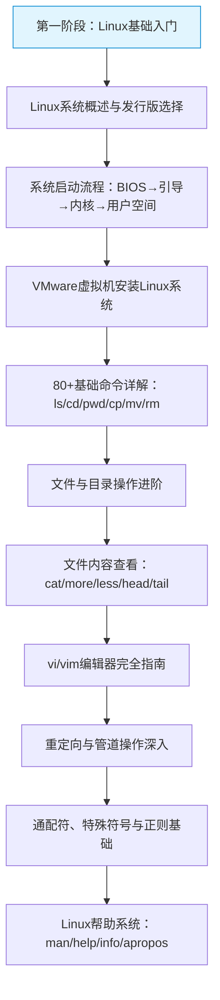
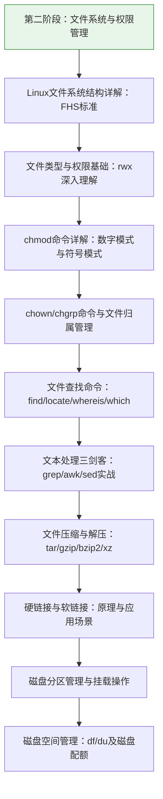
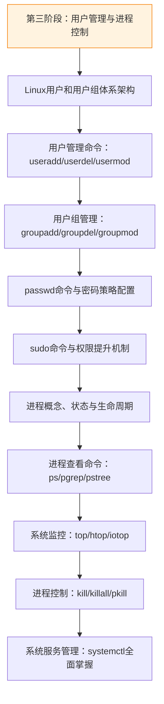
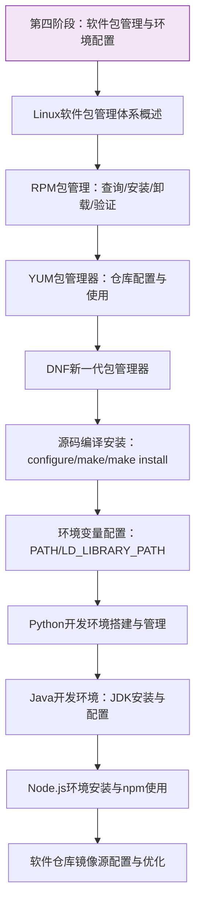
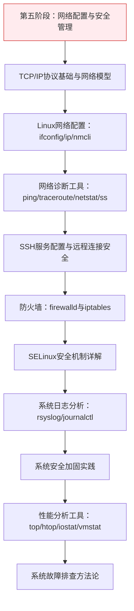
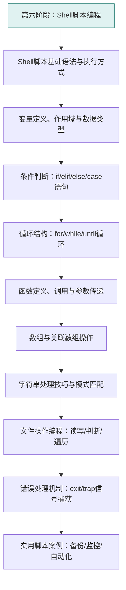
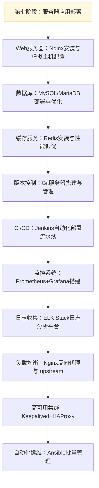

# Linux基础技术专栏

## 📝 专栏介绍

本专栏专注于Linux系统基础技术，从入门到进阶，系统学习Linux操作系统的核心知识和实用技能。适合后端开发者、系统管理员、运维工程师以及所有对Linux感兴趣的学习者。

## 🗺️ 学习路线图

### 第一阶段：Linux基础入门（L1系列）

### 第二阶段：文件系统与权限管理（L2系列）

### 第三阶段：用户管理与进程控制（L3系列）

### 第四阶段：软件包管理与环境配置（L4系列）

### 第五阶段：网络配置与安全管理（L5系列）

### 第六阶段：Shell脚本编程（L6系列）

### 第七阶段：服务器应用部署（L7系列）

## 📚 文档链接目录

### 📋 基础篇

### 🎯 第一阶段：Linux基础入门

- [L1C-VMware创建CentOS虚拟机完全指南](f:\BaiduSyncdisk\ZhengEnCi\Note\Knowledge\Knowledges\玩转Linux\L1C-VMware创建CentOS虚拟机完全指南.md) - [掘金](https://juejin.cn/post/7616598497153253426) | [CSDN](https://blog.csdn.net/2301_79239314/article/details/159048570)

### 📊 第二阶段：文件系统与权限管理

### ⚙️ 第三阶段：用户管理与进程控制

### 🏗️ 第四阶段：软件包管理与环境配置

### 🔒 第五阶段：网络配置与安全管理

### 💻 第六阶段：Shell脚本编程

### 🚀 第七阶段：服务器应用部署

---

*本专栏持续更新中，欢迎提出宝贵建议！*