# N0-为什么90%的网络小白学不好计算机网络？大厂网络工程师的六阶段通关内幕大公开

## 📝 摘要

**90% 的网络小白在协议栈迷宫中迷失**，零散学习导致知识碎片化，**大厂网络工程师有一套系统的六阶段通关秘籍**！新手死记硬背 → 专家理解原理；新手盲目抓包 → 专家秒杀故障。从网络小白到网络大神，只需路径！

## 🗺️ 计算机网络完整学习路线图

```mermaid
graph TD
    Start["计算机网络学习路线图"]
    
    P1["第一阶段：网络基础概念<br/>(7-10天)"]
    P1A["N1A: 计算机网络定义"]
    P1B["N1B: 网络分类"]
    P1C["N1C: 网络拓扑结构"]
    P1D["N1D: OSI 七层模型"]
    P1E["N1E: TCP/IP 四层模型"]
    
    P2["第二阶段：网络协议体系<br/>(10-14天)"]
    P2A["N2A: 物理层"]
    P2B["N2B: 数据链路层"]
    P2C["N2C: 网络层 IP 协议"]
    P2D["N2D: ICMP、ARP 协议"]
    P2E["N2E: 路由选择算法"]
    
    P3["第三阶段：传输层协议<br/>(10-14天)"]
    P3A["N3A: TCP 协议"]
    P3B["N3B: UDP 协议"]
    P3C["N3C: 三次握手与四次挥手"]
    P3D["N3D: 流量控制与拥塞控制"]
    P3E["N3E: 端口号与套接字"]
    
    P4["第四阶段：应用层协议<br/>(10-14天)"]
    P4A["N4A: HTTP/HTTPS 协议"]
    P4B["N4B: DNS 域名解析"]
    P4C["N4C: FTP、SMTP 协议"]
    P4D["N4D: WebSocket 协议"]
    P4E["N4E: RESTful API 设计"]
    
    P5["第五阶段：网络安全<br/>(10-14天)"]
    P5A["N5A: 加密技术（对称/非对称）"]
    P5B["N5B: SSL/TLS 协议"]
    P5C["N5C: 防火墙与入侵检测"]
    P5D["N5D: 常见网络攻击与防护"]
    P5E["N5E: VPN 与安全通信"]
    
    P6["第六阶段：实战应用<br/>(14-21天)"]
    P6A["N6A: Wireshark 抓包分析"]
    P6B["N6B: 配置网络设备与路由"]
    P6C["N6C: 搭建小型局域网"]
    P6D["N6D: 网络应用开发"]
    P6E["N6E: 网络故障排查"]
    
    Start --> P1
    P1 --> P1A --> P1B --> P1C --> P1D --> P1E
    P1E --> P2
    P2 --> P2A --> P2B --> P2C --> P2D --> P2E
    P2E --> P3
    P3 --> P3A --> P3B --> P3C --> P3D --> P3E
    P3E --> P4
    P4 --> P4A --> P4B --> P4C --> P4D --> P4E
    P4E --> P5
    P5 --> P5A --> P5B --> P5C --> P5D --> P5E
    P5E --> P6
    P6 --> P6A --> P6B --> P6C --> P6D --> P6E
    
    style Start fill:#e3f2fd,stroke:#1976d2,stroke-width:3px
    style P1 fill:#e1f5fe,stroke:#0288d1
    style P2 fill:#e8f5e9,stroke:#388e3c
    style P3 fill:#fff3e0,stroke:#f57c00
    style P4 fill:#f3e5f5,stroke:#7b1fa2
    style P5 fill:#fce4ec,stroke:#c2185b
    style P6 fill:#ffebee,stroke:#d32f2f
```

## 📚 学习阶段详解

### 第一阶段：网络基础概念 Must

**学习目标**：建立计算机网络的基础认知，理解网络的基本概念和体系结构。

**核心知识点**：

- **N1A - 计算机网络定义** 📖 [RFC 1122](https://www.rfc-editor.org/rfc/rfc1122.html) 📚 [计算机网络概述 - 维基百科](https://zh.wikipedia.org/wiki/%E8%AE%A1%E7%AE%97%E6%9C%BA%E7%BD%91%E7%BB%9C)：将多台计算机及其外部设备通过通信线路连接起来，按照网络协议进行数据交换和资源共享的系统。

- **N1B - 网络分类** 📚 [局域网与广域网 - 维基百科](https://zh.wikipedia.org/wiki/%E5%B1%80%E5%9F%9F%E7%BD%91)：局域网（LAN、Local Area Network）、广域网（WAN、Wide Area Network）、城域网（MAN、Metropolitan Area Network）、互联网（Internet）。

- **N1C - 网络拓扑结构** 📚 [网络拓扑结构 - 维基百科](https://zh.wikipedia.org/wiki/%E7%BD%91%E7%BB%9C%E6%8B%93%E6%89%91)：星型、总线型、环型、网状型等。

- **N1D - OSI 七层模型** 📖 [OSI 模型 - ISO 标准](https://www.iso.org/standard/20269.html) 📚 [OSI 七层模型详解 - 维基百科](https://zh.wikipedia.org/wiki/OSI%E6%A8%A1%E5%9E%8B)：物理层、数据链路层、网络层、传输层、会话层、表示层、应用层。

- **N1E - TCP/IP 四层模型** 📖 [RFC 1122](https://www.rfc-editor.org/rfc/rfc1122.html) 📚 [TCP/IP 模型详解 - 维基百科](https://zh.wikipedia.org/wiki/TCP/IP%E5%8D%8F%E8%AE%AE%E6%97%8F)：应用层、传输层、网络层、链路层。

**学习建议**：

- 使用比喻理解：OSI 七层模型就像寄快递的流程，每一层负责不同的包装和运输环节。
- 对比理解：OSI 模型是理论模型，TCP/IP 模型是实际应用的模型。

### 第二阶段：网络协议体系 Must

**学习目标**：深入理解网络各层的协议和工作原理。

**核心知识点**：

- **N2A - 物理层** 📖 [IEEE 802.3 标准](https://www.ieee802.org/3/) 📚 [物理层详解 - 维基百科](https://zh.wikipedia.org/wiki/%E7%89%A9%E7%90%86%E5%B1%82)：负责比特流（bit stream）的传输，定义电气特性和物理接口。

- **N2B - 数据链路层** 📖 [IEEE 802.3 以太网标准](https://www.ieee802.org/3/) 📚 [数据链路层详解 - 维基百科](https://zh.wikipedia.org/wiki/%E6%95%B0%E6%8D%AE%E9%93%BE%E8%B7%AF%E5%B1%82)：负责帧（frame）的传输，包括以太网（Ethernet）协议。

- **N2C - 网络层 IP 协议** 📖 [RFC 791 - IP 协议](https://www.rfc-editor.org/rfc/rfc791.html) 📚 [IP 协议详解 - 维基百科](https://zh.wikipedia.org/wiki/%E4%BA%92%E8%81%94%E7%BD%91%E5%8D%8F%E8%AE%AE)：负责数据包（packet）的路由和转发，核心协议是 IP（Internet Protocol，互联网协议）。

- **N2D - ICMP 协议** 📖 [RFC 792 - ICMP 协议](https://www.rfc-editor.org/rfc/rfc792.html) 📚 [ICMP 协议详解 - 维基百科](https://zh.wikipedia.org/wiki/ICMP)：Internet 控制消息协议（Internet Control Message Protocol），用于网络诊断。

- **N2E - ARP 协议** 📖 [RFC 826 - ARP 协议](https://www.rfc-editor.org/rfc/rfc826.html) 📚 [ARP 协议详解 - 维基百科](https://zh.wikipedia.org/wiki/%E5%9C%B0%E5%9D%80%E8%A7%A3%E6%9E%90%E5%8D%8F%E8%AE%AE)：地址解析协议（Address Resolution Protocol），将 IP 地址映射到 MAC 地址。

**学习建议**：

- 重点理解 IP 地址的分类和子网划分。
- 掌握路由选择的基本原理。

### 第三阶段：传输层协议 Must

**学习目标**：掌握 TCP 和 UDP 协议的区别和应用场景。

**核心知识点**：

- **N3A - TCP 协议** 📖 [RFC 793 - TCP 协议](https://www.rfc-editor.org/rfc/rfc793.html) 📚 [TCP 协议详解 - 维基百科](https://zh.wikipedia.org/wiki/%E4%BC%A0%E8%BE%93%E6%8E%A7%E5%88%B6%E5%8D%8F%E8%AE%AE)：传输控制协议（Transmission Control Protocol），面向连接的可靠传输协议，提供流量控制和拥塞控制。

- **N3B - UDP 协议** 📖 [RFC 768 - UDP 协议](https://www.rfc-editor.org/rfc/rfc768.html) 📚 [UDP 协议详解 - 维基百科](https://zh.wikipedia.org/wiki/%E7%94%A8%E6%88%B7%E6%95%B0%E6%8D%AE%E6%8A%A5%E5%8D%8F%E8%AE%AE)：用户数据报协议（User Datagram Protocol），无连接的不可靠传输协议，传输速度快但可能丢包。

- **N3C - 三次握手** 📚 [TCP 三次握手详解 - 维基百科](https://zh.wikipedia.org/wiki/%E4%BC%A0%E8%BE%93%E6%8E%A7%E5%88%B6%E5%8D%8F%E8%AE%AE) 💡 [TCP 三次握手详解 - MDN](https://developer.mozilla.org/zh-CN/docs/Glossary/TCP_handshake)：TCP 建立连接的过程。

- **N3D - 四次挥手** 📚 [TCP 四次挥手详解 - 维基百科](https://zh.wikipedia.org/wiki/%E4%BC%A0%E8%BE%93%E6%8E%A7%E5%88%B6%E5%8D%8F%E8%AE%AE) 💡 [TCP 连接关闭 - MDN](https://developer.mozilla.org/zh-CN/docs/Glossary/TCP_handshake)：TCP 断开连接的过程。

- **N3E - 端口号** 📖 [RFC 6335 - 端口号分配](https://www.rfc-editor.org/rfc/rfc6335.html) 📚 [端口号详解 - 维基百科](https://zh.wikipedia.org/wiki/TCP/UDP%E7%AB%AF%E5%8F%A3%E5%88%97%E8%A1%A8)：用于区分不同应用程序的标识符（0-65535）。

**学习建议**：

- 理解 TCP 可靠性的保证机制。
- 对比 TCP 和 UDP 的适用场景：TCP 适合需要可靠传输的场景（如文件传输），UDP 适合实时性要求高的场景（如视频通话）。

### 第四阶段：应用层协议 Should

**学习目标**：掌握常见的应用层协议和 Web 开发相关技术。

**核心知识点**：

- **N4A - HTTP/HTTPS 协议** 📖 [RFC 7231 - HTTP/1.1](https://www.rfc-editor.org/rfc/rfc7231.html) 📖 [RFC 2818 - HTTP over TLS](https://www.rfc-editor.org/rfc/rfc2818.html) 📚 [MDN Web 文档 - HTTP](https://developer.mozilla.org/zh-CN/docs/Web/HTTP)：超文本传输协议（Hypertext Transfer Protocol），Web 应用的基础。HTTPS 是在 HTTP 基础上添加了 SSL/TLS 加密。

- **N4B - DNS 协议** 📖 [RFC 1035 - DNS 协议](https://www.rfc-editor.org/rfc/rfc1035.html) 📚 [DNS 协议详解 - 维基百科](https://zh.wikipedia.org/wiki/%E5%9F%9F%E5%90%8D%E7%B3%BB%E7%BB%9F)：域名系统（Domain Name System），将域名解析为 IP 地址。

- **N4C - FTP 协议** 📖 [RFC 959 - FTP 协议](https://www.rfc-editor.org/rfc/rfc959.html) 📚 [FTP 协议详解 - 维基百科](https://zh.wikipedia.org/wiki/%E6%96%87%E4%BB%B6%E4%BC%A0%E8%BE%93%E5%8D%8F%E8%AE%AE)：文件传输协议（File Transfer Protocol）。

- **N4D - SMTP 协议** 📖 [RFC 5321 - SMTP 协议](https://www.rfc-editor.org/rfc/rfc5321.html) 📚 [SMTP 协议详解 - 维基百科](https://zh.wikipedia.org/wiki/%E7%AE%80%E5%8D%95%E9%82%AE%E4%BB%B6%E4%BC%A0%E8%BE%93%E5%8D%8F%E8%AE%AE)：简单邮件传输协议（Simple Mail Transfer Protocol）。

- **N4E - WebSocket 协议** 📖 [RFC 6455 - WebSocket 协议](https://www.rfc-editor.org/rfc/rfc6455.html) 📚 [MDN Web 文档 - WebSocket](https://developer.mozilla.org/zh-CN/docs/Web/API/WebSocket)：全双工通信协议，支持实时通信。

**学习建议**：

- 重点掌握 HTTP 请求和响应的格式。
- 理解 HTTPS 的加密原理。
- 学习 RESTful API 设计规范。

### 第五阶段：网络安全 Should

**学习目标**：了解网络安全威胁和防护措施。

**核心知识点**：

- **N5A - 加密技术** 📖 [RFC 4880 - OpenPGP](https://www.rfc-editor.org/rfc/rfc4880.html) 📚 [加密技术详解 - 维基百科](https://zh.wikipedia.org/wiki/%E5%8A%A0%E5%AF%86)：对称加密（AES、Advanced Encryption Standard）和非对称加密（RSA、Rivest-Shamir-Adleman）。

- **N5B - SSL/TLS 协议** 📖 [RFC 8446 - TLS 1.3](https://www.rfc-editor.org/rfc/rfc8446.html) 📚 [SSL/TLS 协议详解 - MDN](https://developer.mozilla.org/zh-CN/docs/Web/Security/Transport_Layer_Security)：安全套接层协议（Secure Sockets Layer / Transport Layer Security），保障数据传输安全。

- **N5C - 防火墙** 📚 [防火墙技术详解 - 维基百科](https://zh.wikipedia.org/wiki/%E9%98%B2%E7%81%AB%E5%A2%99)：网络边界安全防护设备（Firewall）。

- **N5D - 常见攻击** 📚 [网络安全威胁详解 - OWASP](https://owasp.org/)：DDoS 攻击（Distributed Denial of Service，分布式拒绝服务攻击）、中间人攻击（Man-in-the-Middle Attack）、SQL 注入（SQL Injection）等。

- **N5E - VPN** 📖 [RFC 2764 - VPN 框架](https://www.rfc-editor.org/rfc/rfc2764.html) 📚 [VPN 技术详解 - 维基百科](https://zh.wikipedia.org/wiki/%E8%99%9B%E6%93%AC%E7%A7%81%E4%BA%BA%E7%B6%B2%E8%B7%AF)：虚拟专用网络（Virtual Private Network），提供安全通信通道。

**学习建议**：

- 理解加密算法的基本原理。
- 掌握常见网络攻击的防护方法。

### 第六阶段：实战应用 Could

**学习目标**：通过实践项目巩固理论知识。

**核心实践**：

- **N6A - Wireshark 抓包分析** 💡 [Wireshark 官方文档](https://www.wireshark.org/docs/) 📚 [Wireshark 使用教程 - 维基百科](https://zh.wikipedia.org/wiki/Wireshark)：使用 Wireshark 工具抓取和分析网络数据包（packet）。

- **N6B - 网络设备配置** 💡 [Cisco Packet Tracer](https://www.netacad.com/courses/packet-tracer) 📚 [Cisco 网络学院](https://www.netacad.com/)：配置路由器（Router）和交换机（Switch）。

- **N6C - 搭建局域网** 📚 [局域网搭建指南 - 维基百科](https://zh.wikipedia.org/wiki/%E5%B1%80%E5%9F%9F%E7%BD%91)：设计并实现小型局域网（LAN）。

- **N6D - 网络应用开发** 💡 [Socket 编程 - Python 官方文档](https://docs.python.org/3/library/socket.html) 📚 [Socket 编程详解 - 维基百科](https://zh.wikipedia.org/wiki/Berkeley%E5%A5%97%E6%8E%A5%E5%AD%97)：开发基于 Socket（套接字）的网络应用。

- **N6E - 故障排查** 📚 [网络故障排查 - 维基百科](https://zh.wikipedia.org/wiki/%E7%BD%91%E7%BB%9C%E6%95%85%E9%9A%9C%E6%8E%92%E9%99%A4) 💡 [网络诊断工具 - Wikipedia](https://en.wikipedia.org/wiki/Network_troubleshooting)：学习网络故障的诊断和解决。

**学习建议**：

- 动手实践是掌握网络知识的关键。
- 通过实际项目加深理解。

## 📚 参考资料

### 第一阶段：网络基础概念

**📖 官方文档**：
- [RFC 1122 - Internet 主机要求](https://www.rfc-editor.org/rfc/rfc1122.html)：TCP/IP 协议族标准文档
- [ISO/IEC 7498 - OSI 模型](https://www.iso.org/standard/20269.html)：OSI 参考模型国际标准

**📚 教程与详解**：
- [计算机网络概述 - 维基百科](https://zh.wikipedia.org/wiki/%E8%AE%A1%E7%AE%97%E6%9C%BA%E7%BD%91%E7%BB%9C)：计算机网络基础知识教程
- [OSI 模型详解 - 维基百科](https://zh.wikipedia.org/wiki/OSI%E6%A8%A1%E5%9E%8B)：OSI 七层模型详细说明
- [TCP/IP 模型详解 - 维基百科](https://zh.wikipedia.org/wiki/TCP/IP%E5%8D%8F%E8%AE%AE%E6%97%8F)：TCP/IP 四层模型详解

**📖 推荐书籍**：
- **《计算机网络》（第 8 版）** - 谢希仁：国内经典教材，内容全面系统

---

### 第二阶段：网络协议体系

**📖 官方文档**：
- [RFC 791 - IP 协议](https://www.rfc-editor.org/rfc/rfc791.html)：IP 协议标准文档
- [RFC 792 - ICMP 协议](https://www.rfc-editor.org/rfc/rfc792.html)：ICMP 协议标准文档
- [RFC 826 - ARP 协议](https://www.rfc-editor.org/rfc/rfc826.html)：ARP 协议标准文档
- [IEEE 802.3 标准](https://www.ieee802.org/3/)：以太网标准文档

**📚 教程与详解**：
- [IP 协议详解 - 维基百科](https://zh.wikipedia.org/wiki/%E4%BA%92%E8%81%94%E7%BD%91%E5%8D%8F%E8%AE%AE)：IP 协议基础知识
- [以太网协议详解 - 维基百科](https://zh.wikipedia.org/wiki/%E4%BB%A5%E5%A4%AA%E7%BD%91)：以太网协议详细说明

**📖 推荐书籍**：
- **《TCP/IP 详解 卷 1：协议》** - W. Richard Stevens：深入理解 TCP/IP 协议

---

### 第三阶段：传输层协议

**📖 官方文档**：
- [RFC 793 - TCP 协议](https://www.rfc-editor.org/rfc/rfc793.html)：TCP 协议标准文档
- [RFC 768 - UDP 协议](https://www.rfc-editor.org/rfc/rfc768.html)：UDP 协议标准文档
- [RFC 6335 - 端口号分配](https://www.rfc-editor.org/rfc/rfc6335.html)：端口号分配标准

**📚 教程与详解**：
- [TCP 协议详解 - 维基百科](https://zh.wikipedia.org/wiki/%E4%BC%A0%E8%BE%93%E6%8E%A7%E5%88%B6%E5%8D%8F%E8%AE%AE)：TCP 协议基础知识
- [UDP 协议详解 - 维基百科](https://zh.wikipedia.org/wiki/%E7%94%A8%E6%88%B7%E6%95%B0%E6%8D%AE%E6%8A%A5%E5%8D%8F%E8%AE%AE)：UDP 协议详细说明

**💡 示例与实践**：
- [TCP 三次握手详解 - MDN](https://developer.mozilla.org/zh-CN/docs/Glossary/TCP_handshake)：TCP 连接建立过程示例
- [TCP 连接关闭 - MDN](https://developer.mozilla.org/zh-CN/docs/Glossary/TCP_handshake)：TCP 连接断开过程示例

---

### 第四阶段：应用层协议

**📖 官方文档**：
- [RFC 7231 - HTTP/1.1](https://www.rfc-editor.org/rfc/rfc7231.html)：HTTP/1.1 协议标准文档
- [RFC 2818 - HTTP over TLS](https://www.rfc-editor.org/rfc/rfc2818.html)：HTTPS 协议标准文档
- [RFC 1035 - DNS 协议](https://www.rfc-editor.org/rfc/rfc1035.html)：DNS 协议标准文档
- [RFC 6455 - WebSocket 协议](https://www.rfc-editor.org/rfc/rfc6455.html)：WebSocket 协议标准文档

**📚 教程与详解**：
- [MDN Web 文档 - HTTP](https://developer.mozilla.org/zh-CN/docs/Web/HTTP)：HTTP 协议详细文档
- [MDN Web 文档 - WebSocket](https://developer.mozilla.org/zh-CN/docs/Web/API/WebSocket)：WebSocket API 文档
- [DNS 协议详解 - 维基百科](https://zh.wikipedia.org/wiki/%E5%9F%9F%E5%90%8D%E7%B3%BB%E7%BB%9F)：DNS 协议详细说明

**📖 推荐书籍**：
- **《HTTP 权威指南》** - David Gourley：HTTP 协议完整指南

---

### 第五阶段：网络安全

**📖 官方文档**：
- [RFC 8446 - TLS 1.3](https://www.rfc-editor.org/rfc/rfc8446.html)：TLS 1.3 协议标准文档
- [RFC 4880 - OpenPGP](https://www.rfc-editor.org/rfc/rfc4880.html)：加密技术标准文档

**📚 教程与详解**：
- [MDN Web 文档 - TLS](https://developer.mozilla.org/zh-CN/docs/Web/Security/Transport_Layer_Security)：TLS 协议详细文档
- [网络安全威胁详解 - OWASP](https://owasp.org/)：常见网络安全威胁和防护措施

**📖 推荐书籍**：
- **《网络安全基础》** - William Stallings：网络安全基础教材

---

### 第六阶段：实战应用

**💡 工具与平台**：
- [Wireshark 官方文档](https://www.wireshark.org/docs/)：网络抓包工具使用教程
- [Cisco Packet Tracer](https://www.netacad.com/courses/packet-tracer)：网络模拟实验平台
- [GNS3](https://www.gns3.com/)：网络仿真平台

**📚 教程与详解**：
- [Socket 编程 - Python 官方文档](https://docs.python.org/3/library/socket.html)：Python Socket 编程教程
- [网络故障排查指南 - 维基百科](https://zh.wikipedia.org/wiki/%E7%BD%91%E7%BB%9C%E6%95%85%E9%9A%9C%E6%8E%92%E9%99%A4)：网络故障诊断方法

**🔗 其他参考资源**：
- [Coursera 在线课程平台](https://www.coursera.org/)：在线课程学习平台
- [中国大学 MOOC](https://www.icourse163.org/)：国内优质在线课程

## 总结

计算机网络是现代信息技术的基石，掌握网络知识对于开发者来说至关重要。通过本学习路线图，你可以系统地从基础概念到实战应用，循序渐进地掌握计算机网络的核心知识。

**学习建议**：

- **循序渐进**：按照六个阶段顺序学习，不要跳跃。
- **理论结合实践**：在学习理论知识的同时，多动手实践，使用 Wireshark 抓包分析，搭建实验环境。
- **对比理解**：通过对比不同协议的特点和应用场景，加深理解。
- **持续学习**：网络技术发展迅速，需要持续关注新技术和标准。

**鼓励**：

计算机网络学习可能一开始会觉得抽象难懂，但只要按照正确的方法，循序渐进地学习，你一定能够掌握网络知识，成为一名优秀的网络工程师！记住，每一个大厂网络工程师都是从零基础开始的，重要的是坚持和正确的学习方法。加油！

---
**作者**：郑恩赐  
**机构**：厦门工学院人工智能创作坊  
**日期**：2025 年 11 月 04 日

