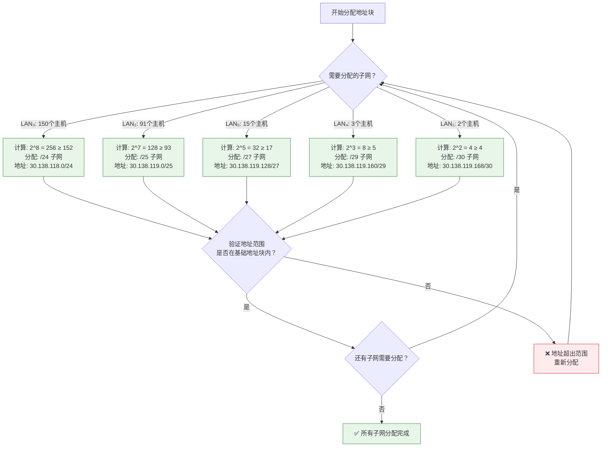
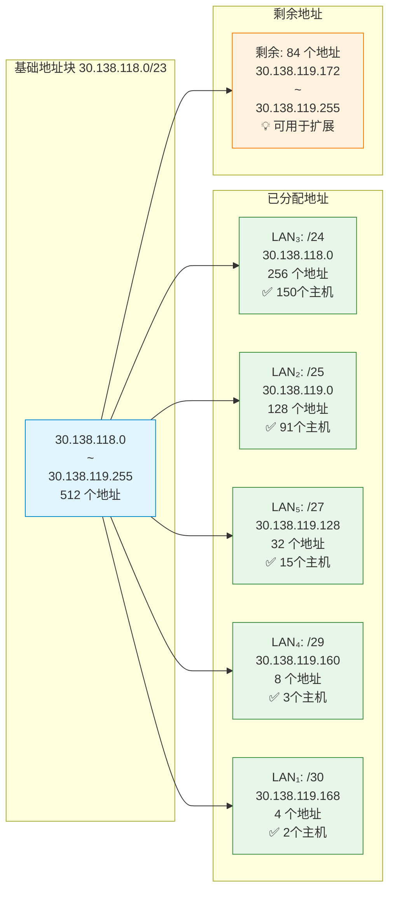

# N2H-为什么99%的人不会做子网划分？网络高手却这样秒算：VLSM子网划分实战解析

## 📝 摘要

99% 的网络小白看到子网划分就懵了，不知道如何根据主机数分配地址块，而网络高手却能秒算 VLSM 子网划分！新手只会死记硬背 → 专家理解原理。本文通过经典实战案例解析，手把手教你掌握 VLSM 子网划分精髓，从新手到高手的蜕变。

## 📚 目录

- [0. 实战案例](#0-实战案例)
- [1. 问题分析：为什么99%的人不会做子网划分？](#1-问题分析为什么99的人不会做子网划分)
- [2. 案例信息提取](#2-案例信息提取)
- [3. VLSM 子网划分基础](#3-vlsm-子网划分基础)
- [4. 解题思路](#4-解题思路)
- [5. 详细计算过程](#5-详细计算过程)
- [6. 完整答案表格](#6-完整答案表格)
- [7. 验证与总结](#7-验证与总结)
- [8. 参考资料](#8-参考资料)

## 0. 实战案例

一个自治系统（Autonomous System，AS）分配到的 IP 地址块为 **30.138.118/23**（注：完整写法应为 `30.138.118.0/23`），并包含有 5 个局域网（Local Area Network，LAN），其连接图如下所示，每个局域网上的主机数分别标注在图上。试给出每一个局域网的地址块（包括前缀）。

### 网络拓扑结构

```
                   30.138.118.0/23
                          |
                    ┌─────┴─────┐
                    │   LAN₁    │
                    │  (主干网)  │
                    └─────┬─────┘
                          │
          ┌───────────────┼───────────────┐
          │               │               │
       ┌──┴──┐        ┌──┴──┐        ┌──┴──┐
       │LAN₂ │        │LAN₃ │        │LAN₄ │
       │ 91个│        │150个│        │ 3个 │
       │主机 │        │主机 │        │主机 │
       └─────┘        └─────┘        └──┬──┘
                                         │
                                      ┌──┴──┐
                                      │LAN₅ │
                                      │15个 │
                                      │主机 │
                                      └─────┘
```

**网络拓扑说明**：
- **LAN₁**：主干网络，连接其他所有局域网
- **LAN₂**：91 个主机
- **LAN₃**：150 个主机
- **LAN₄**：3 个主机
- **LAN₅**：15 个主机

### 案例要求

给出每个子网的下列信息：

| 网络 | IP范围 | 子网掩码 | 网络地址 | 广播地址 |
|------|--------|----------|----------|----------|
| LAN3 |        |          |          |          |
| LAN2 |        |          |          |          |
| LAN5 |        |          |          |          |
| LAN4 |        |          |          |          |
| LAN1 |        |          |          |          |

---

## 1. 问题分析：为什么99%的人不会做子网划分？

### 1.1 新手常见错误场景

**错误做法**：
- ❌ 看到 `/23` 就懵了，不知道如何计算可用地址范围
- ❌ 不知道如何根据主机数量确定合适的子网掩码
- ❌ 分配地址时浪费严重，没有考虑实际需求
- ❌ 不知道 VLSM（可变长子网掩码）的概念和应用
- ❌ 计算网络地址和广播地址时容易出错

**结果**：IP 地址浪费严重，网络规划不合理，无法满足实际需求。😭

### 1.2 网络高手的做法

**正确做法**：
- ✅ 理解 CIDR 表示法，快速计算可用地址范围
- ✅ 根据主机数量需求，使用 VLSM 精确分配地址块
- ✅ 掌握网络地址和广播地址的计算方法
- ✅ 按主机数从大到小分配，避免浪费
- ✅ 验证所有分配结果，确保无重叠和遗漏

**结果**：IP 地址利用率高，网络规划合理，满足所有需求！🚀

## 2. 案例信息提取

### 2.1 基础信息

- **基础地址块**：`30.138.118.0/23`
- **CIDR 前缀长度**：23 位
- **网络前缀**：`30.138.118.0`
- **可用主机位**：32 - 23 = 9 位
- **总可用地址数**：2^9 = 512 个地址
- **可用 IP 范围**：`30.138.118.0` ~ `30.138.119.255`（包括网络地址和广播地址）
- **实际可用主机数**：512 - 2 = 510 个主机

### 2.2 各局域网主机需求

| 局域网 | 主机数 | 说明 |
|--------|--------|------|
| LAN₃ | 150 | 最大子网 |
| LAN₂ | 91 | 较大子网 |
| LAN₅ | 15 | 中等子网 |
| LAN₄ | 3 | 小子网 |
| LAN₁ | 至少 2 | 主干网（连接其他网络，至少需要 2 个接口） |

### 2.3 地址分配策略

**VLSM（Variable Length Subnet Mask，可变长子网掩码）分配原则**：
1. **按主机数从大到小分配**：优先分配需要更多主机的子网
2. **精确匹配**：根据实际需求选择最合适的子网掩码，避免浪费
3. **连续分配**：从基础地址块开始，按顺序分配地址空间

## 3. VLSM 子网划分基础

### 3.1 什么是 VLSM？

📖 [RFC 1878 - Variable Length Subnet Table](https://www.rfc-editor.org/rfc/rfc1878.html) 📚 [可变长子网掩码（VLSM）- 阿里云开发者社区](https://developer.aliyun.com/article/1047436) 💡 [简单搞懂子网划分，学会子网划分这篇就够了（例题详解）- 腾讯云开发者社区](https://cloud.tencent.com/developer/article/2106151)

**VLSM（Variable Length Subnet Mask（可变长子网掩码））** 是一种允许在同一网络中使用不同长度子网掩码的技术，它能够根据实际需求灵活分配地址空间，提高 IP 地址的利用率。

**生活化比喻**：
- **传统固定子网划分** = 只能用固定大小的盒子装东西，小东西用大盒子浪费空间
- **VLSM** = 可以根据东西大小选择合适大小的盒子，充分利用空间

### 3.2 主机数需求计算

**计算公式**：所需主机位数 n 满足 2^n ≥ 主机数 + 2

**说明**：
- 每个子网需要 1 个网络地址和 1 个广播地址
- 实际可用主机数 = 2^n - 2
- 子网掩码 = 32 - n

**常用主机数对应的 CIDR 前缀长度**：

| 主机数需求 | 所需主机位 | 2^n | 实际可用主机数 | CIDR 前缀 | 子网掩码 |
|-----------|-----------|-----|---------------|-----------|----------|
| 1-2 | 2 | 4 | 2 | /30 | 255.255.255.252 |
| 3-6 | 3 | 8 | 6 | /29 | 255.255.255.248 |
| 7-14 | 4 | 16 | 14 | /28 | 255.255.255.240 |
| 15-30 | 5 | 32 | 30 | /27 | 255.255.255.224 |
| 31-62 | 6 | 64 | 62 | /26 | 255.255.255.192 |
| 63-126 | 7 | 128 | 126 | /25 | 255.255.255.128 |
| 127-254 | 8 | 256 | 254 | /24 | 255.255.255.0 |

### 3.3 网络地址和广播地址计算

**网络地址**：子网中第一个 IP 地址，主机位全为 0
**广播地址**：子网中最后一个 IP 地址，主机位全为 1
**可用 IP 范围**：网络地址 + 1 到 广播地址 - 1

## 4. 解题思路

### 4.1 步骤一：确定各子网所需的主机位数

根据各局域网的主机数需求，计算所需的主机位数：

1. **LAN₃（150 个主机）**：
   - 需要：2^8 = 256 ≥ 150 + 2 = 152
   - 所需主机位：8 位
   - CIDR 前缀：32 - 8 = 24
   - 子网掩码：`255.255.255.0`（/24）

2. **LAN₂（91 个主机）**：
   - 需要：2^7 = 128 ≥ 91 + 2 = 93
   - 所需主机位：7 位
   - CIDR 前缀：32 - 7 = 25
   - 子网掩码：`255.255.255.128`（/25）

3. **LAN₅（15 个主机）**：
   - 需要：2^5 = 32 ≥ 15 + 2 = 17
   - 所需主机位：5 位
   - CIDR 前缀：32 - 5 = 27
   - 子网掩码：`255.255.255.224`（/27）

4. **LAN₄（3 个主机）**：
   - 需要：2^2 = 4 ≥ 3 + 2 = 5 ❌ 不够
   - 需要：2^3 = 8 ≥ 3 + 2 = 5
   - 所需主机位：3 位
   - CIDR 前缀：32 - 3 = 29
   - 子网掩码：`255.255.255.248`（/29）

5. **LAN₁（主干网，至少 2 个接口）**：
   - 需要：2^2 = 4 ≥ 2 + 2 = 4
   - 所需主机位：2 位
   - CIDR 前缀：32 - 2 = 30
   - 子网掩码：`255.255.255.252`（/30）

### 4.2 步骤二：按主机数从大到小分配地址块

**分配顺序**：LAN₃ → LAN₂ → LAN₅ → LAN₄ → LAN₁

**基础地址块**：`30.138.118.0/23`
- 地址范围：`30.138.118.0` ~ `30.138.119.255`
- 可用地址：512 个

### 4.3 地址分配决策流程图

**地址分配决策流程图**：下面的流程图帮助你正确分配地址块。



## 5. 详细计算过程

### 5.1 LAN₃ 分配（150 个主机，/24）

**分配**：`30.138.118.0/24`

**计算过程**：
- 网络地址：`30.138.118.0`
- 广播地址：`30.138.118.255`
- IP 范围：`30.138.118.1` ~ `30.138.118.254`（254 个可用 IP）
- 子网掩码：`255.255.255.0`（/24）
- 地址块大小：256 个地址

**验证**：256 - 2 = 254 ≥ 150 ✅

### 5.2 LAN₂ 分配（91 个主机，/25）

**分配**：`30.138.119.0/25`

**计算过程**：
- 网络地址：`30.138.119.0`
- 广播地址：`30.138.119.127`（119.0 + 128 - 1 = 119.127）
- IP 范围：`30.138.119.1` ~ `30.138.119.126`（126 个可用 IP）
- 子网掩码：`255.255.255.128`（/25）
- 地址块大小：128 个地址

**验证**：128 - 2 = 126 ≥ 91 ✅

### 5.3 LAN₅ 分配（15 个主机，/27）

**分配**：`30.138.119.128/27`

**计算过程**：
- 网络地址：`30.138.119.128`
- 广播地址：`30.138.119.159`（119.128 + 32 - 1 = 119.159）
- IP 范围：`30.138.119.129` ~ `30.138.119.158`（30 个可用 IP）
- 子网掩码：`255.255.255.224`（/27）
- 地址块大小：32 个地址

**验证**：32 - 2 = 30 ≥ 15 ✅

### 5.4 LAN₄ 分配（3 个主机，/29）

**分配**：`30.138.119.160/29`

**计算过程**：
- 网络地址：`30.138.119.160`
- 广播地址：`30.138.119.167`（119.160 + 8 - 1 = 119.167）
- IP 范围：`30.138.119.161` ~ `30.138.119.166`（6 个可用 IP）
- 子网掩码：`255.255.255.248`（/29）
- 地址块大小：8 个地址

**验证**：8 - 2 = 6 ≥ 3 ✅

### 5.5 LAN₁ 分配（主干网，/30）

**分配**：`30.138.119.168/30`

**计算过程**：
- 网络地址：`30.138.119.168`
- 广播地址：`30.138.119.171`（119.168 + 4 - 1 = 119.171）
- IP 范围：`30.138.119.169` ~ `30.138.119.170`（2 个可用 IP）
- 子网掩码：`255.255.255.252`（/30）
- 地址块大小：4 个地址

**验证**：4 - 2 = 2 ≥ 2 ✅

### 5.6 地址分配汇总

| 子网 | 网络地址 | CIDR | 地址块大小 | 已使用 |
|------|----------|------|-----------|--------|
| LAN₃ | 30.138.118.0/24 | /24 | 256 | 256 |
| LAN₂ | 30.138.119.0/25 | /25 | 128 | 128 |
| LAN₅ | 30.138.119.128/27 | /27 | 32 | 32 |
| LAN₄ | 30.138.119.160/29 | /29 | 8 | 8 |
| LAN₁ | 30.138.119.168/30 | /30 | 4 | 4 |
| **总计** | | | | **428** |

**验证**：428 < 512（基础地址块大小）✅

**剩余地址**：512 - 428 = 84 个地址（`30.138.119.172` ~ `30.138.119.255`）可用于未来扩展

### 5.7 地址分配可视化图

**地址分配可视化图**：下面的图表直观展示了地址分配的空间分布。



## 6. 完整答案表格

| 网络 | IP范围 | 子网掩码 | 网络地址 | 广播地址 |
|------|--------|----------|----------|----------|
| LAN3 | 30.138.118.1 ~ 30.138.118.254 | 255.255.255.0 (/24) | 30.138.118.0 | 30.138.118.255 |
| LAN2 | 30.138.119.1 ~ 30.138.119.126 | 255.255.255.128 (/25) | 30.138.119.0 | 30.138.119.127 |
| LAN5 | 30.138.119.129 ~ 30.138.119.158 | 255.255.255.224 (/27) | 30.138.119.128 | 30.138.119.159 |
| LAN4 | 30.138.119.161 ~ 30.138.119.166 | 255.255.255.248 (/29) | 30.138.119.160 | 30.138.119.167 |
| LAN1 | 30.138.119.169 ~ 30.138.119.170 | 255.255.255.252 (/30) | 30.138.119.168 | 30.138.119.171 |

## 7. 验证与总结

### 7.1 验证检查清单

- ✅ **地址范围不重叠**：所有子网的地址范围互不重叠
- ✅ **满足主机需求**：每个子网的可分配 IP 数量满足主机需求
- ✅ **在基础地址块内**：所有子网都在 `30.138.118.0/23` 范围内
- ✅ **无地址冲突**：所有网络地址和广播地址都正确计算
- ✅ **地址利用率高**：使用 VLSM 技术，避免地址浪费

### 7.2 解题要点总结

1. **理解 CIDR 表示法**：`/23` 表示前 23 位是网络位，后 9 位是主机位
2. **计算主机位数**：根据主机数需求，使用 2^n ≥ 主机数 + 2 公式
3. **使用 VLSM 技术**：根据实际需求选择不同的子网掩码长度
4. **按需求大小分配**：优先分配需要更多主机的子网
5. **验证计算结果**：确保地址不重叠、满足需求、在范围内

### 7.3 常见错误提醒

❌ **错误 1**：不知道如何根据主机数计算所需主机位数
- ✅ **正确做法**：使用 2^n ≥ 主机数 + 2 公式，找到最小的 n

❌ **错误 2**：分配地址时没有考虑网络地址和广播地址
- ✅ **正确做法**：可用主机数 = 2^n - 2

❌ **错误 3**：使用固定子网掩码，导致地址浪费
- ✅ **正确做法**：使用 VLSM，根据实际需求选择不同的子网掩码

## 8. 参考资料

### 8.1 官方文档

📖 [RFC 1878 - Variable Length Subnet Table](https://www.rfc-editor.org/rfc/rfc1878.html)  
📖 [RFC 4632 - Classless Inter-Domain Routing (CIDR)](https://www.rfc-editor.org/rfc/rfc4632.html)

### 8.2 教程资源

📚 [子网划分完全指南 - 菜鸟教程](https://www.runoob.com/w3cnote/ip-subnet-mask.html)  
📚 [可变长子网掩码（VLSM）- 阿里云开发者社区](https://developer.aliyun.com/article/1047436)  
📚 [简单搞懂子网划分，学会子网划分这篇就够了（例题详解）- 腾讯云开发者社区](https://cloud.tencent.com/developer/article/2106151)

### 8.3 实践工具

💡 [在线子网计算器 - 站长工具](https://tool.chinaz.com/Tools/subnetmask)  
💡 [IP 子网划分计算器 - 在线工具](https://www.sojson.com/convert/subnetmask.html)

---

**作者**：郑恩赐  
**机构**：厦门工学院人工智能创作坊  
**日期**：2025 年 11 月 06 日

