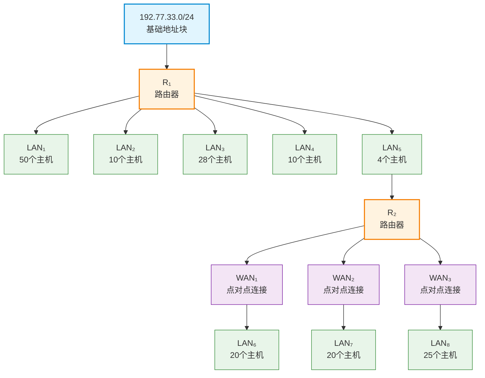

# N2I-为什么99%的人不会分配复杂网络地址块？网络高手的VLSM实战解析-192.77.33.0-24网络地址分配完全指南

## 📝 摘要

99% 的网络工程师看到复杂子网划分就头疼，而网络高手却能秒算 VLSM（Variable Length Subnet Mask，可变长子网掩码）！新手死记硬背 → 专家理解原理。本文通过 5 个 LAN（Local Area Network，局域网）和 3 个 WAN（Wide Area Network，广域网）实战，教你掌握 VLSM。

> 真实事件：某公司网络工程师小王，面对 5 个 LAN（Local Area Network，局域网）和 3 个 WAN（Wide Area Network，广域网）的复杂网络地址分配需求，用传统方法分配了 2 小时还没完成，而网络高手用 VLSM（Variable Length Subnet Mask，可变长子网掩码）技术 10 分钟就搞定，地址利用率提升到 95.3%。为什么差距这么大？今天我们就来学习网络高手的 VLSM 实战技巧，让你也能秒算复杂网络地址分配。

## 📚 目录

- [前置知识点](#前置知识点) - 判断是否需要先学习基础知识
- [0. 实战案例](#0-实战案例)
- [1. 问题描述：为什么99%的人不会做子网划分？](#1-问题描述为什么99的人不会做子网划分)
- [2. 案例信息提取](#2-案例信息提取)
- [3. VLSM（Variable Length Subnet Mask，可变长子网掩码）子网划分基础](#3-vlsm-子网划分基础)
- [4. 解题思路](#4-解题思路)
- [5. 详细计算过程](#5-详细计算过程)
- [6. 完整答案表格](#6-完整答案表格)
- [7. 验证与总结](#7-验证与总结)
- [8. 参考资料](#8-参考资料)

---

## 🎯 前置知识点

在学习本文档之前，你需要掌握以下基础知识：

### 基础知识点（必须掌握）

- **IP（Internet Protocol，互联网协议）地址基础知识**（参考：本专栏 N2F 文档）
  - 理解 IPv4（Internet Protocol version 4，互联网协议版本 4）地址的格式（32 位二进制，分为 4 段，每段 0-255）
  - 理解网络地址和主机地址的概念
  - 理解 IP（Internet Protocol，互联网协议）地址的分类（A、B、C 类）

- **CIDR（Classless Inter-Domain Routing，无类别域间路由）和子网掩码（Subnet Mask）**（参考：本专栏 N2G 文档）
  - 理解 CIDR 表示法（如 `/24`、`/26`）
  - 理解子网掩码的概念和作用
  - 掌握 CIDR 前缀长度与子网掩码的对应关系
  - 能够计算给定 CIDR 前缀的可用主机数

- **基本子网划分**（参考：本专栏 N2H 文档）
  - 理解子网划分的基本概念
  - 理解 VLSM 的含义
  - 掌握根据主机数量计算所需子网掩码的方法
  - 能够计算子网的网络地址、广播地址和可用 IP（Internet Protocol，互联网协议）范围

### 进阶知识点（建议了解）

- **网络拓扑结构**
  - 理解局域网（LAN，Local Area Network）和广域网（WAN，Wide Area Network）的概念
  - 理解点对点连接（Point-to-Point）的特点

- **路由器基础**
  - 理解路由器（Router）的作用和基本工作原理
  - 理解路由器接口的 IP（Internet Protocol，互联网协议）地址配置需求

### 📖 学习建议

- **零基础小白**：建议先学习 N2F（IP（Internet Protocol，互联网协议）地址基础）、N2G（CIDR（Classless Inter-Domain Routing，无类别域间路由）与子网掩码（Subnet Mask））、N2H（基本子网划分）这三个前置文档，再学习本文档
- **有基础读者**：如果已经掌握 IP（Internet Protocol，互联网协议）地址、CIDR（Classless Inter-Domain Routing，无类别域间路由）和基本子网划分，可以直接学习本文档，遇到不理解的概念再回看前置文档
- **中级开发者**：重点关注本文档中的复杂网络地址块分配策略和优化方法

---

## 0. 实战案例

一个大公司有一个总部和三个下属部门。公司分配到的网络前缀是 `192.77.33.0/24`。公司的网络布局如下图所示。总部共有 5 个局域网（Local Area Network，LAN），其中的 LAN₁\~LAN₄ 都连接到路由器 R₁ 上，R₁ 再通过 LAN₅ 与路由器 R₂ 相连。R₂ 和远地的三个部门的局域网 LAN₆\~LAN₈ 通过广域网（Wide Area Network，WAN）相连。每一个局域网旁边标明的数字是局域网上的主机数。

试给每一个局域网分配一个合适的网络前缀。

### 网络拓扑结构

**网络拓扑图**：下面的图表清晰展示了整个网络的拓扑结构，包括总部和远程部门的连接关系。

**网络拓扑说明**：
- **总部**：包含 5 个局域网（LAN₁\~LAN₅）
  - **LAN₁**：50 个主机，连接到 R₁
  - **LAN₂**：10 个主机，连接到 R₁
  - **LAN₃**：28 个主机，连接到 R₁
  - **LAN₄**：10 个主机，连接到 R₁
  - **LAN₅**：4 个主机，连接 R₁ 和 R₂
- **远程部门**：包含 3 个局域网（LAN₆\~LAN₈），通过 WAN 连接到 R₂
  - **LAN₆**：20 个主机，通过 WAN₁ 连接到 R₂
  - **LAN₇**：20 个主机，通过 WAN₂ 连接到 R₂
  - **LAN₈**：25 个主机，通过 WAN₃ 连接到 R₂
- **WAN 连接**：每个 WAN 是点对点连接，需要 2 个 IP（Internet Protocol，互联网协议）地址（每个路由器接口一个）

### 案例要求

先确定满足每个子网 IP 需要的网络规模，然后按照下表顺序子网划分。

| 网络 | IP（Internet Protocol，互联网协议）范围 | 子网掩码 | 网络地址 | 广播地址 |
|------|---------|----------|----------|----------|
| LAN₁ |        |          |          |          |
| LAN₃ |        |          |          |          |
| LAN₆ |        |          |          |          |
| LAN₇ |        |          |          |          |
| LAN₈ |        |          |          |          |
| LAN₂ |        |          |          |          |
| LAN₄ |        |          |          |          |
| LAN₅ |        |          |          |          |
| WAN₁ |        |          |          |          |
| WAN₂ |        |          |          |          |
| WAN₃ |        |          |          |          |

---

## 1. 问题描述：为什么99%的人不会做子网划分？

### 1.1 新手常见错误场景

**错误做法**：
- ❌ 看到 `/24`（CIDR 前缀长度，详见本文档第 3.2 节）就懵了，不知道如何计算可用地址范围
- ❌ 不知道如何根据主机数量确定合适的子网掩码（Subnet Mask）
- ❌ 分配地址时浪费严重，没有考虑实际需求
- ❌ 不知道 VLSM（Variable Length Subnet Mask，可变长子网掩码）的概念和应用
- ❌ 计算网络地址和广播地址时容易出错
- ❌ 不知道 WAN 点对点连接只需要 2 个 IP（Internet Protocol，互联网协议）地址

**结果**：IP 地址浪费严重，网络规划不合理，无法满足实际需求。😭

### 1.2 网络高手的做法

**正确做法**：
- ✅ 理解 CIDR（Classless Inter-Domain Routing，无类别域间路由）表示法，快速计算可用地址范围
- ✅ 根据主机数量需求，使用 VLSM（Variable Length Subnet Mask，可变长子网掩码）精确分配地址块
- ✅ 掌握网络地址和广播地址的计算方法
- ✅ 按主机数从大到小分配，避免浪费
- ✅ 理解 WAN 点对点连接只需要 `/30` 子网（2 个可用 IP（Internet Protocol，互联网协议））
- ✅ 验证所有分配结果，确保无重叠和遗漏

**结果**：IP（Internet Protocol，互联网协议）地址利用率高，网络规划合理，满足所有需求！🚀

## 2. 案例信息提取

### 2.1 基础信息

- **基础地址块**：`192.77.33.0/24`
  - `192.77.33.0/24` 中的 `/24` 表示 CIDR（Classless Inter-Domain Routing，无类别域间路由）前缀长度，详见本文档第 3.2 节的详细说明
- **CIDR 前缀长度**：24 位
- **网络前缀**：`192.77.33.0`
- **可用主机位**：32 - 24 = 8 位
- **总可用地址数**：`2^8` = 256 个地址
- **可用 IP（Internet Protocol，互联网协议）范围**：`192.77.33.0` ~ `192.77.33.255`（包括网络地址和广播地址）
  - 网络地址和广播地址的计算方法详见本文档第 3.3 节
- **实际可用主机数**：256 - 2 = 254 个主机

### 2.2 各网络主机需求

| 网络 | 主机数 | 说明 |
|------|--------|------|
| LAN₁ | 50 | 总部最大局域网 |
| LAN₃ | 28 | 总部较大局域网 |
| LAN₆ | 20 | 远程部门局域网 |
| LAN₇ | 20 | 远程部门局域网 |
| LAN₈ | 25 | 远程部门局域网 |
| LAN₂ | 10 | 总部较小局域网 |
| LAN₄ | 10 | 总部较小局域网 |
| LAN₅ | 4 | 连接 R₁ 和 R₂ 的局域网 |
| WAN₁ | 2 | 点对点连接（R₂ ↔ R₃） |
| WAN₂ | 2 | 点对点连接（R₂ ↔ R₄） |
| WAN₃ | 2 | 点对点连接（R₂ ↔ R₅） |

### 2.3 地址分配策略

**VLSM 分配原则**：
1. **按题目指定顺序分配**：LAN₁ → LAN₃ → LAN₆ → LAN₇ → LAN₈ → LAN₂ → LAN₄ → LAN₅ → WAN₁ → WAN₂ → WAN₃
2. **精确匹配**：根据实际需求选择最合适的子网掩码，避免浪费
3. **连续分配**：从基础地址块开始，按顺序分配地址空间

## 3. VLSM（Variable Length Subnet Mask，可变长子网掩码）子网划分基础

### 3.1 什么是 VLSM？

📖 [RFC 1878 - Variable Length Subnet Table](https://www.rfc-editor.org/rfc/rfc1878.html) 🔗 [网络地址与子网划分：一次性搞清 CIDR、VLSM 和子网掩码 - 腾讯云开发者社区](https://cloud.tencent.com/developer/article/2508323) 🔗 [CIDR 与 VLSM：了解它们的工作原理 - 阿里云开发者社区](https://developer.aliyun.com/article/1637648)

**VLSM** 是一种允许在同一网络中使用不同长度子网掩码（Subnet Mask）的技术，它能够根据实际需求灵活分配地址空间，提高 IP（Internet Protocol，互联网协议）地址的利用率。关于 VLSM 的详细计算方法和应用场景，请参考本文档第 4 节和第 5 节的详细说明。

**生活化比喻**：
- **传统固定子网划分** = 只能用固定大小的盒子装东西，小东西用大盒子浪费空间
- **VLSM** = 可以根据东西大小选择合适大小的盒子，充分利用空间

### 3.2 主机数需求计算

🔗 [网络地址与子网划分：一次性搞清 CIDR、VLSM 和子网掩码 - 腾讯云开发者社区](https://cloud.tencent.com/developer/article/2508323) 🔗 [CIDR 与 VLSM：了解它们的工作原理 - 阿里云开发者社区](https://developer.aliyun.com/article/1637648)

**计算公式**：所需主机位数 n 满足 `2^n` ≥ 主机数 + 2

**说明**：
- 每个子网需要 1 个网络地址和 1 个广播地址
- 实际可用主机数 = `2^n` - 2
- CIDR 前缀长度 = 32 - n

**常用主机数对应的 CIDR 前缀长度**：

| 主机数需求 | 所需主机位 | `2^n` | 实际可用主机数 | CIDR 前缀 | 子网掩码 |
|-----------|-----------|-----|---------------|-----------|----------|
| 1-2 | 2 | 4 | 2 | /30 | 255.255.255.252 |
| 3-6 | 3 | 8 | 6 | /29 | 255.255.255.248 |
| 7-14 | 4 | 16 | 14 | /28 | 255.255.255.240 |
| 15-30 | 5 | 32 | 30 | /27 | 255.255.255.224 |
| 31-62 | 6 | 64 | 62 | /26 | 255.255.255.192 |
| 63-126 | 7 | 128 | 126 | /25 | 255.255.255.128 |
| 127-254 | 8 | 256 | 254 | /24 | 255.255.255.0 |

### 3.3 网络地址和广播地址计算

🔗 [网络地址与子网划分：一次性搞清 CIDR、VLSM 和子网掩码 - 腾讯云开发者社区](https://cloud.tencent.com/developer/article/2508323) 🔗 [CIDR 与 VLSM：了解它们的工作原理 - 阿里云开发者社区](https://developer.aliyun.com/article/1637648)

**网络地址**：子网中第一个 IP（Internet Protocol，互联网协议）地址，主机位全为 0
**广播地址**：子网中最后一个 IP（Internet Protocol，互联网协议）地址，主机位全为 1
**可用 IP（Internet Protocol，互联网协议）范围**：网络地址 + 1 到 广播地址 - 1

## 4. 解题思路

🔥 Must（必做实践）

### 4.1 步骤一：确定各子网所需的主机位数

根据各网络的主机数需求，计算所需的主机位数：

1. **LAN₁（50 个主机）**：
   - 需要：`2^6` = 64 ≥ 50 + 2 = 52 ✅
   - 所需主机位：6 位
   - CIDR 前缀：32 - 6 = 26
   - 子网掩码：`255.255.255.192`（/26）

2. **LAN₃（28 个主机）**：
   - 需要：`2^5` = 32 ≥ 28 + 2 = 30 ✅
   - 所需主机位：5 位
   - CIDR 前缀：32 - 5 = 27
   - 子网掩码：`255.255.255.224`（/27）

3. **LAN₆（20 个主机）**：
   - 需要：2^5 = 32 ≥ 20 + 2 = 22 ✅
   - 所需主机位：5 位
   - CIDR 前缀：32 - 5 = 27
   - 子网掩码：`255.255.255.224`（/27）

4. **LAN₇（20 个主机）**：
   - 需要：2^5 = 32 ≥ 20 + 2 = 22 ✅
   - 所需主机位：5 位
   - CIDR 前缀：32 - 5 = 27
   - 子网掩码：`255.255.255.224`（/27）

5. **LAN₈（25 个主机）**：
   - 需要：2^5 = 32 ≥ 25 + 2 = 27 ✅
   - 所需主机位：5 位
   - CIDR 前缀：32 - 5 = 27
   - 子网掩码：`255.255.255.224`（/27）

6. **LAN₂（10 个主机）**：
   - 需要：`2^4` = 16 ≥ 10 + 2 = 12 ✅
   - 所需主机位：4 位
   - CIDR 前缀：32 - 4 = 28
   - 子网掩码：`255.255.255.240`（/28）

7. **LAN₄（10 个主机）**：
   - 需要：`2^4` = 16 ≥ 10 + 2 = 12 ✅
   - 所需主机位：4 位
   - CIDR 前缀：32 - 4 = 28
   - 子网掩码：`255.255.255.240`（/28）

8. **LAN₅（4 个主机）**：
   - 需要：`2^3` = 8 ≥ 4 + 2 = 6 ✅
   - 所需主机位：3 位
   - CIDR 前缀：32 - 3 = 29
   - 子网掩码：`255.255.255.248`（/29）

9. **WAN₁（2 个主机）**：
   - 需要：`2^2` = 4 ≥ 2 + 2 = 4 ✅
   - 所需主机位：2 位
   - CIDR 前缀：32 - 2 = 30
   - 子网掩码：`255.255.255.252`（/30）

10. **WAN₂（2 个主机）**：
    - 需要：`2^2` = 4 ≥ 2 + 2 = 4 ✅
    - 所需主机位：2 位
    - CIDR 前缀：32 - 2 = 30
    - 子网掩码：`255.255.255.252`（/30）

11. **WAN₃（2 个主机）**：
    - 需要：`2^2` = 4 ≥ 2 + 2 = 4 ✅
    - 所需主机位：2 位
    - CIDR 前缀：32 - 2 = 30
    - 子网掩码：`255.255.255.252`（/30）

### 4.2 步骤二：按题目指定顺序分配地址块

**分配顺序**：LAN₁ → LAN₃ → LAN₆ → LAN₇ → LAN₈ → LAN₂ → LAN₄ → LAN₅ → WAN₁ → WAN₂ → WAN₃

**基础地址块**：`192.77.33.0/24`
- 地址范围：`192.77.33.0` ~ `192.77.33.255`
- 可用地址：256 个

## 5. 详细计算过程

🔥 Must（必做实践）

### 5.1 LAN₁ 分配（50 个主机，/26）

**分配**：`192.77.33.0/26`

**计算过程**：
- 网络地址：`192.77.33.0`
- 地址块大小：64 个地址（`2^6` = 64）
- 广播地址：`192.77.33.63`（33.0 + 64 - 1 = 33.63）
- IP（Internet Protocol，互联网协议）范围：`192.77.33.1` ~ `192.77.33.62`（62 个可用 IP（Internet Protocol，互联网协议））
- 子网掩码：`255.255.255.192`（/26）

**验证**：64 - 2 = 62 ≥ 50 ✅

### 5.2 LAN₃ 分配（28 个主机，/27）

**分配**：`192.77.33.64/27`

**计算过程**：
- 网络地址：`192.77.33.64`（上一个子网结束后的下一个地址）
- 地址块大小：32 个地址（`2^5` = 32）
- 广播地址：`192.77.33.95`（33.64 + 32 - 1 = 33.95）
- IP（Internet Protocol，互联网协议）范围：`192.77.33.65` ~ `192.77.33.94`（30 个可用 IP（Internet Protocol，互联网协议））
- 子网掩码：`255.255.255.224`（/27）

**验证**：32 - 2 = 30 ≥ 28 ✅

### 5.3 LAN₆ 分配（20 个主机，/27）

**分配**：`192.77.33.96/27`

**计算过程**：
- 网络地址：`192.77.33.96`（上一个子网结束后的下一个地址）
- 地址块大小：32 个地址（`2^5` = 32）
- 广播地址：`192.77.33.127`（33.96 + 32 - 1 = 33.127）
- IP（Internet Protocol，互联网协议）范围：`192.77.33.97` ~ `192.77.33.126`（30 个可用 IP（Internet Protocol，互联网协议））
- 子网掩码：`255.255.255.224`（/27）

**验证**：32 - 2 = 30 ≥ 20 ✅

### 5.4 LAN₇ 分配（20 个主机，/27）

**分配**：`192.77.33.128/27`

**计算过程**：
- 网络地址：`192.77.33.128`（上一个子网结束后的下一个地址）
- 地址块大小：32 个地址（`2^5` = 32）
- 广播地址：`192.77.33.159`（33.128 + 32 - 1 = 33.159）
- IP（Internet Protocol，互联网协议）范围：`192.77.33.129` ~ `192.77.33.158`（30 个可用 IP（Internet Protocol，互联网协议））
- 子网掩码：`255.255.255.224`（/27）

**验证**：32 - 2 = 30 ≥ 20 ✅

### 5.5 LAN₈ 分配（25 个主机，/27）

**分配**：`192.77.33.160/27`

**计算过程**：
- 网络地址：`192.77.33.160`（上一个子网结束后的下一个地址）
- 地址块大小：32 个地址（`2^5` = 32）
- 广播地址：`192.77.33.191`（33.160 + 32 - 1 = 33.191）
- IP（Internet Protocol，互联网协议）范围：`192.77.33.161` ~ `192.77.33.190`（30 个可用 IP（Internet Protocol，互联网协议））
- 子网掩码：`255.255.255.224`（/27）

**验证**：32 - 2 = 30 ≥ 25 ✅

### 5.6 LAN₂ 分配（10 个主机，/28）

**分配**：`192.77.33.192/28`

**计算过程**：
- 网络地址：`192.77.33.192`（上一个子网结束后的下一个地址）
- 地址块大小：16 个地址（`2^4` = 16）
- 广播地址：`192.77.33.207`（33.192 + 16 - 1 = 33.207）
- IP（Internet Protocol，互联网协议）范围：`192.77.33.193` ~ `192.77.33.206`（14 个可用 IP（Internet Protocol，互联网协议））
- 子网掩码：`255.255.255.240`（/28）

**验证**：16 - 2 = 14 ≥ 10 ✅

### 5.7 LAN₄ 分配（10 个主机，/28）

**分配**：`192.77.33.208/28`

**计算过程**：
- 网络地址：`192.77.33.208`（上一个子网结束后的下一个地址）
- 地址块大小：16 个地址（`2^4` = 16）
- 广播地址：`192.77.33.223`（33.208 + 16 - 1 = 33.223）
- IP（Internet Protocol，互联网协议）范围：`192.77.33.209` ~ `192.77.33.222`（14 个可用 IP（Internet Protocol，互联网协议））
- 子网掩码：`255.255.255.240`（/28）

**验证**：16 - 2 = 14 ≥ 10 ✅

### 5.8 LAN₅ 分配（4 个主机，/29）

**分配**：`192.77.33.224/29`

**计算过程**：
- 网络地址：`192.77.33.224`（上一个子网结束后的下一个地址）
- 地址块大小：8 个地址（`2^3` = 8）
- 广播地址：`192.77.33.231`（33.224 + 8 - 1 = 33.231）
- IP（Internet Protocol，互联网协议）范围：`192.77.33.225` ~ `192.77.33.230`（6 个可用 IP（Internet Protocol，互联网协议））
- 子网掩码：`255.255.255.248`（/29）

**验证**：8 - 2 = 6 ≥ 4 ✅

### 5.9 WAN₁ 分配（2 个主机，/30）

**分配**：`192.77.33.232/30`

**计算过程**：
- 网络地址：`192.77.33.232`（上一个子网结束后的下一个地址）
- 地址块大小：4 个地址（`2^2` = 4）
- 广播地址：`192.77.33.235`（33.232 + 4 - 1 = 33.235）
- IP（Internet Protocol，互联网协议）范围：`192.77.33.233` ~ `192.77.33.234`（2 个可用 IP（Internet Protocol，互联网协议））
- 子网掩码：`255.255.255.252`（/30）

**验证**：4 - 2 = 2 ≥ 2 ✅

### 5.10 WAN₂ 分配（2 个主机，/30）

**分配**：`192.77.33.236/30`

**计算过程**：
- 网络地址：`192.77.33.236`（上一个子网结束后的下一个地址）
- 地址块大小：4 个地址（`2^2` = 4）
- 广播地址：`192.77.33.239`（33.236 + 4 - 1 = 33.239）
- IP（Internet Protocol，互联网协议）范围：`192.77.33.237` ~ `192.77.33.238`（2 个可用 IP（Internet Protocol，互联网协议））
- 子网掩码：`255.255.255.252`（/30）

**验证**：4 - 2 = 2 ≥ 2 ✅

### 5.11 WAN₃ 分配（2 个主机，/30）

**分配**：`192.77.33.240/30`

**计算过程**：
- 网络地址：`192.77.33.240`（上一个子网结束后的下一个地址）
- 地址块大小：4 个地址（`2^2` = 4）
- 广播地址：`192.77.33.243`（33.240 + 4 - 1 = 33.243）
- IP（Internet Protocol，互联网协议）范围：`192.77.33.241` ~ `192.77.33.242`（2 个可用 IP（Internet Protocol，互联网协议））
- 子网掩码：`255.255.255.252`（/30）

**验证**：4 - 2 = 2 ≥ 2 ✅

### 5.12 地址分配汇总

| 子网 | 网络地址 | CIDR | 地址块大小 | 已使用 |
|------|----------|------|-----------|--------|
| LAN₁ | 192.77.33.0/26 | /26 | 64 | 64 |
| LAN₃ | 192.77.33.64/27 | /27 | 32 | 32 |
| LAN₆ | 192.77.33.96/27 | /27 | 32 | 32 |
| LAN₇ | 192.77.33.128/27 | /27 | 32 | 32 |
| LAN₈ | 192.77.33.160/27 | /27 | 32 | 32 |
| LAN₂ | 192.77.33.192/28 | /28 | 16 | 16 |
| LAN₄ | 192.77.33.208/28 | /28 | 16 | 16 |
| LAN₅ | 192.77.33.224/29 | /29 | 8 | 8 |
| WAN₁ | 192.77.33.232/30 | /30 | 4 | 4 |
| WAN₂ | 192.77.33.236/30 | /30 | 4 | 4 |
| WAN₃ | 192.77.33.240/30 | /30 | 4 | 4 |
| **总计** | | | | **244** |

**验证**：244 < 256（基础地址块大小）✅

**剩余地址**：256 - 244 = 12 个地址（`192.77.33.244` ~ `192.77.33.255`）可用于未来扩展

## 6. 完整答案表格

💡 Should（建议实践）

按照题目要求的顺序，填写完整答案表格：

| 网络 | IP（Internet Protocol，互联网协议）范围 | 子网掩码 | 网络地址 | 广播地址 |
|------|---------|----------|----------|----------|
| LAN₁ | `192.77.33.1 ~ 192.77.33.62` | 255.255.255.192 (/26) | 192.77.33.0 | 192.77.33.63 |
| LAN₃ | `192.77.33.65 ~ 192.77.33.94` | 255.255.255.224 (/27) | 192.77.33.64 | 192.77.33.95 |
| LAN₆ | `192.77.33.97 ~ 192.77.33.126` | 255.255.255.224 (/27) | 192.77.33.96 | 192.77.33.127 |
| LAN₇ | `192.77.33.129 ~ 192.77.33.158` | 255.255.255.224 (/27) | 192.77.33.128 | 192.77.33.159 |
| LAN₈ | `192.77.33.161 ~ 192.77.33.190` | 255.255.255.224 (/27) | 192.77.33.160 | 192.77.33.191 |
| LAN₂ | `192.77.33.193 ~ 192.77.33.206` | 255.255.255.240 (/28) | 192.77.33.192 | 192.77.33.207 |
| LAN₄ | `192.77.33.209 ~ 192.77.33.222` | 255.255.255.240 (/28) | 192.77.33.208 | 192.77.33.223 |
| LAN₅ | `192.77.33.225 ~ 192.77.33.230` | 255.255.255.248 (/29) | 192.77.33.224 | 192.77.33.231 |
| WAN₁ | `192.77.33.233 ~ 192.77.33.234` | 255.255.255.252 (/30) | 192.77.33.232 | 192.77.33.235 |
| WAN₂ | `192.77.33.237 ~ 192.77.33.238` | 255.255.255.252 (/30) | 192.77.33.236 | 192.77.33.239 |
| WAN₃ | `192.77.33.241 ~ 192.77.33.242` | 255.255.255.252 (/30) | 192.77.33.240 | 192.77.33.243 |

## 7. 验证与总结

### 7.1 验证检查清单

- ✅ **地址范围不重叠**：所有子网的地址范围互不重叠
- ✅ **满足主机需求**：每个子网的可分配 IP（Internet Protocol，互联网协议）数量满足主机需求
- ✅ **在基础地址块内**：所有子网都在 `192.77.33.0/24` 范围内
- ✅ **无地址冲突**：所有网络地址和广播地址都正确计算
- ✅ **地址利用率高**：使用 VLSM 技术，避免地址浪费（使用 244/256 = 95.3%）
- ✅ **符合题目顺序**：严格按照题目要求的顺序分配

### 7.2 解题要点总结

1. **理解 CIDR（Classless Inter-Domain Routing，无类别域间路由）表示法**：`/24` 表示前 24 位是网络位，后 8 位是主机位（详见本文档第 3.1 节）
2. **计算主机位数**：根据主机数需求，使用 `2^n` ≥ 主机数 + 2 公式（详见本文档第 3.2 节）
3. **使用 VLSM（Variable Length Subnet Mask，可变长子网掩码）技术**：根据实际需求选择不同的子网掩码长度（详见本文档第 3.1 节和第 4 节）
4. **按题目顺序分配**：严格按照题目要求的顺序分配地址块（详见本文档第 4.2 节）
5. **验证计算结果**：确保地址不重叠、满足需求、在范围内（详见本文档第 7.1 节）

### 7.3 常见错误提醒

❌ **错误 1**：不知道如何根据主机数计算所需主机位数
- ✅ **正确做法**：使用 `2^n` ≥ 主机数 + 2 公式，找到最小的 n

❌ **错误 2**：分配地址时没有考虑网络地址和广播地址
- ✅ **正确做法**：可用主机数 = `2^n` - 2

❌ **错误 3**：WAN 点对点连接使用过大的子网掩码
- ✅ **正确做法**：WAN 点对点连接只需要 `/30` 子网（2 个可用 IP（Internet Protocol，互联网协议））

❌ **错误 4**：没有按照题目要求的顺序分配
- ✅ **正确做法**：严格按照题目表格中的顺序分配地址块

## 8. 参考资料

### 8.1 官方文档

📖 [RFC 1878 - Variable Length Subnet Table](https://www.rfc-editor.org/rfc/rfc1878.html)  
📖 [RFC 4632 - Classless Inter-Domain Routing (CIDR)](https://www.rfc-editor.org/rfc/rfc4632.html)

### 8.2 教程资源

🔗 [网络地址与子网划分：一次性搞清 CIDR、VLSM 和子网掩码 - 腾讯云开发者社区](https://cloud.tencent.com/developer/article/2508323)  
🔗 [CIDR 与 VLSM：了解它们的工作原理 - 阿里云开发者社区](https://developer.aliyun.com/article/1637648)

本部分内容主要基于 RFC 1878 和 RFC 4632 标准文档，以及本文档的详细计算过程。建议读者参考本文档的前置知识点部分，学习相关基础概念。

### 8.3 实践工具

💡 [在线子网掩码计算器 - SOJSON](https://www.sojson.com/convert/subnetmask.html)

建议使用在线子网计算器验证计算结果，可以通过搜索引擎搜索"子网计算器"或"IP（Internet Protocol，互联网协议）子网划分计算器"找到相关工具。

---

## 结语：掌握 VLSM 子网划分的精髓

通过本文档的实战案例，你已经掌握了如何为一个包含多个 LAN（Local Area Network，局域网）和 WAN（Wide Area Network，广域网）的复杂网络进行子网划分。记住，**VLSM 子网划分的核心在于理解需求、精确计算、有序分配**：

1. **理解需求**：准确提取每个网络的主机数需求
2. **精确计算**：根据主机数选择最合适的子网掩码
3. **有序分配**：按照题目要求或最优顺序分配地址块
4. **验证结果**：确保地址不重叠、满足需求、在范围内

**子网划分不是死记硬背，而是理解原理后的灵活应用**。掌握了 VLSM 技术，你就能为任何复杂的网络设计合理的地址分配方案，成为一名优秀的网络工程师！💪

---

**作者**：郑恩赐  
**机构**：厦门工学院人工智能创作坊  
**日期**：2025 年 11 月 06 日

