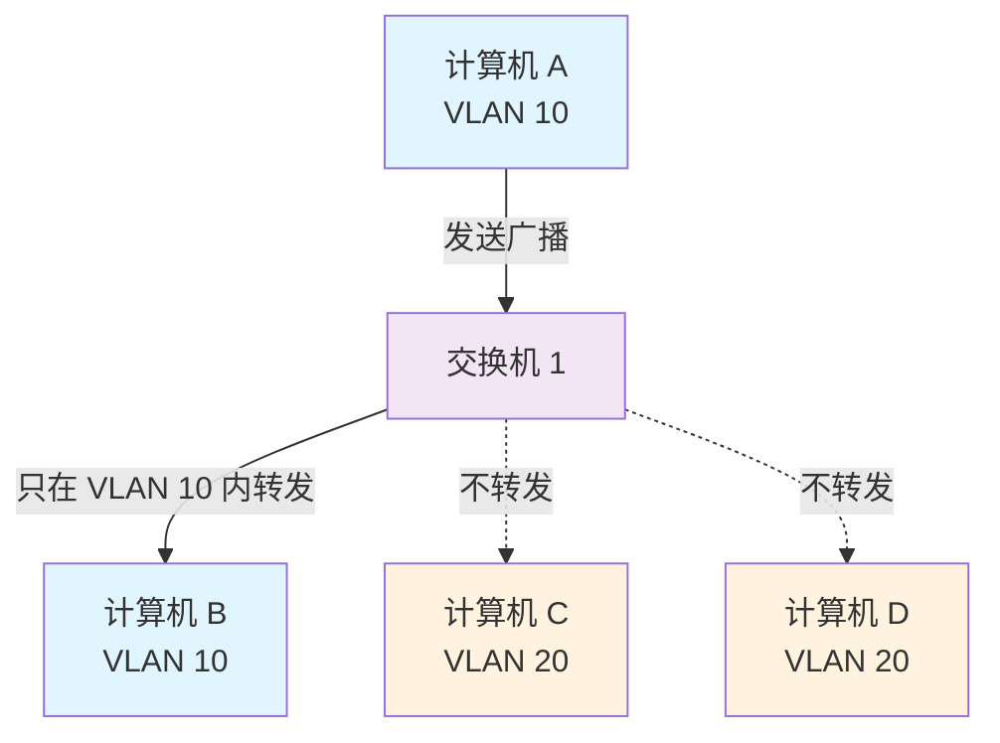
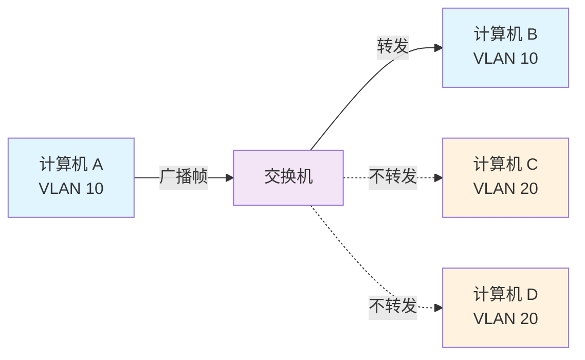
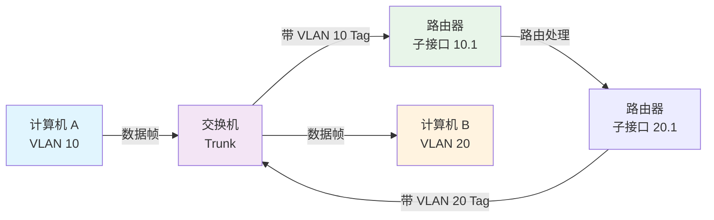
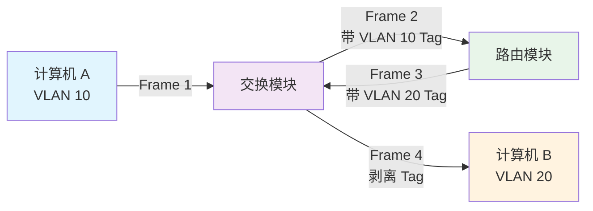

# N2J-为什么99%的人不理解VLAN？大厂网络工程师的虚拟局域网完全指南

## 📝 摘要

**99% 的网络小白看到 VLAN（Virtual Local Area Network，虚拟局域网）就懵了**，不知道如何划分广播域、配置接口类型，而**大厂网络工程师却能秒懂 VLAN 原理并灵活应用**！新手只会死记硬背 → 专家理解原理。今天，我们将通过通俗化解释和实战案例，一起掌握 VLAN 技术精髓。

## 📚 目录

- [0. 实战案例](#0-实战案例)
- [1. 问题描述：为什么99%的人不理解VLAN？](#1-问题描述为什么99的人不理解vlan)
- [2. VLAN 基础概念](#2-vlan-基础概念)
- [3. 为什么需要 VLAN](#3-为什么需要-vlan)
- [4. VLAN 工作原理](#4-vlan-工作原理)
- [5. VLAN 接口类型](#5-vlan-接口类型)
- [6. VLAN 划分方式](#6-vlan-划分方式)
- [7. VLAN 间通信](#7-vlan-间通信)
- [8. VLAN 配置实践](#8-vlan-配置实践)
- [9. VLAN 应用场景](#9-vlan-应用场景)
- [10. 总结回顾](#10-总结回顾)
- [11. 参考资料](#11-参考资料)

---

## 0. 实战案例

> **真实场景**：某公司网络工程师小王，面对 200 台主机连接在同一台交换机上的网络，广播风暴频发，网络性能严重下降。新手小王只会重启交换机 → 网络高手用 VLAN（Virtual Local Area Network，虚拟局域网）技术 10 分钟就搞定，将网络划分为 5 个 VLAN，广播域隔离，性能提升 80%。为什么差距这么大？今天我们就来学习网络高手的 VLAN 实战技巧，让你也能秒懂虚拟局域网原理。

## 1. 问题描述：为什么99%的人不理解VLAN？

### 1.1 新手常见困惑 🔍

**99% 的网络小白**在学习 VLAN 时都会遇到以下困惑：

- ❌ **不知道 VLAN 是什么**：看到"虚拟局域网"这个词就懵了，虚拟在哪里？局域网又是什么？
- ❌ **不理解为什么需要 VLAN**：明明所有设备都连在同一台交换机上，为什么要划分 VLAN？
- ❌ **分不清 Access、Trunk、Hybrid**：三种接口类型有什么区别？什么时候用哪个？
- ❌ **不会配置 VLAN**：看到配置命令就头疼，不知道从哪里开始

---

## 2. VLAN 基础概念

### 2.1 什么是 VLAN？ 🔑 **Must**

让我们来理解一下 VLAN 的本质：**VLAN（Virtual Local Area Network，虚拟局域网）**是将一个物理的 LAN（Local Area Network，局域网）在逻辑上划分成多个广播域的通信技术。

**生活化比喻**：
- **物理 LAN** = 一栋大楼，所有房间都在同一栋楼里
- **VLAN** = 把大楼分成不同的楼层或区域，每个区域有独立的门禁系统
- **广播域** = 每个楼层内部可以互相喊话，但不同楼层之间不能直接喊话

**核心特点**：
- ✅ VLAN 内的主机间可以直接通信（二层通信）
- ✅ VLAN 间不能直接通信（需要三层路由）
- ✅ 广播报文被限制在一个 VLAN 内

### 2.2 VLAN 的作用 🎯

VLAN 具备以下优点：

1. **限制广播域** 📡
   - 广播域被限制在一个 VLAN 内，节省了带宽，提高了网络处理能力
   - 减少广播风暴对网络的影响

2. **增强局域网的安全性** 🔒
   - 不同 VLAN 内的报文在传输时相互隔离
   - 一个 VLAN 内的用户不能和其他 VLAN 内的用户直接通信

3. **提高网络的健壮性** 💪
   - 故障被限制在一个 VLAN 内
   - 本 VLAN 内的故障不会影响其他 VLAN 的正常工作

4. **灵活构建虚拟工作组** 🏢
   - 用 VLAN 可以划分不同的用户到不同的工作组
   - 同一工作组的用户不必局限于某一固定的物理范围
   - 网络构建和维护更方便灵活

### 2.3 VLAN vs 子网 🆚

很多新手会混淆 VLAN 和子网（Subnet）的概念，让我们来看看它们有什么区别。

| 对比维度 | VLAN | 子网（Subnet） |
|---------|------|---------------|
| **工作层次** | 数据链路层（Layer 2） | 网络层（Layer 3） |
| **划分依据** | 逻辑划分广播域 | IP 地址的网络部分 |
| **隔离方式** | 二层隔离（MAC 地址） | 三层隔离（IP 地址） |
| **通信方式** | 同一 VLAN 内直接二层通信 | 同一子网内直接三层通信 |
| **跨 VLAN/子网通信** | 需要三层路由 | 需要路由 |
| **对应关系** | 一个 VLAN 可以包含多个子网 | 一个子网通常对应一个 VLAN |

**重要理解**：
- VLAN 和子网**没有必然的对应关系**
- 属于不同 VLAN 的主机之间不能直接通信
- 属于不同子网的主机之间也不能直接通信
- 但一个 VLAN 可以包含多个子网，一个子网也可以跨越多个 VLAN（不推荐）

---

## 3. 为什么需要 VLAN

### 3.1 未分割广播域时的问题 ⚠️

在理解 VLAN 之前，让我们先来看看**没有 VLAN 时会发生什么问题**。

#### 3.1.1 广播风暴问题 🌊

假设有一个由 5 台二层交换机连接了大量客户机构成的网络：

```
计算机 A 需要与计算机 B 通信
    ↓
计算机 A 发送 ARP（Address Resolution Protocol，地址解析协议）请求
    ↓
交换机 1 收到广播帧后，转发给除接收端口外的所有其他端口（Flooding）
    ↓
交换机 2、3、4、5 也进行 Flooding
    ↓
最终 ARP 请求被转发到同一网络中的所有客户机
```

**问题分析**：
- ❌ 这个 ARP 请求原本只是为了获得计算机 B 的 MAC 地址
- ❌ 但数据帧却传遍整个网络，导致所有计算机都收到了它
- ❌ 消耗了网络整体的带宽
- ❌ 收到广播信息的计算机还要消耗 CPU 时间来处理

#### 3.1.2 广播信息频繁出现 📢

广播信息会**非常频繁地出现**，包括：

- **ARP 请求**：建立 IP 地址和 MAC 地址的映射关系
- **DHCP（Dynamic Host Configuration Protocol，动态主机配置协议）**：用于自动设定 IP 地址
- **RIP（Routing Information Protocol，路由信息协议）**：每隔 30 秒路由器都会广播一次路由信息
- **NetBEUI、IPX、Apple Talk** 等协议也需要用到广播

如果整个网络只有一个广播域，那么一旦发出广播信息，就会传遍整个网络，对网络中的主机带来额外的负担。

### 3.2 传统分割广播域的方法 🔧

#### 3.2.1 使用路由器分割

分割广播域时，一般都必须使用到路由器。使用路由器后，可以以路由器上的网络接口（LAN Interface）为单位分割广播域。

**问题**：
- ❌ 路由器上不会有太多的网络接口，其数目多在 1～4 个左右
- ❌ 所能分割的个数完全取决于路由器的网络接口个数
- ❌ 用户无法自由地根据实际需要分割广播域

#### 3.2.2 使用 VLAN 分割

与路由器相比，二层交换机一般带有多个网络接口。因此如果能使用它分割广播域，那么无疑运用上的灵活性会大大提高。

**VLAN 的优势**：
- ✅ 可以自由设计广播域的构成
- ✅ 提高网络设计的自由度
- ✅ 不需要额外的硬件设备（路由器）
- ✅ 配置灵活，易于管理

### 3.3 VLAN 如何解决广播域问题 💡

让我们来看看使用 VLAN 后，网络结构是如何变化的：



**VLAN 的作用**：
- ✅ 将网络分割成多个广播域
- ✅ 广播帧只在同一 VLAN 内转发
- ✅ 不同 VLAN 之间的广播帧被隔离
- ✅ 节省带宽，提高网络性能

---

## 4. VLAN 工作原理

### 4.1 VLAN 的实现机制 ⚙️ **Must**

在理解了"为什么需要 VLAN"之后，接下来让我们来了解一下交换机是如何使用 VLAN 分割广播域的。

#### 4.1.1 未设置 VLAN 的交换机

在一台未设置任何 VLAN 的二层交换机上，任何广播帧都会被转发给除接收端口外的所有其他端口（Flooding）。

例如，计算机 A 发送广播信息后，会被转发给端口 2、3、4。

#### 4.1.2 设置 VLAN 后的交换机

如果在交换机上生成红、蓝两个 VLAN：
- 端口 1、2 属于红色 VLAN
- 端口 3、4 属于蓝色 VLAN

再从 A 发出广播帧的话，交换机就只会把它转发给同属于一个 VLAN 的其他端口——也就是同属于红色 VLAN 的端口 2，不会再转发给属于蓝色 VLAN 的端口。

**工作原理图**：



### 4.2 直观理解 VLAN 🎨

如果要更为直观地描述 VLAN 的话，我们可以把它理解为**将一台交换机在逻辑上分割成了数台交换机**。

在一台交换机上生成红、蓝两个 VLAN，也可以看作是将一台交换机换做一红一蓝两台虚拟的交换机。

**重要理解**：
- VLAN 生成的逻辑上的交换机是**互不相通**的
- 在交换机上设置 VLAN 后，如果未做其他处理，VLAN 间是无法通信的
- 明明接在同一台交换机上，但却偏偏无法通信——这既是 VLAN 方便易用的特征，又是使 VLAN 令人难以理解的原因

### 4.3 IEEE 802.1Q 协议 📋 **Must**

现在，让我们来学习 IEEE 802.1Q 协议，这是实现 VLAN 的核心协议。要使交换机能够分辨不同 VLAN 的报文，需要在报文中添加标识 VLAN 信息的字段。**IEEE 802.1Q 协议**规定，在以太网数据帧中加入 4 个字节的 VLAN 标签（又称 VLAN Tag，简称 Tag），用以标识 VLAN 信息。

#### 4.3.1 VLAN Tag 格式

IEEE 802.1Q 封装的 VLAN 数据帧格式如下：

```
| 目的MAC地址 | 源MAC地址 | TPID | TCI | 类型/长度 | 数据 | FCS |
|  6 字节    |  6 字节   | 2字节 |2字节|   2 字节  | 可变 |4字节|
                    |              |
                    └── VLAN Tag ──┘
```

**VLAN Tag 详细结构**：

| 字段 | 长度 | 含义 | 取值 |
|-----|------|------|------|
| **TPID（Tag Protocol Identifier，标签协议标识符）** | 2 字节 | 表示数据帧类型 | 取值为 0x8100 时表示 IEEE 802.1Q 的 VLAN 数据帧 |
| **PRI（Priority，优先级）** | 3 bit | 表示数据帧的 802.1Q 优先级 | 取值范围为 0～7，值越大优先级越高 |
| **CFI（Canonical Format Indicator，标准格式指示位）** | 1 bit | 表示 MAC 地址是否以标准格式封装 | 在以太网中，CFI 的值为 0 |
| **VID（VLAN ID，VLAN 标识符）** | 12 bit | 表示该数据帧所属 VLAN 的编号 | VLAN ID 取值范围是 0～4095。由于 0 和 4095 为协议保留取值，所以 VLAN ID 的有效取值范围是 1～4094 |

#### 4.3.2 VLAN ID 的取值范围

- **VLAN ID 取值范围**：0～4095
- **保留值**：0 和 4095 为协议保留取值
- **有效范围**：1～4094（共 4094 个可用的 VLAN）

这意味着在一个网络中，最多可以创建 **4094 个不同的 VLAN**。

### 4.4 Tagged 帧 vs Untagged 帧 🏷️

在一个 VLAN 交换网络中，以太网数据帧主要有以下两种形式：

#### 4.4.1 Untagged 帧（无标记帧）

- **定义**：原始的、未加入 4 字节 VLAN 标签的帧
- **特点**：普通以太网数据帧，不包含 VLAN 信息
- **使用场景**：用户主机、服务器等终端设备发送的数据帧

#### 4.4.2 Tagged 帧（有标记帧）

- **定义**：加入了 4 字节 VLAN 标签的帧
- **特点**：包含 VLAN ID 信息，用于标识数据帧属于哪个 VLAN
- **使用场景**：交换机之间传输的数据帧，用于跨交换机传递 VLAN 信息

#### 4.4.3 设备对帧的处理

| 设备类型 | 收发能力 |
|---------|---------|
| **用户主机、服务器、Hub** | 只能收发 Untagged 帧 |
| **交换机、路由器、AC** | 既能收发 Tagged 帧，也能收发 Untagged 帧 |
| **语音终端、AP** | 可以同时收发一个 Tagged 帧和一个 Untagged 帧 |

**重要说明**：
- 为了提高处理效率，**设备内部处理的数据帧一律都是 Tagged 帧**
- 当设备收到 Untagged 帧时，会根据接口的缺省 VLAN（PVID）给帧添加 VLAN Tag
- 当设备发送数据帧到终端设备时，会剥离 VLAN Tag，发送 Untagged 帧

---

## 5. VLAN 接口类型

### 5.1 链路类型和接口类型概述 🔌 **Must**

让我们先来了解一下链路类型和接口类型的基本概念。设备内部处理的数据帧一律都带有 VLAN 标签，而现网中的设备有些只会收发 Untagged 帧，要与这些设备交互，就需要接口能够识别 Untagged 帧并在收发时给帧添加、剥除 VLAN 标签。

为了适应不同的连接和组网，设备定义了 **Access 接口**、**Trunk 接口**和 **Hybrid 接口** 3 种接口类型，以及**接入链路（Access Link）**和**干道链路（Trunk Link）**两种链路类型。

#### 5.1.1 链路类型

根据链路中需要承载的 VLAN 数目的不同，以太网链路分为：

**接入链路（Access Link）**：
- 只可以承载 1 个 VLAN 的数据帧
- 用于连接设备和用户终端（如用户主机、服务器等）
- 通常情况下，用户终端并不需要知道自己属于哪个 VLAN，也不能识别带有 Tag 的帧
- 所以在接入链路上传输的帧都是 Untagged 帧

**干道链路（Trunk Link）**：
- 可以承载多个不同 VLAN 的数据帧
- 用于设备间互连
- 为了保证其它网络设备能够正确识别数据帧中的 VLAN 信息，在干道链路上传输的数据帧必须都打上 Tag

### 5.2 Access 接口 🔵 **Must**

让我们来看看 Access 接口的特点和工作流程。**Access 接口**一般用于和不能识别 Tag 的用户终端（如用户主机、服务器）相连，或者不需要区分不同 VLAN 成员时使用。

#### 5.2.1 Access 接口的特点

- ✅ 只能收发 Untagged 帧
- ✅ 只能为 Untagged 帧添加唯一 VLAN 的 Tag
- ✅ 交换机内部只处理 Tagged 帧，所以 Access 接口需要给收到的数据帧添加 VLAN Tag
- ✅ 必须配置缺省 VLAN（PVID）
- ✅ 配置缺省 VLAN 后，该 Access 接口也就加入了该 VLAN

#### 5.2.2 Access 接口的工作流程

**接收数据帧时**：
- 收到 Untagged 帧：添加缺省 VLAN 的 Tag
- 收到 Tagged 帧：只有当帧中的 VID 与 PVID 相同时，才接收并处理该帧

**发送数据帧时**：
- 在发送带有 Tag 的帧前，Access 接口会剥离 Tag，发送 Untagged 帧

**生活化比喻**：
- Access 接口就像一个**单间公寓**，只能住一个人（一个 VLAN）
- 进出公寓时，门卫会给你发一个身份牌（添加 Tag），离开时收回身份牌（剥离 Tag）

### 5.3 Trunk 接口 🟢 **Must**

接下来，让我们来学习 Trunk 接口。**Trunk 接口**一般用于连接交换机、路由器、AP 以及可同时收发 Tagged 帧和 Untagged 帧的语音终端。

#### 5.3.1 Trunk 接口的特点

- ✅ 可以允许多个 VLAN 的帧带 Tag 通过
- ✅ 只允许属于缺省 VLAN 的帧从该类接口上发出时不带 Tag（即剥除 Tag）
- ✅ Trunk 接口上的缺省 VLAN，有的厂商也将它定义为 native VLAN
- ✅ 当 Trunk 接口收到 Untagged 帧时，会为 Untagged 帧打上 Native VLAN 对应的 Tag

#### 5.3.2 Trunk 接口的工作流程

**接收数据帧时**：
- 收到 Untagged 帧：打上缺省 VLAN 的 Tag，当缺省 VLAN ID 在允许通过的 VLAN ID 列表里时，接收该报文
- 收到 Tagged 帧：当 VLAN ID 在接口允许通过的 VLAN ID 列表里时，接收该报文

**发送数据帧时**：
- 当 VLAN ID 与缺省 VLAN ID 相同，且是该接口允许通过的 VLAN ID 时，去掉 Tag，发送该报文
- 当 VLAN ID 与缺省 VLAN ID 不同，且是该接口允许通过的 VLAN ID 时，保持原有 Tag，发送该报文

**生活化比喻**：
- Trunk 接口就像一个**多房间的办公楼**，可以同时容纳多个部门（多个 VLAN）
- 每个部门的人都有自己的身份牌（Tag），只有缺省部门的人进出时可以不戴身份牌

### 5.4 Hybrid 接口 🟡 **Should**

最后，让我们来了解 Hybrid 接口。**Hybrid 接口**既可以用于连接不能识别 Tag 的用户终端（如用户主机、服务器）和网络设备（如 Hub），也可以用于连接交换机、路由器以及可同时收发 Tagged 帧和 Untagged 帧的语音终端、AP。

#### 5.4.1 Hybrid 接口的特点

- ✅ 可以允许多个 VLAN 的帧带 Tag 通过
- ✅ 允许从该类接口发出的帧根据需要配置某些 VLAN 的帧带 Tag（即不剥除 Tag）、某些 VLAN 的帧不带 Tag（即剥除 Tag）
- ✅ Hybrid 接口和 Trunk 接口在很多应用场景下可以通用
- ✅ 但在某些应用场景下，必须使用 Hybrid 接口

**必须使用 Hybrid 接口的场景**：
- 在灵活 QinQ 中，服务提供商网络的多个 VLAN 的报文在进入用户网络前，需要剥离外层 VLAN Tag
- 此时 Trunk 接口不能实现该功能，因为 Trunk 接口只能使该接口缺省 VLAN 的报文不带 VLAN Tag 通过

#### 5.4.2 Hybrid 接口的工作流程

**接收数据帧时**：
- 收到 Untagged 帧：打上缺省 VLAN 的 Tag，当缺省 VLAN ID 在允许通过的 VLAN ID 列表里时，接收该报文
- 收到 Tagged 帧：当 VLAN ID 在接口允许通过的 VLAN ID 列表里时，接收该报文

**发送数据帧时**：
- 当 VLAN ID 是该接口允许通过的 VLAN ID 时，发送该报文
- 可以通过命令设置发送时是否携带 Tag

**生活化比喻**：
- Hybrid 接口就像一个**灵活的办公楼**，可以根据需要决定哪些部门的人进出时需要身份牌，哪些不需要

### 5.5 三种接口类型对比 🆚

| 对比维度 | Access 接口 | Trunk 接口 | Hybrid 接口 |
|---------|------------|-----------|------------|
| **连接对象** | 用户终端（主机、服务器） | 交换机、路由器、AP | 用户终端、网络设备、交换机、路由器 |
| **承载 VLAN 数量** | 1 个 | 多个 | 多个 |
| **接收 Untagged 帧** | 添加缺省 VLAN Tag | 添加缺省 VLAN Tag | 添加缺省 VLAN Tag |
| **接收 Tagged 帧** | VID = PVID 时接收 | VID 在允许列表时接收 | VID 在允许列表时接收 |
| **发送 Untagged 帧** | 总是剥离 Tag | 仅缺省 VLAN 剥离 Tag | 可配置哪些 VLAN 剥离 Tag |
| **发送 Tagged 帧** | 不支持 | 非缺省 VLAN 保持 Tag | 可配置哪些 VLAN 保持 Tag |
| **使用场景** | 连接终端设备 | 交换机间互连 | 灵活配置场景 |

**选择建议**：
- 🔵 **Access 接口**：连接终端设备时使用
- 🟢 **Trunk 接口**：交换机间互连时使用
- 🟡 **Hybrid 接口**：需要灵活配置 Tag 的场景使用

---

## 6. VLAN 划分方式

### 6.1 静态 VLAN（基于端口） 📌 **Must**

让我们先来学习静态 VLAN，这是最常用的划分方式。**静态 VLAN**又被称为**基于端口的 VLAN（Port Based VLAN）**。顾名思义，就是明确指定各端口属于哪个 VLAN 的设定方法。

#### 6.1.1 静态 VLAN 的特点

- ✅ 配置简单，易于理解
- ✅ 性能稳定，不依赖其他设备
- ❌ 当网络中的计算机数目超过一定数字（比如数百台）后，设定操作就会变得烦杂无比
- ❌ 客户机每次变更所连端口，都必须同时更改该端口所属 VLAN 的设定
- ❌ 不适合那些需要频繁改变拓补结构的网络

#### 6.1.2 静态 VLAN 配置示例

```bash
# 华为交换机配置示例
system-view
vlan 10
description Sales-Department
quit

interface GigabitEthernet0/0/1
port link-type access
port default vlan 10
quit

interface GigabitEthernet0/0/2
port link-type access
port default vlan 10
quit
```

**配置说明**：
- 创建 VLAN 10，描述为"销售部门"
- 将端口 1 和 2 配置为 Access 接口，并加入 VLAN 10

### 6.2 动态 VLAN 🔄 **Should**

**动态 VLAN**则是根据每个端口所连的计算机，随时改变端口所属的 VLAN。这就可以避免上述的更改设定之类的操作。

动态 VLAN 可以大致分为 3 类：

#### 6.2.1 基于 MAC 地址的 VLAN（MAC Based VLAN）

**工作原理**：
- 通过查询并记录端口所连计算机上网卡的 MAC 地址来决定端口的所属
- 假定有一个 MAC 地址"A"被交换机设定为属于 VLAN "10"
- 那么不论 MAC 地址为"A"的这台计算机连在交换机哪个端口，该端口都会被划分到 VLAN 10 中去

**优点**：
- ✅ 计算机移动位置时，不需要重新配置端口

**缺点**：
- ❌ 在设定时必须调查所连接的所有计算机的 MAC 地址并加以登录
- ❌ 如果计算机交换了网卡，还是需要更改设定

#### 6.2.2 基于子网的 VLAN（Subnet Based VLAN）

**工作原理**：
- 通过所连计算机的 IP 地址，来决定端口所属 VLAN 的
- 即使计算机因为交换了网卡或是其他原因导致 MAC 地址改变，只要它的 IP 地址不变，就仍可以加入原先设定的 VLAN

**优点**：
- ✅ 与基于 MAC 地址的 VLAN 相比，能够更为简便地改变网络结构
- ✅ IP 地址是 OSI 参照模型中第三层的信息，所以我们可以理解为基于子网的 VLAN 是一种在 OSI 的第三层设定访问链接的方法

#### 6.2.3 基于用户的 VLAN（User Based VLAN）

**工作原理**：
- 根据交换机各端口所连的计算机上当前登录的用户，来决定该端口属于哪个 VLAN
- 这里的用户识别信息，一般是计算机操作系统登录的用户，比如可以是 Windows 域中使用的用户名
- 这些用户名信息，属于 OSI 第四层以上的信息

**特点**：
- 决定端口所属 VLAN 时利用的信息在 OSI 中的层面越高，就越适于构建灵活多变的网络

**注意事项**：
- ⚠️ 基于子网的 VLAN 和基于用户的 VLAN 有可能是网络设备厂商使用独有的协议实现的
- ⚠️ 不同厂商的设备之间互联有可能出现兼容性问题
- ⚠️ 因此在选择交换机时，一定要注意事先确认

### 6.3 VLAN 划分方式对比 🆚

| 划分方式 | 划分依据 | 优点 | 缺点 | 适用场景 |
|---------|---------|------|------|---------|
| **静态 VLAN（基于端口）** | 端口 | 配置简单、性能稳定 | 灵活性差、管理复杂 | 网络结构稳定的场景 |
| **基于 MAC 地址** | MAC 地址 | 设备移动方便 | 需要维护 MAC 地址表 | 移动设备较多的场景 |
| **基于子网** | IP 地址 | 配置灵活 | 需要 DHCP 支持 | IP 地址管理规范的场景 |
| **基于用户** | 用户名 | 最灵活 | 需要认证系统支持 | 企业域环境 |

---

## 7. VLAN 间通信

### 7.1 VLAN 间通信的必要性 🔗 **Must**

根据目前为止学习的知识，我们已经知道两台计算机即使连接在同一台交换机上，只要所属的 VLAN 不同就无法直接通信。

**为什么不同 VLAN 间不通过路由就无法通信？**

在 LAN 内的通信，必须在数据帧头中指定通信目标的 MAC 地址。而为了获取 MAC 地址，TCP/IP 协议下使用的是 ARP（Address Resolution Protocol，地址解析协议）。ARP 解析 MAC 地址的方法，则是通过广播。

也就是说，如果广播报文无法到达，那么就无从解析 MAC 地址，亦即无法直接通信。

计算机分属不同的 VLAN，也就意味着分属不同的广播域，自然收不到彼此的广播报文。因此，属于不同 VLAN 的计算机之间无法直接互相通信。

为了能够在 VLAN 间通信，需要利用 OSI 参照模型中更高一层——网络层的信息（IP 地址）来进行路由。

### 7.2 单臂路由（Router on a Stick）🔧 **Should**

让我们先来了解单臂路由，这是一种传统的 VLAN 间路由方法。**单臂路由**是一种使用普通的路由器进行 VLAN 间路由的方法。

#### 7.2.1 单臂路由的工作原理

**实现方式**：
- 将用于连接路由器的交换机端口设为汇聚链接（Trunk Link）
- 路由器上的端口也必须支持汇聚链路
- 在路由器上定义对应各个 VLAN 的"子接口（Sub Interface）"
- 尽管实际与交换机连接的物理端口只有一个，但在理论上我们可以把它分割为多个虚拟端口

**工作流程**：



#### 7.2.2 单臂路由的优缺点

**优点**：
- ✅ 成本低，只需要一个路由器接口
- ✅ 配置相对简单

**缺点**：
- ❌ 随着 VLAN 之间流量的不断增加，很可能导致路由器成为整个网络的瓶颈
- ❌ 所有 VLAN 间通信都要经过这一个物理接口，容易造成性能瓶颈

### 7.3 三层交换机（Layer 3 Switch）🚀 **Must**

为了解决单臂路由的性能瓶颈问题，让我们来学习三层交换机。**三层交换机**应运而生。

#### 7.3.1 三层交换机的原理

**三层交换机**，本质上就是"带有路由功能的（二层）交换机"。路由属于 OSI 参照模型中第三层网络层的功能，因此带有第三层路由功能的交换机才被称为"三层交换机"。

**内部结构**：
- 在一台本体内，分别设置了交换机模块和路由器模块
- 内置的路由模块与交换模块相同，使用 ASIC（Application Specified Integrated Circuit，专用集成电路）硬件处理路由
- 与传统的路由器相比，可以实现高速路由
- 路由与交换模块是汇聚链接的，由于是内部连接，可以确保相当大的带宽

#### 7.3.2 三层交换机的工作流程

**VLAN 内通信**：
- 目标地址为同一 VLAN 的数据帧被发到交换机
- 通过检索同一 VLAN 的 MAC 地址列表发现目标主机
- 直接将数据帧转发给目标端口

**VLAN 间通信**：



**工作步骤**：
1. 计算机 A 判断目标 IP 地址不属于同一个网络，向默认网关发送数据（Frame 1）
2. 交换机通过检索 MAC 地址列表后，经由内部汇聚链接，将数据帧转发给路由模块（Frame 2）
3. 路由模块根据 VLAN 识别信息分辨出它属于 VLAN 10，进行路由处理
4. 从 VLAN 20 接口经由内部汇聚链路转发回交换模块（Frame 3）
5. 交换机检索 VLAN 20 的 MAC 地址列表，确认需要将它转发给端口 3
6. 由于端口 3 是通常的访问链接，因此转发前会先将 VLAN 识别信息去除（Frame 4）

#### 7.3.3 三层交换机的优势

- ✅ **高速路由**：使用 ASIC 硬件处理路由，性能远高于软件路由
- ✅ **内部带宽大**：路由与交换模块是内部连接，可以确保相当大的带宽
- ✅ **成本效益高**：一台设备同时具备交换和路由功能
- ✅ **配置简单**：通过 VLANIF 接口配置，比单臂路由更简单

### 7.4 VLANIF 接口配置 💻 **Must**

**VLANIF 接口**是一种三层的逻辑接口。在 VLANIF 接口上配置 IP 地址后，设备会在 MAC 地址表中添加 VLANIF 接口的 MAC 地址+VID 表项，并且为表项的三层转发标志位置位。

**配置示例**：

```bash
# 华为交换机配置示例
system-view
vlan 10
quit

interface Vlanif10
ip address 192.168.10.1 255.255.255.0
quit

vlan 20
quit

interface Vlanif20
ip address 192.168.20.1 255.255.255.0
quit
```

**配置说明**：
- 创建 VLAN 10 和 VLAN 20
- 为每个 VLAN 创建 VLANIF 接口并配置 IP 地址
- 这些 IP 地址将作为对应 VLAN 的网关地址

---

## 8. VLAN 配置实践

### 8.1 单交换机 VLAN 配置 🔧 **Must**

现在，让我们通过实际配置来学习 VLAN 的使用。

#### 8.1.1 配置需求

假设有以下需求：
- PC0 和 PC1 属于 VLAN 10（销售部门）
- PC2 和 PC3 属于 VLAN 20（技术部门）
- PC4 和 PC5 属于 VLAN 30（财务部门）

#### 8.1.2 配置步骤

**步骤 1：创建 VLAN**

```bash
# 进入系统视图
system-view

# 创建 VLAN 10
vlan 10
description Sales-Department
quit

# 创建 VLAN 20
vlan 20
description Tech-Department
quit

# 创建 VLAN 30
vlan 30
description Finance-Department
quit
```

**步骤 2：配置接口类型和 VLAN**

```bash
# 配置端口 1 为 Access 接口，加入 VLAN 10
interface GigabitEthernet0/0/1
port link-type access
port default vlan 10
quit

# 配置端口 2 为 Access 接口，加入 VLAN 10
interface GigabitEthernet0/0/2
port link-type access
port default vlan 10
quit

# 配置端口 3 为 Access 接口，加入 VLAN 20
interface GigabitEthernet0/0/3
port link-type access
port default vlan 20
quit

# 配置端口 4 为 Access 接口，加入 VLAN 20
interface GigabitEthernet0/0/4
port link-type access
port default vlan 20
quit

# 配置端口 5 为 Access 接口，加入 VLAN 30
interface GigabitEthernet0/0/5
port link-type access
port default vlan 30
quit

# 配置端口 6 为 Access 接口，加入 VLAN 30
interface GigabitEthernet0/0/6
port link-type access
port default vlan 30
quit
```

**步骤 3：验证配置**

```bash
# 查看 VLAN 配置
display vlan brief

# 查看接口配置
display interface brief
```

### 8.2 跨交换机 VLAN 配置 🌐 **Must**

#### 8.2.1 配置需求

假设有以下需求：
- 交换机 1 和交换机 2 需要连接
- VLAN 10 和 VLAN 20 需要跨交换机通信
- 交换机间使用 Trunk 链路

#### 8.2.2 配置步骤

**交换机 1 配置**：

```bash
# 创建 VLAN
vlan batch 10 20

# 配置连接 PC 的接口为 Access
interface GigabitEthernet0/0/1
port link-type access
port default vlan 10
quit

interface GigabitEthernet0/0/2
port link-type access
port default vlan 20
quit

# 配置连接交换机 2 的接口为 Trunk
interface GigabitEthernet0/0/24
port link-type trunk
port trunk allow-pass vlan 10 20
port trunk pvid vlan 1
quit
```

**交换机 2 配置**：

```bash
# 创建 VLAN
vlan batch 10 20

# 配置连接 PC 的接口为 Access
interface GigabitEthernet0/0/1
port link-type access
port default vlan 10
quit

interface GigabitEthernet0/0/2
port link-type access
port default vlan 20
quit

# 配置连接交换机 1 的接口为 Trunk
interface GigabitEthernet0/0/24
port link-type trunk
port trunk allow-pass vlan 10 20
port trunk pvid vlan 1
quit
```

### 8.3 VLAN 间路由配置 🚦 **Must**

#### 8.3.1 使用三层交换机配置 VLAN 间路由

**配置步骤**：

```bash
# 创建 VLAN
vlan batch 10 20

# 配置接口加入 VLAN
interface GigabitEthernet0/0/1
port link-type access
port default vlan 10
quit

interface GigabitEthernet0/0/2
port link-type access
port default vlan 20
quit

# 配置 VLANIF 接口（网关）
interface Vlanif10
ip address 192.168.10.1 255.255.255.0
quit

interface Vlanif20
ip address 192.168.20.1 255.255.255.0
quit
```

**PC 配置**：
- VLAN 10 的 PC：IP 地址 192.168.10.x，网关 192.168.10.1
- VLAN 20 的 PC：IP 地址 192.168.20.x，网关 192.168.20.1

### 8.4 常见配置问题排查 🔍 **Should**

在配置过程中，我们可能会遇到一些问题，让我来帮你排查。

#### 8.4.1 问题 1：同一 VLAN 内无法通信

**可能原因**：
- 接口未正确加入 VLAN
- 接口类型配置错误
- 物理链路故障

**排查步骤**：
```bash
# 检查 VLAN 配置
display vlan brief

# 检查接口配置
display interface GigabitEthernet0/0/1

# 检查 MAC 地址表
display mac-address
```

#### 8.4.2 问题 2：跨交换机 VLAN 无法通信

**可能原因**：
- Trunk 接口未配置允许通过的 VLAN
- Trunk 接口的 PVID 配置错误
- 两端交换机 VLAN ID 不一致

**排查步骤**：
```bash
# 检查 Trunk 接口配置
display interface GigabitEthernet0/0/24

# 检查允许通过的 VLAN 列表
display port vlan
```

#### 8.4.3 问题 3：VLAN 间无法通信

**可能原因**：
- 未配置 VLANIF 接口
- VLANIF 接口 IP 地址配置错误
- PC 网关配置错误
- 路由表未正确生成

**排查步骤**：
```bash
# 检查 VLANIF 接口配置
display interface Vlanif10

# 检查路由表
display ip routing-table

# 检查 ARP 表
display arp
```

---

## 9. VLAN 应用场景

### 9.1 企业网络场景 🏢 **Must**

让我们来看看 VLAN 在实际场景中的应用。

#### 9.1.1 部门隔离

**场景描述**：
- 企业有多个部门（销售、技术、财务、人事等）
- 需要实现部门间的网络隔离
- 同时需要部门内的高效通信

**VLAN 规划**：
- VLAN 10：销售部门（192.168.10.0/24）
- VLAN 20：技术部门（192.168.20.0/24）
- VLAN 30：财务部门（192.168.30.0/24）
- VLAN 40：人事部门（192.168.40.0/24）
- VLAN 100：服务器 VLAN（192.168.100.0/24）

**优势**：
- ✅ 部门间网络隔离，提高安全性
- ✅ 广播域隔离，提高网络性能
- ✅ 故障隔离，一个部门的网络问题不影响其他部门

### 9.2 数据中心场景 🖥️ **Should**

#### 9.2.1 服务器网络隔离

**场景描述**：
- 数据中心有不同类型的服务器（Web 服务器、数据库服务器、存储服务器等）
- 需要实现服务器间的网络隔离
- 同时需要服务器与客户端的通信

**VLAN 规划**：
- VLAN 10：Web 服务器 VLAN
- VLAN 20：数据库服务器 VLAN
- VLAN 30：存储服务器 VLAN
- VLAN 100：管理 VLAN

### 9.3 云环境场景 ☁️ **Should**

#### 9.3.1 VLAN 的局限性

**VLAN 的限制**：
- ❌ VLAN ID 只有 12 位，最多支持 4094 个 VLAN
- ❌ 在大型数据中心中，4094 个 VLAN 无法满足多租户的需求
- ❌ VLAN 的二层范围一般较小且固定，无法支持虚拟机大范围的动态迁移

#### 9.3.2 VXLAN 简介

**VXLAN（Virtual eXtensible Local Area Network，虚拟扩展局域网）**是 VLAN 的扩展方案：

- ✅ 采用 MAC in UDP（User Datagram Protocol，用户数据报协议）封装方式
- ✅ 是 NVO3（Network Virtualization over Layer 3，三层网络虚拟化）中的一种网络虚拟化技术
- ✅ 通过 VXLAN 中的 24 比特 VNI（VXLAN Network Identifier，VXLAN 网络标识符）字段，提供多达 16M 租户的标识能力
- ✅ 本质上在两台交换机之间构建了一条穿越数据中心基础 IP 网络的虚拟隧道
- ✅ 将数据中心网络虚拟成一个巨型"二层交换机"，满足虚拟机大范围动态迁移的需求

**VLAN vs VXLAN**：

| 对比维度 | VLAN | VXLAN |
|---------|------|-------|
| **标识字段** | 12 bit VID | 24 bit VNI |
| **最大数量** | 4094 | 16,777,214 |
| **封装方式** | 802.1Q Tag | MAC in UDP |
| **工作层次** | 数据链路层 | 网络层 |
| **应用场景** | 传统企业网络 | 云数据中心 |

### 9.4 IPTV 应用场景 📺 **Could**

#### 9.4.1 单线复用场景

**场景描述**：
- 家庭网络只有一条网线到客厅
- 需要同时支持上网和 IPTV 业务
- 通过 VLAN 区分上网数据和 IPTV 数据

**VLAN 规划**：
- VLAN 1：上网业务（Untagged）
- VLAN 45：IPTV 业务（Tagged）

**配置要点**：
- 光猫复用口配置为 Hybrid 接口
- 上网数据不带 Tag，IPTV 数据带 Tag
- 交换机配置相应的 VLAN 透传

---

## 10. 总结回顾

### 10.1 核心要点总结 📌

通过本文的学习，我们掌握了以下核心知识点：

1. **VLAN 的本质** 🔑
   - VLAN 是将物理 LAN 在逻辑上划分成多个广播域的通信技术
   - 每个 VLAN 是一个独立的广播域
   - VLAN 内的主机可以直接通信，VLAN 间需要路由

2. **IEEE 802.1Q 协议** 📋
   - VLAN Tag 包含 4 个字节（TPID + TCI）
   - VLAN ID 有效范围是 1～4094
   - Tagged 帧用于交换机间传输，Untagged 帧用于终端设备

3. **三种接口类型** 🔌
   - **Access 接口**：连接终端设备，只承载一个 VLAN
   - **Trunk 接口**：交换机间互连，承载多个 VLAN
   - **Hybrid 接口**：灵活配置，可自定义 Tag 处理方式

4. **VLAN 间通信** 🔗
   - 单臂路由：成本低，但性能有限
   - 三层交换机：性能高，配置简单，推荐使用

5. **VLAN 划分方式** 📌
   - 静态 VLAN（基于端口）：配置简单，适合稳定网络
   - 动态 VLAN（基于 MAC/IP/用户）：灵活，适合移动场景

### 10.2 学习路径建议 🎯

**初学者路径**：
1. ✅ 理解 VLAN 的基本概念和作用
2. ✅ 掌握 Access 接口的配置
3. ✅ 学习单交换机 VLAN 配置
4. ✅ 理解 VLAN 间通信的原理

**进阶路径**：
1. ✅ 掌握 Trunk 和 Hybrid 接口
2. ✅ 学习跨交换机 VLAN 配置
3. ✅ 掌握三层交换机 VLAN 间路由
4. ✅ 学习 VLAN 规划和优化

**高级路径**：
1. ✅ 学习动态 VLAN 配置
2. ✅ 掌握 VLAN 故障排查
3. ✅ 了解 VXLAN 等扩展技术
4. ✅ 学习大型网络 VLAN 设计

### 10.3 实践建议 💪

**必做实践（Must）**：
- 🔥 配置单交换机 VLAN
- 🔥 配置跨交换机 VLAN（Trunk）
- 🔥 配置三层交换机 VLAN 间路由

**建议实践（Should）**：
- ⭐ 配置 Hybrid 接口
- ⭐ 配置动态 VLAN
- ⭐ VLAN 故障排查

**可选实践（Could）**：
- 💡 配置 IPTV VLAN
- 💡 学习 VXLAN 配置
- 💡 大型网络 VLAN 规划

### 10.4 写在最后 ✨

VLAN 技术是网络工程师必须掌握的核心技能之一。通过本文的学习，相信我们已经从"99% 不理解 VLAN 的网络小白"成长为"能够灵活应用 VLAN 技术的网络工程师"。

记住：
- 💡 **理解原理比死记硬背更重要**：理解了 VLAN 的本质，配置就会变得简单
- 💡 **实践是最好的老师**：多动手配置，多排查问题，才能真正掌握
- 💡 **持续学习**：网络技术不断发展，VXLAN、SDN 等新技术也在不断涌现

**继续学习**：
- 学习更多网络协议和技术
- 掌握网络故障排查技能
- 了解云计算和 SDN 技术

相信通过不断的学习和实践，你一定能成为一名优秀的网络工程师！🚀

---

## 11. 参考资料

### 11.1 VLAN 基础概念

**参考资源**：

- 📖 [什么是VLAN - 华为技术文档](https://info.support.huawei.com/info-finder/encyclopedia/zh/VLAN.html) - 来源：华为 - 参考：VLAN 定义、作用、接口类型等基础概念
- 📚 [图文并茂VLAN详解，让你看一遍就理解VLAN - 腾讯云开发者社区](https://cloud.tencent.com/developer/article/1412795) - 来源：腾讯云开发者社区 - 作者：Stare - 参考：VLAN 通俗化解释、工作原理、接口类型详解
- 💡 [VLAN基础知识 - CSDN](https://blog.csdn.net/qq_38265137/article/details/80390759) - 来源：CSDN - 作者：曹世宏 - 参考：VLAN 基本概念、VLAN Tag 格式、接口类型对比
- 🔗 [VLAN原理详解 - CSDN](https://blog.csdn.net/phunxm/article/details/9498829) - 来源：CSDN - 作者：弦苦 - 参考：VLAN 实现机制、IEEE 802.1Q 协议、VLAN 间路由

### 11.2 IEEE 802.1Q 协议

**参考资源**：

- 📖 [VLAN - 维基百科](https://en.wikipedia.org/wiki/VLAN) - 来源：维基百科 - 参考：IEEE 802.1Q 协议、VLAN Tag 格式、VLAN ID 取值范围
- 📚 [VLAN基础知识 - CSDN](https://blog.csdn.net/qq_38265137/article/details/80390759) - 来源：CSDN - 作者：曹世宏 - 参考：VLAN Tag 详细结构、TPID、TCI 字段说明

### 11.3 VLAN 接口类型

**参考资源**：

- 📖 [什么是VLAN - 华为技术文档](https://info.support.huawei.com/info-finder/encyclopedia/zh/VLAN.html) - 来源：华为 - 参考：Access、Trunk、Hybrid 接口类型详解
- 📚 [图文并茂VLAN详解，让你看一遍就理解VLAN - 腾讯云开发者社区](https://cloud.tencent.com/developer/article/1412795) - 来源：腾讯云开发者社区 - 作者：Stare - 参考：访问链接、汇聚链接、接口类型对比
- 💡 [VLAN基础知识 - CSDN](https://blog.csdn.net/qq_38265137/article/details/80390759) - 来源：CSDN - 作者：曹世宏 - 参考：接口类型对比表格、接口收发数据帧处理过程

### 11.4 VLAN 间路由

**参考资源**：

- 📖 [什么是VLAN - 华为技术文档](https://info.support.huawei.com/info-finder/encyclopedia/zh/VLAN.html) - 来源：华为 - 参考：VLAN 间路由、三层交换机原理
- 📚 [图文并茂VLAN详解，让你看一遍就理解VLAN - 腾讯云开发者社区](https://cloud.tencent.com/developer/article/1412795) - 来源：腾讯云开发者社区 - 作者：Stare - 参考：单臂路由、三层交换机、VLAN 间路由流程
- 💡 [VLAN原理详解 - CSDN](https://blog.csdn.net/phunxm/article/details/9498829) - 来源：CSDN - 作者：弦苦 - 参考：VLAN 间路由、三层交换机内部结构、加速 VLAN 间通信

### 11.5 VLAN 配置实践

**参考资源**：

- 💡 [Cisco Packet Tracer下完成单交换机VLAN的划分 - 稀土掘金](https://juejin.cn/post/7042599766529671175) - 来源：稀土掘金 - 作者：java厂长 - 参考：单交换机 VLAN 配置步骤、配置验证方法
- 🔗 [【IPTV详解三部曲】绝对干货！单线分线VLAN分流多种方案实现IPTV与上网并用！ - CSDN](https://blog.csdn.net/weixin_41500064/article/details/132523532) - 来源：CSDN - 作者：小云君网络 - 参考：IPTV VLAN 配置、Hybrid 接口配置、QinQ 配置

### 11.6 VLAN 应用场景

**参考资源**：

- 📖 [什么是VLAN - 华为技术文档](https://info.support.huawei.com/info-finder/encyclopedia/zh/VLAN.html) - 来源：华为 - 参考：VLAN 使用场景、VXLAN 简介
- 📚 [从VLAN到IPVLAN: 聊聊虚拟网络设备及其在云原生中的应用 - 稀土掘金](https://juejin.cn/post/7128690771594592292) - 来源：稀土掘金 - 作者：阿里云云原生 - 参考：VLAN 在云环境中的应用、VXLAN 技术

---

**作者**：郑恩赐  
**机构**：厦门工学院人工智能创作坊  
**日期**：2025 年 11 月 09 日

---

